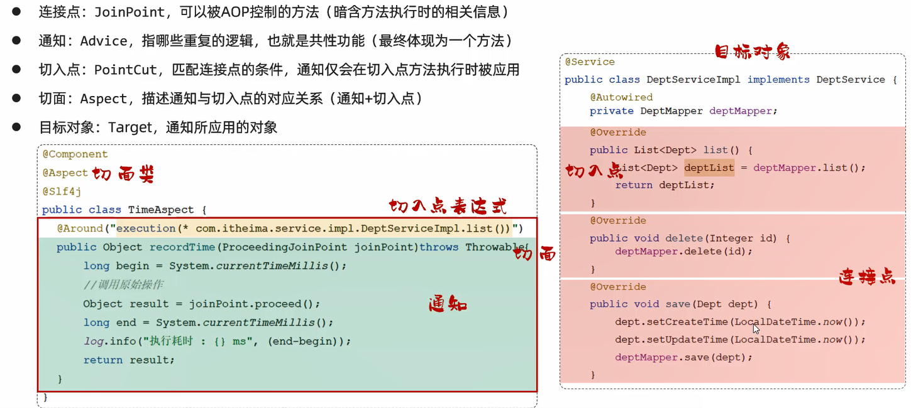
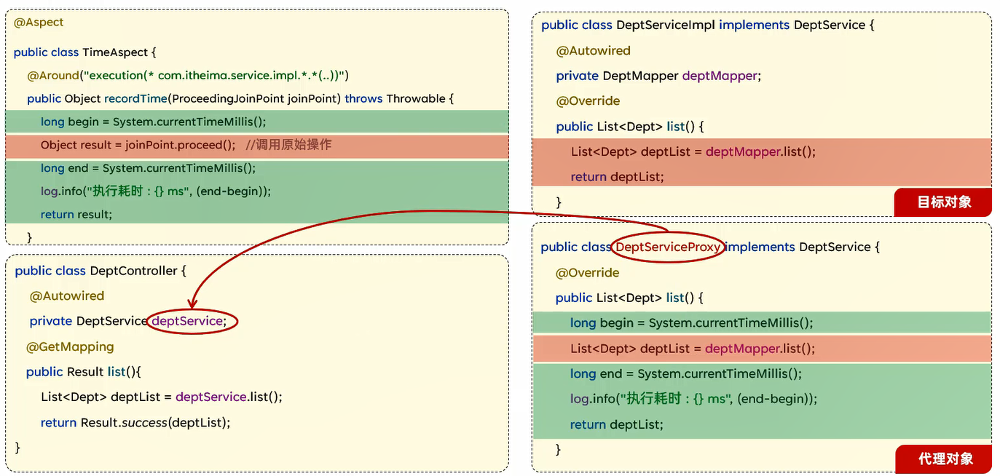
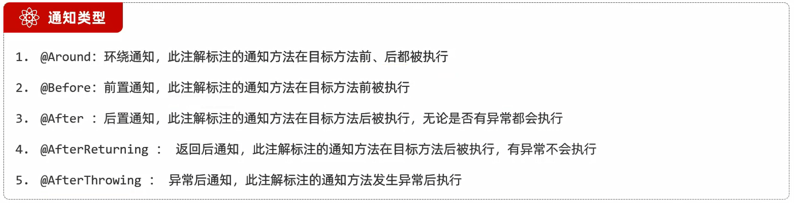
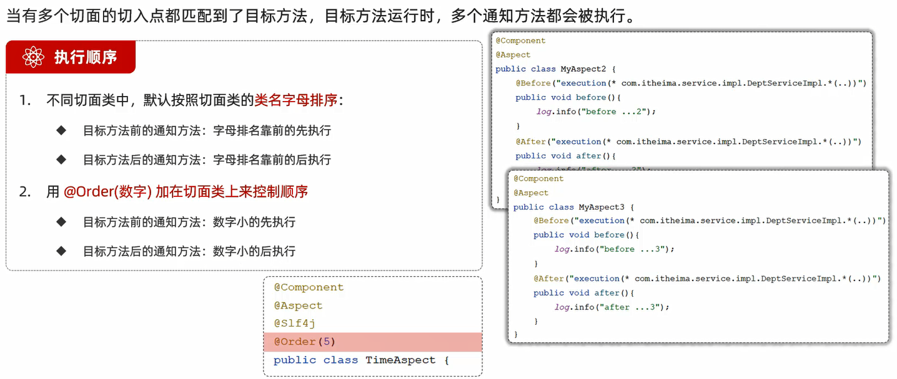
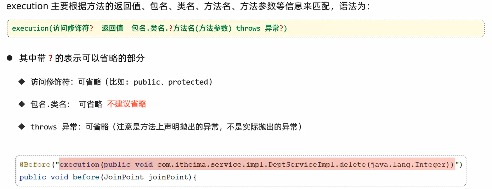
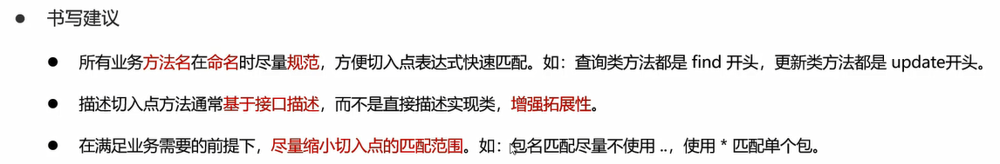
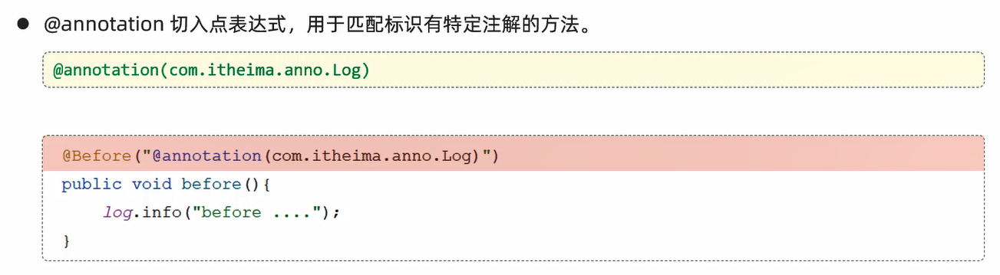
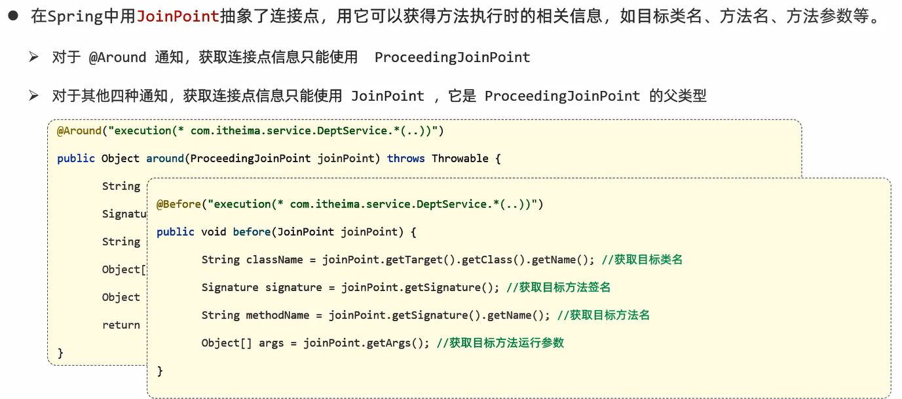

# AOP

AOP:Aspect Oriented Programming(**面向切面编程、面向方面编程**),其实就是面向特定方法编程

场景:案例部分功能运行较慢,定位执行耗时较长的业务方法,此时需要统计每一个业务方法的执行耗时
1. 记录操作日志
2. 权限控制
3. 事务管理

实现:动态代理是面向切面编程最主流的实现,而SpringAOP是Spring框架的高级技术,旨在管理bean对象的过程中,主要通过底层的动态代理机制,对特定的方法进行编程

优势:
- 代码无侵入
- 减少重复代码
- 提高开发效率
- 维护方便

# 快速入门

Maven依赖引入:

```xml
<dependency>
    <groupId>org.springframework.boot</groupId>
    <artifactId>spring-boot-starter-aop</artifactId>
    <version>3.2.1</version>
</dependency>
```

TimeAspect类:统计各个业务层方法执行耗时

```java
package com.jinzhao.aop;

import lombok.extern.slf4j.Slf4j;
import org.aspectj.lang.ProceedingJoinPoint;
import org.aspectj.lang.annotation.Around;
import org.aspectj.lang.annotation.Aspect;
import org.springframework.stereotype.Component;

@Slf4j
@Component
@Aspect
public class TimeAspect {
    // 切入点表达式
    // 当运行com.jinzhao.service包下所有的接口/类当中的方法时,都会运行下面这个方法中封装的公共逻辑代码
    @Around("execution(* com.jinzhao.service.*.*(..))")
    public Object recordTime(ProceedingJoinPoint joinPoint) throws Throwable {
        // 记录开始时间
        long begin = System.currentTimeMillis();

        // 调用原始方法运行
        Object result = joinPoint.proceed();

        // 记录结束时间,计算方法执行耗时
        long end = System.currentTimeMillis();
        log.info(joinPoint.getSignature() + "方法执行耗时:{}ms", end - begin);

        return result;
    }
}
```

# 核心概念



# 执行流程



- 目标对象:Target,通知所应用的对象

# 通知

- 通知:Advice,指重复的逻辑,也就是共性功能(最终体现为一个方法)

## 通知类型



细节:
1. **`@Around`环绕通知需要自己调用`ProceedingJoinPoint.proceed()`来让原始方法执行,其他通知不需要考虑目标方法执行**
2. **`@Around`环绕通知方法的返回值,必须指定为`Object`来接收原始方法的返回值**

范例:

```java
package com.jinzhao.aop;

import lombok.extern.slf4j.Slf4j;
import org.aspectj.lang.ProceedingJoinPoint;
import org.aspectj.lang.annotation.*;
import org.springframework.stereotype.Component;

@Slf4j
@Component
@Aspect
public class MyAspect {
    // 将公共的切点表达式抽取为pt()方法
    @Pointcut("execution(* com.jinzhao.service.impl.DeptServiceImpl.*(..))")
    private void pt() {
    }

    @Before("pt()")
    public void before() {
        log.info("before ...");
    }

    @Around("pt()")
    public Object around(ProceedingJoinPoint proceedingJoinPoint) throws Throwable {
        log.info("around before ...");

        // 调用目标对象的原始方法执行
        Object result = proceedingJoinPoint.proceed();

        log.info("around after ...");
        return result;
    }

    @After("pt()")
    public void after() {
        log.info("after ...");
    }

    @AfterReturning("pt()")
    public void afterReturning() {
        log.info("afterReturning ...");
    }

    @AfterThrowing("pt()")
    public void afterThrowing() {
        log.info("afterThrowing ...");
    }
}
```

**`@PointCut`注解:将公共的切点表达式抽取出来,需要用到时引用该切点表达式即可**

可以修改该方法的访问权限修饰符:
- private私有的:只能在当前切面类中引用该表达式               
- public公共的:在其他外部的切面类中也可以引用该表达式

## 通知顺序



# 切入点表达式

- 切入点:PointCut,匹配连接点的条件,通知仅会在切入点方法执行时被应用
- 切面:Aspect,描述通知与切入点的对应关系(通知+切入点)
- 切入点表达式:描述切入点方法的一种表达式

切入点表达式作用:决定项目中的哪些方法需要加入通知

常见形式:
1. `execution(...)`:根据方法的签名来匹配
2. `@annotation(...)`:根据注解来匹配

## execution




细节:**根据业务需要,可以使用且(`&&`)、或(`||`)、非(`!`)来组合比较复杂的切入点表达式**



## @annotation



范例:

自定义注解:

```java
package com.jinzhao.annotation;

import java.lang.annotation.ElementType;
import java.lang.annotation.Retention;
import java.lang.annotation.RetentionPolicy;
import java.lang.annotation.Target;

// 生效时间
@Retention(RetentionPolicy.RUNTIME)
// 生效范围
@Target(ElementType.METHOD)
public @interface MyAnnotation {
}
```

```java
package com.jinzhao.aop;

import lombok.extern.slf4j.Slf4j;
import org.aspectj.lang.ProceedingJoinPoint;
import org.aspectj.lang.annotation.Around;
import org.aspectj.lang.annotation.Aspect;
import org.springframework.stereotype.Component;

@Slf4j
@Component
@Aspect
public class TimeAspect {
    // 切入点表达式
    // 当运行的方法上有@MyAnnotation注解时,都会运行下面这个方法中封装的公共逻辑代码
    @Around("@@annotation(com.jinzhao.annotation.MyAnnotation)")
    public Object recordTime(ProceedingJoinPoint joinPoint) throws Throwable {
        // 记录开始时间
        long begin = System.currentTimeMillis();

        // 调用原始方法运行
        Object result = joinPoint.proceed();

        // 记录结束时间,计算方法执行耗时
        long end = System.currentTimeMillis();
        log.info(joinPoint.getSignature() + "方法执行耗时:{}ms", end - begin);

        return result;
    }
}
```

# 连接点

- 连接点:JoinPoint,可以被AOP控制的方法(暗含方法执行时的相关信息)



范例:

```java
package com.jinzhao.aop;

import lombok.extern.slf4j.Slf4j;
import org.aspectj.lang.JoinPoint;
import org.aspectj.lang.ProceedingJoinPoint;
import org.aspectj.lang.annotation.Around;
import org.aspectj.lang.annotation.Aspect;
import org.aspectj.lang.annotation.Before;
import org.aspectj.lang.annotation.Pointcut;
import org.springframework.stereotype.Component;

import java.util.Arrays;

// 切面类
@Slf4j
@Aspect
@Component
public class MyAspect {

    @Pointcut("execution(* com.jinzhao.service.DeptService.*(..))")
    private void pt() {
    }

    @Before("pt()")
    public void before(JoinPoint joinPoint) {
        log.info("MyAspect ... before ...");
    }

    @Around("pt()")
    public Object around(ProceedingJoinPoint joinPoint) throws Throwable {
        log.info("MyAspect around before ...");

        // 获取 目标对象的类名 
        String className = joinPoint.getTarget().getClass().getName();
        log.info("目标对象的类名:{}", className);

        // 获取 目标方法的方法名 
        String methodName = joinPoint.getSignature().getName();
        log.info("目标方法的方法名: {}", methodName);

        // 获取 目标方法运行时传入的参数 
        Object[] args = joinPoint.getArgs();
        log.info("目标方法运行时传入的参数: {}", Arrays.toString(args));

        // 放行 目标方法执行 
        Object result = joinPoint.proceed();

        // 获取 目标方法运行的返回值 
        log.info("目标方法运行的返回值: {}", result);

        log.info("MyAspect around after ...");
        return result;
    }
}
```

# 案例:记录操作日志

- [TLIAS项目-Gitee仓库](https://gitee.com/gjt_1538048299/tlias)

案例:将TLIAS部门管理、员工管理中增、删、改相关接口的操作日志记录到数据库表中

日志信息包含:操作人、操作时间、执行方法的全类名、执行方法名、方法运行时参数、返回值、方法执行时长

创建操作日志表:

```sql
-- 创建操作日志表
create table operate_log
(
    id            int unsigned primary key auto_increment comment 'ID',
    operate_user  int unsigned comment '操作人ID',
    operate_time  datetime comment '操作时间',
    class_name    varchar(100) comment '操作的类名',
    method_name   varchar(100) comment '操作的方法名',
    method_params varchar(1000) comment '方法参数',
    return_value  varchar(2000) comment '返回值',
    cost_time     bigint comment '方法执行耗时, 单位:ms'
) comment '操作日志表';
```

Log接口:自定义注解

```java
package com.jinzhao.annotation;

import java.lang.annotation.ElementType;
import java.lang.annotation.Retention;
import java.lang.annotation.RetentionPolicy;
import java.lang.annotation.Target;

// 自定义注解

// 生效时间
@Retention(RetentionPolicy.RUNTIME)
// 生效范围
@Target(ElementType.METHOD)
public @interface Log {
}
```

OperateLogMapper类:插入日志数据

```java
package com.jinzhao.mapper;

import com.jinzhao.pojo.OperateLog;
import org.apache.ibatis.annotations.Insert;
import org.apache.ibatis.annotations.Mapper;

@Mapper
public interface OperateLogMapper {
    // 插入日志数据
    @Insert("insert into operate_log (operate_user, operate_time, class_name, method_name, method_params, return_value, cost_time) " +
            "values (#{operateUser}, #{operateTime}, #{className}, #{methodName}, #{methodParams}, #{returnValue}, #{costTime});")
    public void insert(OperateLog log);
}
```

LogAspect类:切面类

```java
package com.jinzhao.aop;

import com.alibaba.fastjson2.JSONObject;
import com.jinzhao.mapper.OperateLogMapper;
import com.jinzhao.pojo.OperateLog;
import com.jinzhao.utils.JwtUtils;
import io.jsonwebtoken.Claims;
import jakarta.servlet.http.HttpServletRequest;
import lombok.extern.slf4j.Slf4j;
import org.aspectj.lang.ProceedingJoinPoint;
import org.aspectj.lang.annotation.Around;
import org.aspectj.lang.annotation.Aspect;
import org.springframework.beans.factory.annotation.Autowired;
import org.springframework.stereotype.Component;

import java.time.LocalDateTime;
import java.util.Arrays;

// 切面类
@Slf4j
@Component
@Aspect
public class LogAspect {
    @Autowired
    private OperateLogMapper operateLogMapper;

    @Autowired
    private HttpServletRequest httpServletRequest;

    @Around("@annotation(com.jinzhao.annotation.Log))")
    public Object recordLog(ProceedingJoinPoint joinPoint) throws Throwable {
        // 获取操作人ID,即获取当前登录员工的ID
        // 通过获取请求头中的JWT令牌,解析令牌
        String jwt = httpServletRequest.getHeader("token");
        Claims claims = JwtUtils.parseJWT(jwt);
        Integer operateUser = (Integer) claims.get("id");

        // 获取操作时间
        LocalDateTime operateTime = LocalDateTime.now();

        // 获取操作类名
        String className = joinPoint.getTarget().getClass().getName();

        // 获取操作方法名
        String methodName = joinPoint.getSignature().getName();

        // 获取操作方法参数
        String methodParams = Arrays.toString(joinPoint.getArgs());

        // 方法开始时间
        long begin = System.currentTimeMillis();

        // 调用原始目标方法运行
        Object result = joinPoint.proceed();

        // 方法结束时间
        long end = System.currentTimeMillis();

        // 获取操作方法返回值
        String returnValue = JSONObject.toJSONString(result);

        // 获取操作耗时
        Long costTime = end - begin;

        // 记录操作日志
        OperateLog operateLog = new OperateLog(null, operateUser, operateTime, className, methodName,
                methodParams, returnValue, costTime);
        operateLogMapper.insert(operateLog);

        log.info("AOP记录操作日志:{}", operateLog);

        return result;
    }
}
```

DeptController类:

```java
package com.jinzhao.controller;

import com.jinzhao.annotation.Log;
import com.jinzhao.service.DeptService;
import com.jinzhao.pojo.Dept;
import com.jinzhao.pojo.Result;
import lombok.extern.slf4j.Slf4j;
import org.springframework.beans.factory.annotation.Autowired;
import org.springframework.web.bind.annotation.*;

import java.util.List;

@Slf4j
@RestController
@RequestMapping("/depts")
public class DeptController {
    @Autowired
    private DeptService deptService;

    @GetMapping
    public Result listDept() {
        // 日志记录
        log.info("查询全部部门数据");
        // 部门列表查询
        List<Dept> deptList = deptService.list();
        return Result.success(deptList);
    }

    @Log
    @DeleteMapping("/{id}")
    public Result deleteDept(@PathVariable Integer id) {
        // 日志记录
        log.info("根据Id删除部门,{}", id);
        // 根据Id删除部门
        deptService.delete(id);
        return Result.success();
    }

    @Log
    @PostMapping
    public Result addDept(@RequestBody Dept dept) {
        // 日志记录
        log.info("添加部门,{}", dept.getName());
        // 添加部门
        deptService.add(dept);
        return Result.success();
    }

    @GetMapping("/{id}")
    public Result getDeptById(@PathVariable Integer id) {
        // 日志记录
        log.info("根据Id查询部门,{}", id);
        // 根据Id查询部门
        Dept dept = deptService.getById(id);
        return Result.success(dept);
    }

    @Log
    @PutMapping
    public Result updateDept(@RequestBody Dept dept) {
        // 日志记录
        log.info("修改部门名称,{}", dept.getName());
        // 修改部门
        deptService.update(dept);
        return Result.success();
    }
}
```

EmpController类:

```java
package com.jinzhao.controller;

import com.jinzhao.annotation.Log;
import com.jinzhao.pojo.Emp;
import com.jinzhao.pojo.PageBean;
import com.jinzhao.pojo.Result;
import com.jinzhao.service.EmpService;
import lombok.extern.slf4j.Slf4j;
import org.springframework.beans.factory.annotation.Autowired;
import org.springframework.format.annotation.DateTimeFormat;
import org.springframework.web.bind.annotation.*;

import java.time.LocalDate;
import java.util.List;

@Slf4j
@RestController
@RequestMapping("/emps")
public class EmpController {
    @Autowired
    private EmpService empService;

    @GetMapping
    public Result listEmp(String name,
                          Short gender,
                          @DateTimeFormat(pattern = "yyyy-MM-dd") LocalDate begin,
                          @DateTimeFormat(pattern = "yyyy-MM-dd") LocalDate end,
                          @RequestParam(defaultValue = "1") Integer page,
                          @RequestParam(defaultValue = "10") Integer pageSize) {
        // 日志记录
        log.info("分页查询,参数:{},{},{},{},{},{}", name, gender, begin, end, page, pageSize);
        // 根据当前页码、每页展示记录数进行分页查询,返回数据列表、总记录数
        // 根据条件进行分页查询
        PageBean pageBean = empService.list(name, gender, begin, end, page, pageSize);
        return Result.success(pageBean);
    }

    @Log
    @DeleteMapping("/{ids}")
    public Result deleteEmp(@PathVariable List<Integer> ids) {
        // 日志记录
        log.info("删除员工,{}", ids);
        // 批量删除员工
        empService.delete(ids);
        return Result.success();
    }

    @Log
    @PostMapping
    public Result addEmp(@RequestBody Emp emp) {
        // 日志记录
        log.info("添加员工,{}", emp.toString());
        // 添加员工
        empService.add(emp);
        return Result.success();
    }

    @GetMapping("/{id}")
    public Result getById(@PathVariable Integer id) {
        // 日志记录
        log.info("根据Id查询员工:{}", id);
        // 根据Id查询员工
        Emp emp = empService.getById(id);
        return Result.success(emp);
    }

    @Log
    @PutMapping
    public Result updateEmp(@RequestBody Emp emp) {
        // 日志记录
        log.info("修改员工,{}", emp);
        // 修改员工
        empService.update(emp);
        return Result.success();
    }
}
```