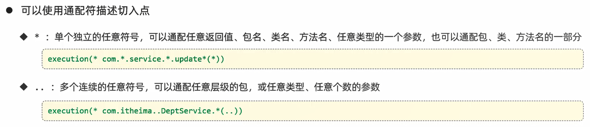

# AOP

AOP:Aspect Oriented Programming(**面向切面编程、面向方面编程**),其实就是面向特定方法编程

场景:案例部分功能运行较慢,定位执行耗时较长的业务方法,此时需要统计每一个业务方法的执行耗时
1. 记录操作日志
2. 权限控制
3. 事务管理

实现:动态代理是面向切面编程最主流的实现,而SpringAOP是Spring框架的高级技术,旨在管理bean对象的过程中,主要通过底层的动态代理机制,对特定的方法进行编程

优势:
- 代码无侵入
- 减少重复代码
- 提高开发效率
- 维护方便

# 快速入门

Maven依赖引入:

```xml
<dependency>
    <groupId>org.springframework.boot</groupId>
    <artifactId>spring-boot-starter-aop</artifactId>
    <version>3.2.1</version>
</dependency>
```

TimeAspect类:统计各个业务层方法执行耗时

```java
package com.jinzhao.aop;

import lombok.extern.slf4j.Slf4j;
import org.aspectj.lang.ProceedingJoinPoint;
import org.aspectj.lang.annotation.Around;
import org.aspectj.lang.annotation.Aspect;
import org.springframework.stereotype.Component;

@Slf4j
@Component
@Aspect
public class TimeAspect {
    // 切入点表达式
    // 当运行com.jinzhao.service包下所有的接口/类当中的方法时,都会运行下面这个方法中封装的公共逻辑代码
    @Around("execution(* com.jinzhao.service.*.*(..))")
    public Object recordTime(ProceedingJoinPoint joinPoint) throws Throwable {
        // 记录开始时间
        long begin = System.currentTimeMillis();

        // 调用原始方法运行
        Object result = joinPoint.proceed();

        // 记录结束时间,计算方法执行耗时
        long end = System.currentTimeMillis();
        log.info(joinPoint.getSignature() + "方法执行耗时:{}ms", end - begin);

        return result;
    }
}
```

# 核心概念


# 执行流程


- 目标对象:Target,通知所应用的对象

# 通知

- 通知:Advice,指重复的逻辑,也就是共性功能(最终体现为一个方法)

## 通知类型


细节:
1. **`@Around`环绕通知需要自己调用`ProceedingJoinPoint.proceed()`来让原始方法执行,其他通知不需要考虑目标方法执行**
2. **`@Around`环绕通知方法的返回值,必须指定为`Object`来接收原始方法的返回值**

范例:

```java
package com.jinzhao.aop;

import lombok.extern.slf4j.Slf4j;
import org.aspectj.lang.ProceedingJoinPoint;
import org.aspectj.lang.annotation.*;
import org.springframework.stereotype.Component;

@Slf4j
@Component
@Aspect
public class MyAspect {
    // 将公共的切点表达式抽取为pt()方法
    @Pointcut("execution(* com.jinzhao.service.impl.DeptServiceImpl.*(..))")
    private void pt() {
    }

    @Before("pt()")
    public void before() {
        log.info("before ...");
    }

    @Around("pt()")
    public Object around(ProceedingJoinPoint proceedingJoinPoint) throws Throwable {
        log.info("around before ...");

        // 调用目标对象的原始方法执行
        Object result = proceedingJoinPoint.proceed();

        log.info("around after ...");
        return result;
    }

    @After("pt()")
    public void after() {
        log.info("after ...");
    }

    @AfterReturning("pt()")
    public void afterReturning() {
        log.info("afterReturning ...");
    }

    @AfterThrowing("pt()")
    public void afterThrowing() {
        log.info("afterThrowing ...");
    }
}
```

**`@PointCut`注解:将公共的切点表达式抽取出来,需要用到时引用该切点表达式即可**

可以修改该方法的访问权限修饰符:
- private私有的:只能在当前切面类中引用该表达式               
- public公共的:在其他外部的切面类中也可以引用该表达式

## 通知顺序


# 切入点表达式

- 切入点:PointCut,匹配连接点的条件,通知仅会在切入点方法执行时被应用
- 切面:Aspect,描述通知与切入点的对应关系(通知+切入点)
- 切入点表达式:描述切入点方法的一种表达式

切入点表达式作用:决定项目中的哪些方法需要加入通知

常见形式:
1. `execution(...)`:根据方法的签名来匹配
2. `@annotation(...)`:根据注解来匹配

## execution




细节:**根据业务需要,可以使用且(`&&`)、或(`||`)、非(`!`)来组合比较复杂的切入点表达式**


## @annotation


范例:

自定义注解:

```java
package com.jinzhao.annotation;

import java.lang.annotation.ElementType;
import java.lang.annotation.Retention;
import java.lang.annotation.RetentionPolicy;
import java.lang.annotation.Target;

// 生效时间
@Retention(RetentionPolicy.RUNTIME)
// 生效范围
@Target(ElementType.METHOD)
public @interface MyAnnotation {
}
```

```java
package com.jinzhao.aop;

import lombok.extern.slf4j.Slf4j;
import org.aspectj.lang.ProceedingJoinPoint;
import org.aspectj.lang.annotation.Around;
import org.aspectj.lang.annotation.Aspect;
import org.springframework.stereotype.Component;

@Slf4j
@Component
@Aspect
public class TimeAspect {
    // 切入点表达式
    // 当运行的方法上有@MyAnnotation注解时,都会运行下面这个方法中封装的公共逻辑代码
    @Around("@@annotation(com.jinzhao.annotation.MyAnnotation)")
    public Object recordTime(ProceedingJoinPoint joinPoint) throws Throwable {
        // 记录开始时间
        long begin = System.currentTimeMillis();

        // 调用原始方法运行
        Object result = joinPoint.proceed();

        // 记录结束时间,计算方法执行耗时
        long end = System.currentTimeMillis();
        log.info(joinPoint.getSignature() + "方法执行耗时:{}ms", end - begin);

        return result;
    }
}
```

# 连接点

- 连接点:JoinPoint,可以被AOP控制的方法(暗含方法执行时的相关信息)

# 记录操作日志