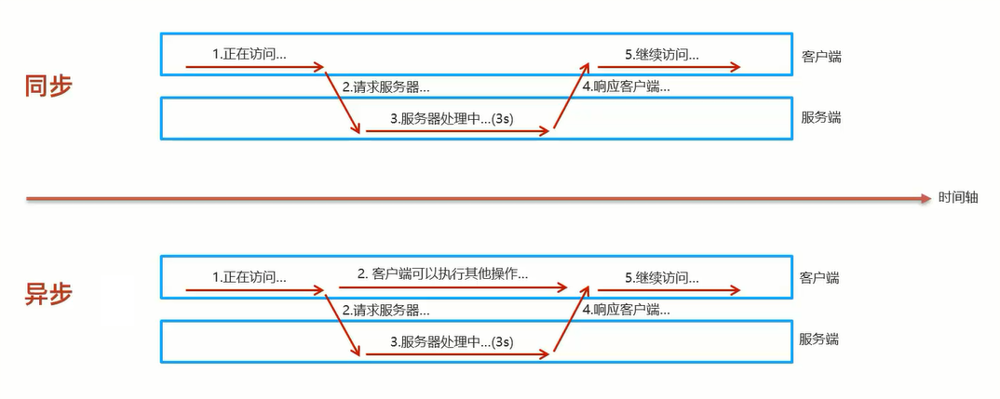
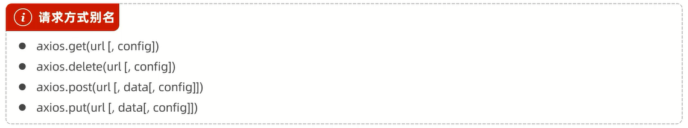
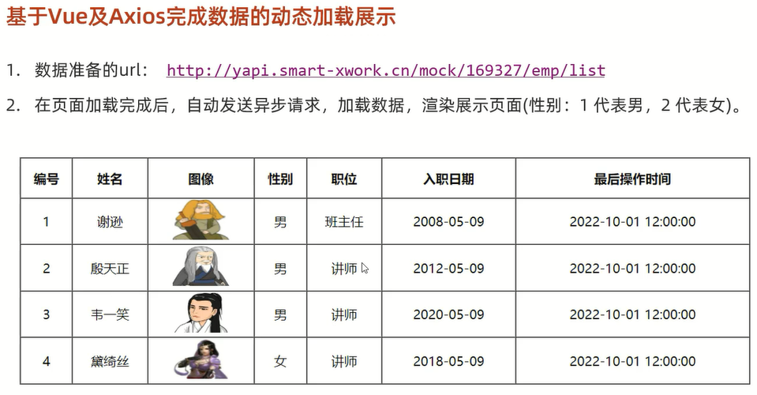

# Ajax

概念:Asynchronous JavaScript And XML,**异步**的JavaScript和XML

作用:
1. 数据交换:通过Ajax可以给服务器发送请求,并获取服务器响应的数据
2. 异步交互:可以在**不重新加载整个页面的情况下**,与服务器交换数据并**更新部分网页**的技术,如搜索联想,用户名是否可用的校验等

## 同步与异步



范例:

```html
<!DOCTYPE html>
<html lang="en">

<head>
    <meta charset="UTF-8">
    <meta http-equiv="X-UA-Compatible" content="IE=edge">
    <meta name="viewport" content="width=device-width, initial-scale=1.0">
    <title>Ajax</title>
</head>

<body>

    <input type="button" value="获取数据" onclick="getData()">

    <div id="div1"></div>

</body>
<script>
    function getData() {
        // 创建XMLHttpRequest 
        var xmlHttpRequest = new XMLHttpRequest();

        // 发送异步请求
        xmlHttpRequest.open("GET", "https://markdown-blog-gjt.vercel.app/2024/05/28/JavaScript/");
        //发送请求
        xmlHttpRequest.send();

        // 获取服务响应数据
        xmlHttpRequest.onreadystatechange = function () {
            if (xmlHttpRequest.readyState == 4 && xmlHttpRequest.status == 200) {
                document.getElementById("div1").innerHTML = xmlHttpRequest.responseText;
            }
        }
    }
</script>

</html>
```

# Axios

概念:Axios对原生的Ajax进行了封装,简化书写,快速开发

[Axios官方网站](https://www.axios-http.cn/)

## 快速入门



范例:

```html
<!DOCTYPE html>
<html lang="en">

<head>
    <meta charset="UTF-8">
    <meta http-equiv="X-UA-Compatible" content="IE=edge">
    <meta name="viewport" content="width=device-width, initial-scale=1.0">
    <title>Ajax-Axios</title>
    <script src="js/axios-0.18.0.js"></script>
</head>

<body>

    <input type="button" value="获取数据GET" onclick="get()">

    <input type="button" value="删除数据POST" onclick="post()">

</body>
<script>
    function get() {
        // 通过axios发送异步请求-get
        // axios({
        //     method: "get",
        //     url: "https://markdown-blog-gjt.vercel.app/2024/05/28/JavaScript/"
        // }).then(result => {
        //     console.log(result.data);
        // })

        axios.get("https://markdown-blog-gjt.vercel.app/2024/05/28/JavaScript/").then(result => {
            console.log(result.data);
        })
    }

    function post() {
        // 通过axios发送异步请求-post
        // axios({
        //     method: "post",
        //     url: "https://markdown-blog-gjt.vercel.app/2024/05/28/JavaScript/",
        //     data: "id=1"
        // }).then(result => {
        //     console.log(result.data);
        // })

        axios.post("https://markdown-blog-gjt.vercel.app/2024/05/28/JavaScript/", "id=1").then(result => {
            console.log(result.data);
        })
    }
</script>

</html>
```

## 范例



```html
<!DOCTYPE html>
<html lang="en">

<head>
    <meta charset="UTF-8">
    <meta http-equiv="X-UA-Compatible" content="IE=edge">
    <meta name="viewport" content="width=device-width, initial-scale=1.0">
    <title>Axios范例</title>
    <script src="js/axios-0.18.0.js"></script>
    <script src="js/vue.js"></script>
</head>

<body>
    <div id="app">
        <table border="1" cellspacing="0" width="60%">
            <tr>
                <th>编号</th>
                <th>姓名</th>
                <th>图像</th>
                <th>性别</th>
                <th>职位</th>
                <th>入职日期</th>
                <th>最后操作时间</th>
            </tr>

            <tr align="center" v-for="(emp,index) in emps">
                <td>{{index + 1}}</td>
                <td>{{emp.name}}</td>
                <td>
                    
                </td>
                <td>
                    <span v-if="emp.gender == 1">男</span>
                    <span v-if="emp.gender == 2">女</span>
                </td>
                <td>{{emp.job}}</td>
                <td>{{emp.entrydate}}</td>
                <td>{{emp.updatetime}}</td>
            </tr>
        </table>
    </div>
</body>
<script>
    new Vue({
        el: "#app",
        data: {
            emps: []
        },
        mounted() {
            // 发送异步请求,加载数据
            axios.get("http://yapi.smart-xwork.cn/mock/169327/emp/list").then(result => {
                this.emps = result.data.data;
            })
        }
    });
</script>

</html>
```