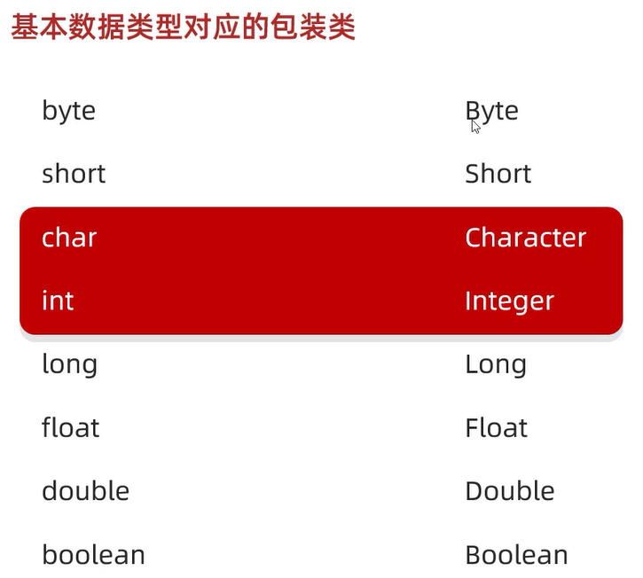
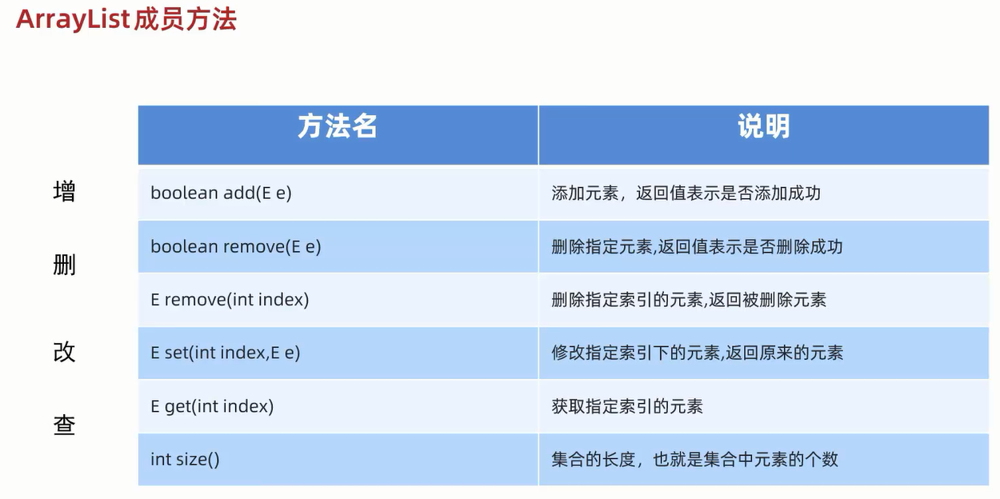

# 集合和数组的对比

1. 长度   
数组: 长度固定   
集合: 长度可变(自动扩容)   

2. 存储类型   
数组: 引用数据类型 + 基本数据类型   
集合: 引用数据类型 + 基本数据类型(转换成对应的包装类)   



# ArrayList

注意: 因为集合会自动扩容,所以长度可变   
但是**集合长度的默认值为0**   
例如`for (int i = 0; i < arrayList.size(); i++)`这种代码,其条件判断语句永远也到达不了   

## 构造方法

`ArrayList<E> list = new ArrayList<>();`   

`E`(泛型): 限定集合中存储数据的类型   

创建的是ArrayList的对象,而ArrayList是Java已经写好的一个类,这个类在底层做了一些处理:   
打印对象不是地址值,而是集合中存储的数据内容,并且在展示的时候会用`[]`把所有的数据进行包裹   

范例: 

```java
import java.util.ArrayList;

public class test {
    public static void main(String[] args) {
        ArrayList<String> list = new ArrayList<>();
        // 打印结果:"[]"
        System.out.println(list);

    }
}
```

## 成员方法



练习: 

```java
import java.util.ArrayList;

public class test {
    public static void main(String[] args) {
        ArrayList<String> list = new ArrayList<>();
        // 添加元素`111``222``333`
        boolean flag1 = list.add("111");
        list.add("222");
        list.add("333");
        // 打印结果:"true",即添加成功
        System.out.println(flag1);
        // 打印结果:"[111, 222, 333]"
        System.out.println(list);

        // 删除元素`111`,返回能否删除
        boolean flag2 = list.remove("111");
        // 打印结果:"true",即删除成功
        System.out.println(flag2);
        // 删除元素`444`,返回能否删除
        boolean flag3 = list.remove("444");
        // 打印结果:"false",即删除失败
        System.out.println(flag3);
        // 打印结果:"[222, 333]"
        System.out.println(list);
        // 删除索引为1的元素,返回被删除的元素
        String str1 = list.remove(1);
        // 打印结果:"333"
        System.out.println(str1);
        // 打印结果:"[222]"
        System.out.println(list);

        // 修改索引为0的值为`444`,返回被修改的元素
        String str2 = list.set(0, "444");
        // 打印结果:"222"
        System.out.println(str2);
        // 打印结果:"[444]"
        System.out.println(list);

        // 查询索引为0的元素
        String str3 = list.get(0);
        // 打印结果:"444"
        System.out.println(str3);

        // 获取集合的长度
        int length = list.size();
        // 打印结果:"1"
        System.out.println(length);
    }
```

根据int size();方法,可以遍历集合   

```java
import java.util.ArrayList;

public class test {
    public static void main(String[] args) {
        ArrayList<String> list = new ArrayList<>();
        // 添加元素`111``222``333`
        list.add("111");
        list.add("222");
        list.add("333");

        for (int i = 0; i < list.size(); i++) {
            String str = list.get(i);
            System.out.println(str);
        }
    }
}
```

练习: 

定义一个集合,添加字符串,并进行遍历,例如输出结果为: `[1,2,3]`   

```java
import java.util.ArrayList;

public class test {
    public static void main(String[] args) {
        ArrayList<String> arrayList = new ArrayList<>();
        arrayList.add("1");
        arrayList.add("2");
        arrayList.add("3");
        String start = "[";
        for (int i = 0; i < arrayList.size(); i++) {
            String str = arrayList.get(i);
            if (i != arrayList.size() - 1) {
                start += str + ",";
            } else {
                start += str + "]";
            }
        }
        System.out.println(start);
    }
}
```

练习: 

定义一个集合,添加数字,并进行遍历,例如输出结果为: `[1,2,3]`

```java
import java.util.ArrayList;

public class test {
    public static void main(String[] args) {
        ArrayList<Integer> arrayList = new ArrayList<>();
        // int和Integer之间是可以互相转化的
        arrayList.add(1);
        arrayList.add(2);
        arrayList.add(3);
        System.out.print("[");
        for (int i = 0; i < arrayList.size(); i++) {
            Integer num = arrayList.get(i);
            if (i != arrayList.size() - 1) {
                System.out.print(num + ",");
            } else {
                System.out.print(num);
            }
        }
        System.out.print("]");
    }
}
```

练习: 

定义一个集合,添加一些学生对象,并进行遍历   
学生类的属性为: 姓名,年龄   

```java
public class Student {
    private String name;
    private int age;

    public Student() {
    }

    public Student(String name, int age) {
        this.name = name;
        this.age = age;
    }

    public String getName() {
        return name;
    }

    public void setName(String name) {
        this.name = name;
    }

    public int getAge() {
        return age;
    }

    public void setAge(int age) {
        this.age = age;
    }
}
```

```java
import java.util.ArrayList;

public class test {
    public static void main(String[] args) {
        Student stu1 = new Student("张三", 20);
        Student stu2 = new Student("李四", 22);
        ArrayList<Student> arrayList = new ArrayList<>();
        arrayList.add(stu1);
        arrayList.add(stu2);
        System.out.println("姓名\t\t年龄");
        for (int i = 0; i < arrayList.size(); i++) {
            System.out.println(arrayList.get(i).getName() + "\t\t" + arrayList.get(i).getAge());
        }
    }
}
```

练习: 

定义一个集合,添加3个学生对象,并进行遍历   
学生类的属性为: 姓名,年龄      

要求: 对象的数据来自键盘录入     

```java
public class Student {
    private String name;
    private int age;

    public Student() {
    }

    public Student(String name, int age) {
        this.name = name;
        this.age = age;
    }

    public String getName() {
        return name;
    }

    public void setName(String name) {
        this.name = name;
    }

    public int getAge() {
        return age;
    }

    public void setAge(int age) {
        this.age = age;
    }
}
```

```java
import java.util.ArrayList;
import java.util.Scanner;

public class test {
    public static void main(String[] args) {
        ArrayList<Student> arrayList = new ArrayList<>();
        Scanner sc = new Scanner(System.in);
        for (int i = 0; i < 3; i++) {
            Student stu = new Student();
            System.out.println("请输入学生的姓名: ");
            stu.setName(sc.next());
            System.out.println("请输入学生的年龄: ");
            stu.setAge(sc.nextInt());
            arrayList.add(stu);
        }
        for (int i = 0; i < 3; i++) {
            System.out.println(arrayList.get(i).getName() + "," + arrayList.get(i).getAge());
        }
    }
}
```

练习: 

定义一个集合,存入3个用户对象   
用户的属性为: id,username,userpassword                    

要求: 定义一个方法,根据id查找对应的用户信息    
1. 如果存在,则返回索引;如果不存在,则返回-1    
2. 如果存在,则返回true;如果不存在,则返回false   

```java
public class User {
    private String id;
    private String username;
    private String password;


    public User() {
    }

    public User(String id, String username, String password) {
        this.id = id;
        this.username = username;
        this.password = password;
    }

    public String getId() {
        return id;
    }

    public void setId(String id) {
        this.id = id;
    }

    public String getUsername() {
        return username;
    }

    public void setUsername(String username) {
        this.username = username;
    }

    public String getPassword() {
        return password;
    }

    public void setPassword(String password) {
        this.password = password;
    }
}
```

```java
import java.util.ArrayList;
import java.util.Scanner;

public class test {
    public static void main(String[] args) {
        User user1 = new User("1230", "张三", "124395123");
        User user2 = new User("1232340", "李四", "1111");
        User user3 = new User("123", "王五", "123");
        ArrayList<User> list = new ArrayList<>();
        list.add(user1);
        list.add(user2);
        list.add(user3);
        Scanner sc = new Scanner(System.in);
        System.out.println("请输入要查询的用户id: ");
        String putInId = sc.next();
        int index = getIndex(putInId, list);
        // 返回索引/-1
        System.out.println(index);
        // 返回true/false
        System.out.println(getCheck(index));
    }

    public static boolean getCheck(int index) {
        return index >= 0;
    }

    public static int getIndex(String putInId, ArrayList<User> list) {
        for (int i = 0; i < list.size(); i++) {
            boolean flag = list.get(i).getId().equals(putInId);
            if (flag) {
                return i;
            }
        }
        return -1;
    }
}
```

练习: 

定义JavaBean类: Phone   
Phone属性: 品牌,价格   
main方法中定义一个集合,存入三个手机对象   
分别为: 小米 1000.0; 苹果 8000.0; 华为 6000.0   
定义一个方法,将价格低于3000的手机信息返回  

**如果要返回多个数据,可以先把数据放到一个容器当中,再把容器返回**

```java
public class Phone {
    private String brand;
    private double price;

    public Phone() {
    }

    public Phone(String brand, double price) {
        this.brand = brand;
        this.price = price;
    }

    public String getBrand() {
        return brand;
    }

    public void setBrand(String brand) {
        this.brand = brand;
    }

    public double getPrice() {
        return price;
    }

    public void setPrice(double price) {
        this.price = price;
    }
}
```

```java
import java.util.ArrayList;

public class test {
    public static void main(String[] args) {
        Phone ph1 = new Phone("小米", 1000);
        Phone ph2 = new Phone("苹果", 8000);
        Phone ph3 = new Phone("华为", 3000);
        ArrayList<Phone> list = new ArrayList<>();
        list.add(ph1);
        list.add(ph2);
        list.add(ph3);
        ArrayList<Phone> newList = getPhone(list);
        for (int i = 0; i < newList.size(); i++) {
            System.out.println(newList.get(i).getBrand() + "," + newList.get(i).getPrice());
        }
    }

    public static ArrayList<Phone> getPhone(ArrayList<Phone> list) {
        ArrayList<Phone> newList = new ArrayList<>();
        for (int i = 0; i < list.size(); i++) {
            Phone p = list.get(i);
            if (p.getPrice() <= 3000) {
                newList.add(p);
            }
        }
        return newList;
    }
}
```

练习: 

请定义教师(Teacher)类,属性包含姓名和专业名称   
将若干教师对象存入ArrayList集合中,并遍历集合打印教师信息     
 
姓名: 赵老师,专业: javase   
姓名: 钱老师,专业: javaee   
姓名: 孙老师,专业: php   
姓名: 李老师,专业: python   

```java
public class Teacher {
    private String name;
    private String profession;

    public Teacher() {
    }

    public Teacher(String name, String profession) {
        this.name = name;
        this.profession = profession;
    }

    public String getName() {
        return name;
    }

    public void setName(String name) {
        this.name = name;
    }

    public String getProfession() {
        return profession;
    }

    public void setProfession(String profession) {
        this.profession = profession;
    }
}
```

```java
import java.util.ArrayList;

public class TeacherTest {
    public static void main(String[] args) {
        ArrayList<Teacher> list = new ArrayList<>();
        Teacher t1 = new Teacher("赵老师", "javase");
        Teacher t2 = new Teacher("钱老师", "javaee");
        Teacher t3 = new Teacher("孙老师", "php");
        Teacher t4 = new Teacher("李老师", "python");
        list.add(t1);
        list.add(t2);
        list.add(t3);
        list.add(t4);
        for (int i = 0; i < list.size(); i++) {
            Teacher teacher = list.get(i);
            System.out.println("姓名: " + teacher.getName() + ",专业: " + teacher.getProfession());
        }
    }
}
```

练习: 

有如下员工信息:   
姓名: 张三,工资: 3000    
姓名: 李四,工资: 3500   
姓名: 王五,工资: 4000    
姓名: 赵六,工资: 4500   
姓名: 田七,工资: 5000    

先需要将所有的员工信息都存入ArrayList集合中,并完成如下操作:    
1. 判断是否有姓名为"王五"的员工,如果有,改名为"王小五"   
2. 判断是否有姓名为"赵六"的员工,如果有,将其删除    
3. 给姓名为"田七"的员工,涨500工资    

```java
public class Employee {
    private String name;
    private int salary;

    public Employee() {
    }

    public Employee(String name, int salary) {
        this.name = name;
        this.salary = salary;
    }

    public String getName() {
        return name;
    }

    public void setName(String name) {
        this.name = name;
    }

    public int getSalary() {
        return salary;
    }

    public void setSalary(int salary) {
        this.salary = salary;
    }
}
```

```java
import java.util.ArrayList;

public class EmployeeTest {
    public static void main(String[] args) {
        Employee e1 = new Employee("张三", 3000);
        Employee e2 = new Employee("李四", 3500);
        Employee e3 = new Employee("王五", 4000);
        Employee e4 = new Employee("赵六", 4500);
        Employee e5 = new Employee("田七", 5000);
        ArrayList<Employee> list = new ArrayList<>();
        list.add(e1);
        list.add(e2);
        list.add(e3);
        list.add(e4);
        list.add(e5);
        for (int i = 0; i < list.size(); i++) {
            Employee employee = list.get(i);
            if (employee.getName().equals("王五")) {
                employee.setName("王小五");
            } else if (employee.getName().equals("赵六")) {
                list.remove(employee);
                // 一旦删除元素,后面的元素会往前走,索引再加1就会有元素遗漏,所以删除后要i--
                i--;
            } else if (employee.getName().equals("田七")) {
                employee.setSalary(employee.getSalary() + 500);
            }
        }
        for (int i = 0; i < list.size(); i++) {
            Employee employee = list.get(i);
            System.out.println(employee.getName() + "," + employee.getSalary());
        }
    }
}
```