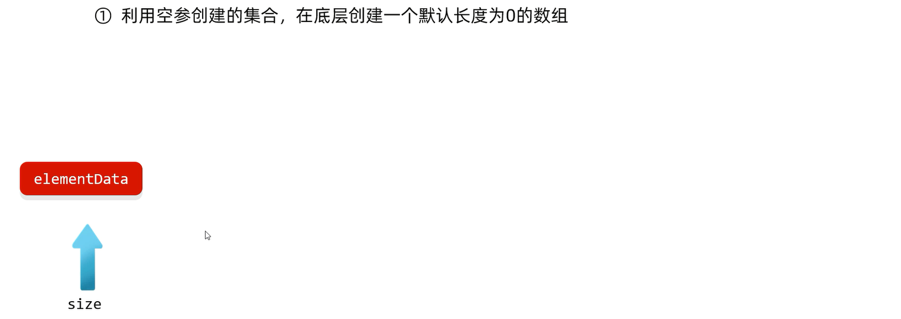
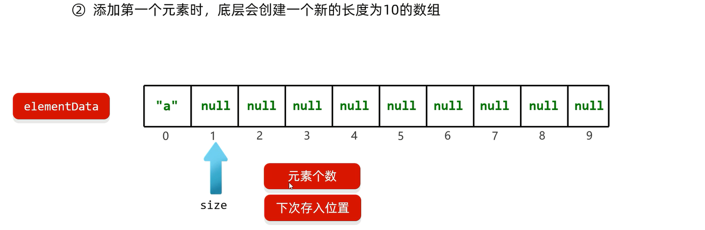
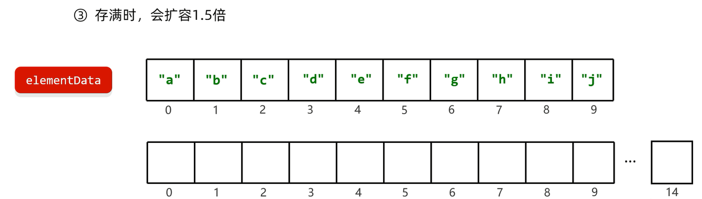
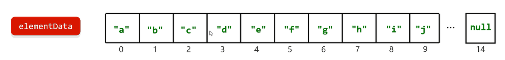
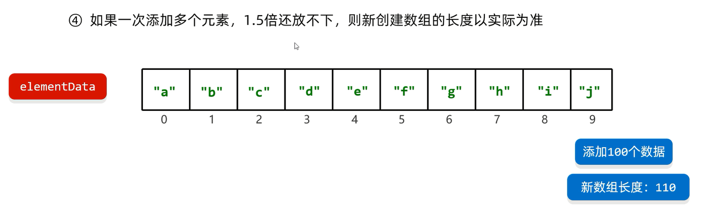
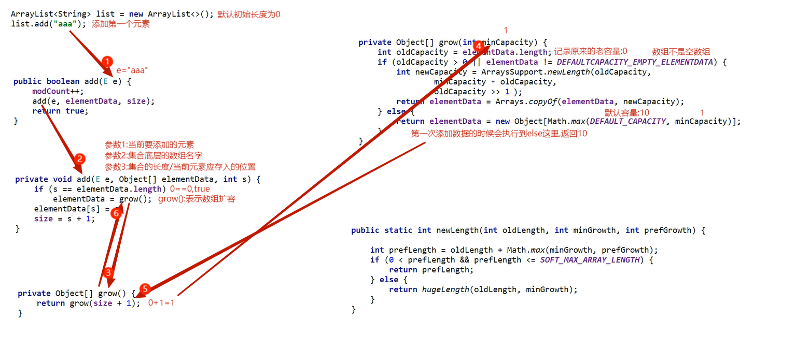
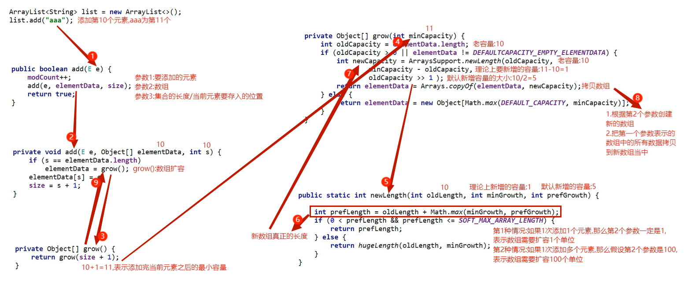

# ArrayList底层原理

ArrayList: `Array` -- 数组,List -- 属于List系列的一员            

ArrayList底层数据结构是数组(`Object[] elementData`)

# 特点

1. **有序**: 存和取的元素顺序一致
2. **有索引**: 可以通过索引操作元素
3. **可重复**: 存储的元素可以重复

# 底层原理

# ArrayList底层源码分析

