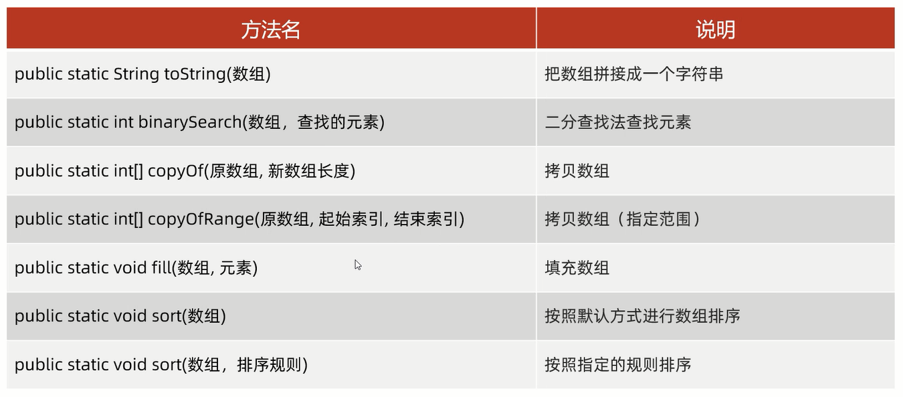

# Arrays

操作数组的工具类

## 常用方法



细节: 
1. `binarySearch`: 二分查找法查找元素              
如果查找的元素是存在的,返回真实的索引; 反之,返回"-插入点-1"
2. `copyOf`: 拷贝数组            
参数一: 老数组; 参数二: 新数组的长度          
a.如果新数组的长度小于老数组的长度,会部分拷贝    
b.如果新数组的长度等于老数组的长度,会完全拷贝            
c.如果新数组的长度大于老数组的长度,会补上默认初始值         
3. `copyOfRange`: 拷贝数组(指定范围)        
包头不包尾,包左不包右         

范例: 

```java
import java.util.Arrays;
import java.util.Comparator;

public class Test {
    public static void main(String[] args) {
        int[] arr = {1,2,3,4,5,6,7,8,9,10};

        // toString: 将数组变成字符串
        // 打印结果:"[1,2,3,4,5,6,7,8,9,10]"
        System.out.println(Arrays.toString(arr));
        System.out.println();

        // binarySearch: 二分查找法查找元素
        // 打印结果:"7"
        System.out.println(Arrays.binarySearch(arr,8));
        System.out.println();

        // copyOf: 拷贝数组
        int[] newArr1 = Arrays.copyOf(arr,20);
        // 打印结果:"[1,2,3,4,5,6,7,8,9,10,0,0,0,0,0,0,0,0,0,0]"
        System.out.println(Arrays.toString(newArr1));
        System.out.println();

        // copyOfRange: 拷贝数组(指定范围)
        int[] newArr2 = Arrays.copyOfRange(arr,0,4);
        // 打印结果:"[1,2,3,4]"
        System.out.println(Arrays.toString(newArr2));
        System.out.println();

        // fill(元素): 填充数组
        Arrays.fill(newArr2,1);
        // 打印结果:"[1,1,1,1,1]"
        System.out.println(Arrays.toString(newArr2));
        System.out.println();

        // sort: 按照默认方式(快速排序进行升序)进行数组排序
        int[] newArr3 = {1,2,3,8,65,3234,66,23,21,90};
        Arrays.sort(newArr3);
        // 打印结果:"[1,2,3,8,21,23,65,66,90,3234]"
        System.out.println(Arrays.toString(newArr3));
        System.out.println();
    }
}
```

## `sort(排序规则)`: 按照指定的规则排序    

1. 参数一: 要排序的数组
2. 参数二: 排序规则            

细节:             
1. 只能给引用数据类型的数组进行排序
2. 如果是基本数据类型的数组,需要变成其对应的包装类       

sort底层原理:      
利用插入排序+二分查找的方式进行排序            
默认把0索引的数据当作是有序的序列,1索引到最后当作是无序的序列           
遍历无序序列得到里面的每一个元素,假设当前遍历得到的元素是A                
把A往有序序列中进行插入,在插入的时候,是利用二分查找确定A元素的插入点     
拿着A元素,跟插入点的规则进行比较,比较的规则就是compare方法的方法体         
如果方法的返回值是负数,拿着A继续跟前面的数据进行比较      
如果方法的返回值是正数或0,拿着A继续跟后面的数据进行比较      
直到能确定A的最终位置为止            

compare方法: 
1. 参数一`o1`: 表示在无序序列中,遍历得到的每一个元素
2. 参数二`o2`: 表示有序序列中的元素
3. 返回值:                                  
a.负数: 表示当前插入的元素是小的,要放在前面                       
b.正数: 表示当前插入的元素是大的,要放在后面            
c.0: 表示当前插入的元素跟现在的元素是一样的,要放在后面                 

简单理解: 
1. **返回o1-o2: 升序排列**
2. **返回o2-o1: 降序排列**

范例: 

```java
import java.util.Arrays;
import java.util.Comparator;

public class ArraySort {
    public static void main(String[] args) {
        // sort(排序规则): 按照指定的规则排序
        Integer[] arr = {1,2,3,8,65,3234,66,23,21,90};
        // 第一个参数是要排序的数组
        // 第二个参数是排序规则,是一个接口
        // 所以我们在调用方法的时候,需要传递这个接口的实现类对象,作为排序规则
        // 但是这个实现类只需要使用一次,因此采取匿名内部类的方式就行
        Arrays.sort(arr,new Comparator<Integer>() {
            @Override
            public int compare(Integer o1,Integer o2) {
                System.out.println("o1: " + o1);
                System.out.println("o2: " + o2);
                System.out.println("返回值: " + (o2 - o1));
                System.out.println();
                return o2 - o1;
            }
        });
        System.out.println(Arrays.toString(arr));
    }
}
```