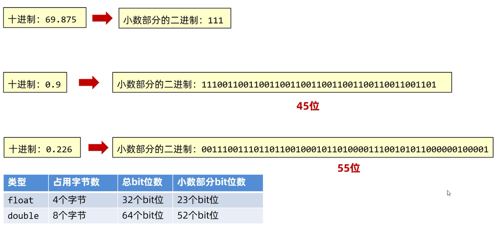
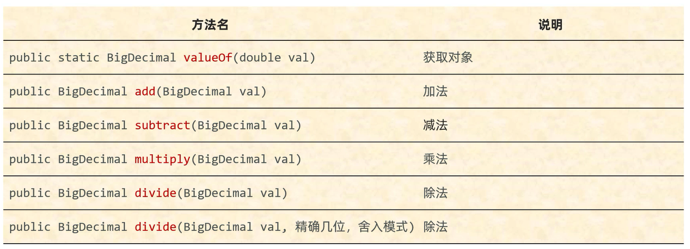
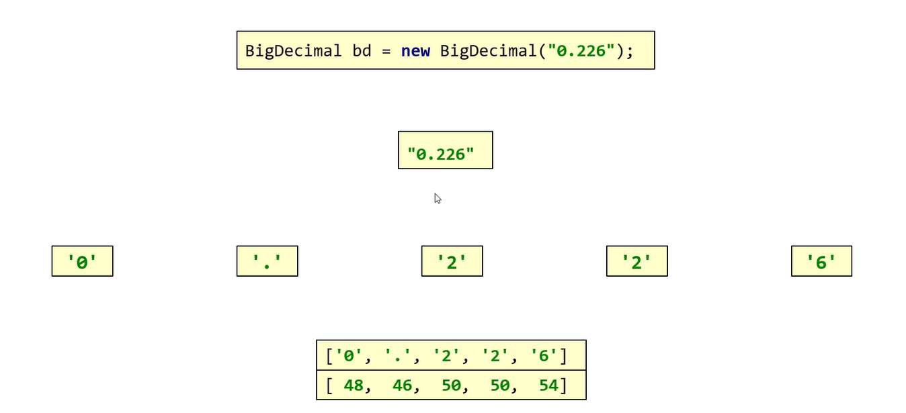
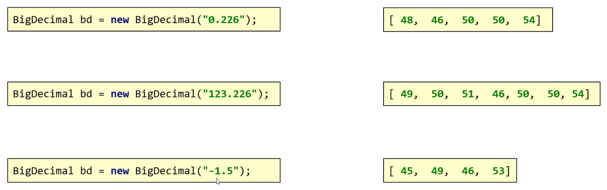

# BigDecimal

计算机中的小数:   



BigDecimal是**不可变的**,任意精度的有符号十进制数

BigDecimal的作用:    
1. 用于小数的精确计算(解决小数运算精度失真问题)   
2. 用来表示很大的小数

## 构造方法
  
1. `public BigDecimal(double val)` -- 通过传递double类型的小数来创建BigDecimal对象       
2. `public BigDecimal(String val)` -- 通过传递字符串来创建BigDecimal对象         

注意事项: 
1. **如果要表示的数字不大,没有超出double的取值范围,建议使用静态方法创建BigDecimal对象**
2. **如果要表示的数字比较大,超出double的取值范围,建议使用传递字符串类型的构造方法**

## BigDecimal(double val)

通过传递double类型的小数来创建BigDecimal对象      

细节: **此构造方法的结果有一定的不可预知性,不建议使用**       

范例:     

```java
import java.math.BigDecimal;

public class Test {
    public static void main(String[] args) {
        BigDecimal bd = new BigDecimal(0.97);
        // 打印结果:"0.9699999999999999733546474089962430298328399658203125"
        System.out.println(bd);
    }
}
```

## BigDecimal(String val)

通过传递字符串来创建BigDecimal对象      

细节: **此构造方法的结果精确,建议使用**    

范例:     

```java
import java.math.BigDecimal;

public class Test {
    public static void main(String[] args) {
        BigDecimal bd = new BigDecimal("0.97");
        // 打印结果:"0.97"
        System.out.println(bd);
    }
}
```

## 成员方法



## valueOf(double val)

静态方法创建BigDecimal对象

细节: **如果传递的是 0 ~ 10 之间的整数(包含0和10),那么方法会返回已经创建好的对象,不会重新创建**    

范例:     

```java
import java.math.BigDecimal;

public class Test {
    public static void main(String[] args) {
        BigDecimal bd1 = BigDecimal.valueOf(2);
        BigDecimal bd2 = BigDecimal.valueOf(2);
        // 打印结果:"2"
        System.out.println(bd1);
        // 打印结果:"true"
        System.out.println(bd1 == bd2);
        BigDecimal bd3 = BigDecimal.valueOf(0.7);
        BigDecimal bd4 = BigDecimal.valueOf(0.7);
        // 打印结果:"false"
        System.out.println(bd3 == bd4);
    }
}
```

## add(BigDecimal val)

范例:    

```java
import java.math.BigDecimal;

public class Test {
    public static void main(String[] args) {
        BigDecimal bd1 = BigDecimal.valueOf(10.0);
        BigDecimal bd2 = BigDecimal.valueOf(2.0);
        // 打印结果:"12.0"
        System.out.println(bd1.add(bd2));
    }
}
```

## subtract(BigDecimal val)

范例:    

```java
import java.math.BigDecimal;

public class Test {
    public static void main(String[] args) {
        BigDecimal bd1 = BigDecimal.valueOf(10.0);
        BigDecimal bd2 = BigDecimal.valueOf(2.0);
        // 打印结果:"8.0"
        System.out.println(bd1.subtract(bd2));
    }
}
```

## multiply(BigDecimal val)

范例:    

```java
import java.math.BigDecimal;

public class Test {
    public static void main(String[] args) {
        BigDecimal bd1 = BigDecimal.valueOf(10.0);
        BigDecimal bd2 = BigDecimal.valueOf(2.0);
        // 打印结果:"20.00"
        System.out.println(bd1.multiply(bd2));
    }
}
```

## divide(BigDecimal val)

范例:    

```java
import java.math.BigDecimal;

public class Test {
    public static void main(String[] args) {
        BigDecimal bd1 = BigDecimal.valueOf(10.0);
        BigDecimal bd2 = BigDecimal.valueOf(2.0);
        // 打印结果:"5"
        System.out.println(bd1.divide(bd2));
    }
}
```

## divide(BigDecimal val,精确几位,舍入模式)

范例:    

```java
import java.math.BigDecimal;
import java.math.RoundingMode;

public class Test {
    public static void main(String[] args) {
        BigDecimal bd1 = BigDecimal.valueOf(10.0);
        BigDecimal bd2 = BigDecimal.valueOf(3.0);
        // 打印结果:"3.33"
        // 精确几位: 小数点后保留2位
        // 舍入模式: 四舍五入
        System.out.println(bd1.divide(bd2,2,RoundingMode.HALF_UP));
    }
}
```

## 底层原理

将BidDecimal对象的数据,分成字符,转换为ASCII码表中对应的数字存储到数组当中



