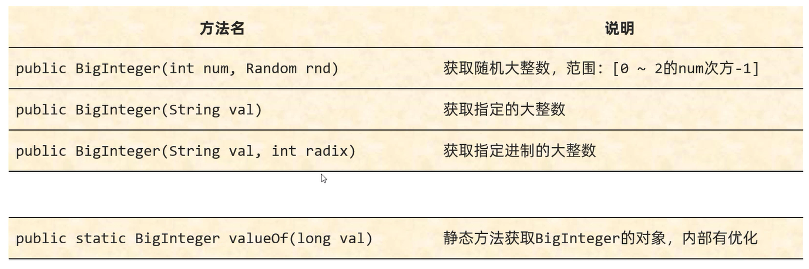
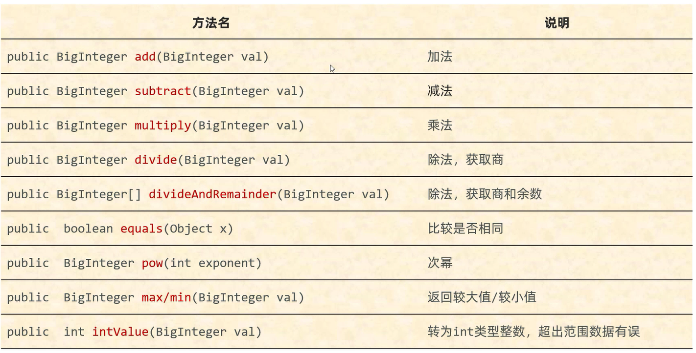
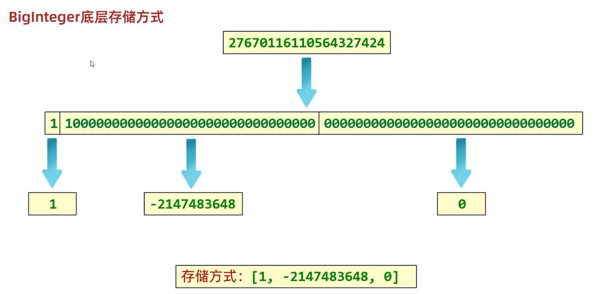
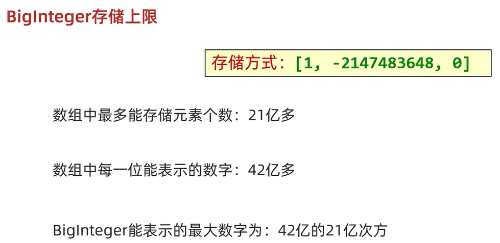

## BigInteger

在`Java`中,整数有四种类型: `byte`、`short`、`int`、`long`    

在底层中占用字节个数:      
- `byte` -- 1个字节   
- `short` -- 2个字节   
- `int` -- 4个字节    
- `long` -- 8个字节    

`BigInteger`表示的范围更大

### 构造方法



**`BigInteger`对象一旦创建,内部记录的值不能发生改变**   

范例:       

```java
import java.math.BigInteger;

public class Test {
    public static void main(String[] args) {
        BigInteger bd1 = BigInteger.valueOf(1);
        BigInteger bd2 = BigInteger.valueOf(2);
        //不会修改参与计算的BigInteger对象中的值，而是创建了一个新的BigInteger对象记录
        BigInteger result = bd1.add(bd2);
        System.out.println(result);
        //打印结果: "false"
        System.out.println(bd1 == result);
        //打印结果: "false"
        System.out.println(bd2 == result);
    }
}
```

#### `BigInteger(int num,Random rnd)`

获取随机大整数,范围: [0 ~ $2^n$ - 1]

范例:    

```java
import java.math.BigInteger;
import java.util.Random;

public class Test {
    public static void main(String[] args) {
        for (int i = 0; i < 100; i++) {
            BigInteger bd = new BigInteger(4,new Random());
            System.out.print(bd + " ");
        }
    }
}
```

#### `BigInteger(String val)`

获取指定的大整数    

细节: **字符串中必须是整数,否则会报错**

范例:    

```java
import java.math.BigInteger;

public class Test {
    public static void main(String[] args) {
        BigInteger bd = new BigInteger("999999999999999999999");
        //打印结果: "999999999999999999999"
        System.out.println(bd);
    }
}
```

#### `BigInteger(String val,int radix)`

获取指定进制的大整数  
 
细节:      
1. **字符串中数字必须是整数**   
2. **字符串中数字必须和进制匹配**   

范例:    

```java
import java.math.BigInteger;

public class Test {
    public static void main(String[] args) {
        BigInteger bd = new BigInteger("100",2);
        //打印结果: "4"(二进制100的十进制值)
        System.out.println(bd);
    }
}
```

#### `valueOf(long val)`

静态方法获取`BigInteger`的对象

细节:     
1. **表示的范围是在`long`的取值范围之内**     
2. **在内部对常用的数字 -16 ~ 16 进行了优化**    
提前把 -16 ~ 16 先创建好`BigInteger`的对象,如果多次获取不会重新创建新的对象

范例:    

```java
import java.math.BigInteger;

public class Test {
    public static void main(String[] args) {
        BigInteger bd1 = BigInteger.valueOf(100);
        //打印结果: "100"
        System.out.println(bd1);

        BigInteger bd2 = BigInteger.valueOf(14);
        BigInteger bd3 = BigInteger.valueOf(14);
        //打印结果: "true"
        System.out.println(bd2 == bd3);

        BigInteger bd4 = BigInteger.valueOf(17);
        BigInteger bd5 = BigInteger.valueOf(17);
        //打印结果: "false"
        System.out.println(bd4 == bd5);
    }
}
```

### 成员方法



#### `add(BigInteger val)`

加法   

范例:   

```java
import java.math.BigInteger;

public class Test {
    public static void main(String[] args) {
        BigInteger bd1 = BigInteger.valueOf(10);
        BigInteger bd2 = BigInteger.valueOf(5);
        BigInteger bd3 = bd1.add(bd2);
        //打印结果: "15"
        System.out.println(bd3);
    }
}
```

#### `subtract(BigInteger val)`

减法   

范例:   

```java
import java.math.BigInteger;

public class Test {
    public static void main(String[] args) {
        BigInteger bd1 = BigInteger.valueOf(10);
        BigInteger bd2 = BigInteger.valueOf(5);
        BigInteger bd3 = bd1.subtract(bd2);
        //打印结果: "5"
        System.out.println(bd3);
    }
}
```

#### `multiply(BigInteger val)`

乘法    

范例:   

```java
import java.math.BigInteger;

public class Test {
    public static void main(String[] args) {
        BigInteger bd1 = BigInteger.valueOf(10);
        BigInteger bd2 = BigInteger.valueOf(5);
        BigInteger bd3 = bd1.multiply(bd2);
        //打印结果: "50"
        System.out.println(bd3);
    }
}
```

#### `divide(BigInteger val)`

除法,获取商     

范例:   

```java
import java.math.BigInteger;

public class Test {
    public static void main(String[] args) {
        BigInteger bd1 = BigInteger.valueOf(10);
        BigInteger bd2 = BigInteger.valueOf(5);
        BigInteger bd3 = bd1.divide(bd2);
        //打印结果: "2"
        System.out.println(bd3);
    }
}
```

#### `divideAndRemainder(BigInteger val)`

除法,获取商和余数     
- 商: `BigInteger[0]`     
- 余数: `BigInteger[1]`   

范例:   

```java
import java.math.BigInteger;

public class Test {
    public static void main(String[] args) {
        BigInteger bd1 = BigInteger.valueOf(10);
        BigInteger bd2 = BigInteger.valueOf(5);
        BigInteger[] bdArr = bd1.divideAndRemainder(bd2);
        //打印结果: "商为2,余数为0"
        System.out.println("商为" + bdArr[0] + ",余数为" + bdArr[1]);
    }
}
```

#### `equals(Object o)`

比较是否相同     

范例:   

```java
import java.math.BigInteger;

public class Test {
    public static void main(String[] args) {
        BigInteger bd1 = BigInteger.valueOf(10);
        BigInteger bd2 = BigInteger.valueOf(5);
        //打印结果: "false"
        System.out.println(bd1.equals(bd2));
    }
}
```

#### `pow(int exponent)`

次幂      

范例:   

```java
import java.math.BigInteger;

public class Test {
    public static void main(String[] args) {
        BigInteger bd1 = BigInteger.valueOf(10);
        //打印结果: "1000"
        System.out.println(bd1.pow(3));
    }
}
```

#### `max/min(BigInteger val)`

返回较大值/较小值        

范例:   

```java
import java.math.BigInteger;

public class Test {
    public static void main(String[] args) {
        BigInteger bd1 = BigInteger.valueOf(10);
        BigInteger bd2 = BigInteger.valueOf(5);
        //打印结果: "10"
        System.out.println(bd1.max(bd2));
        //打印结果: "5"
        System.out.println(bd1.min(bd2));
    }
}
```

#### `int/double/longValue(BigInteger val)`

转为`int`/`double`/`long`类型整数，超出范围数据有误      

范例:   

```java
import java.math.BigInteger;

public class Test {
    public static void main(String[] args) {
        BigInteger bd1 = BigInteger.valueOf(1000);
        //打印结果: "1000"
        System.out.println(bd1.intValue());
        //打印结果: "1000.0"
        System.out.println(bd1.doubleValue());
        //打印结果: "1000"
        System.out.println(bd1.longValue());
    }
}
```

### 底层原理

将`BigInteger`对象的数据,转成二进制的补码,然后从右往左分成两组(32位一组)和一个符号位

接着,把这两组和一个符号位转成各自的十进制,存储到一个数组当中



