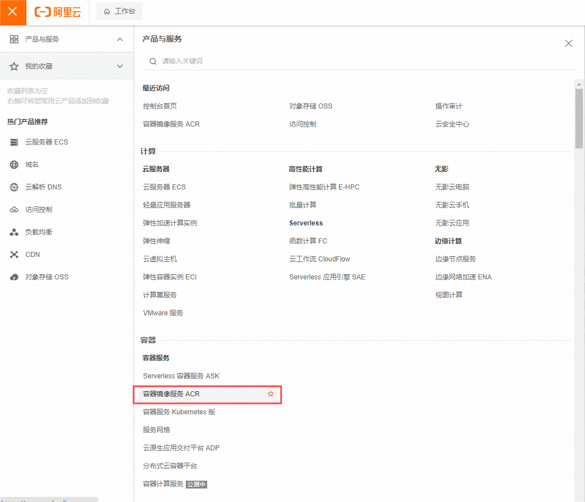
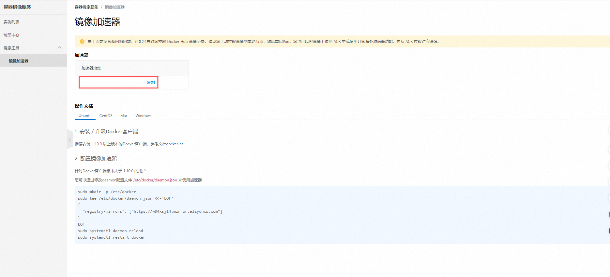

# 卸载旧版Docker

如果系统中已经存在旧的Docker,则先卸载

```cmd
yum remove docker \
    docker-client \
    docker-client-latest \
    docker-common \
    docker-latest \
    docker-latest-logrotate \
    docker-logrotate \
    docker-engine
```

# 配置yum源

1. 配置yum源为阿里云

`curl -o /etc/yum.repos.d/CentOS-Base.repo http://mirrors.aliyun.com/repo/Centos-7.repo`

2. 安装yum工具 

`yum install -y yum-utils`

3. 清除yum缓存

`yum clean all`

4. 生成yum缓存

`yum makecache`

5. 配置Docker的yum源为阿里云

`yum-config-manager --add-repo http://mirrors.aliyun.com/docker-ce/linux/centos/docker-ce.repo`

# 安装Docker

`yum install -y docker-ce docker-ce-cli containerd.io docker-buildx-plugin docker-compose-plugin`

# 启动和校验

1. 启动Docker

`systemctl start docker`

2. 停止Docker

`systemctl stop docker`

3. 重启

`systemctl restart docker`

4. 设置开机自启

`systemctl enable docker`

5. 执行`docker ps`命令,如果不报错,说明安装启动成功

# 配置镜像加速(阿里云)

1. (注册登录阿里云后)找到阿里云的容器镜像服务(初次登录需要开通)



2. 找到镜像工具下的镜像加速器



3. 创建目录

`mkdir -p /etc/docker`

4. 复制内容,把其中的镜像加速地址改成自己的

```cmd
tee /etc/docker/daemon.json <<-'EOF'
{
  "registry-mirrors": ["https://xxxx.mirror.aliyuncs.com"]
}
EOF
```

5. 重新加载配置

`systemctl daemon-reload`

6. 重启Docker

`systemctl restart docker`