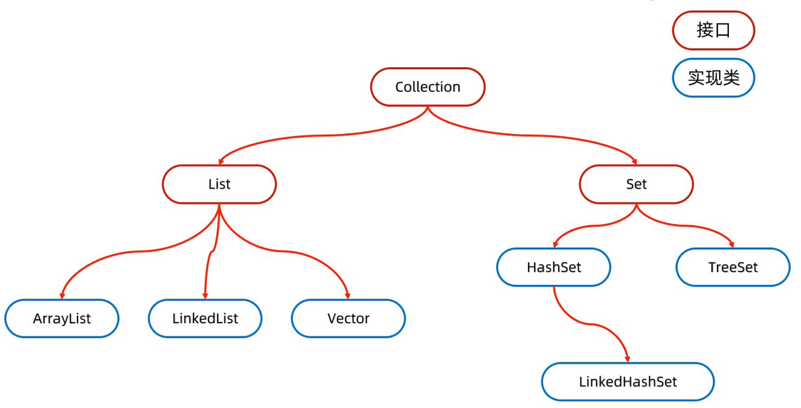
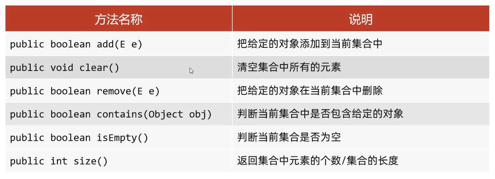
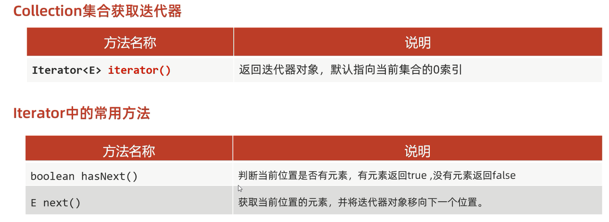
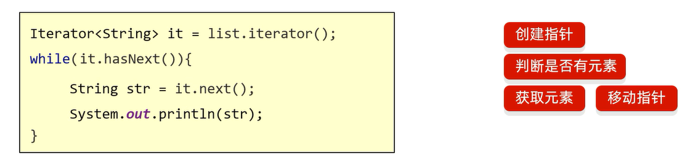
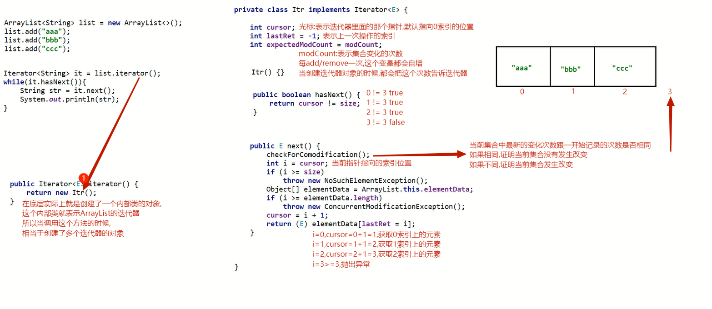
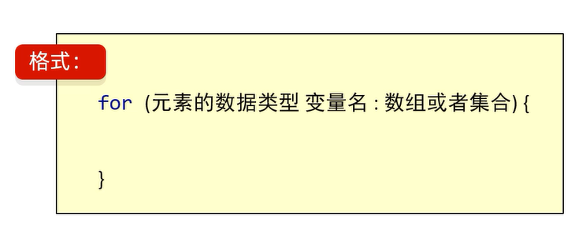
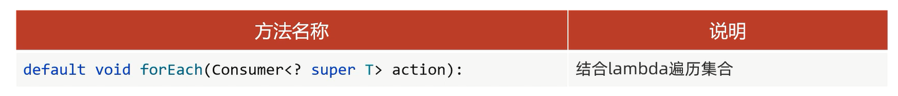

# 集合体系结构 

1. 单列集合(Collection)
2. 双列集合(Map)

# 单列集合(Collection)



1. List系列集合: 添加的元素是**有序、可重复、有索引**
2. Set系列集合: 添加的元素是**无序、不重复、无索引**

Collection是单列集合的祖宗接口,它的功能是全部单列集合都可以继承使用的

## 常用方法



细节: 
1. `public boolean add(E e)`                    
如果要往List系列集合中添加数据,方法返回true,因为List系列集合允许元素重复                         
而往Set系列集合中添加数据,方法返回true/false                    
因为Set系列集合不允许元素重复(元素重复,返回false; 元素不重复,返回true)                  
2. `public boolean remove(E e)`                 
a.Collection里面定义的是共性的方法,所以不能通过索引删除,只能通过对象删除                
b.删除成功返回true,删除失败返回false            

范例: 

```java
import java.util.ArrayList;
import java.util.Collection;

public class Test {
    public static void main(String[] args) {
        // Collection是一个接口,不能直接创建其对象,只能创建其实现类的对象
        Collection<String> coll = new ArrayList<>();

        // 添加
        coll.add("aaa");
        // 打印结果:"[aaa]"
        System.out.println(coll);
        System.out.println();

        // 清空
        coll.clear();
        // 打印结果:"[]"
        System.out.println(coll);
        System.out.println();

        // 删除
        coll.add("apple");
        coll.add("pig");
        // 打印结果:"[apple,pig]"
        System.out.println(coll);
        coll.remove("pig");
        // 打印结果:"[apple]"
        System.out.println(coll);
        System.out.println();

        // 判断元素是否包含
        // 打印结果:"不包含pig"
        // 打印结果:"包含apple"
        if (coll.contains("pig")) {
            System.out.println("包含pig");
        } else {
            System.out.println("不包含pig");
        }
        if (coll.contains("apple")) {
            System.out.println("包含apple");
        } else {
            System.out.println("不包含apple");
        }
        System.out.println();

        // 判断是否为空
        // 打印结果:"false"
        System.out.println(coll.isEmpty());

        // 返回集合长度
        // 打印结果:"1"
        System.out.println(coll.size());
    }
}
```

3. `public boolean contains(Object obj)`          
底层是依赖equals方法进行判断是否存在           
如果集合中存储的是自定义对象,也想通过contains方法来判断是否包含               
则在JavaBean类中一定要重写equals方法

范例: 

```java
import java.util.Objects;

public class Student {
    private String name;
    private int age;

    public Student() {
    }

    public Student(String name,int age) {
        this.name = name;
        this.age = age;
    }

    public String getName() {
        return name;
    }

    public void setName(String name) {
        this.name = name;
    }

    public int getAge() {
        return age;
    }

    public void setAge(int age) {
        this.age = age;
    }

    // 重写equals方法
    @Override
    public boolean equals(Object o) {
        if (this == o) return true;
        if (o == null || getClass() != o.getClass()) return false;
        Student student = (Student) o;
        return age == student.age && Objects.equals(name,student.name);
    }
}
```

```java
import java.util.ArrayList;
import java.util.Collection;

public class StudentTest {
    public static void main(String[] args) {
        Collection<Student> coll = new ArrayList<>();
        Student stu1 = new Student("张三",23);
        Student stu2 = new Student("李四",24);
        Student stu3 = new Student("张三",23);
        coll.add(stu1);
        coll.add(stu2);
        // 打印结果:"true"
        System.out.println(coll.contains(stu1));
        // 打印结果:"true"
        System.out.println(coll.contains(stu3));
    }
}
```

## 遍历方式

1. 迭代器遍历 -- **在遍历的过程中需要删除元素,使用迭代器遍历**
2. 增强for遍历 -- **仅遍历,使用增强for遍历**
3. Lambda表达式遍历 -- **仅遍历,使用Lambda表达式遍历**

## 迭代器遍历

细节: **迭代器不依赖索引**

迭代器在Java中的类是Iterator,迭代器是集合专用的遍历方式  

### 获取迭代器和常用方法



### 格式



范例: 

```java
import java.util.ArrayList;
import java.util.Iterator;

public class Test {
    public static void main(String[] args) {
        Collection<String> list = new ArrayList<>();
        list.add("你");
        list.add("是");
        list.add("我");
        list.add(",");
        list.add("我");
        list.add("是");
        list.add("你");
        // 获取一个迭代器对象
        // 迭代器就好比一个指针,默认指向集合的0索引处
        Iterator<String> it = list.iterator();
        // 判断是否有元素
        // 打印结果:"你是我,我是你"
        while (it.hasNext()) {
            // 获取元素并移动指针
            System.out.print(it.next());
        }
    }
}
```

**注意事项 :** 
1. **如果迭代器已经指向空位置,此时再调用next方法,就会报错NoSuchElementException(没有这个元素异常)**
2. **迭代器遍历完毕,指针不会复位(如果还想遍历一遍,只能再次获取一个迭代器对象)**
3. **循环中只能用一次next方法,否则就会报错NoSuchElementException(不存在相关元素异常)**

范例: 

```java
import java.util.ArrayList;
import java.util.Iterator;

public class Test {
    public static void main(String[] args) {
        Collection<String> list = new ArrayList<>();
        list.add("你");
        list.add("是");
        list.add("我");
        list.add(",");
        list.add("我");
        list.add("是");
        list.add("你");
        // 获取一个迭代器对象
        // 迭代器就好比一个指针,默认指向集合的0索引处
        Iterator<String> it = list.iterator();
        // 判断是否有元素
        while (it.hasNext()) {
            // 获取元素并移动指针
            // 打印结果:"你是我,我是你Exception in thread "main" java.util.NoSuchElementException..."
            System.out.print(it.next());    //   你    我      我      你
            System.out.print(it.next());    //   是    ,      是      Exception in thread "main" java.util.NoSuchElementException...
        }
    }
}
```

4. **迭代器遍历时,不能用集合的方法进行增加或者删除**                  
**否则就会报错ConcurrentModificationException(并发修改异常)**              

范例: 

```java
import java.util.ArrayList;
import java.util.Collection;
import java.util.Iterator;

public class Test {
    public static void main(String[] args) {
        Collection<String> list = new ArrayList<>();
        list.add("你");
        list.add("是");
        list.add("我");
        list.add(",");
        list.add("我");
        list.add("是");
        list.add("你");
        // 获取一个迭代器对象
        // 迭代器就好比一个指针,默认指向集合的0索引处
        Iterator<String> it = list.iterator();
        // 判断是否有元素
        while (it.hasNext()) {
            // 获取元素并移动指针
            String str = it.next();

            if (str.equals("我")) {
                // 用集合的方法进行删除
                list.remove("我");
            }
        }
        // 打印结果:"Exception in thread "main" java.util.ConcurrentModificationException..."
        System.out.print(list);
    }
}
```

**实在要删除: 可以用迭代器提供的remove方法进行删除**              

范例: 

```java
import java.util.ArrayList;
import java.util.Collection;
import java.util.Iterator;

public class Test {
    public static void main(String[] args) {
        Collection<String> list = new ArrayList<>();
        list.add("你");
        list.add("是");
        list.add("我");
        list.add(",");
        list.add("我");
        list.add("是");
        list.add("你");
        // 获取一个迭代器对象
        // 迭代器就好比一个指针,默认指向集合的0索引处
        Iterator<String> it = list.iterator();
        // 判断是否有元素
        while (it.hasNext()) {
            // 获取元素并移动指针
            String str = it.next();

            if (str.equals("我")) {
                // 用迭代器的方法进行删除
                it.remove();
            }
        }
        // 打印结果:"[你,是,,,是,你]"
        System.out.print(list);
    }
}
```

### 迭代器底层源码分析



## 增强for遍历

1. 增强for的底层就是迭代器,为了简化迭代器的代码书写的
2. 在JDK5之后出现的,其内部原理就是一个Iterator迭代器
3. **所有的单列集合和数组**才能用增强for进行遍历

### 格式



**快速生成增强for**: `单列集合/数组名.for`

范例: 

```java
import java.util.ArrayList;
import java.util.Collection;

public class Test {
    public static void main(String[] args) {
        Collection<String> list = new ArrayList<>();
        list.add("你");
        list.add("是");
        list.add("我");
        list.add(",");
        list.add("我");
        list.add("是");
        list.add("你");
        
        // 注意: s其实就是一个第三方变量,在循环的过程中依次表示集合中的每一个数据
        for (String s: list) {
            // 打印结果:"你是我,我是你"
            System.out.print(s);
        }
    }
}
```

**注意事项 :**      
1. **增强for中的变量其实就是一个第三方变量,在循环的过程中依次表示集合中的每一个数据**
2. **修改增强for中的变量,不会改变集合中原本的数据**

范例: 

```java
import java.util.ArrayList;
import java.util.Collection;

public class Test {
    public static void main(String[] args) {
        Collection<String> list = new ArrayList<>();
        list.add("你");
        list.add("是");
        list.add("我");
        list.add(",");
        list.add("我");
        list.add("是");
        list.add("你");

        for (String s: list) {
            s = "它";
        }
        // 打印结果:"[你,是,我,,,我,是,你]"
        System.out.print(list);
    }
}
```

## Lambda表达式遍历

得益于JDK8开始的新技术Lambda表达式,提供了一种更简单,更直接的遍历集合的方式

### 格式



forEach方法的底层原理: 遍历集合,依次得到每一个元素,传递给下面的accept方法

范例: 

```java
import java.util.ArrayList;
import java.util.Collection;
import java.util.function.Consumer;

public class Test {
    public static void main(String[] args) {
        Collection<String> list = new ArrayList<>();
        list.add("你");
        list.add("是");
        list.add("我");
        list.add(",");
        list.add("我");
        list.add("是");
        list.add("你");

        // 匿名内部类的形式
        list.forEach(new Consumer<String>() {
            @Override
            // s依次表示集合中的每一个数据
            public void accept(String s) {
                System.out.print(s);
            }
        });

        System.out.println();

        // Lambda表达式的形式
        list.forEach(s -> System.out.print(s));
    }
}
```

## 总结

1. 如果想要集合中的元素可重复                           
用ArrayList集合,基于数组的(**用的最多**)
2. 如果想要集合中的元素可重复,而且当前的**增删操作明显多于查询**                  
用LinkedList集合,基于链表的
3. 如果想对集合中的元素去重                      
用HashSet集合,基于哈希表的(**用的最多**)          
4. 如果想对集合中的元素去重,而且**保证存取顺序**                 
用LinkedHashSet集合,基于哈希表和双链表,效率低于HashSet               
5. 如果相对集合中的元素进行**排序**                    
用TreeSet集合,基于红黑树,后续也可以用List集合实现排序