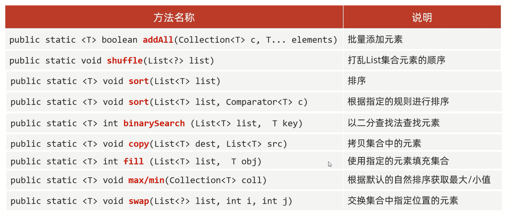

# Collections

java.utils.Collections是集合工具类

# 常用方法



范例:

```java
import java.util.ArrayList;
import java.util.Collections;
import java.util.Comparator;

public class Test {
    public static void main(String[] args) {
        // addAll:批量添加元素
        ArrayList<String> list = new ArrayList<>();
        Collections.addAll(list, "zhangsan", "lisi", "wangwu");
        // 打印结果:"[zhangsan, lisi, wangwu]"
        System.out.println(list);

        // shuffle:打乱
        Collections.shuffle(list);
        // 打印结果:"[wangwu, zhangsan, lisi]"
        System.out.println(list);

        // sort:排序
        Collections.sort(list);
        // 打印结果:"[lisi, wangwu, zhangsan]"
        System.out.println(list);

        // sort:根据指定的规则进行排序
        Collections.sort(list, new Comparator<String>() {
            @Override
            public int compare(String o1, String o2) {
                return o2.compareTo(o1);
            }
        });
        // 打印结果:"[zhangsan, wangwu, lisi]"
        System.out.println(list);

        // binarySearch:以二分查找法查找元素
        // 打印结果:"1"
        System.out.println(Collections.binarySearch(list, "wangwu"));

        // copy:拷贝集合中的元素
        ArrayList<String> newList = new ArrayList<>();
        Collections.addAll(newList, null, null, null);
        Collections.copy(newList, list);
        // 打印结果:"[zhangsan, wangwu, lisi]"
        System.out.println(newList);


        // fill:使用指定元素填充集合
        Collections.fill(list, "a");
        // 打印结果:"[a, a, a]"
        System.out.println(list);


        Collections.addAll(newList, "a", "b", "d", "m");
        // max/min:根据默认的自然排序获取最大/小值
        // 打印结果:"m"
        System.out.println(Collections.max(newList));
        // 打印结果:"a"
        System.out.println(Collections.min(newList));

        // swap:交换集合中指定位置的元素
        Collections.swap(newList, 0, 3);
        // 打印结果:"[m, b, d, a]"
        System.out.println(newList);
    }
}
```

