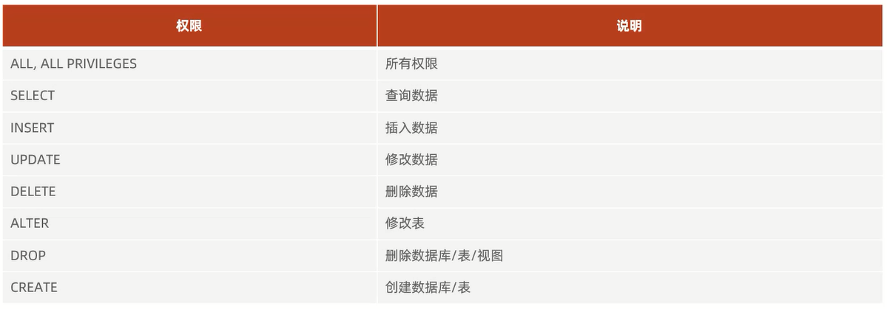

# DCL

DCL全称Data Control Language(数据控制语言),用来管理数据库用户、控制数据库的访问权限

# 管理用户

主要是DBA(Database Administrator)数据库管理员使用

## 查询用户

`use mysql;`           
`select * from user;`    

## 创建用户

`create user '用户名'@'主机名' identified by '密码';`:用户只能在当前主机localhost访问该数据库           

细节:**主机名可以用`%`进行通配,代表任意主机都可以访问该数据库**

## 修改用户密码

`alter user '用户名'@'主机名' identified with mysql_native_password by '新密码';`

## 删除用户

`drop user '用户名'@'主机名';`

# 权限控制

细节:
1. **多个权限之间,使用逗号分隔**
2. **授权时,数据库名和表名可以使用`*`进行通配,代表所有**

## 查询权限

`show grants for '用户名'@'主机名';`

## 授予权限

`grant 权限列表 on 数据库名.表名 to '用户名'@'主机名';`

## 撤销权限

`revoke 权限列表 on 数据库名.表名 to '用户名'@'主机名';`