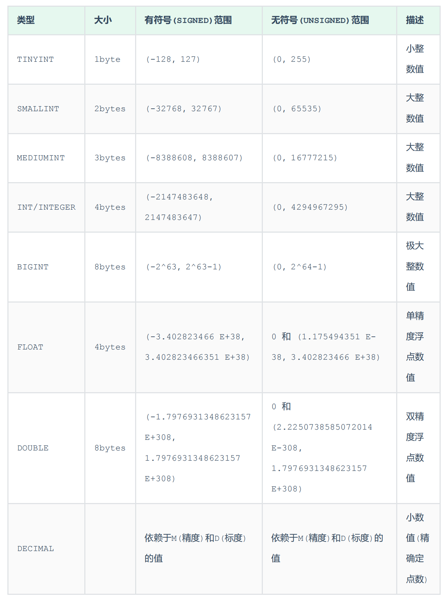
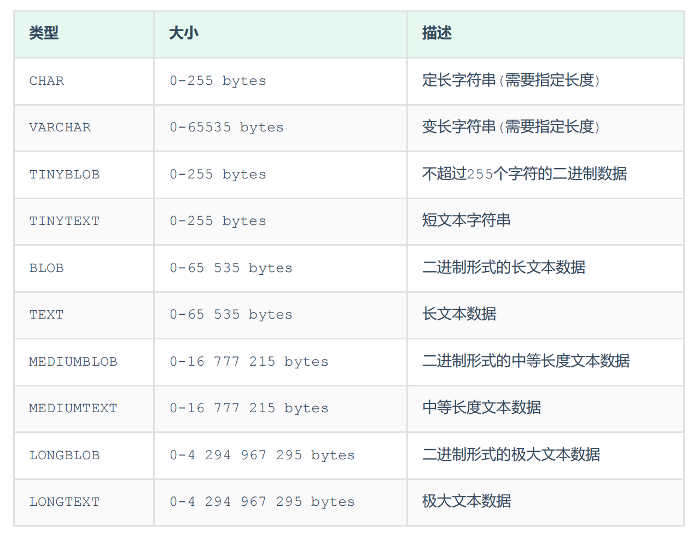
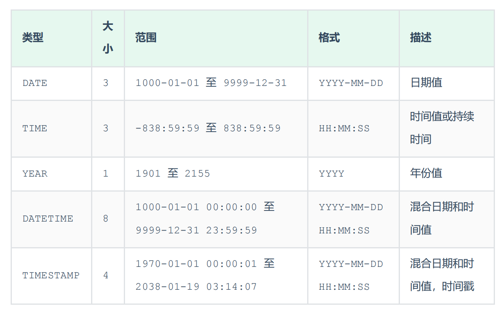
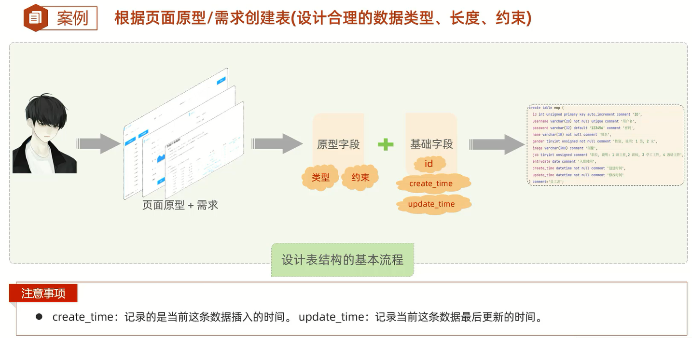

# DDL

DDL全称Data Definition Language(数据定义语言),用来定义数据库对象(数据库,表,字段)

# 数据库操作

1. `show databases;`:查询所有数据库                  
2. `select database();`:查询当前数据库
3. `create database [if not exists] 数据库名 [default charset 字符集] [collate 排序规则];`:创建数据库                  
数据库中默认字符集:`utf8mb4`
4. `drop database [if exists] 数据库名;`:删除数据库
5. `use 数据库名;`:切换数据库

细节:**上述语法中的`database`,也可以替换成`schema`**

# 表操作

## 查询表

1. `show tables;`:查询当前数据库所有表
2. `desc 表名;`:查询表结构
3. `show create table 表名;`:查询指定表的建表语句

## 创建表

```sql
create table 表名(
字段1 字段1类型 [comment '字段1注释'],
字段2 字段2类型 [comment '字段2注释'],
字段3 字段3类型 [comment '字段3注释'],
......
字段n 字段n类型 [comment '字段n注释'] 
) [comment '表注释'];
```

## 数据类型

MySQL中的数据类型有很多,主要分为三类:数值类型、字符串类型、日期时间类型

### 数值类型



细节:                   
1. 精度和标度,例如:123.23的精度M为5,标度D为2           
2. 直接使用类型,默认是有符号范围的(signed),如果要使用无符号范围的,需要添加`unsigned`,例如`age - tinyint unsigned`:年龄为正数且一般情况下不会超过255
3. `score - double(4,1)`:其中4表示整个数字长度,1表示小数数字长度,即分数为0.0-100.0               


### 字符串类型



细节:
1. `char(10)`:当前字符串最多存储10个字符,定长即占10个字符空间,不足的用空格补位,性能较好,浪费空间
2. `varchar(20)`:当前字符串最多存储20个字符,变长即用几个字符就占几个字符空间,性能较差,节省空间
3. `username - varchar(50)`:用户名用变长字符串,用户名长度不一
4. `gender - char(1)`:性别用定长字符串,要么男,要么女
5. `phone - char(11)`:手机号用定长字符串,都是11位数

### 日期时间类型



细节:
1. `birthday - date`:记录生日,用日期值
2. `update_time - datetime`:记录准确时间,用混合日期和时间值

## 建表练习

练习1:

设计一张员工信息表,要求如下：
1. 编号(纯数字)
2. 员工工号 (字符串类型,长度不超过10位)
3. 员工姓名(字符串类型,长度不超过10位)
4. 性别(男/女,存储一个汉字)
5. 年龄(正常人年龄,不可能存储负数)
6. 身份证号(二代身份证号均为18位,身份证中有X这样的字符)
7. 入职时间(取值年月日即可)

```sql
create table tb_emp
(
    id        int comment '编号',
    empId     varchar(10) comment '员工工号',
    name      varchar(10) comment '姓名',
    gender    char(1) comment '性别',
    age       tinyint unsigned comment '年龄',
    idCard    char(18) comment '身份证号',
    entryDate date comment '入职时间'
) comment '用户表';
```

练习2:



```sql
create table tb_emp
(
    id          int auto_increment comment '主键ID'
        primary key,
    username    varchar(20)                  not null comment '用户名',
    password    varchar(32) default '123456' not null comment '密码',
    name        varchar(10)                  not null comment '姓名',
    gender      tinyint unsigned             not null comment '性别(1 男,2 女)',
    image       varchar(300)                 null comment '图像url',
    job         tinyint unsigned             null comment '职位(1 讲师,2 班主任,3 就业指导)',
    entry_date  date                         null comment '入职日期',
    create_time datetime                     not null comment '创建时间',
    update_time datetime                     not null comment '修改时间',
    constraint tb_emp_pk2
        unique (username)
)
    comment '员工表';
```

## 修改表

### 添加字段

`alter table 表名 add 字段名 类型(长度) [comment '注释'] [约束];`

### 修改字段类型

`alter table 表名 modify 字段名 新字段类型(长度);`

### 修改字段名和字段类型

`alter table 表名 change 旧字段名 新字段名 新字段类型(长度) [comment '注释'] [约束];`

### 删除字段

`alter table 表名 drop column 字段名;`

### 修改表名

1. `alter table 表名 rename to 新表名;`
2. `rename table 表名 to 新表名;`

## 删除表

1. `drop table [if exists] 表名;`:删除表
2. `truncate table 表名;`:删除指定表,并重新创建该表(**清空数据,保留表结构**)