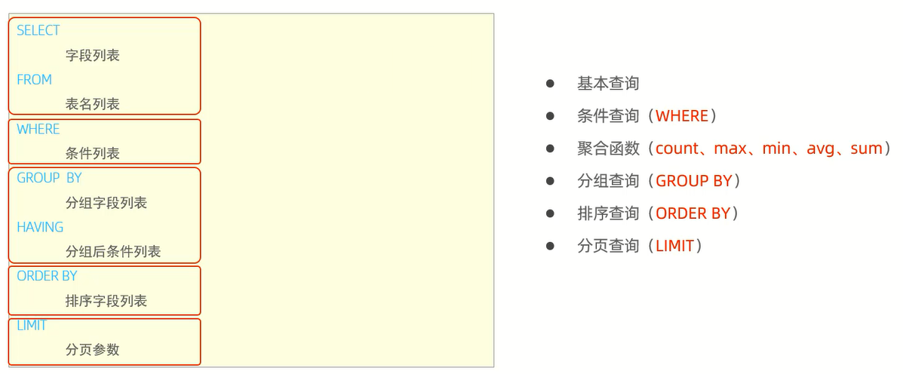
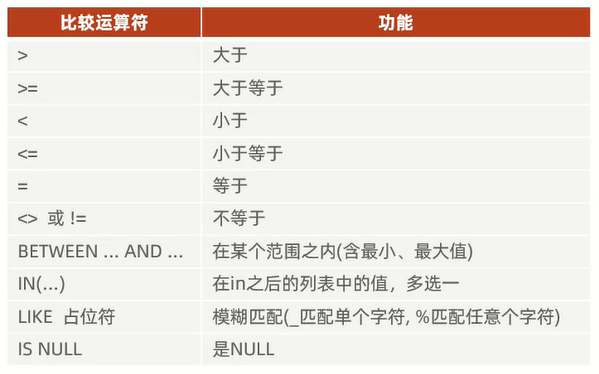
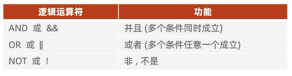
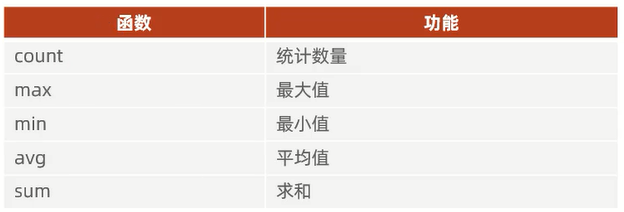
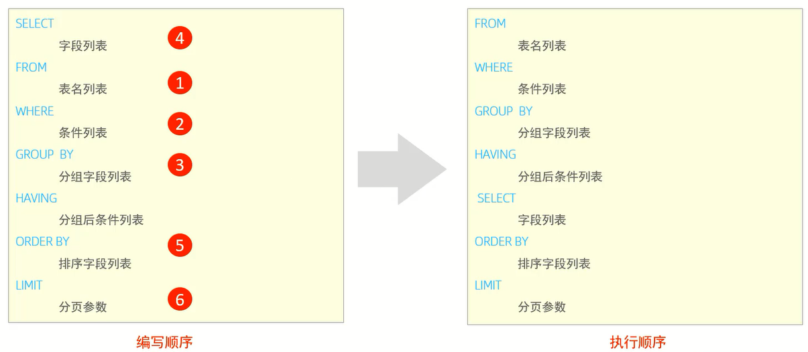

# DQL

DQL全称Data Query Language(数据查询语言),数据查询语言.用来查询数据库中表的记录

关键字:`select`

# 语法



# 基本查询

范例表:


## 查询字段

`select 字段1,字段2,字段3 ... from 表名;`:查询多个字段

`select * from 表名;`:查询所有字段

## 设置别名

`select 字段1[as 别名1],字段2[as 别名2], ... from 表名;`

## 去除重复记录

`select distinct 字段列表 from 表名;`

# 条件查询 

关键字:`where`

## 语法

`select 字段列表 from 表名 where 条件列表;`

## 条件



细节:`select 字段列表 from 表名 where between ... and ...;`中前面是最小值,后面是最大值



## 范例

```cmd
# 查询年龄等于88的员工
select * from emp where age = 88;

# 查询年龄小于20的员工信息 
select * from emp where age < 20; 

# 查询年龄小于等于20的员工信息
select * from emp where age <= 20; 

# 查询没有身份证号的员工信息
select * from emp where idcard is null; 

# 查询有身份证号的员工信息
select * from emp where idcard is not null; 

# 查询年龄不等于88的员工信息
select * from emp where age != 88;
select * from emp where age <> 88;

# 查询年龄在15岁(包含)到20岁(包含)之间的员工信息
select * from emp where age >= 15 && age <= 20;
select * from emp where age >= 15 and age <= 20;
select * from emp where age between 15 and 20;

# 查询性别为女且年龄小于25岁的员工信息
select * from emp where gender = '女' and age < 25; 

# 查询年龄等于18或20或40的员工信息
select * from emp where age = 18 or age = 20 or age =40;
select * from emp where age in(18,20,40);

# 查询姓名为两个字的员工信息
select * from emp where name like '__'; 

# 查询身份证号最后一位是X的员工信息
select * from emp where idcard like '%X';
select * from emp where idcard like '_________________X';
```

# 聚合函数

聚合函数指将一列数据作为一个整体进行纵向计算



## 语法

`select 聚合函数(字段列表) from 表名;`

细节:**null值不参与所有聚合函数的运算**

# 分组查询

## 语法

`select 字段列表 from 表名 [where 分组前的过滤条件] group by 分组字段名 [having 分组后的过滤条件];`

## where与having的区别

- 执行时机不同:where是分组之前进行过滤,不满足where条件,不参与分组;而having是分组之后对结果进行过滤
- 判断条件不同:where不能对聚合函数进行判断,而having可以

细节:
1. **分组之后,查询的字段一般为聚合函数和分组字段,查询其他字段无任何意义**
2. **执行顺序:where > 聚合函数 > having**
3. **支持多字段分组,具体语法为:group by columnA,columnB**

## 范例

```cmd
# 根据性别分组,统计男性员工和女性员工的数量
select gender, count(*) from emp group by gender;

# 根据性别分组,统计男性员工和女性员工的平均年龄
select gender, avg(age) from emp group by gender;

# 查询年龄小于45的员工,并根据工作地址分组,获取员工数量大于等于3的工作地址
select workAddress, count(*) from emp where age < 45 group by workAddress having count(*) >= 3;

# 统计各个工作地址上班的男性及女性员工的数量
select workAddress, gender, count(*) from emp group by gender,workAddress;
```

# 排序查询

关键字:`order by`

## 语法

`select 字段列表 from 表名 order by 字段1 排序方式1,字段2,排序方式2;`

细节:**如果是多字段排序,当第一个字段值相同时,才会根据第二个字段进行排序**

## 排序方式

1. asc:升序(默认值)
2. desc:降序

## 范例

```cmd
# 根据年龄对公司的员工进行升序排序
select name,age from emp order by age;

# 根据入职时间,对员工进行降序排序
select name,entrydate from emp order by entrydate desc;

# 根据年龄对公司的员工进行升序排序,如果年龄相同,再按照入职时间进行降序排序
select name,age,entrydate from emp order by age,entrydate desc;
```

# 分页查询

关键字:`limit`

## 语法

`select 字段列表 from 表名 limit 起始索引,查询记录数;`

细节:
1. **起始索引从0开始,起始索引=(查询页码 - 1)*每页显示记录数**
2. **分页查询是数据库的方言,不同的数据库有不同的实现,MySQL中是limit**
3. **如果查询的是第一页数据,起始索引可以省略,直接简写为limit 10**

## 范例

```cmd
# 查询第1页员工数据,每页展示10条记录
select * from emp limit 0,10;
select * from emp limit 10;

# 查询第2页员工数据,每页展示10条记录
select * from emp limit 10,10;
```

# 练习

1. 查询年龄为20,21,22,23岁的员工信息
2. 查询性别为男,并且年龄在20-40岁(含)以内的姓名为三个字的员工
3. 统计员工表中,年龄小于60岁的男性员工和女性员工的人数
4. 查询所有年龄小于等于35岁员工的姓名和年龄,并对查询结果按年龄升序排序,如果年龄相同按入职时间降序排序
5. 查询性别为男,且年龄在20-40岁(含)以内的前5个员工信息,对查询的结果按年龄升序排序,如果年龄相同按入职时间升序排序

```cmd
# 查询年龄为20,21,22,23岁的女性员工信息
select * from emp where age in(20,21,22,23) && gender='女';
select * from emp where age between 20 and 23 && gender='女';
select * from emp where (age >= 20 && age <= 23) && gender='女';

# 查询性别为男,并且年龄在20(不含)-40岁(含)以内的姓名为三个字的员工
select * from emp where gender='男' && (age > 20 && age <= 40) && name like '___';

# 统计员工表中,年龄小于60岁的男性员工和女性员工的人数
select gender,count(*) from emp where age < 60 group by gender;

# 查询所有年龄小于等于35岁员工的姓名和年龄,并对查询结果按年龄升序排序,如果年龄相同按入职时间降序排序
select name,age from emp where age <= 35 order by age,entrydate desc;

# 查询性别为男,且年龄在20(不含)-40岁(含)以内的前5个员工信息,对查询的结果按年龄升序排序,如果年龄相同按入职时间升序排序
select * from emp where gender='男' && (age > 20 && age <= 40) order by age,entrydate limit 5;
```

# 编写和执行顺序

