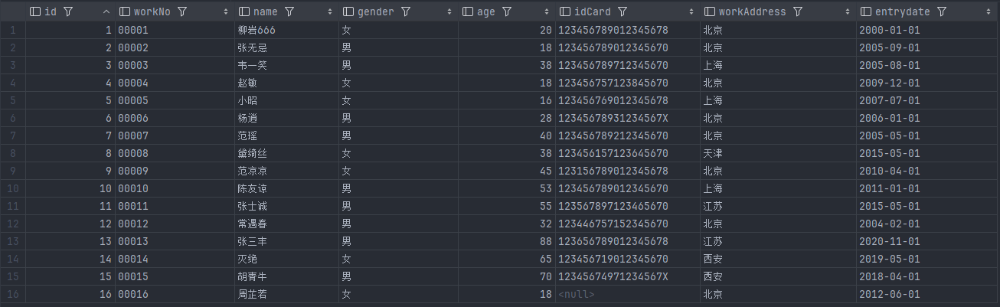

# DQL

DQL全称Data Query Language(数据查询语言),数据查询语言.用来查询数据库中表的记录

关键字:`select`

# 语法


# 基本查询

范例表:



```sql
# 创建员工表
create table emp
(
    id          int comment '编号',
    workNo      varchar(10) comment '工号',
    name        varchar(10) comment '姓名',
    gender      char(1) comment '性别',
    age         tinyint unsigned comment '年龄',
    idCard      char(18) comment '身份证号',
    workAddress varchar(50) comment '工作地址',
    entryDate   date comment '入职时间'
) comment '员工表';

# 员工表导入数据
INSERT INTO emp (id, workNo, name, gender, age, idCard, workAddress, entryDate)
VALUES (1, '00001', '柳岩666', '女', 20, '123456789012345678', '北京', '2000-01-01');
INSERT INTO emp (id, workNo, name, gender, age, idCard, workAddress, entryDate)
VALUES (2, '00002', '张无忌', '男', 18, '123456789012345670', '北京', '2005-09-01');
INSERT INTO emp (id, workNo, name, gender, age, idCard, workAddress, entryDate)
VALUES (3, '00003', '韦一笑', '男', 38, '123456789712345670', '上海', '2005-08-01');
INSERT INTO emp (id, workNo, name, gender, age, idCard, workAddress, entryDate)
VALUES (4, '00004', '赵敏', '女', 18, '123456757123845670', '北京', '2009-12-01');
INSERT INTO emp (id, workNo, name, gender, age, idCard, workAddress, entryDate)
VALUES (5, '00005', '小昭', '女', 16, '123456769012345678', '上海', '2007-07-01');
INSERT INTO emp (id, workNo, name, gender, age, idCard, workAddress, entryDate)
VALUES (6, '00006', '杨逍', '男', 28, '12345678931234567X', '北京', '2006-01-01');
INSERT INTO emp (id, workNo, name, gender, age, idCard, workAddress, entryDate)
VALUES (7, '00007', '范瑶', '男', 40, '123456789212345670', '北京', '2005-05-01');
INSERT INTO emp (id, workNo, name, gender, age, idCard, workAddress, entryDate)
VALUES (8, '00008', '黛绮丝', '女', 38, '123456157123645670', '天津', '2015-05-01');
INSERT INTO emp (id, workNo, name, gender, age, idCard, workAddress, entryDate)
VALUES (9, '00009', '范凉凉', '女', 45, '123156789012345678', '北京', '2010-04-01');
INSERT INTO emp (id, workNo, name, gender, age, idCard, workAddress, entryDate)
VALUES (10, '00010', '陈友谅', '男', 53, '123456789012345670', '上海', '2011-01-01');
INSERT INTO emp (id, workNo, name, gender, age, idCard, workAddress, entryDate)
VALUES (11, '00011', '张士诚', '男', 55, '123567897123465670', '江苏', '2015-05-01');
INSERT INTO emp (id, workNo, name, gender, age, idCard, workAddress, entryDate)
VALUES (12, '00012', '常遇春', '男', 32, '123446757152345670', '北京', '2004-02-01');
INSERT INTO emp (id, workNo, name, gender, age, idCard, workAddress, entryDate)
VALUES (13, '00013', '张三丰', '男', 88, '123656789012345678', '江苏', '2020-11-01');
INSERT INTO emp (id, workNo, name, gender, age, idCard, workAddress, entryDate)
VALUES (14, '00014', '灭绝', '女', 65, '123456719012345670', '西安', '2019-05-01');
INSERT INTO emp (id, workNo, name, gender, age, idCard, workAddress, entryDate)
VALUES (15, '00015', '胡青牛', '男', 70, '12345674971234567X', '西安', '2018-04-01');
INSERT INTO emp (id, workNo, name, gender, age, idCard, workAddress, entryDate)
VALUES (16, '00016', '周芷若', '女', 18, null, '北京', '2012-06-01');
```

## 查询字段

1. `select 字段1,字段2,字段3 ... from 表名;`:查询多个字段(**推荐使用**)
2. `select * from 表名;`:查询所有字段(通配符),不推荐使用(**性能低**)

## 设置别名

`select 字段1[as 别名1],字段2[as 别名2], ... from 表名;`

细节:
1. **给表设置别名后,就不能再直接通过表名来限定字段**
2. **as可以省略**

## 去除重复记录

`select distinct 字段列表 from 表名;`

# 条件查询 

关键字:`where`

## 语法

`select 字段列表 from 表名 where 条件列表;`

## 条件


细节:`select 字段列表 from 表名 where between ... and ...;`中前面是最小值,后面是最大值


## 范例

```sql
# 查询年龄等于88的员工
select * from emp where age = 88;

# 查询年龄小于20的员工信息 
select * from emp where age < 20; 

# 查询年龄小于等于20的员工信息
select * from emp where age <= 20; 

# 查询没有身份证号的员工信息
select * from emp where idcard is null; 

# 查询有身份证号的员工信息
select * from emp where idcard is not null; 

# 查询年龄不等于88的员工信息
select * from emp where age != 88;
select * from emp where age <> 88;

# 查询年龄在15岁(包含)到20岁(包含)之间的员工信息
select * from emp where age >= 15 && age <= 20;
select * from emp where age >= 15 and age <= 20;
select * from emp where age between 15 and 20;

# 查询性别为女且年龄小于25岁的员工信息
select * from emp where gender = '女' and age < 25; 

# 查询年龄等于18或20或40的员工信息
select * from emp where age = 18 or age = 20 or age =40;
select * from emp where age in(18,20,40);

# 查询姓名为两个字的员工信息
select * from emp where name like '__'; 

# 查询身份证号最后一位是X的员工信息
select * from emp where idcard like '%X';
select * from emp where idcard like '_________________X';
```

# 聚合函数

聚合函数指将一列数据作为一个整体进行纵向计算


## 语法

`select 聚合函数(字段列表) from 表名;`

细节:
1. **null值不参与所有聚合函数的运算**
2. **统计数量可以用`count(非null字段)`、`count(常量)`、`count(*)`(推荐使用)**

# 分组查询

## 语法

`select 字段列表 from 表名 [where 分组前的过滤条件] group by 分组字段名 [having 分组后的过滤条件];`

## where与having的区别

- **执行时机**不同:where是分组之前进行过滤,不满足where条件,不参与分组;而having是分组之后对结果进行过滤
- **判断条件**不同:where不能对聚合函数进行判断,而having可以

细节:
1. **分组之后,查询的字段一般为聚合函数和分组字段,查询其他字段无任何意义**
2. **执行顺序:where > 聚合函数 > having**
3. **支持多字段分组,具体语法为:group by columnA,columnB**

## 范例

```sql
# 根据性别分组,统计男性员工和女性员工的数量
select gender, count(*) from emp group by gender;

# 根据性别分组,统计男性员工和女性员工的平均年龄
select gender, avg(age) from emp group by gender;

# 查询年龄小于45的员工,并根据工作地址分组,获取员工数量大于等于3的工作地址
select workAddress, count(*) from emp where age < 45 group by workAddress having count(*) >= 3;

# 统计各个工作地址上班的男性及女性员工的数量
select workAddress, gender, count(*) from emp group by gender,workAddress;
```

# 排序查询

关键字:`order by`

## 语法

`select 字段列表 from 表名 order by 字段1 排序方式1,字段2,排序方式2;`

细节:**如果是多字段排序,当第1个字段值相同时,才会根据第2个字段进行排序**

## 排序方式

1. asc:升序(默认值)
2. desc:降序

## 范例

```sql
# 根据年龄对公司的员工进行升序排序
select name,age from emp order by age;

# 根据入职时间,对员工进行降序排序
select name,entrydate from emp order by entrydate desc;

# 根据年龄对公司的员工进行升序排序,如果年龄相同,再按照入职时间进行降序排序
select name,age,entrydate from emp order by age,entrydate desc;
```

# 分页查询

关键字:`limit`

## 语法

`select 字段列表 from 表名 limit 起始索引,查询记录数;`

细节:
1. **起始索引从0开始,起始索引=(查询页码 - 1)*每页显示记录数**
2. **分页查询是数据库的方言,不同的数据库有不同的实现,MySQL中是limit**
3. **如果查询的是第1页数据,起始索引可以省略,直接简写为limit 10**

## 范例

```sql
# 查询第1页员工数据,每页展示10条记录
select * from emp limit 0,10;
select * from emp limit 10;

# 查询第2页员工数据,每页展示10条记录
select * from emp limit 10,10;
```

# 练习

1. 查询年龄为20,21,22,23岁的员工信息

```sql
select * from emp where age in(20,21,22,23) && gender='女';
select * from emp where age between 20 and 23 && gender='女';
select * from emp where (age >= 20 && age <= 23) && gender='女';
```

2. 查询性别为男,并且年龄在20-40岁(含)以内的姓名为三个字的员工

```sql
select * from emp where gender='男' && (age > 20 && age <= 40) && name like '___';
```

3. 统计员工表中,年龄小于60岁的男性员工和女性员工的人数

```sql
select gender,count(*) from emp where age < 60 group by gender;
```

4. 查询所有年龄小于等于35岁员工的姓名和年龄,并对查询结果按年龄升序排序,如果年龄相同按入职时间降序排序

```sql
select name,age from emp where age <= 35 order by age,entrydate desc;
```

5. 查询性别为男,且年龄在20-40岁(含)以内的前5个员工信息,对查询的结果按年龄升序排序,如果年龄相同按入职时间升序排序

```sql
select * from emp where gender='男' && (age > 20 && age <= 40) order by age,entrydate limit 5;
```

# 综合范例

```sql
-- 创建员工表
create table tb_emp
(
    id          int auto_increment comment '主键ID'
        primary key,
    username    varchar(20)                  not null comment '用户名',
    password    varchar(32) default '123456' not null comment '密码',
    name        varchar(10)                  not null comment '姓名',
    gender      tinyint unsigned             not null comment '性别(1 男,2 女)',
    image       varchar(300)                 null comment '图像url',
    job         tinyint unsigned             null comment '职位(1 班主任,2 讲师,3 学工主管,4 教研主管)',
    entry_date  date                         null comment '入职日期',
    create_time datetime                     not null comment '创建时间',
    update_time datetime                     not null comment '修改时间',
    constraint tb_emp_pk2
        unique (username)
)
    comment '员工表';

-- 员工表导入数据
INSERT INTO tb_emp (id, username, password, name, gender, image, job, entry_date, create_time, update_time)
VALUES (1, 'jinyong', '123456', '金庸', 1, '1.jpg', 4, '2000-01-01', '2022-10-27 16:35:33', '2022-10-27 16:35:35'),
       (2, 'zhangwuji', '123456', '张无忌', 1, '2.jpg', 2, '2015-01-01', '2022-10-27 16:35:33', '2022-10-27 16:35:37'),
       (3, 'yangxiao', '123456', '杨逍', 1, '3.jpg', 2, '2008-05-01', '2022-10-27 16:35:33', '2022-10-27 16:35:39'),
       (4, 'weiyixiao', '123456', '韦一笑', 1, '4.jpg', 2, '2007-01-01', '2022-10-27 16:35:33', '2022-10-27 16:35:41'),
       (5, 'changyuchun', '123456', '常遇春', 1, '5.jpg', 2, '2012-12-05', '2022-10-27 16:35:33',
        '2022-10-27 16:35:43'),
       (6, 'xiaozhao', '123456', '小昭', 2, '6.jpg', 3, '2013-09-05', '2022-10-27 16:35:33', '2022-10-27 16:35:45'),
       (7, 'jixiaofu', '123456', '纪晓芙', 2, '7.jpg', 1, '2005-08-01', '2022-10-27 16:35:33', '2022-10-27 16:35:47'),
       (8, 'zhouzhiruo', '123456', '周芷若', 2, '8.jpg', 1, '2014-11-09', '2022-10-27 16:35:33', '2022-10-27 16:35:49'),
       (9, 'dingminjun', '123456', '丁敏君', 2, '9.jpg', 1, '2011-03-11', '2022-10-27 16:35:33', '2022-10-27 16:35:51'),
       (10, 'zhaomin', '123456', '赵敏', 2, '10.jpg', 1, '2013-09-05', '2022-10-27 16:35:33', '2022-10-27 16:35:53'),
       (11, 'luzhangke', '123456', '鹿杖客', 1, '11.jpg', 2, '2007-02-01', '2022-10-27 16:35:33',
        '2022-10-27 16:35:55'),
       (12, 'hebiweng', '123456', '鹤笔翁', 1, '12.jpg', 2, '2008-08-18', '2022-10-27 16:35:33', '2022-10-27 16:35:57'),
       (13, 'fangdongbai', '123456', '方东白', 1, '13.jpg', 1, '2012-11-01', '2022-10-27 16:35:33',
        '2022-10-27 16:35:59'),
       (14, 'zhangsanfeng', '123456', '张三丰', 1, '14.jpg', 2, '2002-08-01', '2022-10-27 16:35:33',
        '2022-10-27 16:36:01'),
       (15, 'yulianzhou', '123456', '俞莲舟', 1, '15.jpg', 2, '2011-05-01', '2022-10-27 16:35:33',
        '2022-10-27 16:36:03'),
       (16, 'songyuanqiao', '123456', '宋远桥', 1, '16.jpg', 2, '2010-01-01', '2022-10-27 16:35:33',
        '2022-10-27 16:36:05'),
       (17, 'chenyouliang', '12345678', '陈友谅', 1, '17.jpg', null, '2015-03-21', '2022-10-27 16:35:33',
        '2022-10-27 16:36:07'),
       (18, 'zhang1', '123456', '张一', 1, '2.jpg', 2, '2015-01-01', '2022-10-27 16:35:33', '2022-10-27 16:36:09'),
       (19, 'zhang2', '123456', '张二', 1, '2.jpg', 2, '2012-01-01', '2022-10-27 16:35:33', '2022-10-27 16:36:11'),
       (20, 'zhang3', '123456', '张三', 1, '2.jpg', 2, '2018-01-01', '2022-10-27 16:35:33', '2022-10-27 16:36:13'),
       (21, 'zhang4', '123456', '张四', 1, '2.jpg', 2, '2015-01-01', '2022-10-27 16:35:33', '2022-10-27 16:36:15'),
       (22, 'zhang5', '123456', '张五', 1, '2.jpg', 2, '2016-01-01', '2022-10-27 16:35:33', '2022-10-27 16:36:17'),
       (23, 'zhang6', '123456', '张六', 1, '2.jpg', 2, '2012-01-01', '2022-10-27 16:35:33', '2022-10-27 16:36:19'),
       (24, 'zhang7', '123456', '张七', 1, '2.jpg', 2, '2006-01-01', '2022-10-27 16:35:33', '2022-10-27 16:36:21'),
       (25, 'zhang8', '123456', '张八', 1, '2.jpg', 2, '2002-01-01', '2022-10-27 16:35:33', '2022-10-27 16:36:23'),
       (26, 'zhang9', '123456', '张九', 1, '2.jpg', 2, '2011-01-01', '2022-10-27 16:35:33', '2022-10-27 16:36:25'),
       (27, 'zhang10', '123456', '张十', 1, '2.jpg', 2, '2004-01-01', '2022-10-27 16:35:33', '2022-10-27 16:36:27'),
       (28, 'zhang11', '123456', '张十一', 1, '2.jpg', 2, '2007-01-01', '2022-10-27 16:35:33', '2022-10-27 16:36:29'),
       (29, 'zhang12', '123456', '张十二', 1, '2.jpg', 2, '2020-01-01', '2022-10-27 16:35:33', '2022-10-27 16:36:31');

-- 查询指定字段name,entry_date并返回
select name, entry_date
from tb_emp;

-- 查询返回所有的字段
select *
from tb_emp;

select id,
       username,
       password,
       name,
       gender,
       image,
       job,
       entry_date,
       create_time,
       update_time
from tb_emp;

-- 查询所有员工的name,entry_date并起别名(姓名,入职日期)
select name as 姓名, entry_date as 入职日期
from tb_emp;

select name 姓名, entry_date 入职日期
from tb_emp;

-- 查询已有的员工关联了哪几种职位(不重复)
select distinct job
from tb_emp;

-- 查询姓名为杨逍的员工
select *
from tb_emp
where name = '杨逍';

-- 查询id小于等于5的员工
select *
from tb_emp
where id <= 5;

-- 查询没有分配职位的员工
select *
from tb_emp
where job is null;

-- 查询有职位的员工
select *
from tb_emp
where job is not null;

-- 查询密码不为123456的员工
select *
from tb_emp
where password != 123456;

select *
from tb_emp
where password <> 123456;

-- 查询入职日期在2000-01-01(包含)到2010-01-01(包含)之间的员工
select *
from tb_emp
where entry_date >= '2000-01-01' && entry_date <= '2010-01-01';

select *
from tb_emp
where entry_date between '2000-01-01' and '2010-01-01';

-- 查询入职日期在2000-01-01(包含)到2010-01-01(包含)之间且性别为女的员工
select *
from tb_emp
where entry_date between '2000-01-01' and '2010-01-01'
  and gender = 2;

-- 查询职位是2,3,4的员工
select *
from tb_emp
where job between 2 and 4;

select *
from tb_emp
where job >= 2 && job <= 4;

select *
from tb_emp
where job = 2
   or job = 3
   or job = 4;

select *
from tb_emp
where job in (2, 3, 4);

-- 查询姓名为2个字的员工
select *
from tb_emp
where name like '__';

-- 查询姓张的员工
select *
from tb_emp
where name like '张%';

-- 统计该企业的员工数量
select count(id) 员工数量
from tb_emp;

select count(*) 员工数量
from tb_emp;

-- 统计该企业员工最早的入职日期
select min(entry_date)
from tb_emp;

-- 统计该企业员工最晚的入职日期
select max(entry_date)
from tb_emp;

-- 统计该企业员工id的平均值
select avg(id)
from tb_emp;

-- 统计该企业员工的id之和
select sum(id)
from tb_emp;

-- 根据性别分组,统计男性和女性员工的数量
select gender 性别, count(*) 员工数量
from tb_emp
group by gender;

-- 先查询入职时间在2015-01-01(包含)之前的员工,再根据职位分组,获取员工数量大于等于2的职位
select job 职位, count(*) 员工数量
from tb_emp
where entry_date <= '2015-01-01'
group by job
having count(*) >= 2;

-- 根据入职时间,对员工进行升序排序
select *
from tb_emp
order by entry_date;

-- 根据入职时间,对员工进行降序排序
select *
from tb_emp
order by entry_date desc;

-- 根据入职时间,对员工进行升序排序,如果入职时间相同,则按照更新时间进行降序排序
select *
from tb_emp
order by entry_date, update_time desc;

-- 查询第1页的员工,每页展示5条记录
select *
from tb_emp
limit 0,5;

select *
from tb_emp
limit 5;

-- 查询第2页的员工,每页展示5条记录
select *
from tb_emp
limit 5,5;

-- 查询第3页的员工,每页展示5条记录
select *
from tb_emp
limit 10,5;

-- 根据输入条件,查询第1页的数据,每页展示10条记录,最后的查询结果按照更新时间进行倒序排序
-- 输入条件:姓张,性别为男,入职时间在2000-01-01(包含)到2015-12-31(包含)之间
select *
from tb_emp
where name like '张%'
  and gender = 1
  and entry_date between '2000-01-01' and '2015-12-31'
order by update_time desc
limit 10;

-- 统计男性和女性员工的数量
-- if(条件表达式,true取值,false取值)
select if(gender = 1, '男', '女') 性别, count(*) 员工数量
from tb_emp
group by gender;

-- 统计各个职位的员工数量
-- case 表达式 when 值1 then 结果1 when 值2 then 结果2 else ... end
select (case job
            when 1 then '班主任'
            when 2 then '讲师'
            when 3 then '学工主管'
            when 4 then '教研主管'
            else '未分配职位' end) 职位,
       count(*)                    员工数量
from tb_emp
group by job;
```

# 编写和执行顺序

