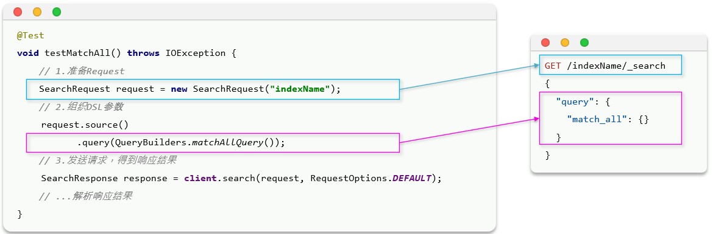
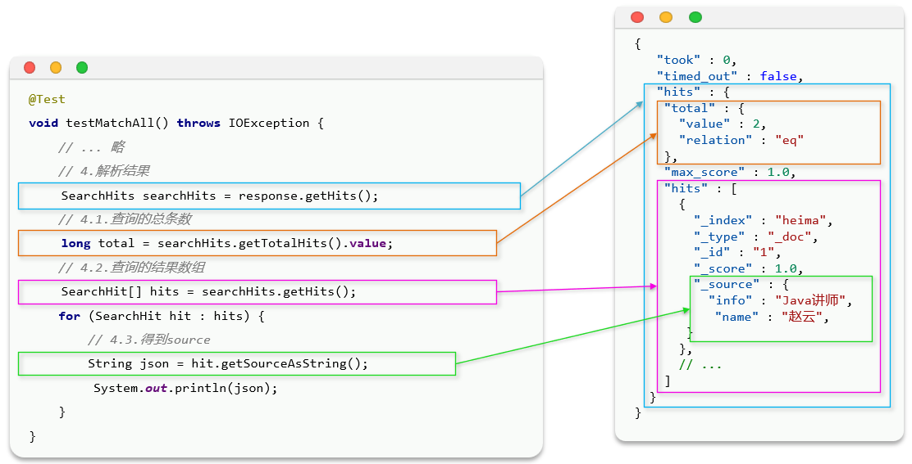
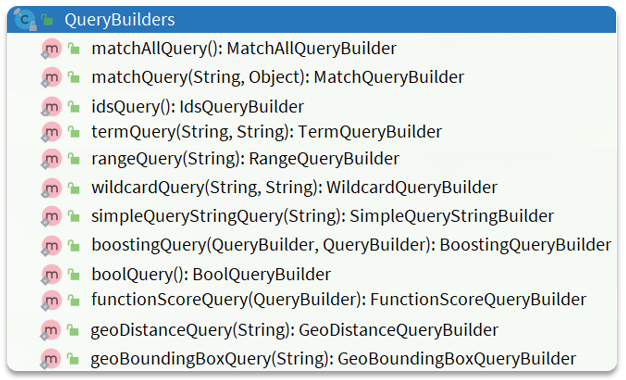
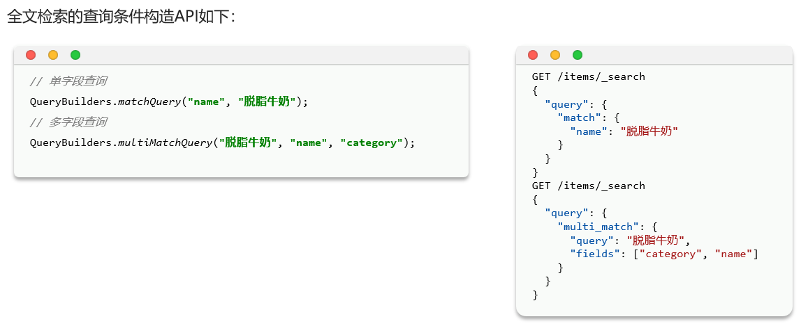
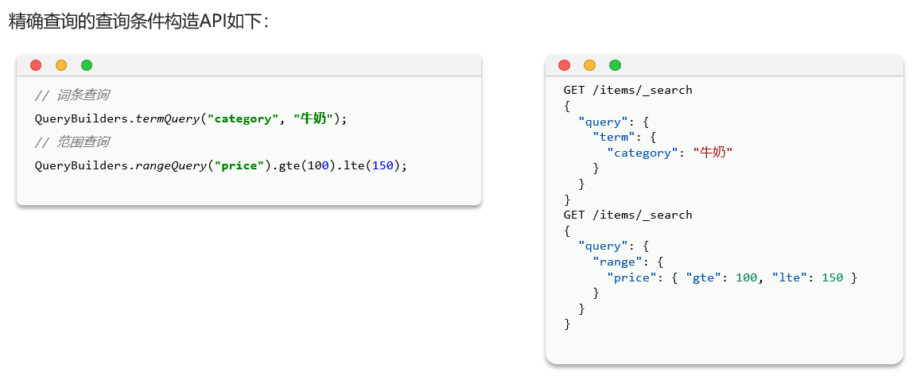
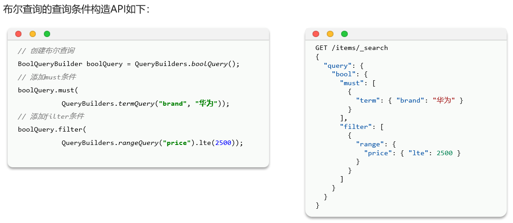
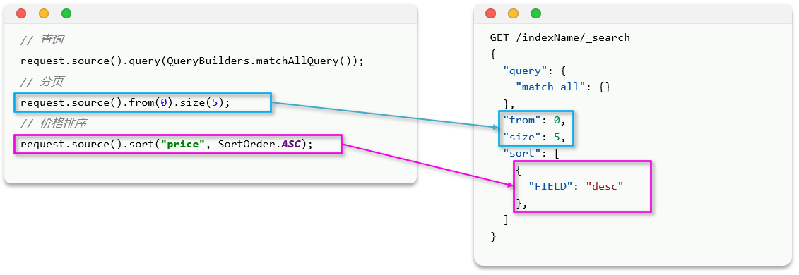
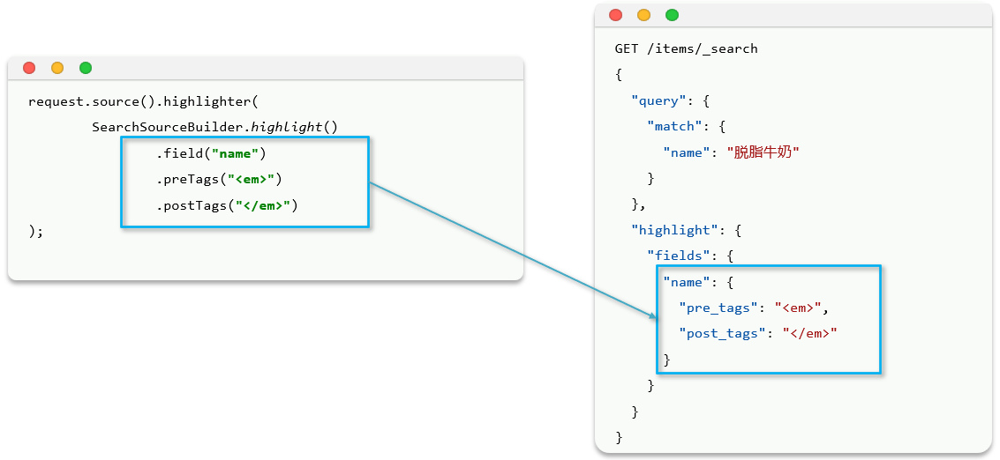
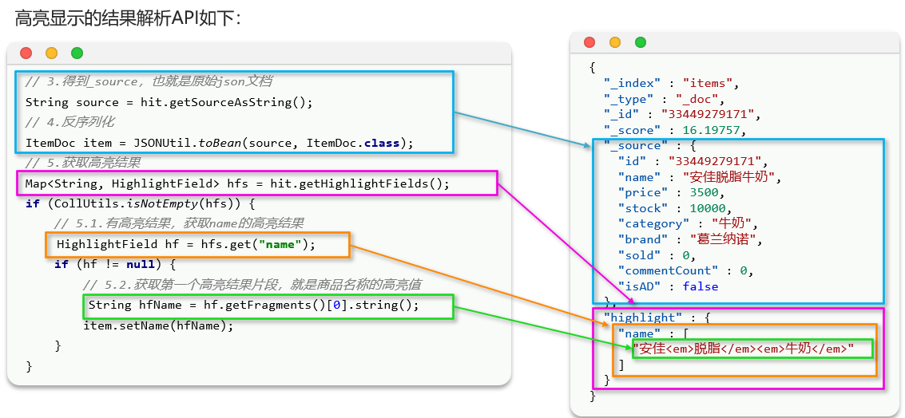

# DSL

Elasticsearch提供了基于JSON的DSL(Domain Specific Language)语句以JSON格式来定义查询条件

DSL查询可以分为两大类:
- **叶子查询**(Leaf query clauses):一般是在特定的字段里查询特定值,属于简单查询,很少单独使用
- **复合查询**(Compound query clauses):以逻辑方式组合多个叶子查询或者更改叶子查询的行为方式

在查询以后,还可以对查询的结果做处理,包括:
- **排序**:按照1个或多个字段值做排序
- **分页**:根据from和size做分页,类似MySQL
- **高亮**:对搜索结果中的关键字添加特殊样式,使其更加醒目
- **聚合**:对搜索结果做数据统计以形成报表

# 快速入门

基本语法:

```cmd
GET /indexName/_search
{
  "query": {
    "查询类型": {
      "查询条件": "条件值"
    }
  }
}
```

# 叶子查询

1. **全文检索(full text)查询**:利用分词器对用户输入内容分词,然后去词条列表中匹配

例如:
    `match_query`
    `multi_match_query`

2. **精确查询(term-level query)**:不对用户输入内容分词,直接精确匹配,一般是查找keyword、数值、日期、布尔等类型

例如:
    `term`
    `range`
    `ids`

3. **地理(geo)查询**:用于搜索地理位置,搜索方式很多

例如:
    `geo_distance`
    `geo_bounding_box`

## 全文检索查询

### match查询

根据一个字段查询,会对用户输入内容分词,然后去倒排索引库检索

语法:

```cmd
GET /indexName/_search
{
  "query": {
    "match": {
      "FIELD": "TEXT"
    }
  }
}
```

范例:

```cmd
GET /items/_search
{
  "query": {
    "match": {
      "name": "脱脂牛奶"
    }
  }
}
```

### multi_match查询

根据多个字段查询,参与查询的字段越多,查询性能越差

语法:

```cmd
GET /indexName/_search
{
  "query": {
    "multi_match": {
      "query": "TEXT",
      "fields": ["FIELD1", " FIELD12"]
    }
  }
}
```

范例:

```cmd
GET /items/_search
{
  "query": {
    "multi_match": {
      "query": "脱脂牛奶",
      "fields": ["name"]
    }
  }
}
```

## 精确查询

**精确查询**,英文是Term-level query,顾名思义,词条级别的查询

也就是说不会对用户输入的搜索条件再分词,而是作为一个词条,与搜索的字段内容精确值匹配

因此推荐查找keyword、数值、日期、boolean类型的字段,例如id、price、城市、地名、人名等作为一个整体才有含义的字段

### term查询

根据词条精确匹配,一般搜索keyword类型、数值类型、布尔类型、日期类型字段

语法:

```cmd
GET /indexName/_search
{
  "query": {
    "term": {
      "FIELD": {
        "value": "VALUE"
      }
    }
  }
}
```

范例:

```cmd
GET /items/_search
{
  "query": {
    "term": {
      "brand": {
        "value": "德亚"
      }
    }
  }
}
```

### range查询

根据数值范围查询,可以是数值、日期的范围

语法:

```cmd
GET /indexName/_search
{
  "query": {
    "range": {
      "FIELD": {
        "gte": 10,
        "lte": 20
      }
    }
  }
}
```

范例:

```cmd
GET /items/_search
{
  "query": {
    "range": {
      "price": {
        "gte": 50000,
        "lte": 100000
      }
    }
  }
}
```

### ids查询

根据id查询

语法:

```cmd
GET /indexName/_search
{
  "query": {
    "ids": {
      "values": ["VALUE1","VALUE2"]
    }
  }
}
```

范例:

```cmd
GET /items/_search
{
  "query": {
    "ids": {
      "values": ["577967","584394"]
    }
  }
}
```

# 复合查询

复合查询大致可以分为两类:
1. 第一类:基于逻辑运算组合叶子查询,实现组合条件

例如:
    `bool`

2. 第二类:基于某种算法修改查询时的文档相关性算分,从而改变文档排名

例如:
    `function_score`
    `dis_max`

## 布尔查询

布尔查询是一个或多个查询子句的组合

子查询的组合方式有:
- `must`:必须匹配每个子查询,类似"与"
- `should`:选择性匹配子查询,类似"或"
- `must_not`:必须不匹配,不参与算分,类似"非"
- `filter`:必须匹配,不参与算分

范例:

```cmd
GET /items/_search
{
  "query": {
    "bool": {
      "must": [
        {
          "match": {
            "name": "智能手机"
          }
        }
      ],
      "filter": [
        {
          "term": {
            "brand": "华为"
          }
        },
        {
          "range": {
            "price": {
              "gte": 90000,
              "lte": 159900
            }
          }
        }
      ]
    }
  }
}
```

# 排序

Elasticsearch支持**对搜索结果排序**,默认是根据相关度算分(_score)来排序,也可以指定字段排序

可以排序字段类型有:keyword类型、数值类型、地理坐标类型、日期类型等

语法:

```cmd
GET /indexName/_search
{
  "query": {
    "match_all": {}
  },
  "sort": [
    {
      "FIELD": "desc"  // 排序字段和排序方式ASC、DESC
    }
  ]
}
```

范例:

```cmd
GET /items/_search
{
  "query": {
    "match_all": {}
  },
  "sort": [
    {
      "sold": {
        "order": "desc"
      },
      "price": {
        "order": "asc"
      }
    }
  ]
}
```

# 分页

Elasticsearch默认情况下只返回top10的数据,而如果要查询更多数据就需要修改分页参数

通过修改from、size参数来控制要返回的分页结果:
- `from`:从第几个文档开始
- `size`:总共查询几个文档

语法:

```cmd
GET /indexName/_search
{
  "query": {
    "match_all": {}
  },
  "from": 0, // 分页开始的位置,默认为0
  "size": 10, // 期望获取的文档总数
  "sort": [
    {"price": "asc"}
  ]
}
```

范例:

```cmd
GET /items/_search
{
  "query": {
    "match_all": {}
  },
  "from": 0,
  "size": 10,
  "sort": [
    {
      "sold": {
        "order": "desc"
      },
      "price": {
        "order": "asc"
      }
    }
  ]
}
```

## 深度分页问题

Elasticsearch的数据一般会采用分片存储,也就是把一个索引中的数据分成N份,存储到不同节点上,查询数据时需要汇总各个分片的数据

针对深度分页,ES提供了两种解决方案:

- `search after`:分页时需要排序,原理是从上一次的排序值开始,查询下一页数据(**官方推荐使用的方式**)
  - 优点:没有查询上限,支持深度分页
  - 缺点:只能向后逐页查询,不能随机翻页
  - 场景:数据迁移、手机滚动查询

- `scroll`:原理将排序数据形成快照,保存在内存

# 高亮

高亮显示:在搜索结果中把搜索关键字突出显示

语法:

```cmd
GET /items/_search
{
  "query": {
    "match": {
      "FIELD": "TEXT"
    }
  },
  "highlight": {
    "fields": {
      "FIELD": {
        "pre_tags": "<em>",
        "post_tags": "</em>"
      }
    }
  }
}
```

范例:

```cmd
GET /items/_search
{
  "query": {
    "match": {
      "name": "华为手机"
    }
  },
  "highlight": {
    "fields": {
      "name": {
        "pre_tags": "<em>",
        "post_tags": "</em>"
      }
    }
  }
}
```

或者

```cmd
GET /items/_search
{
  "query": {
    "match": {
      "name": "华为手机"
    }
  },
  "highlight": {
    "fields": {
      "name": {}
    }
  }
}
```

细节:**默认高亮显示的标签`<em></em>`**

# 搜索的完整语法范例

```cmd
GET /items/_search
{
  "query": {
    "match": {
      "name": "华为手机"
    }
  },
  "from": 0,
  "size": 10,
  "sort": [
    {
      "price": {
        "order": "asc"
      }
    }
  ],
  "highlight": {
    "fields": {
      "name": {
        "pre_tags": "<em>",
        "post_tags": "</em>"
      }
    }
  }
}
```

# DSL查询的JavaRestClient实现

## 快速入门

1. 查询



```java
@Test
void testMatchAll() throws IOException {
    // 创建Request对象
    SearchRequest request = new SearchRequest("items");
    // 准备请求参数
    request.source()
            .query(QueryBuilders.matchAllQuery());
    // 发送请求
    SearchResponse response = client.search(request, RequestOptions.DEFAULT);
    System.out.println(response);
}
```

2. 解析查询结果



```java
@Test
void testMatchAll() throws IOException {
    // 创建Request对象
    SearchRequest request = new SearchRequest("items");
    // 准备请求参数
    request.source()
            .query(QueryBuilders.matchAllQuery());
    // 发送请求
    SearchResponse response = client.search(request, RequestOptions.DEFAULT);
    // 解析结果
    SearchHits searchHits = response.getHits();
    // 查询的总条数
    long total = searchHits.getTotalHits().value;
    System.out.println("查询的总条数:" + total);
    // 命中的数据
    SearchHit[] hits = searchHits.getHits();
    for (SearchHit hit : hits) {
        // 得到source结果
        String json = hit.getSourceAsString();
        // 转为ItemsDoc
        ItemDoc itemDoc = JSONUtil.toBean(json, ItemDoc.class);
        System.out.println(itemDoc);
    }
}
```

## 构建查询条件

在JavaRestAPI中,所有类型的query查询条件都是由`QueryBuilders`来构建的



1. 全文检索查询



2. 精确查询



3. 布尔查询



### 范例

需求:利用JavaRestClient实现搜索功能,条件如下
1. 搜索关键字为脱脂牛奶
2. 品牌必须为德亚
3. 价格必须低于300

```java
@Test
void testSearch() throws IOException {
    // 创建Request对象
    SearchRequest request = new SearchRequest("items");
    // 准备请求参数
    BoolQueryBuilder boolQuery = QueryBuilders.boolQuery()
            .must(QueryBuilders.matchQuery("name", "脱脂牛奶"))
            .filter(QueryBuilders.termQuery("brand", "德亚"))
            .filter(QueryBuilders.rangeQuery("price").lt(30000));
    request.source()
            .query(boolQuery);
    // 发送请求
    SearchResponse response = client.search(request, RequestOptions.DEFAULT);
    // 解析结果
    SearchHits searchHits = response.getHits();
    // 查询的总条数
    long total = searchHits.getTotalHits().value;
    System.out.println("查询的总条数:" + total);
    // 命中的数据
    SearchHit[] hits = searchHits.getHits();
    for (SearchHit hit : hits) {
        // 得到source结果
        String json = hit.getSourceAsString();
        // 转为ItemsDoc
        ItemDoc itemDoc = JSONUtil.toBean(json, ItemDoc.class);
        System.out.println(itemDoc);
    }
}
```

## 排序和分页

与query类似,排序和分页参数都是基于`request.source()`来设置



范例:

```java
@Test
void testSortAndPage() throws IOException {
    // 分页参数
    int pageNo = 1;
    int pageSize = 10;
    // 创建Request对象
    SearchRequest request = new SearchRequest("items");
    // 准备请求参数
    request.source().query(QueryBuilders.matchAllQuery());
    // 分页
    request.source().from((pageNo - 1) * pageSize).size(pageSize);
    // 排序
    request.source().sort("price", SortOrder.DESC).sort("sold", SortOrder.ASC);
    // 发送请求
    SearchResponse response = client.search(request, RequestOptions.DEFAULT);
    // 解析结果
    SearchHits searchHits = response.getHits();
    // 查询的总条数
    long total = searchHits.getTotalHits().value;
    System.out.println("查询的总条数:" + total);
    // 命中的数据
    SearchHit[] hits = searchHits.getHits();
    for (SearchHit hit : hits) {
        // 得到source结果
        String json = hit.getSourceAsString();
        // 转为ItemsDoc
        ItemDoc itemDoc = JSONUtil.toBean(json, ItemDoc.class);
        System.out.println(itemDoc);
    }
}
```

## 高亮显示



1. 查询

范例:

```java
@Test
void testHighlight() throws IOException {
    // 创建Request对象
    SearchRequest request = new SearchRequest("items");
    // 准备请求参数
    request.source()
            .query(QueryBuilders.matchQuery("name", "脱脂牛奶"))
            .highlighter(SearchSourceBuilder.highlight()
                    .field("name")
                    .preTags("<em>")
                    .postTags("</em>"));
    // request.source()
    //         .query(QueryBuilders.matchQuery("name", "脱脂牛奶"))
    //         .highlighter(new HighlightBuilder()
    //                 .field("name")
    //                 .preTags("<em>")
    //                 .postTags("</em>"));
    // 发送请求
    SearchResponse response = client.search(request, RequestOptions.DEFAULT);
}
```

2. 解析高亮显示的结果



范例:

```java
@Test
void testHighlight() throws IOException {
    // 创建Request对象
    SearchRequest request = new SearchRequest("items");
    // 准备请求参数
    request.source()
            .query(QueryBuilders.matchQuery("name", "脱脂牛奶"))
            .highlighter(SearchSourceBuilder.highlight()
                    .field("name")
                    .preTags("<em>")
                    .postTags("</em>"));
    // request.source()
    //         .query(QueryBuilders.matchQuery("name", "脱脂牛奶"))
    //         .highlighter(new HighlightBuilder()
    //                 .field("name")
    //                 .preTags("<em>")
    //                 .postTags("</em>"));
    // 发送请求
    SearchResponse response = client.search(request, RequestOptions.DEFAULT);
    // 解析结果
    SearchHits searchHits = response.getHits();
    // 查询的总条数
    long total = searchHits.getTotalHits().value;
    System.out.println("查询的总条数:" + total);
    // 命中的数据
    SearchHit[] hits = searchHits.getHits();
    for (SearchHit hit : hits) {
        // 得到source结果
        String json = hit.getSourceAsString();
        // 转为ItemsDoc
        ItemDoc itemDoc = JSONUtil.toBean(json, ItemDoc.class);
        // 获取高亮结果
        Map<String, HighlightField> hfs = hit.getHighlightFields();
        if (hfs != null && !hfs.isEmpty()) {
            // 根据高亮字段名获取高亮结果
            HighlightField hf = hfs.get("name");
            if (hf != null) {
                StringBuilder sb = new StringBuilder();
                for (Text fragment : hf.getFragments()) {
                    sb.append(fragment.string());
                }
                String hfName = sb.toString();
                itemDoc.setName(hfName);
            }
        }
        System.out.println(itemDoc);
    }
}
```
