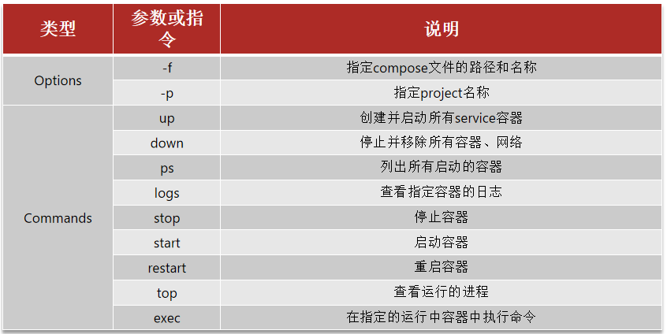

# 准备工作

将MySQL、Nginx、Nacos、Sentinel、Seata、RabbitMQ、ElasticSearch、Kibana在容器运行前的准备工作做好(参考Docker安装系列文章)

# Docker Compose一键部署

将docker-compose.yml文件放到root目录下

```yml
version: '3.8'

services:
  mysql:
    image: mysql
    container_name: mysql
    ports:
      - "3306:3306"
    environment:
      - TZ=Asia/Shanghai
      - MYSQL_ROOT_PASSWORD=123456
    volumes:
      - /root/mysql/log:/var/log/mysql
      - /root/mysql/data:/var/lib/mysql
      - /root/mysql/conf:/etc/mysql/conf.d
      - /root/mysql/init:/docker-entrypoint-initdb.d
    networks:
      - root_net

  nginx:
    image: nginx
    container_name: nginx
    ports:
      - "80:80"
    volumes:
      - /root/nginx/conf/nginx.conf:/etc/nginx/nginx.conf
      - /root/nginx/conf/conf.d:/etc/nginx/conf.d
      - /root/nginx/log:/var/log/nginx
      - /root/nginx/html:/usr/share/nginx/html
    depends_on:
      - mysql
    networks:
      - root_net

  nacos:
    image: nacos/nacos-server
    container_name: nacos
    env_file:
      - /root/nacos/custom.env
    ports:
      - "8848:8848"
      - "9848:9848"
      - "9849:9849"
    depends_on:
      - nginx
    networks:
      - root_net

  sentinel:
    image: bladex/sentinel-dashboard
    container_name: sentinel
    ports:
      - "8858:8858"
    depends_on:
      - nacos
    networks:
      - root_net

  seata:
    image: seataio/seata-server:1.5.2
    container_name: seata
    ports:
      - "8091:8091"
      - "7091:7091"
    environment:
      - SEATA_IP=192.168.149.100
    volumes:
      - /root/seata:/seata-server/resources
    privileged: true
    depends_on:
      - sentinel
    networks:
      - root_net

  rabbitmq:
    image: rabbitmq:3.8-management
    container_name: rabbitmq
    hostname: rabbitmq
    ports:
      - "15672:15672"
      - "5672:5672"
    environment:
      - RABBITMQ_DEFAULT_USER=rabbitmq
      - RABBITMQ_DEFAULT_PASS=rabbitmq
    volumes:
      - mq-plugins:/plugins
    depends_on:
      - seata
    networks:
      - root_net
  
  es:
    image: elasticsearch:7.12.1
    container_name: es
    ports:
      - 9200:9200
      - 9300:9300
    environment:
      - ES_JAVA_OPTS=-Xms512m -Xmx512m
      - discovery.type=single-node
    volumes:
      - es-data:/usr/share/elasticsearch/data
      - es-plugins:/usr/share/elasticsearch/plugins
    privileged: true
    depends_on:
      - rabbitmq
    networks:
      - root_net
  
  kibana:
    image: kibana:7.12.1
    container_name: kibana
    ports:
      - 5601:5601
    environment:
      - ELASTICSEARCH_HOSTS=http://es:9200
    depends_on:
      - es
    networks:
      - root_net
      
  minio:
    image: minio/minio
    container_name: minio
    ports:
      - "9000:9000"
      - "9001:9001"
    environment:
      - MINIO_ROOT_USER=minioadmin
      - MINIO_ROOT_PASSWORD=minioadmin
    volumes:
      - /root/minio/data:/data
      - /root/minio/conf:/root/.minio
    command: server /data --console-address ":9001" --address ":9000"
    depends_on:
      - kibana

volumes:
  mq-plugins:
  es-data:
  es-plugins:

networks:
  root_net:
```

# Docker Compose常用命令



- `docker compose up -d`:创建并启动所有服务容器
- `docker compose down`:停止并移除所有服务容器和网络

- `docker compose ps`:查看所有服务容器状态
- `docker compose logs -f`:查看所有服务容器日志

- `docker compose start`:启动所有服务容器
- `docker compose stop`:停止所有服务容器
- `docker compose restart`:重启所有服务容器

# 服务地址

- nacos:`http://192.168.149.100:8848/nacos`
- sentinel:`http://192.168.149.100:8858`
- seata:`http://192.168.149.100:8091`
- rabbitmq:`http://192.168.149.100:15672`
- es:`http://192.168.149.100:9200`
- kibana:`http://192.168.149.100:5601`