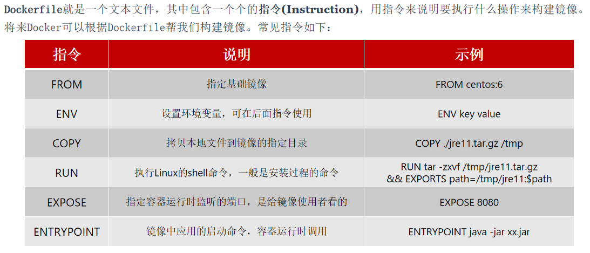

# Docker

Docker可以下载应用镜像,创建并运行镜像的容器,从而快速部署应用

**Docker安装软件的过程,就是自动搜索下载镜像,然后创建并运行容器的过程**

当利用Docker安装应用时,Docker会自动搜索并下载**应用镜像(image)**,镜像不仅包含应用本身,还包含应用运行所需要的环境、配置、系统函数库 

Docker会在运行镜像时创建一个隔离环境,称为**容器(container)**


- 镜像:将应用所需的函数库、依赖、配置等与应用一起打包
- 容器:每个镜像的应用进程创建的隔离运行环境
- 镜像仓库:存储和管理镜像的平台

Docker官方维护了一个公共仓库:[Docker Hub](https://hub.docker.com/)

# 命令解读


- `docker run -d`:创建并运行一个容器,-d则是让容器以后台进程运行
- `--name mysql`: 给容器起个名字叫mysql
- `-p 3306:3306`:设置端口映射

容器是隔离环境,外界不可访问,但是可以将宿主机端口映射容器内到端口,当访问宿主机指定端口时,就是在访问容器内的端口了           
容器内端口往往是由容器内的进程决定,例如MySQL进程默认端口是3306,因此容器内端口一定是3306;而宿主机端口则可以任意指定,一般与容器内保持一致                
格式:`-p 宿主机端口:容器内端口`,示例中就是将宿主机的3306映射到容器内的3306端口

- `-e TZ=Asia/Shanghai`: 配置容器内进程运行时的一些参数

格式:`-e KEY=VALUE`,KEY和VALUE都由容器内进程决定                
案例中,TZ=Asia/Shanghai是设置时区;MYSQL_ROOT_PASSWORD=123456是设置MySQL默认密码

- `mysql`:设置镜像名称,Docker会根据这个名字搜索并下载镜像

格式:`REPOSITORY:TAG`,例如mysql:8.0,其中REPOSITORY可以理解为镜像名,TAG是版本号                   
在未指定TAG的情况下,默认是最新版本,也就是mysql:latest                           

# 常见命令

[Docker命令官方文档](https://docs.docker.com/)

Docker最常见的命令就是操作镜像、容器的命令


## 修改命令别名

先进入文件`vi /root/.bashrc`,然后修改命令别名,最后`source /root/.bashrc`使别名生效

# 数据卷

**数据卷(volume)**是一个虚拟目录,是**容器内目录与宿主机目录**之间映射的桥梁,方便操作容器内文件或者迁移容器产生的数据


## 挂载数据卷

**在执行`docker run`命令时,使用`-v 数据卷:容器内目录`可以完成数据卷挂载**                    
**当创建容器时,如果挂载了数据卷且数据卷不存在,会自动创建数据卷**

## 数据卷命令

- `docker volume create`:创建数据卷
- `docker volume ls`:查看所有数据卷
- `docker volume rm`:删除指定数据卷
- `docker volume inspect`:查看某个数据卷的详情
- `docker volume prune`:清除数据卷

## 本地目录挂载

**在执行`docker run`命令时,使用`-v 本地目录:容器内目录`可以完成本地目录挂载**                    
**本地目录必须以"/"或"./"开头,如果直接以名称开头,会被识别为数据卷而非本地目录**              

例如:                 
`-v mysql : /var/lib/mysql`:会被识别为一个数据卷叫mysql
`-v ./mysql : /var/lib/mysql`:会被识别为当前目录下的mysql目录

### 范例

MySQL容器的数据挂载
1. 查看mysql容器,判断是否有数据卷挂载
2. 基于宿主机目录实现MySQL数据目录、配置文件、初始化脚本的挂载(查阅官方镜像文档)

挂载/root/mysql/data到容器内的/var/lib/mysql目录                                                  
挂载/root/mysql/init到容器内的/docker-entrypoint-initdb.d目录               
挂载/root/mysql/conf到容器内的/etc/mysql/conf.d目录                 

```cmd
cd ~
mkdir mysql
cd mysql
mkdir data
mkdir init
mkdir conf

docker run -d \
  --name mysql \
  -p 3306:3306 \
  -e TZ=Asia/Shanghai \
  -e MYSQL_ROOT_PASSWORD=123456 \
  -v /root/mysql/data:/var/lib/mysql \
  -v /root/mysql/init:/docker-entrypoint-initdb.d \
  -v /root/mysql/conf:/etc/mysql/conf.d \
  mysql
```

# 自定义镜像

镜像就是包含了应用程序、程序运行的系统函数库、运行配置等文件的文件包,构建镜像的过程其实就是把上述文件打包的过程




## 范例

基于Ubuntu基础镜像,利用Dockerfile描述镜像结构,也可以直接基于JDK为基础镜像,省略前面的步骤:


当编写好了Dockerfile,可以利用`docker build -t myImage:1.0 .`命令来构建镜像

`-t`:是给镜像起名,格式依然是repository:tag的格式,不指定tag时,默认为latest
`.`:是指定Dockerfile所在目录,如果就在当前目录,则指定为"."

# 网络

默认情况下,所有容器都是以bridge方式连接到Docker的一个虚拟网桥上


网络操作命令:
- `docker network create`:创建一个网络
- `docker network ls`:查看所有网络
- `docker network rm`:删除指定网络
- `docker network prune`:清除未使用的网络
- `docker network connect`:使指定容器连接加入某网络
- `docker network disconnect`:使指定容器连接离开某网络
- `docker network inspect`:查看网络详细信息

# DockerCompose

Docker Compose通过一个单独的**docker-compose.yml**模板文件(YAML格式)来定义一组相关联的应用容器,帮助实现**多个相互关联的Docker容器的快速部署**


