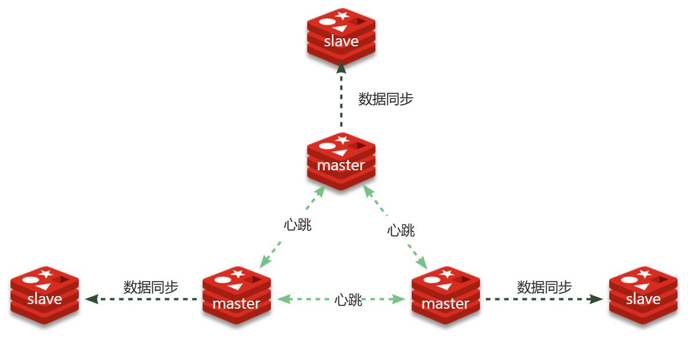

# 下载镜像

- [Docker Hub官方网站](https://hub.docker.com/)

- `docker pull redis`:下载最新版Redis镜像

# 检查镜像

`docker images`

# 安装Redis

## 创建并运行Redis容器

```cmd
docker run \
    -d \
    --name redis \
    -p 6379:6379 \
    -v ./redis/data:/data \
    -v ./redis/conf/redis.conf:/usr/local/etc/redis/redis.conf \
    redis
```

解释:
- `-d`:设置后台运行容器
- `-p 6379:6379`:将容器的6379端口映射到主机的6379端口
- `-v ./redis/data:/data`:将主机的redis/data目录挂载到容器的/data目录
- `-v ./redis/conf/redis.conf:/usr/local/etc/redis/redis.conf`:将主机的redis/conf/redis.conf文件挂载到容器的/usr/local/etc/redis/redis.conf文件
- `redis`:指定Redis镜像名称

## 检查Redis容器运行状态

1. 检查容器是否运行:`docker ps`

2. 进入redis容器:`docker exec -it redis bash`

3. 进入redis-cli:`redis-cli`

# 搭建Redis分片集群



## 创建配置文件

以搭建三主三从架构的Redis分片集群为例:

1. 在工作目录中新建redis目录:`mkdir redis`

2. 移动到redis目录:`cd redis`

3. 在redis目录中新建conf目录:`mkdir conf`

4. 在conf目录中新建配置文件:`touch redis-01.conf redis-02.conf redis-03.conf redis-04.conf redis-05.conf redis-06.conf`

redis-01.conf范例:

```yaml
bind 192.168.149.100
port 7001
cluster-enabled yes
cluster-config-file nodes-7001.conf
cluster-node-timeout 5000
appendonly yes
masterauth 123456
requirepass 123456
```

## 创建容器并启动

1. Docker Compose创建Redis容器

```yaml
version: '3.8'

services:
  redis-01:
    image: redis
    container_name: redis-01
    restart: always
    network_mode: "host"
    volumes:
      - ./conf/redis-01.conf:/etc/redis-01.conf
    command: redis-server /etc/redis-01.conf --port 7001

  redis-02:
    image: redis
    container_name: redis-02
    restart: always
    network_mode: "host"
    volumes:
      - ./conf/redis-02.conf:/etc/redis-02.conf
    command: redis-server /etc/redis-02.conf --port 7002

  redis-03:
    image: redis
    container_name: redis-03
    restart: always
    network_mode: "host"
    volumes:
      - ./conf/redis-03.conf:/etc/redis-03.conf
    command: redis-server /etc/redis-03.conf --port 7003

  redis-04:
    image: redis
    container_name: redis-04
    restart: always
    network_mode: "host"
    volumes:
      - ./conf/redis-01.conf:/etc/redis-04.conf
    command: redis-server /etc/redis-04.conf --port 7004

  redis-05:
    image: redis
    container_name: redis-05
    restart: always
    network_mode: "host"
    volumes:
      - ./conf/redis-02.conf:/etc/redis-05.conf
    command: redis-server /etc/redis-05.conf --port 7005

  redis-06:
    image: redis
    container_name: redis-06
    restart: always
    network_mode: "host"
    volumes:
      - ./conf/redis-03.conf:/etc/redis-06.conf
    command: redis-server /etc/redis-06.conf --port 7006
```

2. 启动Redis容器:`docker compose up -d`

## 集群搭建

1. 进入redis-01容器:`docker exec -it redis-01 bash`

2. 创建集群

```cmd
redis-cli \
    -a 123456 \
    --cluster create \
    --cluster-replicas 1 \
    192.168.149.100:7001 192.168.149.100:7002 192.168.149.100:7003 \
    192.168.149.100:7004 192.168.149.100:7005 192.168.149.100:7006
```

解释:
- `-a 123456`:指定Redis密码
- `--cluster create`:创建集群
- `--cluster-replicas 1`:每个节点创建一个副本
  此时节点总数÷(replicas + 1)得到的就是master的数量n,因此节点列表中的前n个节点就是master,其它节点都是slave节点,随机分配到不同master

出现选择提示信息,输入`yes`

## 检查Redis集群运行状态

1. 进入redis-01容器:`docker exec -it redis-01 bash`

2. 进入redis-cli:`redis-cli -c -h 192.168.149.100 -p 7001 -a 123456`

3. 查看集群状态:`cluster info`、`info replication`、`cluster nodes`

4. 操作Redis时,如果出现`(error) NOAUTH Authentication required.`的提示,则需要输入`auth 123456`密码进行认证