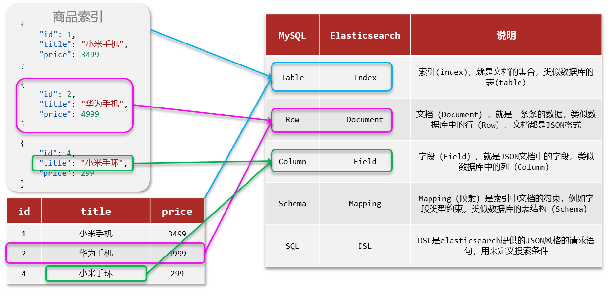

# 全文检索

全文检索是指计算机索引程序通过扫描文章中的每一个词,对每一个词建立一个索引,指明该词在文章中出现的次数和位置,当用户查询时,检索程序就根据事先建立的索引进行查找,并将查找的结果反馈给用户的检索方式

这个过程类似于通过字典中的检索字表查字的过程,全文检索可以简单理解为通过索引搜索文章

# ElasticSearch

Lucene是一个Java语言的搜索引擎类库,是Apache公司的顶级项目

[Lucene官网地址](https://lucene.apache.org/)

Lucene的优势:
- 易扩展
- 高性能(基于倒排索引)

[ElasticSearch官网地址](https://www.elastic.co/cn/)

ElasticSearch具备下列优势:
- 支持分布式,可水平扩展
- 提供Restful接口,可被任何语言调用

ElasticSearch结合kibana、Logstash、Beats,是一整套技术栈,被叫做ELK,被广泛应用在日志数据分析、实时监控等领域

# 倒排索引

倒排索引是搜索引擎技术中重要的一种索引技术,其原理是把文档中的每个词都作为索引,每个词都对应一个文档列表,文档列表中包含的是包含该词的文档的id

- 文档(document):每条数据就是一个文档
- 词条(term):文档按照语义分成的词语

- **正向索引**是最传统的,根据id索引的方式,但根据词条查询时,必须先逐条获取每个文档,然后判断文档中是否包含所需要的词条,是**根据文档找词条的过程**
-  而**倒排索引**则相反,是先找到用户要搜索的词条,根据词条得到保护词条的文档的id,然后根据id获取文档,是**根据词条找文档的过程**

**正向索引**:
- 优点:
  - 可以给多个字段创建索引
  - 根据索引字段搜索、排序速度非常快
- 缺点: 
  - 根据非索引字段,或者索引字段中的部分词条查找时,只能全表扫描,

**倒排索引**:
- 优点: 
  - 根据词条搜索、模糊搜索时,速度非常快
- 缺点: 
  - 只能给词条创建索引,而不是字段
  - 无法根据字段做排序

# IK分词器

分词器的作用:
- 创建倒排索引时,对文档分词
- 搜索时,对输入内容进行分词

中文分词往往需要根据语义分析,比较复杂,这就需要用到中文分词器,例如**IK分词器**,其采用的正向迭代最细粒度切分算法一直沿用至今

IK分词器包含两种模式:
-  `ik_smart`:智能语义切分(粗粒度) 
-  `ik_max_word`:最细粒度切分 

拓展词典:利用config目录的IKAnalyzer.cfg.xml配置文件,可以添加自定义词条

# 基础概念

- `Mysql`:擅长事务类型操作,可以确保数据的安全和一致性 
- `Elasticsearch`:擅长海量数据的搜索、分析、计算

在企业中,往往是两者结合使用:
- 对安全性要求较高的写操作,使用MySQL实现
- 对查询性能要求较高的搜索需求,使用ElasticSearch实现
- 两者再基于某种方式,实现数据的同步,保证一致性