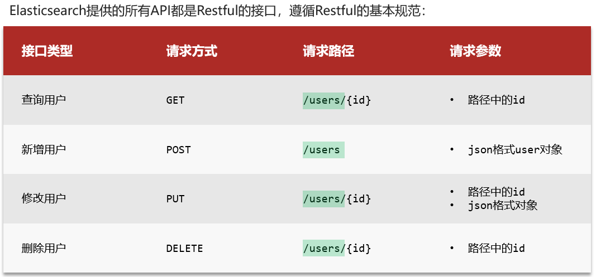
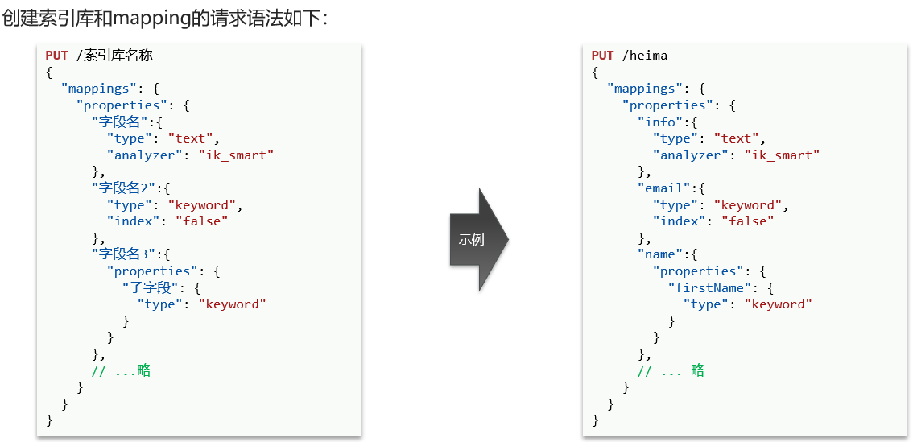
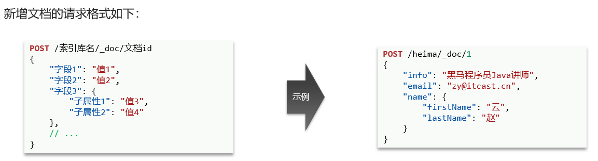
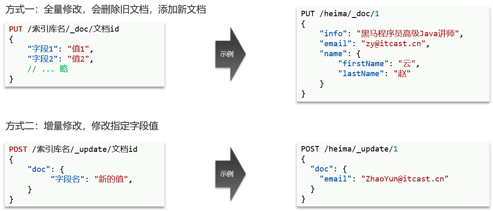
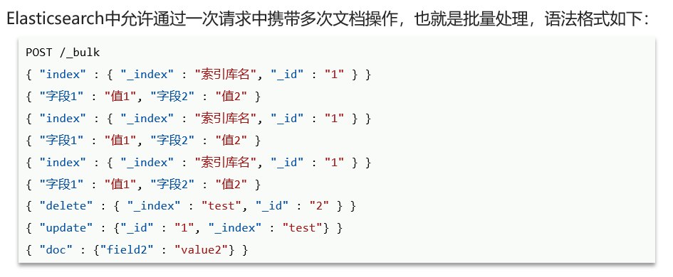

# mapping映射属性

mapping是对索引库中文档的约束,常见的mapping属性包括:
- type:字段数据类型,常见的简单类型有:
  - 字符串:text(可分词的文本)、keyword(精确值,例如:品牌、国家、ip地址)
  - 数值:long、integer、short、byte、double、float、 
  - 布尔:boolean
  - 日期:date
  - 对象:object
- index:是否创建索引,默认为true
- analyzer:使用哪种分词器
- properties:字段的子字段

# 索引库操作



### 创建索引库和mapping



范例:

```cmd
PUT /jinzhao
{
  "mappings": {
    "properties": {
      "info": {
        "type": "text",
        "analyzer": "ik_smart",
        "index": true
      },
      "age": {
        "type": "byte",
        "index": true
      },
      "email": {
        "type": "keyword",
        "index": true
      },
      "name": {
        "type": "object",
        "properties": {
          "firstName": {
            "type": "keyword"
          },
          "lastName": {
            "type": "keyword"
          }
        }
      }
    }
  }
}
```

### 查看索引库

语法:`GET /索引库`

范例:`GET /jinzhao`

### 删除索引库

语法:`DELETE /索引库`

范例:`DELETE /jinzhao`

### 修改索引库

索引库和mapping**一旦创建无法修改,但是可以添加新的字段**

语法:

```cmd
PUT /索引库名/_mapping
{
  "properties": {
    "新字段名":{
      "type": "integer"
    }
  }
}
```

范例:

```cmd
PUT /jinzhao/_mapping
{
  "properties": {
    "age": {
      "type": "byte"
    }
  }
}
```

# 文档操作

## 新增文档



范例:

```cmd
POST /jinzhao/_doc/1
{
  "info": "中国上海东方明珠旅行者",
  "email": "chinashanghai.com",
  "name": {
    "firstName": "张",
    "lastName": "三"
  },
  "age": "23"
}
```

## 查询文档

语法:`GET /索引库/_doc/文档id`

范例:`GET /jinzhao/_doc/1`

## 删除文档

语法:`DELETE /索引库/_doc/文档id`

范例:`DELETE /jinzhao/_doc/1`

## 修改文档



全量修改范例:

```cmd
PUT /jinzhao/_doc/1
{
  "info": "中国上海东方明珠旅行者2号",
  "email": "chinashanghai.com",
  "name": {
    "firstName": "张",
    "lastName": "三炮"
  },
  "age": "23"
}
```

增量修改范例:

```cmd
POST /jinzhao/_update/1
{
  "doc": {
    "name": {
      "lastName": "三河"
    }
  }
}
```

# 文档批量处理



## 批量新增文档

语法:

```cmd
POST /_bulk
{"index":{"_index":"索引库名","_id":"文档id"}}
{"字段1":"值1","字段2":"值2"}
```

细节:**如何文档id已存在,则是覆盖(修改文档);如何文档id不存在,则是新增**

范例:

```cmd
POST /_bulk
{"index":{"_index":"jinzhao","_id":"2"}}
{"info":"中国上海东方明珠旅行者2号","email":"chinashanghai2.com","name":{"firstName":"李","lastName":"四"},"age":"24"}
{"index":{"_index":"jinzhao","_id":"3"}}
{"info":"中国上海东方明珠旅行者3号","email":"chinashanghai3.com","name":{"firstName":"王","lastName":"五"},"age":"25"}
```

## 批量删除文档

语法:

```cmd
POST /_bulk
{"delete":{"_index":"索引库名","_id":"文档id"}}
```

范例:

```cmd
POST /_bulk
{"delete":{"_index":"jinzhao","_id":"2"}}
{"delete":{"_index":"jinzhao","_id":"3"}}
```

## 批量修改文档

语法:

```cmd
POST /_bulk
{"update":{"_index":"索引库名","_id":"文档id"}}
{"doc":{"字段1":"值1","字段2":"值2"}}
```

范例:

```cmd
POST /_bulk
{"update":{"_index":"jinzhao","_id":2}}
{"doc":{"name":{"lastName":"四万"}}}
{"update":{"_index":"jinzhao","_id":3}}
{"doc":{"age":"55"}}
```

## 批量查询文档

语法:

```cmd
GET /索引库名/_doc/_mget
{"ids":[文档id]}
```

范例:

```cmd
GET /jinzhao/_doc/_mget
{"ids":[1,2,3]}
```