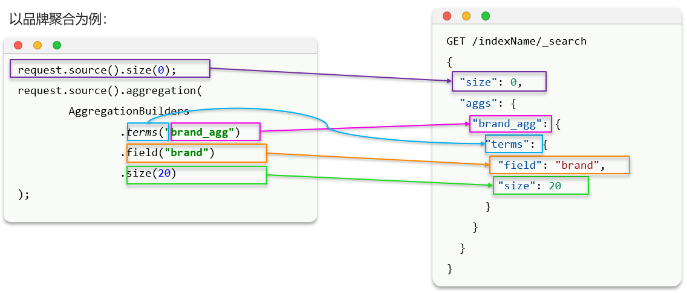
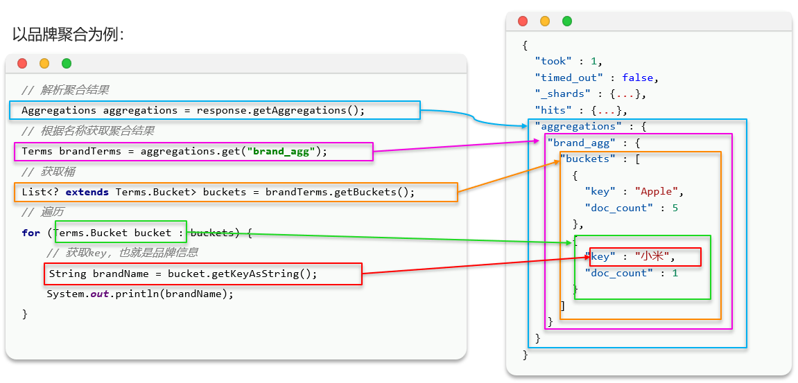

# 聚合

**聚合**(aggregations)可以实现对文档数据的统计、分析、运算

聚合常见的有三类:
- **桶(Bucket)聚合**:用来对文档做分组
    - TermAggregation:按照文档字段值分组
    - Date Histogram:按照日期阶梯分组,例如一周为一组,或者一月为一组

- **度量(Metric)聚合**:用以计算一些值,比如:最大值、最小值、平均值等
    - Avg:求平均值
    - Max:求最大值
    - Min:求最小值
    - Stats:同时求max、min、avg、sum等

- **管道(pipeline)聚合**:其它聚合的结果为基础做聚合

细节:**参与聚合的字段必须是Keyword、数值、日期、布尔的类型的字段**

聚合必须的三要素:
- 聚合名称
- 聚合类型
- 聚合字段

聚合可配置属性有:
- size:指定聚合结果数量
- field:指定聚合字段

# DSL聚合

## 范例一 

统计所有商品中共有哪些商品分类?

分析:其实就是以分类(category)字段对数据分组,category值一样的放在同一组,属于Bucket聚合中的Term聚合

语法:

```cmd
GET /items/_search
{
  "query": {"match_all": {}},  // 可以省略
  "size": 0,  // 设置size为0,结果中不包含文档,只包含聚合结果
  "aggs": { // 定义聚合
    "AGG_NAME": { //给聚合起个名字
      "terms": { // 聚合的类型,按照品牌值聚合,所以选择term
        "field": "category", // 参与聚合的字段
        "size": 20 // 希望获取的聚合结果数量
      }
    }
  }
}
```

命令:

```cmd
GET /items/_search
{
  "query": {
    "match_all": {}
  },
  "size": 0,
  "aggs": {
    "cate_agg": {
      "terms": {
        "field": "category",
        "size": 10
      }
    }
  }
}
```

相当于MySQL中的语句:

```cmd
SELECT category, COUNT(*) as count
FROM items
GROUP BY category
ORDER BY count DESC
LIMIT 10;
```

## 范例二

统计价格高于3000元的手机品牌有哪些?

分析:在分组的基础上,添加条件查询query

命令:

```cmd
GET /items/_search
{
  "query": {
    "bool": {
      "filter": [
        {
          "term": {
            "category": "手机"
          }
        },
        {
          "range": {
            "price": {
              "gt": 300000
            }
          }
        }
      ]
    }
  },
  "size": 0,
  "aggs": {
    "cate_agg": {
      "terms": {
        "field": "brand",
        "size": 10
      }
    }
  }
}
```

## 范例三

统计手机有哪些品牌,每个品牌的价格最小值、最大值、平均值?

分析:在分组和查询的基础上,对每个Bucket内的数据进一步做数据计算和统计

命令:

```cmd
GET /items/_search
{
  "query": {
    "term": {
      "category": "手机"
    }
  },
  "size": 0,
  "aggs": {
    "cate_agg": {
      "terms": {
        "field": "brand",
        "size": 10
      },
      "aggs": {
        "price_stats": {
          "stats": {
            "field": "price"
          }
        }
      }
    }
  }
}
```

# JavaRestClient聚合

1. 聚合



范例:

```java
@Test
void testAgg() throws IOException {
    // 创建Request对象
    SearchRequest request = new SearchRequest("items");
    // 准备请求参数
    // 分页
    request.source().size(0);
    // 聚合条件
    request.source()
            .aggregation(AggregationBuilders
                    .terms("brand_agg")
                    .field("brand")
                    .size(10));
    // 发送请求
    SearchResponse response = client.search(request, RequestOptions.DEFAULT);
}
```

2. 聚合结果解析



范例:

```java
@Test
void testAgg() throws IOException {
    // 创建Request对象
    SearchRequest request = new SearchRequest("items");
    // 准备请求参数
    // 分页
    request.source().size(0);
    // 聚合条件
    request.source()
            .aggregation(AggregationBuilders
                    .terms("brand_agg")
                    .field("brand")
                    .size(10));
    // 发送请求
    SearchResponse response = client.search(request, RequestOptions.DEFAULT);
    // 解析结果
    Aggregations aggregations = response.getAggregations();
    // 根据名称获取聚合结果
    Terms brandTerms = aggregations.get("brand_agg");
    // 获取桶
    List<? extends Terms.Bucket> buckets = brandTerms.getBuckets();
    // 遍历桶
    for (Terms.Bucket bucket : buckets) {
        // 获取key,即品牌名称
        String key = bucket.getKeyAsString();
        System.out.println(key);
    }
}
```