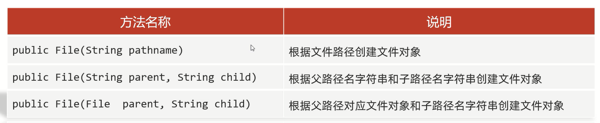

# File

- File对象就表示一个路径,可以是文件的路径,也可以是文件夹的路径
- 这个路径可以是存在的,也可以是不存在的
- File类只能对文件本身进行操作,**不能读写文件里面存储的数据**

# 常用方法



范例:

```java
import java.io.File;

public class Test {
    public static void main(String[] args) {
        String str1 = "C:/Users/gujintao/Desktop/a.txt";
        File f1 = new File(str1);
        System.out.println(f1);

        String parent = "C:/Users/gujintao/Desktop";
        String child = "a.txt";
        File f2 = new File(parent, child);
        System.out.println(f2);

        File parent2 = new File("C:/Users/gujintao/Desktop");
        String child2 = "a.txt";
        File f3 = new File(parent2, child2);
        System.out.println(f3);
    }
}
```

## 判断、获取


细节:
1. length                                 
a.返回**文件**的大小(**字节数量**)            
b.如果要获取文件夹的大小,需要把这个文件夹里面所有文件大小累加到一起                 
2. getName        
a.文件:返回文件名+后缀名(拓展名)
b.文件夹:返回文件夹名
3. lastModified:返回文件的最后修改时间(时间毫秒值)

范例: 

```java
import java.io.File;
import java.text.SimpleDateFormat;
import java.util.Date;

public class Test {
    public static void main(String[] args) {
        // 存在的文件
        File f1 = new File("C:\\Users\\gujintao\\Desktop\\a.txt");
        System.out.println(f1.exists());
        System.out.println(f1.isFile());
        System.out.println(f1.isDirectory());
        System.out.println();

        // 存在的文件夹
        File f2 = new File("C:\\Users\\gujintao\\Desktop");
        System.out.println(f2.exists());
        System.out.println(f2.isFile());
        System.out.println(f2.isDirectory());
        System.out.println();

        // 不存在的文件
        File f3 = new File("C:\\Users\\gujintao\\Desktop\\b.txt");
        System.out.println(f3.exists());
        System.out.println(f3.isFile());
        System.out.println(f3.isDirectory());
        System.out.println();

        System.out.println(f1.length());
        System.out.println(f1.getAbsolutePath());
        System.out.println(f1.getPath());
        System.out.println(f1.getName());

        long time = f1.lastModified();
        Date date = new Date(time);
        SimpleDateFormat simpleDateFormat = new SimpleDateFormat("yy年MM月dd日 HH:mm:ss");
        String formatTime = simpleDateFormat.format(date);
        System.out.println(formatTime);
    }
}
```

## 创建、删除


细节:
1. delete方法默认**只能删除文件和空文件夹,直接删除不走回收站**
2. createNewFile           
a.如果当前路径表示的文件是不存在的,则创建成功,方法返回true;如果当前路径表示的文件是存在的,则创建失败,方法返回false                            
b.如果父级路径是不存在的,那么方法会有异常IOException                        
c.createNewFile方法创建的一定是文件,如果路径中不包含文件后缀名,则创建一个没有后缀的文件                  
3. mkdir           
a.windows中当前路径是唯一的,如果当前路径已经存在,则创建失败,返回false               
b.mkdir方法只能创建单级文件夹,无法创建多级文件夹
4. mkdirs:既可以创建单级文件夹,也可以创建多级文件夹     
5. delete           
a.如果删除的是文件,则直接删除,不走回收站,返回true              
b.如果删除的是空文件夹,则直接删除,不走回收站,返回true                      
c.如果删除的是有内容的文件夹(先删除内容,再删除文件夹),则删除失败,返回false                

范例:

```java
import java.io.File;
import java.io.IOException;

public class Test {
    public static void main(String[] args) throws IOException {
        // 创建文件
        File f1 = new File("C:\\Users\\gujintao\\Desktop\\b.txt");
        boolean newFile = f1.createNewFile();
        System.out.println(newFile);

        // 创建单级文件夹
        File f2 = new File("C:\\Users\\gujintao\\Desktop\\DDD");
        boolean mkdir1 = f2.mkdir();
        System.out.println(mkdir1);

        // 创建多级文件夹
        File f3 = new File("C:\\Users\\gujintao\\Desktop\\AAAA");
        boolean mkdir2 = f3.mkdirs();
        System.out.println(mkdir2);

        // 删除文件、空文件夹
        boolean delete = f1.delete();
        System.out.println(delete);
    }
}
```

## 获取并遍历

### listFiles

细节:
1. 当调用者File表示的路径不存时,返回null
2. 当调用者File表示的路径是文件时,返回null
3. 当调用者File表示的路径是一个空文件夹时,返回一个长度为0的数组                              
4. 当调用者File表示的路径是一个有内容的文件夹时,将里面所有的文件和文件夹放在File数组中返回 
5. 当调用者File表示的路径是一个有隐藏文件的文件夹时,将里面所有的文件和文件夹放在File数组中返回,包含隐藏文件              
6. 当调用者File表示的路径是需要权限才能访问的文件夹时,返回null

范例:

```java
import java.io.File;
import java.io.IOException;

public class Test {
    public static void main(String[] args) {
        File f1 = new File("C:\\Users\\gujintao\\Desktop\\A");
        File[] files = f1.listFiles();
        for (File f : files) {
            System.out.println(f);
        }
    }
}
```

### 其余方法


范例:

```java
import java.io.File;
import java.util.Arrays;

public class Test {
    public static void main(String[] args) {
        // 获取系统中的所有盘符
        File[] files = File.listRoots();
        for (File file : files) {
            System.out.println(file);
        }
        System.out.println();

        // 获取当前路径下的所有内容(仅仅获取名字)
        File f1 = new File("C:\\Users\\gujintao\\Desktop\\A");
        String[] list1 = f1.list();
        System.out.println(Arrays.toString(list1));
        System.out.println();

        // 利用文件名过滤器获取当前路径下的所有内容
        File f2 = new File("C:\\Users\\gujintao\\Desktop\\A");

        // String[] list2 = f2.list(new FilenameFilter() {
        //     // accept方法的形参,依次表示文件夹里面每一个文件或者文件夹的路径
        //     // 参数一:父级路径
        //     // 参数二:子级路径
        //     // 返回值:如果返回值为true,就表示当前路径保留;如果返回值为false,就表示当前路径舍弃
        //     @Override
        //     public boolean accept(File dir, String name) {
        //         File src = new File(dir, name);
        //         return src.isFile() && name.endsWith(".txt");
        //     }
        // });

        // 方法一
        String[] list2 = f2.list((dir, name) -> {
            File src = new File(dir, name);
            return src.isFile() && name.endsWith(".txt");
        });
        System.out.println(Arrays.toString(list2));
        System.out.println();

        // 方法二
        // File[] list3 = f2.listFiles(new FileFilter() {
        //     @Override
        //     public boolean accept(File pathname) {
        //         return pathname.isFile() && pathname.getName().endsWith(".txt");
        //     }
        // });
        // System.out.println(Arrays.toString(list3));

        File[] list3 = f2.listFiles(pathname -> pathname.isFile() && pathname.getName().endsWith(".txt"));
        System.out.println(Arrays.toString(list3));

        // 方法三
        // File[] list4 = f2.listFiles(new FilenameFilter() {
        //     @Override
        //     public boolean accept(File dir, String name) {
        //         File src = new File(dir, name);
        //         return src.isFile() && name.endsWith(".txt");
        //     }
        // });
        // System.out.println(Arrays.toString(list4));

        File[] list4 = f2.listFiles((dir, name) ->
        {
            File src = new File(dir, name);
            return src.isFile() && name.endsWith(".txt");
        });
        System.out.println(Arrays.toString(list4));
    }
}
```