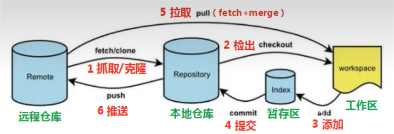
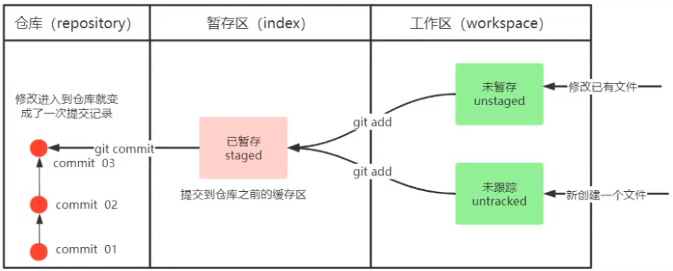
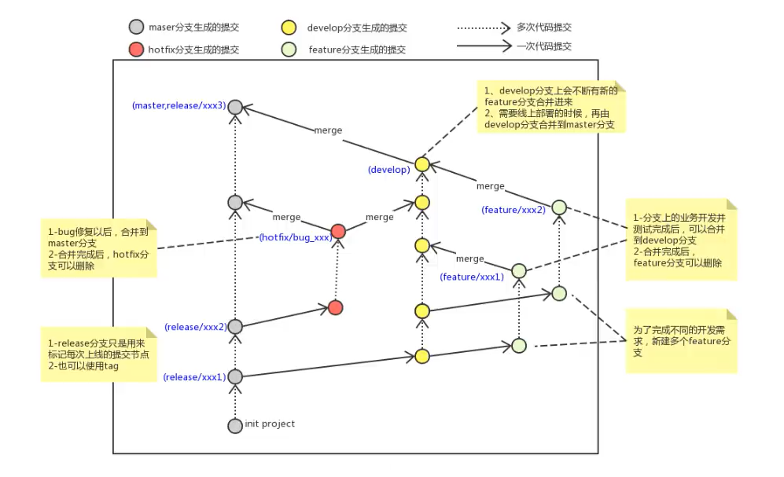
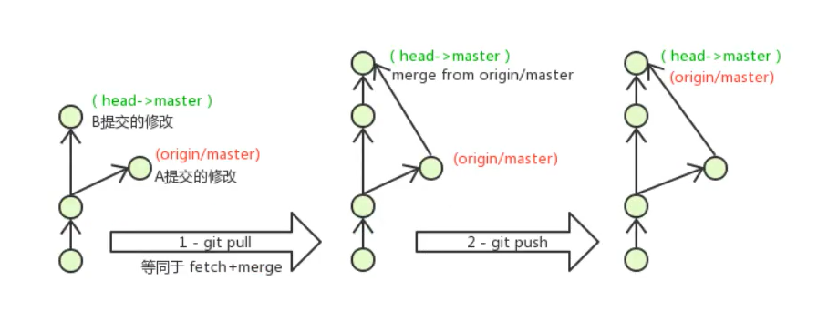

# [Git 官方文档链接](https://git-scm.com/docs)

# Git工作流程  

指令:    
`clone`(克隆): 从远程仓库中克隆代码到本地仓库  
`checkout`(检出): 从本地仓库中检出一个仓库分支然后进行修订  
`add`(添加): 在提交前先将代码提交到暂存区  
`commit`(提交): 提交到本地仓库,本地仓库中保存修改的各个历史版本  
`fetch`(抓取): 从远程库,抓取到本地仓库,不进行任何的合并动作,一般操作比较少    
`pull`(拉取): 从远程库拉到本地库,自动进行合并(`merge`),然后放到到工作区,相当于`fetch+merge`    
`push`(推送): 修改完成后,需要和团队成员共享代码时,将代码推送到远程仓库  

# 基本配置  

**设置当前用户信息**:        
`git config user.name "[用户名]"` -- 针对当前本地仓库,设置用户名  
`git config user.email "[用户邮箱]"` -- 针对当前本地仓库,设置用户名邮箱   
  
**设置全局用户信息**:    
`git config --global user.name "[用户名]"` -- 针对系统上所有的本地仓库,设置全局用户名  
`git config --global user.email "[用户邮箱]"` -- 针对系统上所有的本地仓库,设置全局用户名邮箱    
  
**查看配置信息**:      
`git config -l` -- 显示当前本地仓库的配置信息  
`git config -e` -- 针对当前本地仓库,编辑配置文件  

**编辑配置文件**:      
`git config -e --global` -- 针对系统上所有的本地仓库,编辑配置文件  

**查看用户名**:     
`git config --global user.name` -- 查看用户名  
`git config --global user.email` -- 查看用户邮箱  

**初始化本地仓库**:     
`git init` -- 将当前目录转换成本地仓库  
`git init [本地路径]` -- 指定本地目录作为本地仓库  

**克隆远程仓库**:   
`git clone [仓库路径]` -- 克隆远程仓库到当前目录内  
`git clone [仓库路径] [本地路径]` -- 克隆远程仓库到指定目录内  

**检查文件状态**:   
`git status` -- 完整版  
`git status -s` -- 精简版    

第一列字符表示本地仓库与暂存区之间的比较状态  
第二列字符表示暂存区与工作区之间的比较状态  

状态:     
`C` -- 表示复制  
`R` -- 表示重命名  
`A` -- 表示新增文件  
`D` -- 表示删除文件  
`!` -- 表示忽略文件  
`?` -- 表示未跟踪文件  
`M` -- 表示文件发生改动  
`U` -- 表示更新但未合并  
`' '` -- (空格)表示文件未发生更改  

# Git-add和Git-commit工作流程   

## 添加文件到暂存区

`git add`指令,即跟踪文件   

`git add [文件1] [文件2] ...` -- 添加一个或多个文件到暂存区  
`git add [本地路径]` -- 添加指定目录(包括子目录)到暂存区  
`git add .` -- 将当前目录(即工作区)下的所有文件添加到暂存区  
`git add -u` -- 将所有已被跟踪的文件(之前`git add`过的文件)添加到暂存区  

**忽略文件提交到暂存区**:  
在工作区中创建`.gitignore`,在里面加入需要忽略的文件名即可  

**撤销暂存区内的文件**:  
`git reset HEAD .` -- 撤销暂存区内的全部文件  
`git reset HEAD [文件]` -- 撤销暂存区内的指定目标文件  
`git rm --cached [文件]` -- 撤销暂存区内的指定目标文件   

**查看提交日志**:  
`git log --all` -- 显示所有本地分支  
`git log --pretty=oneline` -- 将提交记录显示为一行  
`git log --abbrev-commit` -- 使输出的提交记录更简短  
`git log --graph` -- 以图的方式显示所有本地分支  
`git reflog` -- 查看已经删除的提交记录  

**添加指令的快捷键**:     
在系统终端的编辑文件中添加`alias [原指令]="[新指令]"`    
例如: 使用`zsh`,在`.zshrc`中添加`alias git-log="git log --pretty=oneline --all --graph --abbrev-commit"`  
即可实现查看提交日志的快捷指令`git-log`  

**版本回退**:      

`HEAD`说明:   
`HEAD`相当于指针,一次只能指向一个分支,`HEAD`永远指向当前分支,指向最新的一次提交  
`HEAD`或者`HEAD~0` -- 当前版本  
`HEAD^`或者`HEAD~1` -- 上一个版本  
`HEAD^^`或者`HEAD~2` -- 上上一个版本  
`HEAD^^^`或者`HEAD~3` -- 上上上一个版本  

`git reset HEAD^` -- 回退所有内容到上一个版本   

`git reset HEAD^ [文件]` -- 回退指定文件到上一个版本 

`git reset --mixed [提交记录]`或者`git reset [提交记录]` -- 保留工作区的改动代码,撤销`git commit`,撤销`git add`    

`git reset --soft [提交记录]` -- 保留工作区的改动代码,撤销`git commit`,不撤销`git add`    

`git reset --hard [提交记录]` -- 删除工作区的改动代码,撤销`git commit`,撤销`git add`     

## 将工作区内容或暂存区内容添加到仓库  

`git commit [文件1] [文件2] ...` -- 将已被跟踪的文件(已经`git add`)提交到本地仓库,进入`Vim`命令界面输入提交记录的信息      

`git commit -m "[修改内容]"` -- 提交暂存区内容到本地仓库,直接输入提交记录的信息   

`git commit -am "[修改内容]"` -- (跳过`git add`)将所有已被跟踪的文件更改提交到仓库,直接输入提交记录的信息    

**修改上一次提交记录的信息**:  
`git commit --amend` -- 进入Vim命令界面,修改上一次提交记录的信息  
`git commit --amend -m "[修改内容]"` -- 直接修改上一次提交记录的信息   

**比较文件之间的差异**: 
`git diff [文件]` -- 显示暂存区和工作区之间的差异  
`git diff --cached [文件]`或者`git diff --staged [文件]` -- 显示暂存区和本地仓库之间的差异  
`git diff [提交记录1] [提交记录2]` -- 显示两次提交之间的差异  

# 分支

**查看本地分支**:  
`git branch` -- 查看本地分支   

**创建本地分支**:  
`git branch [本地分支]` -- 创建本地分支  

**切换本地分支**:  
`git checkout [本地分支]` -- 切换本地分支  
`git checkout -b [本地分支]` -- (如果分支不存在)创建本地分支,并切换到该本地分支  

**合并本地分支**: 
`git merge [本地分支]` -- 合并其他本地分支到当前本地分支  

**删除本地分支**:  
`git branch -d [本地分支]` -- 删除本地分支(需要做各种检查)    
`git branch -D [本地分支]` -- 强制删除本地分支(不做各种检查)   
`git branch -M main` -- 将当前分支重命名为main,并删除所有其他分支  

**查看本地分支与远端分支的关联**:  
`git branch -vv` -- 查看本地分支与远端分支的关联  

# Git开发流程

开发中分支使用原则与流程: 

1. `master`(生产)分支  
线上分支,主分支,中小规模项目作为线上运行的应用对应的分支  

2. `develop`(开发)分支  
从`master`创建的分支,一般作为开发部门的主要开发分支  
如果没有其他并行开发不同期上线的要求,都可以在此版本进行开发  
阶段开发完成后,需要合并到`master`分支,准备上线  

3. `feature`或者XXX分支  
从`develop`创建的分支,一般是同期并行开发,但不同期上线时创建的分支  
分支上的研发任务完成后,需要合并到`develop`分支  

4. `hotfix`或者XXX分支  
从`master`派生的分支,一般作为线上bug修复使用  
修复完成后,需要合并到`master`、`test`、`develop`分支  
还有一些其他分支,例如`test`分支(用于代码测试)、`pre`分支(用于预上线)  
 
# 配置ssh公钥  

`ssh-keygen -t rsa` -- 本地生成`ssh`公钥  
`cat ~/.ssh/id_rsa.pub` -- 查看本地生成的`ssh`公钥  
`ssh -T git@gitee.com` -- 验证是否配置成功(以`Gitee`为例)  

# 远程仓库

**添加远程仓库**:  
`git remote add [远程仓库名] [仓库路径]`  

远程仓库名默认是`origin`,取决于远端服务器设置     
`git remote add origin [仓库路径]` -- 添加远程仓库  

**查看远程仓库** :
`git remote` -- 查看远程仓库   

**推送到远程仓库(远端分支)**: 
`git push [-f] [--set-upstream] [本地分支]: [远端分支]`  
`[-f]`参数: 强制推送(无视冲突,以推送的本地分支为准,强制用本地分支覆盖远端分支)  

`git push origin [本地分支]: [远端分支]` -- 推送本地分支到远端分支  

`git push origin [本地分支]` -- 推送本地分支到远端分支(本地分支名和远端分支名相同)  

`git push [--set-upstream] [本地分支]: [远端分支]` -- 推送本地分支到远端分支,同时建立起本地分支与远端分支的关联联系  

`git push` -- (当前分支已经和远端分支关联)推送到远端分支  

`git push -u origin main` -- 将本地的main分支推送到远程仓库`origin`,并将本地的main分支与远程的main分支关联起来(如果远程仓库中已经存在一个main分支,则会将其覆盖)

**从远程仓库(远端分支)中抓取**:    

`git fetch [远程仓库名] [远端分支]` -- 将远程仓库里的更新都抓取到本地,不会进行合并(如果不指定远端名称和远端分支,则抓取所有分支) 

远程仓库名默认是`origin`,取决于远端服务器设置  

**从远程仓库(远端分支)中拉取**:     

`git pull [远程仓库名] [远端分支]` -- 将远程仓库里的修改都拉取到本地并自动进行合并,等同于`fetch + merge`(如果不指定远端名称和远端分支,则拉取所有并更新当前分支)  

远程仓库名默认是`origin`,取决于远端服务器设置   

# 解决冲突流程 

解决冲突:   
当两个分支上对文件的修改存在冲突,例如同时修改了同一个文件的同一行,这时就需要手动解决冲突  

**解决冲突步骤**:   
1. 处理文件中冲突的地方  
2. 将解决完冲突的文件加入暂存区  
3. 提交到仓库  