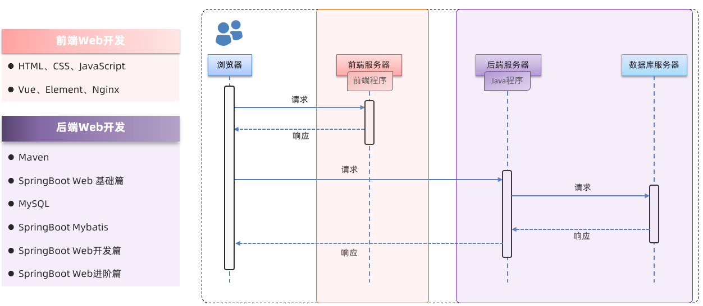
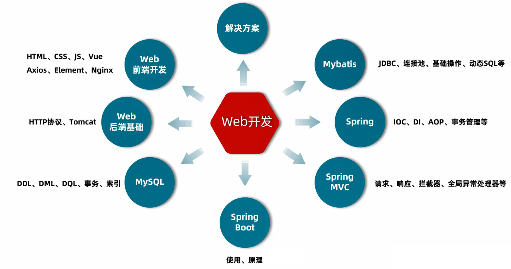
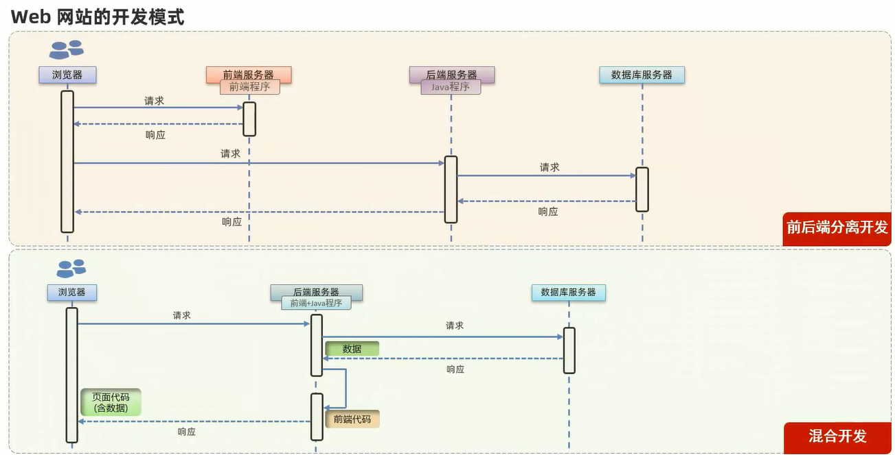
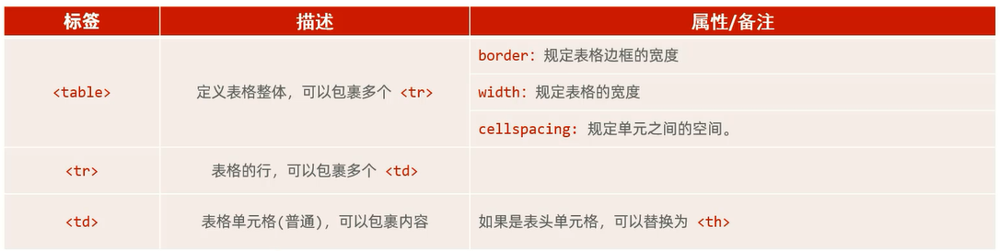
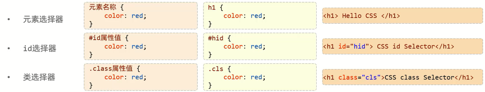
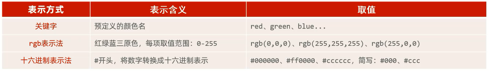
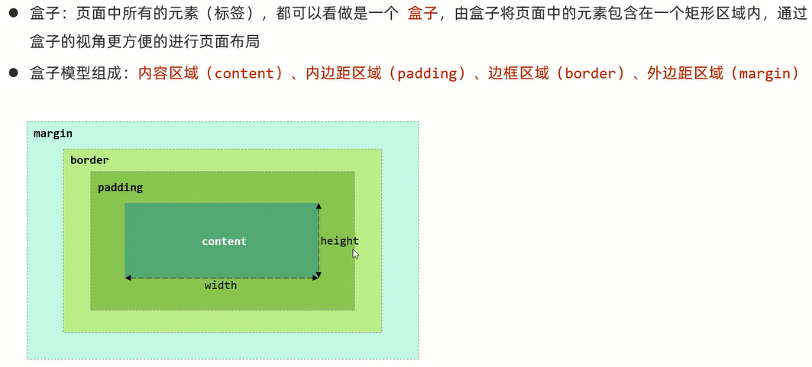

[前端官方文档](https://www.w3school.com.cn/)

# Web





## Web网站开发模式



前端的代码是如何转换成用户眼中的网页的?

通过浏览器转化(解析和渲染)成用户看到的网页

浏览器中对代码进行解析和渲染的部分,称为**浏览器内核**

## Web标准

**Web标准**也称为**网页标准**,由一系列的标准组成,大部分由W3C(World Wide Web Consortium,万维网联盟)负责制定

三个组成部分:
- HTML:负责**网页的结构**(页面元素和内容)
- CSS:负责**网页的表现**(页面元素的外观、位置等页面样式,如:颜色、大小等)
- JavaScript:负责**网页的行为**(交互效果)

# HTML

HTML(HyperText Markup Language):超文本标记语言

- 超文本:超越了文本的限制,比普通文本更强大,除了文字信息,还可以定义图片、音频、视频等内容             
- 标记语言:由标签构成的语言
- HTML标签都是**预定义**好的,例如:使用`<h1>`标签展示标题,使用`<a>`展示超链接,使用``展示图片,`<video>`展示视频
- HTML代码直接在浏览器中运行,HTML标签由浏览器解析

## 快速入门范例

```html
<html>
    <head>
        <title>网站</title>
    </head>
    <body>
        <h1>hello,world</h1>
        
    </body>
</html>
```

**HTML中的标签特点**:
- HTML标签不区分大小写
- HTML标签的属性值,采用单引号、双引号都可以
- HTML语法相对比较松散(建议大家编写HTML标签的时候尽量严谨一些)

细节:**在HTML中无论输入多少个空格,只会显示一个,可以使用空格占位符`&nbsp;`**

## 图片标签

``

- `src`:指定图像的url(绝对路径/相对路径)
- `alt`:指定图像的名称
- `width`:图像的宽度(像素px/相对于父元素的百分比%)
- `height`:图像的高度(像素px/相对于父元素的百分比%)

## 标题标签

`<h1>`、`<h2>`、`<h3>`、`<h4>`、`<h5>`、`<h6>`

## 水平分割线标签

`<hr>`

## 布局标签

在实际开发网页中,会大量频繁的使用div和span这两个没有语义的布局标签

### div标签

特点:
1. **一行只显示一个(独占一行)**
2. **宽度默认是父元素的宽度,高度默认由内容撑开**
3. **可以设置宽高**

### span标签
              
特点:
1. **一行可以显示多个(组合行内元素)**
2. **宽度和高度默认由内容撑开**
3. **不可以设置宽高**

## 视频标签

`<video>`

- `src`:规定视频的url
- `controls`:显示播放控件
- `width`:播放器的宽度
- `height`:播放器的高度

## 音频标签

`<audio>`

- `src`:规定音频的url
- `controls`:显示播放控件

## 段落标签

`<p>`

## 换行标签

`<br>`

## 文本加粗标签

`<b>`或者`<strong>`

## 超链接标签

标签:`<a href="..." target="...">标题</a>`

属性:
- `href`:指定资源访问的url
- `target`:指定在何处打开资源链接
- `_self`:默认值,在当前页面打开
- `_blank`:在空白页面打开

范例:

```css
h1 {
    color: red;
}

h2 {
    color: #f00;
}

h3 {
    color: rgb(255, 0, 0);
}

span {
    color: cadetblue;
}

.cls {
    color: blue;
}

#time {
    color: rgb(120, 42, 23);
    font-size: 12px;
}

a {
    /*text-decoration:规定添加到文本的修饰
    none:定义标准的文本*/
    text-decoration: none;
}
```

```html
<!DOCTYPE html>
<html lang="en">

<head>
    <meta charset="UTF-8">
    <meta name="viewport" content="width=device-width, initial-scale=1.0">
    <title>新闻网站</title>

    <link rel="stylesheet" href="css\news.css">
</head>

<body>
    
    <!--超链接-->
    <a href="http://gov.sina.com.cn/" target="_self">新浪政务</a> > 正文
    <h1>焦点访谈:世界和平</h1>
    <hr>
    <span>作者:张三</span>
    <!--超链接-->
    <span class="cls"> <a href="http://www.people.com.cn/" target="_blank">人民网</a> </span>
    <span id="time">2022:22:22</span>
    <hr>
</body>

</html>
```

## 表格标签

场景:在网页中以表格(行、列)的形式整齐的展示数据



- `<table>`:定义表格
- `<tr>`:定义表格中的行,一个`<tr>`表示一行
- `<th>`:表示表头单元格,具有加粗居中的效果
- `<td>`:表示普通单元格

## 表单标签

场景:在网页中主要负责数据采集功能,例如注册、登录等数据采集

标签:`<form>`

属性:

- `action`:规定当提交表单时向何处发送表单数据:url                        
细节:**如果不指定,默认提交到当前页面**

- `method`:规定用于发送表单数据的方式:get(默认值)/post                  
get:在url后面拼接表单数据,比如:?username=Tom&age=12,url长度有限制                                   
post:在消息体(请求体)中传递的,参数大小无限制的                            

## 表单项标签

表单项:不同类型的input元素、下拉列表、文本域等

- `<input>`:定义表单项,通过type属性控制输入形式
- `<select>`:定义下拉列表
- `<textarea>`:定义文本域

细节:**表单项必须有name属性才可以提交**

# CSS

CSS(Cascading Style Sheet),层叠样式表,用于控制页面的样式(表现)

## CSS引入方式

- 行内样式:写在标签的style属性中(不推荐)
- 内嵌样式:写在style标签中(可以写在页面任何位置,但通常约定写在head标签中)
- 外联样式:写在一个单独的.css文件中(需要通过link标签在网页中引入)

范例:

```css
h1 {
    color: red;
}

h2 {
    color: #f00;
}

h3 {
    color: rgb(255, 0, 0);
}
```

```html
<!DOCTYPE html>
<html lang="en">

<head>
    <meta charset="UTF-8">
    <meta name="viewport" content="width=device-width, initial-scale=1.0">
    <title>新闻网站</title>

    <!--内嵌样式-->
    <!-- <style>
        h1 {
            color: blue;
        }
    </style> -->

    <!--外联样式-->
    <link rel="stylesheet" href="css\news.css">
</head>

<body>
     新浪政务 > 正文

    <!--行内样式-->
    <!-- <h1 style="color:red">焦点访谈:世界和平</h1> -->

    <h1>焦点访谈:世界和平</h1>
    <hr>
    <h3>作者:张三</h3>
    <hr>
</body>

</html>
```

## CSS选择器

CSS选择器:用来选取需要设置样式的元素(标签)



**优先级:id选择器>类选择器>元素选择器**

范例:

```css
h1 {
    color: red;
}

h2 {
    color: #f00;
}

h3 {
    color: rgb(255, 0, 0);
}

/*元素选择器*/
span {
    color: cadetblue;
}

/*类选择器*/
.cls {
    color: blue;
}

/*id选择器*/
#time {
    color: rgb(120, 42, 23);
    font-size: 12px;
}
```

```html
<!DOCTYPE html>
<html lang="en">

<head>
    <meta charset="UTF-8">
    <meta name="viewport" content="width=device-width, initial-scale=1.0">
    <title>新闻网站</title>

    <link rel="stylesheet" href="css\news.css">
</head>

<body>
     新浪政务 > 正文
    <h1>焦点访谈:世界和平</h1>
    <hr>
    <span>作者:张三</span>
    <span class="cls">中文网</span>
    <span id="time">2022:22:22</span>
    <hr>
</body>

</html>
```

## CSS属性

- 文本内容的字体大小              
`font-size`:指定字体的大小(像素px)

- 文本内容的字体颜色           
`color`



- 规定添加到文本的修饰              
`text-decoration: none;`:定义标准的文本

- 首行缩进               
`text-indent`

- 行高                   
`line-height`

- 规定元素中的文本的水平对齐方式                  
`text-align`

## CSS盒子模型



方位默认顺序:上、右、下、左

- `width`:设置宽度
- `height`:设置高度
- `border`:设置边框的属性,例如`1px solid #000`
- `padding`:内边距
- `margin`:外边距

细节:**如果只需要设置一个方位的边框、内边距、外边距,可以在属性名后加上`-位置`,例如`padding-top`**

# 综合范例

```css
h1 {
    color: red;
}

h2 {
    color: #f00;
}

h3 {
    color: rgb(255, 0, 0);
}

span {
    color: cadetblue;
}

.cls {
    color: blue;
}

#time {
    color: rgb(120, 42, 23);
    font-size: 12px;
}

a {
    text-decoration: none;
}

p {
    text-indent: 50px;
    line-height: 45px;
    text-align: left;
}

#p1 {
    text-indent: 50px;
    line-height: 45px;
    text-align: right;
}

#div-center {
    width: 65%;
    margin: 0 auto;
}

td {
    text-align: center;
}
```

```html
<!DOCTYPE html>
<html lang="en">

<head>
    <meta charset="UTF-8">
    <meta name="viewport" content="width=device-width, initial-scale=1.0">
    <title>新闻网站</title>

    <link rel="stylesheet" href="css\news.css">
</head>

<body>
    <div id="div-center">
        
        <a href="http://gov.sina.com.cn/" target="_self">新浪政务</a> > 正文
        <h1>焦点访谈:世界和平</h1>
        <hr>
        <span>作者:人民</span>&nbsp;摘自
        <span class="cls"> <a href="http://www.people.com.cn/" target="_blank">人民网</a> </span>
        <span id="time">2022:22:22</span>
        <hr>
        <video src="video\1536450122-1-16.mp4" controls="controls" width="100%"></video> <br><br>
        <audio src="audio\M500003Yv8hH3lrqgg.mp3" controls></audio>
        <p>
            <b>习近平</b>指出,今年是中俄建交75周年,75年来,中俄关系历经风雨,历久弥坚,经受住了国际风云变幻的考验,树立了大国、邻国相互尊重、坦诚相待、和睦相处、互利共赢的典范,中俄关系稳定发展,不仅符合两国和两国人民的根本利益,也有利于地区乃至世界的和平、稳定、繁荣,中方愿始终同俄方做彼此信赖的好邻居、好朋友、好伙伴,不断巩固两国人民世代友好,共同实现各自国家发展振兴,携手维护世界公平正义
        </p>
        <p>
            <strong>习近平</strong>强调,中俄关系75年发展历史得出的最重要结论,就是两个相邻的大国之间,必须始终弘扬和平共处五项原则,相互尊重、平等互信、照顾彼此关切,真正为双方的发展振兴相互提供助力,这既是中俄两国正确相处之道,也是21世纪大国关系应该努力的方向,中俄关系有着深厚的历史积淀和坚实的民意基础,双方要密切战略协作和互利合作,坚定地走自己的发展道路,坚定维护国际公平正义,
        </p>
        <p id="p1">
            <span>作者:人民</span>
        </p> <br><br>
        <table border="1px" cellspacing="0" width="100%">
            <tr>
                <th>序号</th>
                <th>品牌Logo</th>
                <th>品牌名称</th>
                <th>企业名称</th>
            </tr>
            <tr>
                <td>1</td>
                <td>  </td>
                <td>华为</td>
                <td>华为技术有限公司</td>
            </tr>
            <tr>
                <td>2</td>
                <td>  </td>
                <td>阿里</td>
                <td>阿里巴巴集团控股有限公司</td>
            </tr>
        </table> <br><br>
        <form action="" method="post">
            用户名: <input type="text" name="username">

            年龄: <input type="text" name="age">

            <input type="submit" value="提交">
        </form> <br><br>
        <form action="" method="post">
            姓名: <input type="text" name="name"> <br><br>

            密码: <input type="password" name="password"> <br><br>

            性别: <label><input type="radio" name="gender" value="1"> 男 </label>
            <label><input type="radio" name="gender" value="2"> 女 </label> <br><br>

            爱好: <label><input type="checkbox" name="hobby" value="编程"> 编程 </label>
            <label><input type="checkbox" name="hobby" value="游戏"> 游戏 </label>
            <label><input type="checkbox" name="hobby" value="唱歌"> 唱歌 </label> <br><br>

            图像: <input type="file" name="image"> <br><br>

            生日: <input type="date" name="birthday"> <br><br>
            时间: <input type="time" name="time"> <br><br>
            日期时间: <input type="datetime-local" name="datetime"> <br><br>

            邮箱: <input type="email" name="email"> <br><br>

            年龄: <input type="number" name="age"> <br><br>

            学历: <select name="degree">
                <option value="">----------- 请选择 -----------</option>
                <option value="1">大专</option>
                <option value="2">本科</option>
                <option value="3">硕士</option>
                <option value="4">博士</option>
            </select> <br><br>

            描述: <textarea name="description" cols="30" rows="10"></textarea> <br><br>

            <input type="hidden" name="id" value="1">

            <input type="button" value="按钮">

            <input type="reset" value="重置">

            <input type="submit" value="提交">
            <br>
        </form>
    </div>
</body>

</html>
```