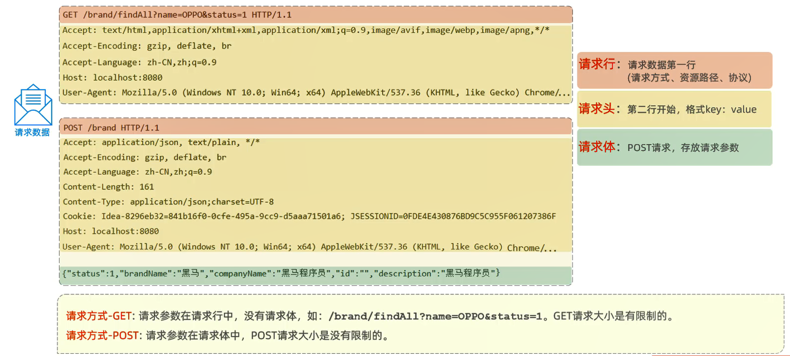
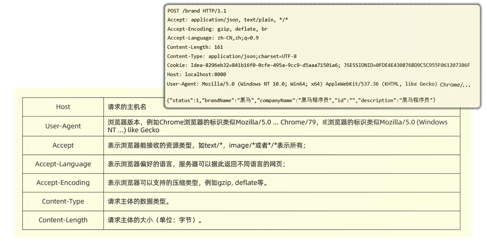
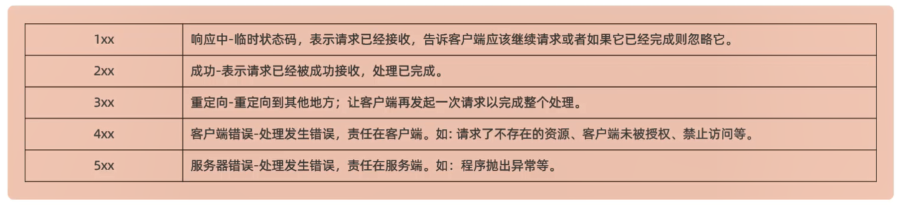
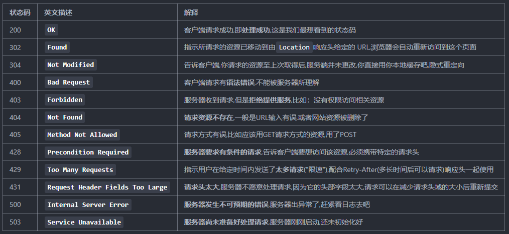
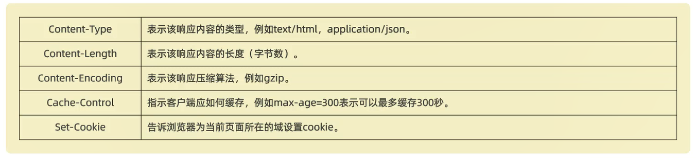

# HTTP

概念:Hyper Text Transfer Protocol,超文本传输协议,规定了浏览器和服务器之间数据传输的规则

特点:
1. 基于TCP协议:面向连接,安全
2. 基于请求-响应模型:一次请求对应一次响应
3. HTTP协议是**无状态**的协议:对于事务处理没有记忆能力,每次请求-响应都是独立的                 
优点:速度快                   
缺点:多次请求键间不能共享数据                

细节:**HTTP协议的默认端口号为80**

# 请求协议

请求头:

  
# 响应协议

状态码:

常见的响应状态码:

[状态码大全](https://cloud.tencent.com/developer/chapter/13553)

响应头:

# 协议解析

通过Web服务器进行HTTP协议解析,例如Tomcat