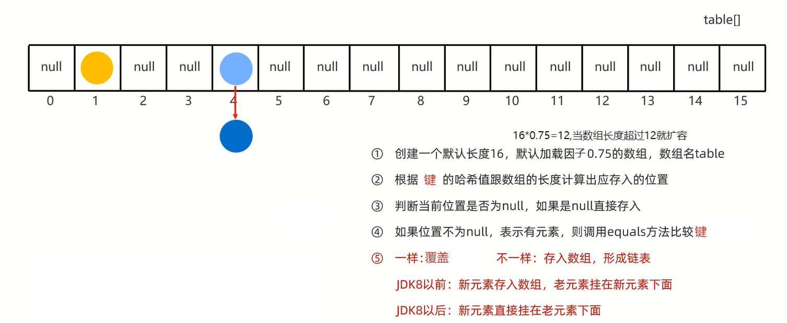

# 特点 

1. HashMap是Map里面的一个实现类
2. 没有额外需要学习的特有方法,直接使用Map里面的方法即可
3. 特点都是**由键决定的:无序、不重复、无索引**
4. HashMap跟HashSet底层原理是一模一样的,都是哈希表的数据结构               
但是HashMap是**利用键计算哈希值,跟值无关**,equals()方法比较的也是**键**                
即依赖hashCode和equals方法保证**键的唯一**                 



5. 如果**键**存储的是自定义对象,**需要重写**hashCode和equals方法                 
如果**值**存储的是自定义对象,**不需要重写**hashCode和equals方法    

练习:

创建一个HashMap集合,键是学生对象(Student),值是籍贯(String)                    
存储四个键值对元素并遍历                    
要求:同姓名、同年龄认为是同一个学生            

```java
import java.util.Objects;

public class Student {
    private String name;
    private int age;

    public Student() {
    }

    public Student(String name, int age) {
        this.name = name;
        this.age = age;
    }

    public String getName() {
        return name;
    }

    public void setName(String name) {
        this.name = name;
    }

    public int getAge() {
        return age;
    }

    public void setAge(int age) {
        this.age = age;
    }

    @Override
    public String toString() {
        return "Student{" +
                "name='" + name + '\'' +
                ", age=" + age +
                '}';
    }

    @Override
    public boolean equals(Object o) {
        if (this == o) return true;
        if (o == null || getClass() != o.getClass()) return false;
        Student student = (Student) o;
        return age == student.age && Objects.equals(name, student.name);
    }

    @Override
    public int hashCode() {
        return Objects.hash(name, age);
    }
}
```

```java
import java.util.*;
import java.util.function.BiConsumer;

public class StudentTest {
    public static void main(String[] args) {
        Student s1 = new Student("zhansan", 23);
        Student s2 = new Student("lisi", 24);
        Student s3 = new Student("wangwu", 25);
        Student s4 = new Student("wangwu", 25);
        HashMap<Student, String> map = new HashMap<>();
        map.put(s1, "北京");
        map.put(s2, "上海");
        map.put(s3, "广州");
        map.put(s4, "深圳");

        // 键找值
        Set<Student> set = map.keySet();
        for (Student student : set) {
            String value = map.get(student);
            // 打印结果:"姓名:zhansan,年龄:23,籍贯:北京"
            // 打印结果:"姓名:wangwu,年龄:25,籍贯:深圳"(深圳覆盖广州)
            // 打印结果:"姓名:lisi,年龄:24,籍贯:上海"
            System.out.println("姓名:" + student.getName() + ",年龄:" + student.getAge() + ",籍贯:" + value);
        }
        System.out.println();

        // 键值对
        Set<Map.Entry<Student, String>> entries = map.entrySet();
        for (Map.Entry<Student, String> entry : entries) {
            String name = entry.getKey().getName();
            int age = entry.getKey().getAge();
            System.out.println("姓名:" + name + ",年龄:" + age + ",籍贯:" + entry.getValue());
        }
        System.out.println();

        // Lambda表达式
        map.forEach((student, value) ->
                System.out.println("姓名:" + student.getName() + ",年龄:" + student.getAge() + ",籍贯:" + value));
    }
}
```

练习:

某个班级8名学生,现在需要组成秋游活动,班长提供了四个景点,依次是(A,B,C,D)                 
每个学生只能选择一个景点,请统计出最终哪个景点想去的人数最多      

```java
import java.util.Objects;

public class Student {
    private String name;

    public Student() {
    }

    public Student(String name) {
        this.name = name;
    }

    public String getName() {
        return name;
    }

    public void setName(String name) {
        this.name = name;
    }

    @Override
    public boolean equals(Object o) {
        if (this == o) return true;
        if (o == null || getClass() != o.getClass()) return false;
        Student student = (Student) o;
        return Objects.equals(name, student.name);
    }

    @Override
    public int hashCode() {
        return Objects.hash(name);
    }
}
```

```java
import java.util.HashMap;
import java.util.Random;
import java.util.function.BiConsumer;

public class StudentTest {
    static int ACount = 0;
    static int BCount = 0;
    static int CCount = 0;
    static int DCount = 0;

    public static void main(String[] args) {
        Student s1 = new Student("zhangsan");
        Student s2 = new Student("lisi");
        Student s3 = new Student("wangwu");
        Student s4 = new Student("zhaoliu");
        Student s5 = new Student("tianqi");
        Student s6 = new Student("xiaowang");
        Student s7 = new Student("xiaogu");
        Student s8 = new Student("xiaozhang");
        HashMap<Student, String> map = new HashMap<>();
        map.put(s1, randomSight());
        map.put(s2, randomSight());
        map.put(s3, randomSight());
        map.put(s4, randomSight());
        map.put(s5, randomSight());
        map.put(s6, randomSight());
        map.put(s7, randomSight());
        map.put(s8, randomSight());
        map.forEach(new BiConsumer<Student, String>() {
            @Override
            public void accept(Student student, String sight) {
                switch (sight) {
                    case "A":
                        ACount++;
                        break;
                    case "B":
                        BCount++;
                        break;
                    case "C":
                        CCount++;
                        break;
                    default:
                        DCount++;
                        break;
                }
                System.out.println(student.getName() + "想去" + sight);
            }
        });
        maxSight(ACount, BCount, CCount, DCount);
    }

    public static void maxSight(int ACount, int BCount, int CCount, int DCount) {
        int maxCount = Math.max(Math.max(ACount, BCount), Math.max(CCount, DCount));
        if (maxCount == ACount) {
            System.out.println("想去A景点的人数最多");
        } else if (maxCount == BCount) {
            System.out.println("想去B景点的人数最多");
        } else if (maxCount == CCount) {
            System.out.println("想去C景点的人数最多");
        } else {
            System.out.println("想去D景点的人数最多");
        }
    }

    public static String randomSight() {
        Random r = new Random();
        String[] arr = new String[]{"A", "B", "C", "D"};
        return arr[r.nextInt(4)];
    }
}
```

练习:

某个班级80名学生,现在需要组成秋游活动,班长提供了四个景点,依次是(A,B,C,D)                 
每个学生只能选择一个景点,请统计出最终哪个景点想去的人数最多          

```java
import java.util.*;

public class sightChoose {
    public static void main(String[] args) {
        // 定义arr数组,存储四个景点
        String[] arr = {"A", "B", "C", "D"};
        // 定义list集合,存储投票的结果
        ArrayList<String> list = new ArrayList<>();
        // 随机生成80个投票结果,存入集合中
        Random r = new Random();
        for (int i = 0; i < 80; i++) {
            list.add(arr[r.nextInt(4)]);
        }
        // 定义map集合进行统计
        HashMap<String, Integer> map = new HashMap<>();
        for (String sight : list) {
            // 判断当前景点是否在map集合中已经存在
            if (map.containsKey(sight)) {
                // 已经存在
                // 获取当前景点已经被投票的次数
                Integer count = map.get(sight);
                // 当前景点又被投票一次
                count++;
                // 将当前景点的投票次数再次存入map集合中
                map.put(sight, count);
            } else {
                // 不存在
                map.put(sight, 1);
            }
        }
        printMap(map, getMax(map));
    }

    // 获取票数中的最大值
    public static int getMax(HashMap<String, Integer> map) {
        int max = 0;
        Set<Map.Entry<String, Integer>> entries = map.entrySet();
        for (Map.Entry<String, Integer> entry : entries) {
            int vote = entry.getValue();
            if (vote > max) {
                max = vote;
            }
        }
        return max;
    }

    // 根据票数最大值找到对应的景点,并打印map集合
    public static void printMap(HashMap<String, Integer> map, int maxVote) {
        map.forEach((sight, vote) ->
                System.out.println("景点" + sight + "的票数为" + vote)
        );
        System.out.print("想去人数最多的景点是:");
        map.forEach((sight, vote) -> {
            if (maxVote == vote) {
                System.out.print(sight + " ");
            }
        });
    }
}
```

# 底层原理

## HashMap里面每一个对象包含以下内容

`Node<K,V>[] table` -- 哈希表结构中数组的名字                
`DEFAULT_INITIAL_CAPACITY` -- 数组的默认长度16                   
`DEFAULT_LOAD_FACTOR` -- 默认加载因子0.75               

HashMap里面每一个对象包含以下内容:            
1. 链表中的键值对对象              
包含:       
`int hash;` -- 键的哈希值                
`final K key;` -- 键                  
`V value;` -- 值               
`Node<K,V> next;` -- 下一个结点的地址值                
2. 红黑树中的键值对对象
包含:            
`int hash;` -- 键的哈希值            
`final K key;` -- 键                  
`V value;` -- 值               
`TreeNode<K,V> parent;` -- 父结点的地址值           
`TreeNode<K,V> left;` -- 左子结点的地址值           
`TreeNode<K,V> right;` -- 右子结点的地址值         
`boolean red;` -- 结点的颜色              

## 添加元素

```java
HashMap<String,Integer> hm = new HashMap<>();
hm.put("aaa" , 111);
hm.put("bbb" , 222);
hm.put("ccc" , 333);
hm.put("ddd" , 444);
hm.put("eee" , 555);
```

添加元素的时候至少考虑三种情况:
1. 数组位置为null
2. 数组位置不为null,键不重复,挂在下面形成链表或者红黑树
3. 数组位置不为null,键重复,元素覆盖

参数一:键                    
参数二:值                                     
返回值:被覆盖元素的值,如果没有覆盖,返回null                     

```java
public V put(K key, V value) {
    return putVal(hash(key), key, value, false, true);
}
```

利用键计算出对应的哈希值,再把哈希值进行一些额外的处理
简单理解:返回值就是返回键的哈希值

```java
static final int hash(Object key) {
    int h;
    return (key == null) ? 0 : (h = key.hashCode()) ^ (h >>> 16);
}
```

参数一:键的哈希值                  
参数二:键            
参数三:值                   
参数四:如果键重复了是否保留                   
true,表示老元素的值保留,不会覆盖                         
false,表示老元素的值不保留,会进行覆盖                            

```java
final V putVal(int hash, K key, V value, boolean onlyIfAbsent,boolean evict) {
    // 定义一个局部变量tab,用来记录哈希表中数组的地址值
    Node<K,V>[] tab;
    
    // 临时的第三方变量,用来记录键值对对象的地址值
    Node<K,V> p;
    
    // 表示当前数组的长度
    int n;
    
    // 表示索引
    int i;
    
    // 把哈希表中数组的地址值,赋值给局部变量tab
    tab = table;

    if (tab == null || (n = tab.length) == 0){
        // 如果当前是第一次添加数据,底层会创建一个默认长度为16,加载因子为0.75的数组
        // 如果不是第一次添加数据,会看数组中的元素是否达到了扩容的条件
        // 如果没有达到扩容条件,底层不会做任何操作
        // 如果达到了扩容条件,底层会把数组扩容为原先的两倍,并把数据全部转移到新的哈希表中
        tab = resize();
        // 表示把当前数组的长度赋值给n
        n = tab.length;
    }

    // 拿着数组的长度跟键的哈希值进行计算,计算出当前键值对对象,在数组中应存入的位置
    i = (n - 1) & hash;
    // 获取数组中对应元素的数据
    p = tab[i];
    
    if (p == null){
        // 底层会创建一个键值对对象,直接放到数组当中
        tab[i] = newNode(hash, key, value, null);
    }else {
        Node<K,V> e;
        K k;
        
        // 等号的左边:数组中键值对的哈希值
        // 等号的右边:当前要添加键值对的哈希值
        // 如果键不一样,此时返回false
        // 如果键一样,返回true
        boolean b1 = p.hash == hash;
        
        if (b1 && ((k = p.key) == key || (key != null && key.equals(k)))){
            e = p;
        } else if (p instanceof TreeNode){
            // 判断数组中获取出来的键值对是不是红黑树中的结点
            // 如果是,则调用方法putTreeVal,把当前的结点按照红黑树的规则添加到树当中
            e = ((TreeNode<K,V>)p).putTreeVal(this, tab, hash, key, value);
        } else {
            // 如果从数组中获取出来的键值对不是红黑树中的结点
            // 表示此时下面挂的是链表
            for (int binCount = 0; ; ++binCount) {
                if ((e = p.next) == null) {
                    // 此时就会创建一个新的结点,挂在下面形成链表
                    p.next = newNode(hash, key, value, null);
                    // 判断当前链表长度是否超过8,如果超过8,就会调用方法treeifyBin
                    // treeifyBin方法的底层还会继续判断
                    // 判断数组的长度是否大于等于64
                    // 如果同时满足这两个条件,就会把这个链表转成红黑树
                    if (binCount >= TREEIFY_THRESHOLD - 1)
                        treeifyBin(tab, hash);
                    break;
                }
                // e:如果e为null,表示当前不需要覆盖任何元素
                // 如果哈希值一样,就会调用equals方法比较内部的属性值是否相同
                if (e.hash == hash && ((k = e.key) == key || (key != null && key.equals(k)))){
                    break;
                }
                p = e;
            }
        }
        
        // 如果e为null,表示当前不需要覆盖任何元素
        // 如果e不为null,表示当前的键是一样的,值会被覆盖
        if (e != null) {
            V oldValue = e.value;
            if (!onlyIfAbsent || oldValue == null){
                // 等号的右边:当前要添加的值
                // 等号的左边:被覆盖的值
                e.value = value;
            }
            afterNodeAccess(e);
            return oldValue;
        }
    }
    
    // threshold:记录的就是数组的长度*0.75,哈希表的扩容时机16*0.75=12
    if (++size > threshold){
            resize();
    }
    
    // 表示当前没有覆盖任何元素,返回null
    return null;
}
```

# 常见面试问题

**HashMap是哈希表结构的,JDK8开始由数组,链表,红黑树组成的,既然有红黑树,是否需要传递比较器Comparator指定比较规则?**                      
**(HashMap的键是否需要实现Compareable接口或者传递比较器对象呢?)**                                  

不需要的,因为在HashMap的底层,默认是利用哈希值的大小关系来创建红黑树的                             