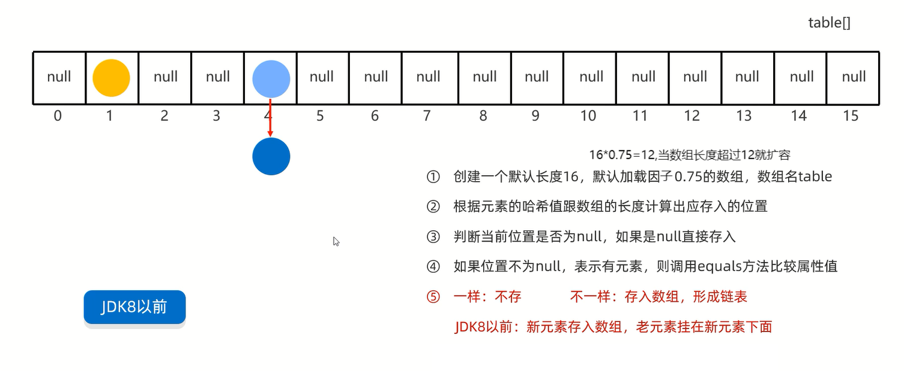
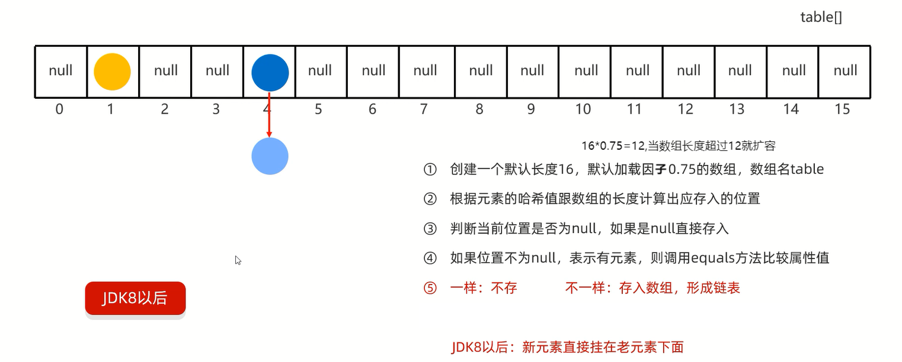

# HashSet

HashSet: `Hash` -- 哈希表,`Set` -- 属于`Set`系列的一员

HashSet集合底层采取**哈希表**存储数据

# 特点

1. **无序**:存取顺序不一致
2. 不重复:可以去除重复
3. 无索引:没有带索引的方法,所以不能使用普通的for循环遍历,也不能通过索引来获取元素

## 哈希表

哈希表是一种对于增删改查数据性能都较好的结构

哈希表组成:
1. JDK8之前:数组+链表
2. JDK8之后:数组+链表+红黑树

## 哈希值

哈希值:对象的整数表现形式

- 根据hashCode方法算出来的int类型的整数
- 该方法定义在Object类中,所有的对象都可以调用,默认使用地址值进行计算
- 一般情况下,会重写hashCode方法,利用对象内部的属性值计算哈希值

特点:
1. 如果没有重写hashCode方法,不同对象计算出的哈希值是不同的
2. 如果已经重写hashCode方法,不同对象只要属性值相同,其计算出的哈希值是一样的
3. 在小部分情况下,不同的属性值或者不同的地址值计算出来的哈希值也有可能是一样的(哈希碰撞)

## 哈希表组成





JDK8以后,当链表长度**超过8**,而且数组长度**大于等于64**时,链表自动转换为红黑树

**如果集合中存储的是自定义对象,必须要重写hashCode和equals方法**

## HashSet的三个问题

1. HashSet为什么存和取的顺序不一样?

存的时候:是根据哈希值和数组的长度来计算出存入的位置,存入的位置不确定;               
取的时候:是按照数组索引和每个索引上的链表依次取,而取出的链表上的值不一定是先存入的值

2. HashSet为什么没有索引?

HashSet的底层由数组、链表、红黑树三者组成的,难以去定义索引

3. HashSet是利用什么机制保证数据去重的?

hashCode方法:确定位置                   
equals方法:比较对象内部的属性值是否一致                  

练习:

利用HashSet集合去除重复元素                              
需求:创建一个存储学生对象的集合,存储多个学生对象,使用程序实现在控制台遍历该集合                 
要求:学生对象的成员变量值相同,我们就认为是同一个对象          

```java
import java.util.Objects;

public class Student {
    private String name;
    private int number;

    public Student() {
    }

    public Student(String name, int number) {
        this.name = name;
        this.number = number;
    }

    public String getName() {
        return name;
    }

    public void setName(String name) {
        this.name = name;
    }

    public int getNumber() {
        return number;
    }

    public void setNumber(int number) {
        this.number = number;
    }

    @Override
    public String toString() {
        return "Student{" +
                "name='" + name + '\'' +
                ", number=" + number +
                '}';
    }

    @Override
    public boolean equals(Object o) {
        if (this == o) return true;
        if (o == null || getClass() != o.getClass()) return false;
        Student student = (Student) o;
        return number == student.number && Objects.equals(name, student.name);
    }

    @Override
    public int hashCode() {
        return Objects.hash(name, number);
    }
}
```

```java
import java.util.HashSet;

public class StudentTest {
    public static void main(String[] args) {
        Student student1 = new Student("张三", 23);
        Student student2 = new Student("张三", 23);
        Student student3 = new Student("李四", 23);
        Student student4 = new Student("王五", 23);
        HashSet<Student> hashset = new HashSet<>();
        hashset.add(student1);
        hashset.add(student2);
        hashset.add(student3);
        hashset.add(student4);
        for (Student student : hashset) {
            // 打印结果:"Student{name='张三', number=23}"
            // 打印结果:"Student{name='王五', number=23}"
            // 打印结果:"Student{name='李四', number=23}"
            System.out.println(student);
        }
    }
}
```

# 应用

1. 如果只要数据去重,默认使用HashSet               
2. 如果要数据去重且存取有序,使用LinkedHashSet  