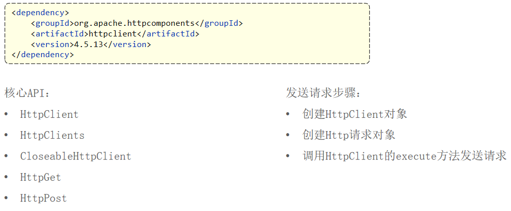

# HttpClient

HttpClient是Apache Jakarta Common下的子项目,可以用来提高高效的、最新的、功能丰富的支持HTTP协议的客户端编程工具包,并且支持HTTP协议最新的版本和建议



# 入门

```java
package com.sky.test;

import com.google.gson.JsonObject;
import org.apache.http.HttpEntity;
import org.apache.http.client.methods.CloseableHttpResponse;
import org.apache.http.client.methods.HttpGet;
import org.apache.http.client.methods.HttpPost;
import org.apache.http.entity.StringEntity;
import org.apache.http.impl.client.CloseableHttpClient;
import org.apache.http.impl.client.HttpClients;
import org.apache.http.util.EntityUtils;
import org.junit.jupiter.api.Test;
import org.springframework.boot.test.context.SpringBootTest;

@SpringBootTest
public class HttpClientTest {
    /**
     * 测试通过HttpClient发送GET方式的请求
     */
    @Test
    public void testGet() throws Exception {
        // 创建HttpClient对象
        CloseableHttpClient httpClient = HttpClients.createDefault();
        // 创建请求对象
        HttpGet httpGet = new HttpGet("http://localhost:8080/user/shop/status");

        // 发送请求
        CloseableHttpResponse response = httpClient.execute(httpGet);

        // 解析返回结果
        // 获取服务端返回的状态码
        int statusCode = response.getStatusLine().getStatusCode();
        System.out.println("服务端返回的状态码为：" + statusCode);
        // 获取服务端返回的状态码
        HttpEntity entity = response.getEntity();
        String body = EntityUtils.toString(entity);
        System.out.println("服务端返回的数据为：" + body);

        // 关闭资源
        response.close();
        httpClient.close();
    }

    /**
     * 测试通过HttpClient发送POST方式的请求
     */
    @Test
    public void testPost() throws Exception {
        // 创建HttpClient对象
        CloseableHttpClient httpClient = HttpClients.createDefault();
        // 创建请求对象
        HttpPost httpPost = new HttpPost("http://localhost:8080/admin/employee/login");

        // 传入参数
        JsonObject jsonObject = new JsonObject();
        jsonObject.addProperty("username", "admin");
        jsonObject.addProperty("password", "123456");

        StringEntity entity = new StringEntity(jsonObject.toString());

        // 指定请求的编码方式
        entity.setContentEncoding("utf-8");
        // 指定请求的数据格式
        entity.setContentType("application/json");

        httpPost.setEntity(entity);

        // 发送请求
        CloseableHttpResponse response = httpClient.execute(httpPost);

        // 解析返回结果
        // 获取服务端返回的状态码
        int statusCode = response.getStatusLine().getStatusCode();
        System.out.println("响应码为：" + statusCode);
        // 获取服务端返回的状态码
        HttpEntity entity1 = response.getEntity();
        String body = EntityUtils.toString(entity1);
        System.out.println("响应数据为：" + body);

        // 关闭资源
        response.close();
        httpClient.close();
    }
}
```