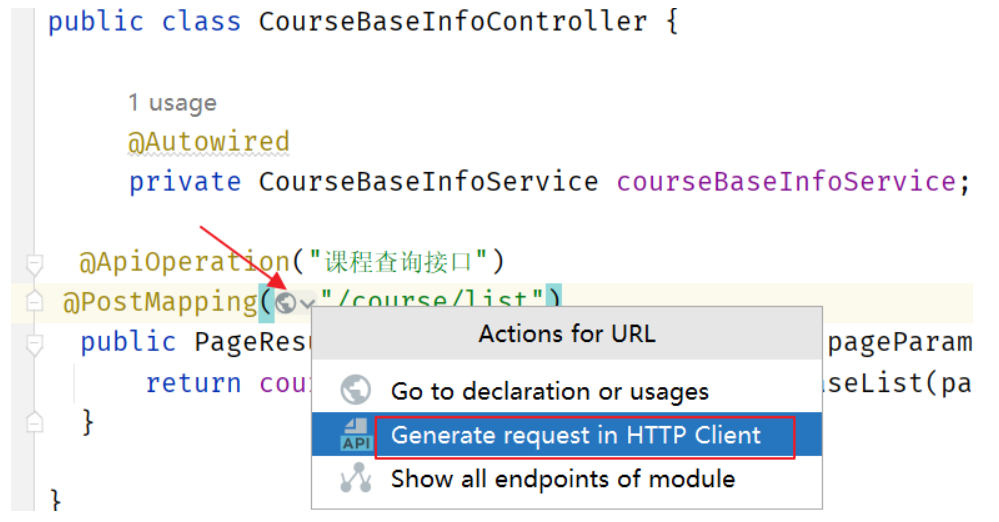

# HttpClient

在IDEA中有一个非常方便的http接口测试工具httpclient



可以添加请求参数进行测试

范例:

```http
### 查询课程信息
POST {{content_host}}/content/course/list?page=1&size=10
Content-Type: application/json

{
  "courseName":"java",
  "auditStatus":"202004",
  "publishStatus":"203001"
}
```

# 方便测试

.http文件即测试用例文档,它可以随着项目工程一起保存,这样测试的数据就可以保存下来,方便进行测试

1. 单独在项目工程的根目录创建一个目录单独存放它们

2. 目录中有两个文件:http-client.env.json和xc-content-api.http

配置文件http-client.env.json中存放测试主机地址:

```json
{
  "dev": {
    "access_token": "",
    "gateway_host": "localhost:63010",
    "content_host": "localhost:63040",
    "system_host": "localhost:63110",
    "media_host": "localhost:63050",
    "search_host": "localhost:63080",
    "auth_host": "localhost:63070",
    "checkcode_host": "localhost:63075",
    "learning_host": "localhost:63020"
  }
}
```

测试文件xc-content-api.http中存放测试:

```http
### 查询课程信息
POST {{content_host}}/content/course/list?page=1&size=10
Content-Type: application/json

{
  "courseName":"java",
  "auditStatus":"202004",
  "publishStatus":"203001"
}

### 查询课程分类
GET {{content_host}}/content/course-category/tree-nodes
Content-Type: application/json

### 新增课程信息
POST {{content_host}}/content/course
Content-Type: application/json

{
  "name": "AAAAAAAAAAAA的Java",
  "users": "IT爱好者IT爱好者IT爱好者IT爱好者IT爱好者IT爱好者",
  "tags": "java",
  "mt": "1-6",
  "st": "1-6-1",
  "grade": "200001",
  "teachmode": "200002",
  "description": "java大法好java大法好java大法好java大法好java大法好java大法好java大法好java大法好",
  "pic": "https://cdn.educba.com/academy/wp-content/uploads/2018/08/Spring-BOOT-Interview-questions.jpg",
  "charge": "201001",
  "price": 2.0,
  "originalPrice": 2000.0,
  "qq": "123456",
  "wechat": "123456",
  "phone": "123456",
  "validDays": 10
}

### 根据课程id查询课程信息
GET {{content_host}}/content/course/40

### 修改课程信息
PUT {{content_host}}/content/course
Content-Type: application/json

{
  "id": 146,
  "name": "ADADFSASDF的Java",
  "users": "IT爱好者IT爱好者IT爱好者IT爱好者IT爱好者IT爱好者",
  "tags": "java",
  "mt": "1-6",
  "st": "1-6-1",
  "grade": "200001",
  "teachmode": "200002",
  "description": "java大法好java大法好java大法好java大法好java大法好java大法好java大法好java大法好",
  "pic": "https://cdn.educba.com/academy/wp-content/uploads/2018/08/Spring-BOOT-Interview-questions.jpg",
  "charge": "201001",
  "price": 20.0,
  "originalPrice": 100.0,
  "qq": "123456",
  "wechat": "123456",
  "phone": "123456",
  "validDays": 10
}

### 根据课程id查询课程计划
GET {{content_host}}/content/teachplan/117/tree-nodes/
```