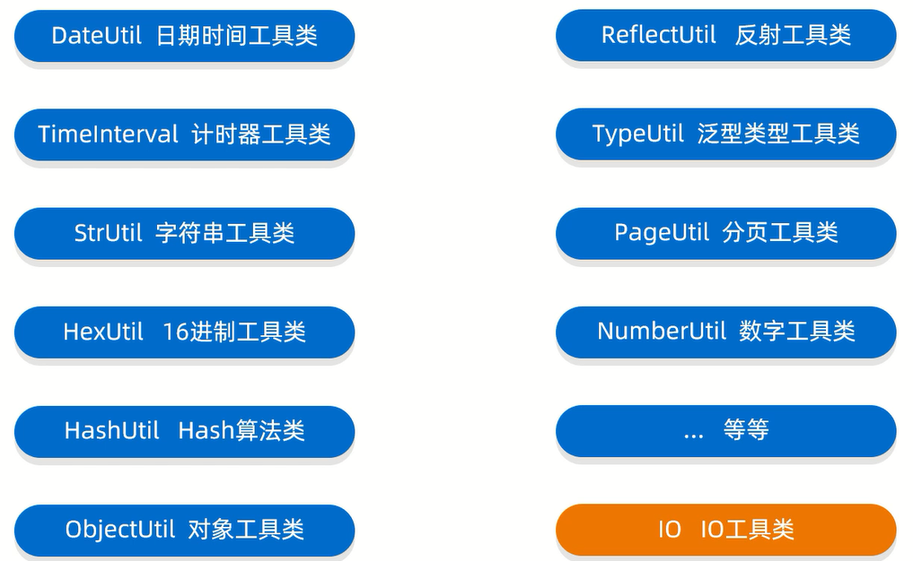

# Hutool-IO



- [Hutool官网](https://hutool.cn/)

- [Hutool API文档](https://apidoc.gitee.com/dromara/hutool/)

- [Hutool中文使用文档](https://hutool.cn/docs/#/)

# IO相关常用类


范例:

```java
import cn.hutool.core.io.FileUtil;

import java.io.File;
import java.util.ArrayList;
import java.util.Collections;

public class Test {
    public static void main(String[] args) {
        // 根据参数创建一个File对象
        File file = FileUtil.file("D:\\", "AAA", "BBB", "aaa.txt");
        // 打印结果:"D:\AAA\BBB\aaa.txt"
        System.out.println(file);

        // 根据参数创建文件
        FileUtil.touch(file);

        ArrayList<String> list1 = new ArrayList<>();
        Collections.addAll(list1, "你好", "明天,");
        // 把集合中的数据写出到文件中,覆盖模式
        FileUtil.writeLines(list1, file, "UTF-8");
        
        ArrayList<String> list2 = new ArrayList<>();
        Collections.addAll(list2, "你好", "后天");
        // 把集合中的数据写出到文件中,续写模式
        FileUtil.appendLines(list2, file, "UTF-8");

        ArrayList<String> list3 = new ArrayList<>();
        // 指定字符编码,把文件中的数据,读到集合中
        FileUtil.readLines(file, "UTF-8", list3);
        // 打印结果:"你好明天,你好后天"
        for (String s : list3) {
            System.out.print(s);
        }
        System.out.println();

        ArrayList<String> list4 = new ArrayList<>();
        // 按照UTF-8的形式,把文件中的数据,读到集合中
        FileUtil.readUtf8Lines(file, list4);
        // 打印结果:"你好明天,你好后天"
        for (String s : list4) {
            System.out.print(s);
        }
    }
}
```

# 细节

1. **Hutool的相对路径,不是相对于当前项目而言的,而是相对class文件而言的**
2. **Hutool的FileUtil.writeLines方法会默认调用JavaBean类的toString方法将数据写入到指定文件中**