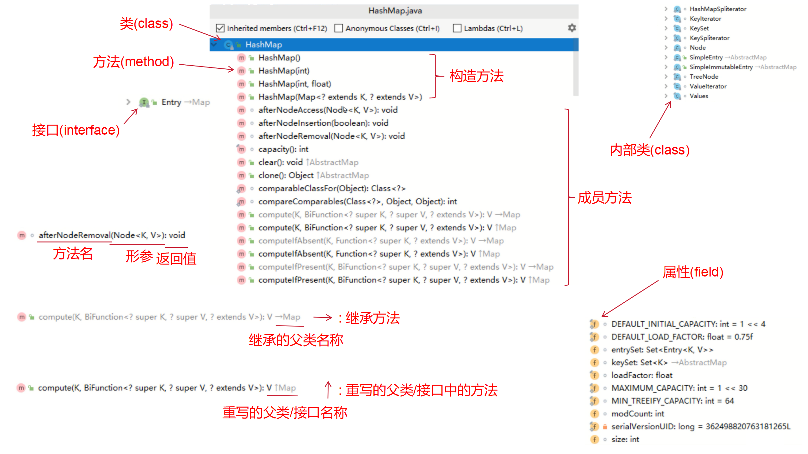

# IDEA项目结构

`project`(项目)包含了`module`(模块)包含了`package`(包)包含了class(类)

# 技巧

## 快速生成main()方法

`psvm`

## 快速生成打印输出语句

`sout`

范例: 

```java
public class HelloWorld {
    // 输入psvm后回车,自动生成main()方法
    public static void main(String[] args) {
        // 输入sout后回车,自动生成输出语句
        System.out.println();
    }
}
```

`System.out.print("abc");`表示: 只打印abc,不换行    
`System.out.printIn("abc");`表示: 先打印abc,后换行    
`System.out.printIn();`表示: 不打印任何数据,只换行    

`souf`包括两部分参数    
第一部分参数: 要输出的内容`%s`(占位)    
第二部分参数: 填充的数据    

范例: 

```java
public class HelloWorld {
    public static void main(String[] args) {
        // 输出: 张三笑着打招呼说道: 你好啊,小美
        System.out.printf("%s笑着打招呼说道: 你好啊,%s","张三","小美");
    }
}
```

`System.out.printf("ab%s","c");`表示: 只打印abc,不换行    

## 快速生成for循环

`循环次数.fori`

范例: 

```java
public class test {
    public static void main(String[] args) {
        // 100.fori快速生成循环次数为100的for循环
        for (int i = 0; i < 100; i++) {
            System.out.printIn("HelloWorld");
        }
    }
}
```

## 键盘录入

定义: Java已经写好一个类叫`Scanner`,这个类可以接收键盘输入的数字   

步骤:     
1. 导包: `import java.util.Scanner;`   
**导包的动作必须出现在类定义的上边**   
2. 创建对象: `Scanner sc = ew Scanner(System.in);`   
**只有sc是变量名,可以变,其他的都不允许变**    
3. 接收数据: `int i = sc.nextInt();`     
**只有i是变量名,可以变,其他的都不允许变**   

范例: 

```java
import java.util.Scanner;
public class Main {
    public static void main(String[] args){
        Scanner sc = ew Scanner(System.in);
        System.out.println("请输入整数: ");
        int i = sc.nextInt();
        System.out.println(i);
    }
}
```

练习: 

键盘输入数字并求和

```java
import java.util.Scanner;
public class Main {
    public static void main(String[] args){
        Scanner sc = new Scanner(System.in);
        System.out.println("输入两个整数并求和");
        System.out.println("请输入第一个整数: ");
        int number_01 = sc.nextInt();
        System.out.println("请输入第二个整数: ");
        int number_02 = sc.nextInt();
        int count = number_01 + number_02;
        System.out.println("这两个整数之和为: " + count);
    }
}
```

1. 第一套体系:      
`nextInt()`: 接受整数   
`nextDouble()`: 接受小数    
`next()`: 接受字符串    
遇到空格、制表符(`\t`)、回车就停止接受数据   
即这些符号后面的数据就不会接受了    

范例: 

```java
import java.util.Scanner;

public class test2 {
    public static void main(String[] args) {
        Scanner sc = new Scanner(System.in);

        System.out.println("请输入一个整数: ");
        // nextInt(): 接受整数
        int number1 = sc.nextInt();
        System.out.println("一个整数: " + number1);

        System.out.println("请输入一个小数: ");
        // nextDouble(): 接受小数
        double number2 = sc.nextDouble();
        System.out.println("一个小数: " + number2);

        System.out.println("请输入一个字符串: ");
        // next(): 接受字符串
        String word1 = sc.next();
        System.out.println("一个字符串: " + word1);
    }
}
```

2. 第二套体系:     
`nextLine()`: 接受字符串   
可以接受空格、制表符(`\t`)   
遇到回车就停止接受数据   

范例: 

```java
import java.util.Scanner;

public class test2 {
    public static void main(String[] args) {
        System.out.println("请输入一个字符串: ");
        // nextLine()接受字符串
        String word2 = sc.nextLine();
        System.out.println("一个字符串: " + word2);
    }
}
```

**第一套体系和第二套体系不能混用**

## 获取随机数
  
步骤:    
1. 导包: `import java.util.Random;`   
**导包的动作必须出现在类定义的上边**     
2. 创建对象: `Random r = new Random();`    
**只有r是变量名,可以变,其他的都不允许变**    
3. 生成随机数: `int number = r.nextInt(x);`    
**只有number是变量名,可以变,其他的都不允许变**    
**随机数的范围一定是从0开始的,到(x-1)结束的,即生成0~(x-1)之间的随机数**   
例如: `int number = r.nextInt(100)`是0~99内生成的随机数     
**口诀: 包头不包尾,包左不包右**    
**生成随机数的代码不能写在循环里面,否则每循环一次都会产生一个新的随机数**   

生成任意范围内的随机数:     
例如45-60,即0-15,只需`int number = r.nextInt(16) + 45`     

范例: 

```java
import java.util.Random;

public class test {
    public static void main(String[] args) {
        Random r = new Random();
        int number = r.nextInt(100);
        System.out.println(number);
    }
}
```

## 快速生成数组遍历

正序遍历: `数组名.fori`

范例: 

```java
public class test {
    public static void main(String[] args) {
        int[] array = {12, 213, 414};
        // array.fori快速生成数组遍历
        for (int i = 0; i < array.length; i++) {
            System.out.println(array[i]);
        }
    }
}
```

逆序遍历: `数组名.forr`

范例 :

```java
public class test {
    public static void main(String[] args) {
        int[] array = {12, 213, 414};
        // array.forr快速生成数组遍历
        for (int i = array.length - 1; i >= 0; i--) {
            System.out.println(array[i]);
        }
    }
}
```

## 快速生成增强for

`单列集合/数组名.for`

范例:                   

```java
// list.for快速生成增强for
for (String s: list) {
    System.out.print(s);
}
```

## 快速生成JavaBean

1. 快捷键 `alt + insert`     
选择构造函数、`Getter`和`Setter`
2. 安装`IDEA`插件: `ptg`     
右键点击`Ptg To JavaBean`   

## 快速生成正则表达式

步骤:                 
1. 安装`IDEA`插件: `any-rule`     
2. 右键点击`AnyRule`,选择要用的正则表达式    
3. 删除前后的`/^`和`/`,这个表示从头开始匹配到末尾,这个在Java的`matches`方法已经实现,所以重复,可删除
4. 在正则表达式中的`\`中再加上一个`\`,因为在Java中`\\`表示`\`

## 阅读异常

例如: 索引越界异常       
1. `Exception in thread "main" java.lang.ArrayIndexOutOfBoundsException:  `    
在Java程序的主线程中发生了一个数组越界异常(`ArrayIndexOutOfBoundsException`)    
2. `Index 10 out of bounds for length 5`      
程序试图访问数组的第10个元素,但数组的长度只有5       
3. `at com.gujintao.test.main(test.java: 8)`     
这个异常发生在`com.gujintao.test`包的main方法内,位置是第8行     

# 快捷键

## 代码操作

自动格式化代码 `ctrl + alt + L`    
自动抽取方法 `ctrl + alt + M`      
快速生成JavaBean `alt + insert`      

## 复制、粘贴、剪切、删除

剪切当前行或选中内容 `ctrl + X`   
复制当前行或选中内容 `ctrl + C`    
粘贴剪切板内容 `ctrl + V`        
复制当前行并粘贴到下一行 `ctrl + D`      
删除当前行 `ctrl + Y`     

## 选中单词

选中当前光标所在的单词 `ctrl + W`       
取消选中当前光标所在的单词 `ctrl + shift + W`       

## 撤销操作

撤销上一步操作 `ctrl + Z`    
恢复上一步被撤销的操作 `ctrl + shift + Z`     

## 注释

多行注释 `ctrl + shift + /`       
注释当前行或选中内容 `ctrl + /`      

## 移动代码

代码上下移动 `shift + alt + up / down`       
代码右移 `tab`        
代码左移 `tab + shift`        

## 运行 

`ctrl + shift + F10`   
 
## 显示参数 

`ctrl + P`    

## 拆分变量为声明和赋值

选中变量后,拆分变量为声明和赋值 `alt + enter`   

## 快速生成包围

选中代码后,为代码添加包围 `ctrl + alt + T`   

## 快速生成方法

选中方法后,在main()方法外创建方法 `ctrl + enter`   

## 列选择模式 

`alt + shift + insert`   
或者按住`alt`不松,鼠标左键也可以实现列选择   

## 小写转变成大写 

`ctrl + shift + U`   

## 搜索 

`ctrl + N`   

## 查看类的方法 

`ctrl + F12`   

## 跟进、后退、前进
 
跟进 `ctrl + B`   
后退 `ctrl + alt + ←`   
前进 `ctrl + alt + →`    

## 查看项目

`alt + 1`

## 查看结构

`alt + 7`

# 源码结构细节

