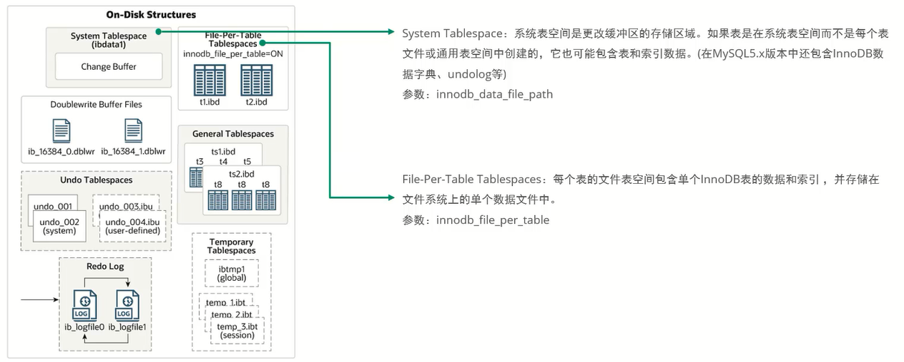
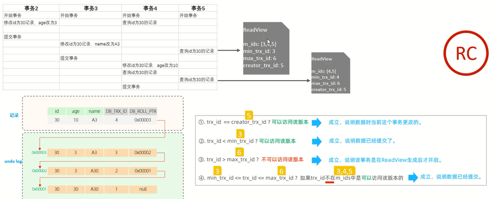

# 逻辑存储结构

# 架构

MySQL5.5版本开始,默认使用InnoDB存储引擎,它擅长事务处理,具有崩溃恢复特性,在日常开发中使用非常广泛             

下面是InnoDB架构图,左侧为内存结构,右侧为磁盘结构:

## 内存结构

### 缓冲池

### 更改缓冲区

### 自适应哈希索引

### 日志缓冲区

## 磁盘结构

### 系统表空间、单表独立表空间

### 通用表空间、撤销表空间、临时表空间

### 双写缓冲区、重做日志

## 后台线程

# 事务原理

## 事务

事务是一组操作的集合,它是一个不可分割的工作单位,事务会把所有的操作作为一个整体一起向系统提交或撤销操作请求,即这些操作要么同时成功,要么同时失败

## 特性(ACID)

- 原子性(Atomicity):事务是不可分割的最小操作单元,要么全部成功,要么全部失败
- 一致性(Consistency):事务完成时,必须使所有的数据都保持一致状态
- 隔离性(Isolation):数据库系统提供的隔离机制,保证事务在不受外部并发操作影响的独立环境下运行
- 持久性(Durability):事务一旦提交或回滚,它对数据库中的数据的改变就是永久的

其中:

- 原子性 -- undo log
- 持久性 -- redo log
- 一致性 -- undo log + redo log
- 隔离性 -- 锁 + MVCC

## redo log

重做日志,记录的是事务提交时数据页的物理修改,是用来实现事务的持久性                   

该日志文件由两部分组成:              
1. 重做日志缓冲(redo log buffer)
2. 重做日志文件(redo log file)

前者是在内存中,后者在磁盘中            
当事务提交之后会把所有修改信息都存到该日志文件中,用于在刷新脏页到磁盘,发生错误时,进行数据恢复使用                 

## undo log

回滚日志,用于记录数据被修改前的信息,作用包含两个:提供回滚(保证事务的原子性)和MVCC(多版本并发控制)              

undo log和redo log记录物理日志不一样,它是逻辑日志,可以认为当delete一条记录时,undo log中会记录一条对应的insert记录,反之亦然,当update一条记录时,它记录一条对应相反的update记录          当执行rollback时,就可以从undo log中的逻辑记录读取到相应的内容并进行回滚                     

Undo log销毁:undo log在事务执行时产生,事务提交时,并不会立即删除undo log,因为这些日志可能还用于MVCC                  
Undo log存储:undo log采用段的方式进行管理和记录,存放在前面介绍的 rollback segment回滚段中,内部包含1024个undo log segment

# MVCC

## 基本概念

### 当前读

读取的是记录的最新版本,读取时还要保证其他并发事务不能修改当前记录,会对读取的记录进行加锁               
对于日常的操作,如:select ... lock in share mode(共享锁),select ...for update、update、insert、delete(排他锁)都是一种当前读

### 快照读

简单的select(不加锁)就是快照读,快照读,读取的是记录数据的可见版本,有可能是历史数据,不加锁,是非阻塞读                     

- Read Committed:每次select,都生成一个快照读
- Repeatable Read:开启事务后第一个select语句才是快照读的地方
- Serializable:快照读会退化为当前读

### MVCC

全称Multi-Version Concurrency Control,多版本并发控制                  
指维护一个数据的多个版本,使得读写操作没有冲突,快照读为MySQL实现MVCC提供了一个非阻塞读功能                   
MVCC的具体实现,还需要依赖于数据库记录中的三个隐式字段、undo log版本链、ReadView

## 隐藏字段

查看stu的表结构信息:`ibd2sdi XXX.ibd`

## undo log版本链

回滚日志,在insert、update、delete的时候产生的便于数据回滚的日志                   
当insert的时候,产生的undo log日志只在回滚时需要,在事务提交后,可被立即删除                        
而update、delete的时候,产生的undo log日志不仅在回滚时需要,在快照读时也需要,不会立即被删除           

## readView

ReadView(读视图)是快照读SQL执行时MVCC提取数据的依据,记录并维护系统当前活跃的事务(未提交的)id

### RC隔离级别下范例

范例1:

范例2:

### RR隔离级别下范例

