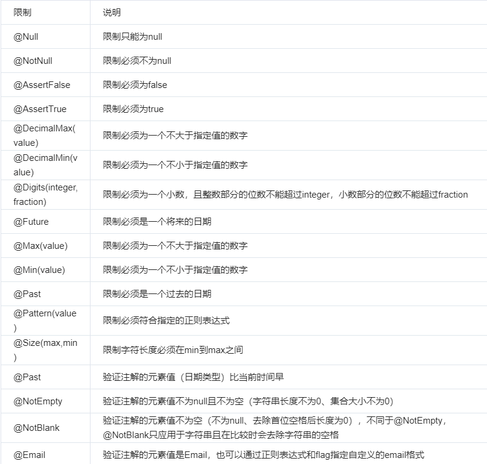

# JSR303校验

前端请求后端接口传输参数,是在controller中校验还是在Service中校验?

答案是都需要校验,只是分工不同

- Contoller中校验请求参数的合法性,包括:必填项校验,数据格式校验,比如:是否是符合一定的日期格式等
- Service中要校验的是业务规则相关的内容,比如:课程已经审核通过所以提交失败

Service中根据业务规则去校验不方便写成通用代码,Controller中则可以将校验的代码写成通用代码

早在JavaEE6规范中就定义了参数校验的规范,它就是JSR-303,它定义了Bean Validation,即对bean属性进行校验

SpringBoot提供了JSR-303的支持,它就是spring-boot-starter-validation,它的底层使用Hibernate Validator,Hibernate Validator是Bean Validation的参考实现

在Controller层可以使用spring-boot-starter-validation完成对请求参数的基本合法性进行校验

# 依赖引入

```xml
<dependency>
    <groupId>org.springframework.boot</groupId>
    <artifactId>spring-boot-starter-validation</artifactId>
</dependency>
```

# 注解规则



定义好校验规则还需要开启校验,在controller方法中添加`@Validated`注解

# 分组校验

分组校验,同一个属性定义多个校验规则属于不同的分组

比如:添加订单定义`@NULL`规则属于insert分组,更新订单定义`@NotEmpty`规则属于update分组,insert和update是分组的名称,是可以修改的

1. 定义不同的接口类型(空接口)表示不同的分组

```java
package com.xuecheng.base.exception;

/**
 * @description 用于分组校验, 定义一些常用的组
 */
public class ValidationGroups {

    public interface Inster {
    }

    ;

    public interface Update {
    }

    ;

    public interface Delete {
    }

    ;
}
```

2. 在定义校验规则时指定分组

```java
@NotEmpty(groups = {ValidationGroups.Inster.class},message = "添加课程名称不能为空")
@NotEmpty(groups = {ValidationGroups.Update.class},message = "修改课程名称不能为空")
// @NotEmpty(message = "课程名称不能为空")
@ApiModelProperty(value = "课程名称", required = true)
private String name;
```

3. 在Controller方法中启动校验规则指定要使用的分组名

```java
@ApiOperation("新增课程基础信息")
@PostMapping("/course")
public CourseBaseInfoDto createCourseBase(@RequestBody @Validated({ValidationGroups.Inster.class}) AddCourseDto addCourseDto){
    //机构id,由于认证系统没有上线暂时硬编码
    Long companyId = 1L;
  return courseBaseInfoService.createCourseBase(companyId,addCourseDto);
}
```

# 范例

1. 定义不同的接口类型(空接口)表示不同的分组

```java
package com.xuecheng.base.exception;

/**
 * @description 用于分组校验, 定义一些常用的组
 */
public class ValidationGroups {

    public interface Inster {
    }

    ;

    public interface Update {
    }

    ;

    public interface Delete {
    }

    ;
}
```

2. 对bean属性通过添加注解进行校验

```java
package com.xuecheng.content.model.dto;

import com.xuecheng.base.exception.ValidationGroups;
import io.swagger.annotations.ApiModel;
import io.swagger.annotations.ApiModelProperty;
import lombok.Data;

import javax.validation.constraints.NotEmpty;
import javax.validation.constraints.Size;

/**
 * @description 添加课程dto
 */
@Data
@ApiModel(value = "AddCourseDto", description = "新增课程基本信息")
public class AddCourseDto {
    /**
     * 课程名称
     */
    @NotEmpty(message = "新增课程名称不能为空", groups = ValidationGroups.Inster.class)
    @NotEmpty(message = "修改课程名称不能为空", groups = ValidationGroups.Update.class)
    @ApiModelProperty(value = "课程名称", required = true)
    private String name;

    /**
     * 适用人群
     */
    @NotEmpty(message = "适用人群不能为空", groups = ValidationGroups.Inster.class)
    @NotEmpty(message = "适用人群不能为空", groups = ValidationGroups.Update.class)
    @Size(message = "适用人群内容过少", min = 10, groups = ValidationGroups.Inster.class)
    @Size(message = "适用人群内容过少", min = 10, groups = ValidationGroups.Update.class)
    @ApiModelProperty(value = "适用人群", required = true)
    private String users;

    /**
     * 课程标签
     */
    @ApiModelProperty(value = "课程标签")
    private String tags;

    /**
     * 大分类
     */
    @NotEmpty(message = "课程分类不能为空", groups = ValidationGroups.Inster.class)
    @NotEmpty(message = "课程分类不能为空", groups = ValidationGroups.Update.class)
    @ApiModelProperty(value = "大分类", required = true)
    private String mt;

    /**
     * 小分类
     */
    @NotEmpty(message = "课程分类不能为空", groups = ValidationGroups.Inster.class)
    @NotEmpty(message = "课程分类不能为空", groups = ValidationGroups.Update.class)
    @ApiModelProperty(value = "小分类", required = true)
    private String st;

    /**
     * 课程等级
     */
    @NotEmpty(message = "课程等级不能为空", groups = ValidationGroups.Inster.class)
    @NotEmpty(message = "课程等级不能为空", groups = ValidationGroups.Update.class)
    @ApiModelProperty(value = "课程等级", required = true)
    private String grade;

    /**
     * 教学模式
     */
    @ApiModelProperty(value = "教学模式", required = true)
    private String teachmode;

    /**
     * 课程介绍
     */
    @ApiModelProperty(value = "课程介绍")
    @Size(message = "课程介绍内容过少", min = 10, groups = ValidationGroups.Inster.class)
    @Size(message = "课程介绍内容过少", min = 10, groups = ValidationGroups.Update.class)
    private String description;

    /**
     * 课程图片
     */
    @ApiModelProperty(value = "课程图片", required = true)
    private String pic;

    /**
     * 收费规则
     */
    @NotEmpty(message = "收费规则不能为空", groups = ValidationGroups.Inster.class)
    @NotEmpty(message = "收费规则不能为空", groups = ValidationGroups.Update.class)
    @ApiModelProperty(value = "收费规则,对应数据字典", required = true)
    private String charge;

    /**
     * 价格
     */
    @ApiModelProperty(value = "价格")
    private Float price;

    /**
     * 原价
     */
    @ApiModelProperty(value = "原价")
    private Float originalPrice;

    /**
     * qq
     */
    @ApiModelProperty(value = "qq")
    private String qq;

    /**
     * 微信
     */
    @ApiModelProperty(value = "微信")
    private String wechat;

    /**
     * 电话
     */
    @ApiModelProperty(value = "电话")
    private String phone;

    /**
     * 有效期
     */
    @ApiModelProperty(value = "有效期")
    private Integer validDays;
}
```

3. 在controller层中启用校验

```java
/**
 * 新增课程信息接口
 *
 * @param addCourseDto 新增课程信息
 * @return 课程信息
 */
@PostMapping("/course")
@ApiOperation("新增课程信息接口")
public CourseBaseInfoDto createCourseBase(@RequestBody @Validated(ValidationGroups.Inster.class) AddCourseDto addCourseDto) {
    // 机构id TODO
    Long companyId = 1232141425L;
    return courseBaseInfoService.createCourseBase(companyId, addCourseDto);
}
```