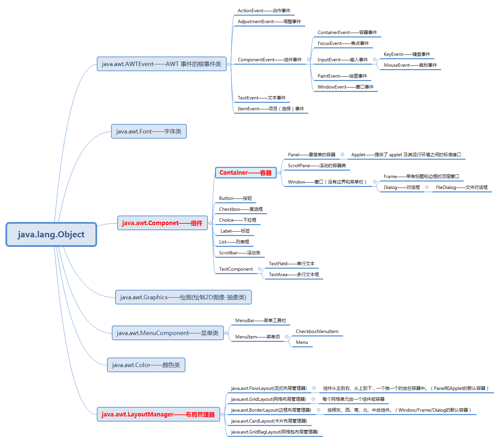
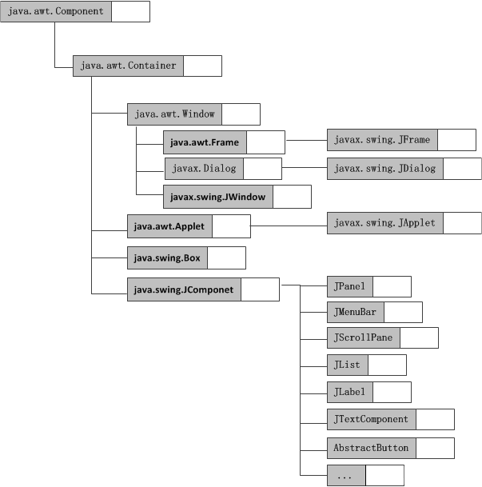

# GUI

是指采用图形化的方式显示操作界面 

Java提供了两个主要的GUI工具包:Abstract Window Toolkit(AWT)和Swing               

## AWT

AWT是Java最早的界面库,需要调用本地系统方法来实现功能,属**重量级控件**                 
依赖于本地平台的组件,被称为"重量级组件"

## Swing

Swing是对AWT的扩展,在AWT的基础上,建立的一套图像界面系统          
其中提供了更多的组件,而且完全由Java实现,增强了移植性,属**轻量级组件**               
不依赖于本地平台的组件,被称为"轻量级组件"      

为了和AWT组件区分,Swing组件在javax.swing.*包下,类名均以J开头,例如:JFrame、JLabel、JButton等

## JavaFX

JavaFX是JDK1.8引入的新的界面库

## SWT

SWT是Eclipse使用的界面库,它吸收了AWT和Swing实现的最好的部分