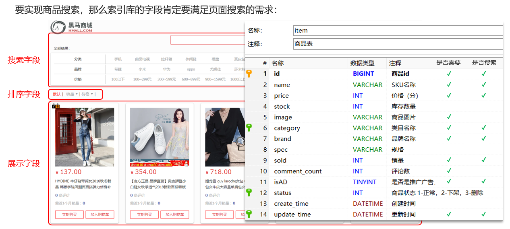
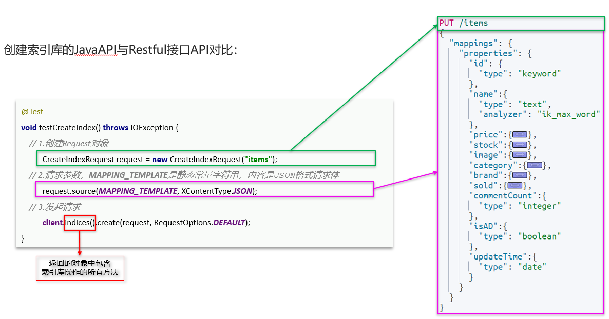
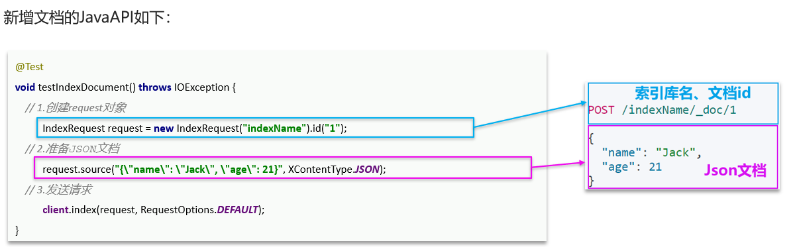
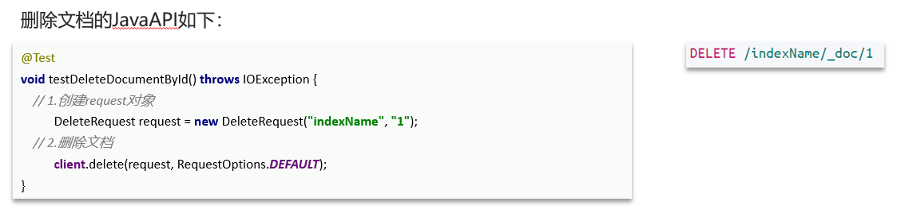
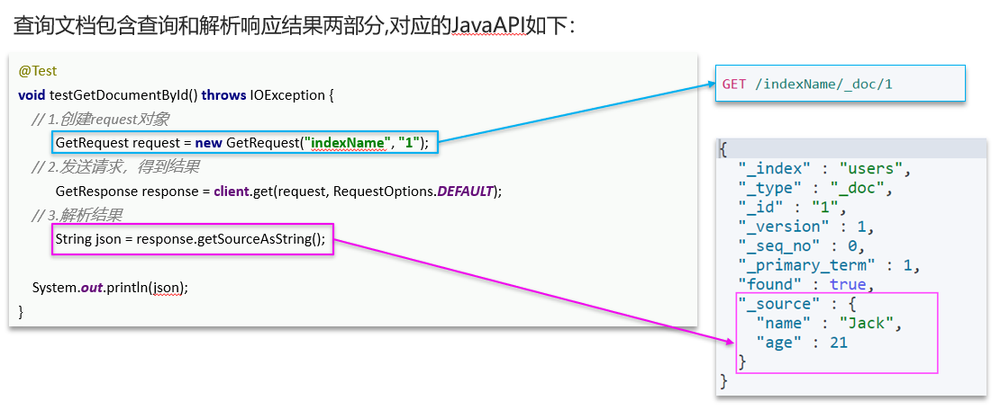

[JavaRestClient官方网站](https://www.elastic.co/guide/en/elasticsearch/client/index.html)

# 客户端初始化

1. 引入es的RestHighLevelClient依赖

```xml
<!--elasticsearch-->
<dependency>
    <groupId>org.elasticsearch.client</groupId>
    <artifactId>elasticsearch-rest-high-level-client</artifactId>
</dependency>
```

2. 因为SpringBoot默认的ES版本是7.17.0,所以需要覆盖默认的ES版本

```xml
<properties>
  <elasticsearch.version>7.12.1</elasticsearch.version>
</properties>
```

3. 初始化RestHighLevelClient

```java
package com.hmall.item.es;

import org.apache.http.HttpHost;
import org.elasticsearch.client.RestClient;
import org.elasticsearch.client.RestHighLevelClient;
import org.junit.jupiter.api.AfterEach;
import org.junit.jupiter.api.BeforeEach;
import org.junit.jupiter.api.Test;

public class ElasticSearchTest {

    private RestHighLevelClient client;

    @Test
    void testConnection() {
        System.out.println(client);
    }

    @BeforeEach
    void setUp() {
        client = new RestHighLevelClient(RestClient.builder(
                HttpHost.create("http://192.168.149.127:9200")
        ));
    }

    @AfterEach
    void tearDown() throws Exception {
        if (client != null) {
            client.close();
        }
    }
}
```

# 商品mapping映射



```cmd
PUT /hmall
{
  "mappings": {
    "properties": {
      "id":{
        "type":"keyword"
      },
      "name":{
        "type":"text",
        "analyzer": "ik_max_word"
      },
      "price":{
        "type": "integer"
      },
      "image":{
        "type":"keyword",
        "index": false
      },
      "category":{
        "type": "keyword",
      },
      "brand":{
        "type": "keyword",
      },
      "sold":{
        "type":"keyword",
      },
      "commentCount":{
        "type":"keyword",
        "index":false
      },
      "isAD":{
        "type":"boolean",
      },
      "updateTime":{
        "type":"date"
      }
    }
  }
}
```

# 索引库操作

## 创建索引库和mapping



范例:创建黑马商城商品索引库

```java
static final String MAPPING_TEMPLATE = "{\n" +
        "  \"mappings\": {\n" +
        "    \"properties\": {\n" +
        "      \"id\": {\n" +
        "        \"type\": \"keyword\"\n" +
        "      },\n" +
        "      \"name\":{\n" +
        "        \"type\": \"text\",\n" +
        "        \"analyzer\": \"ik_max_word\"\n" +
        "      },\n" +
        "      \"price\":{\n" +
        "        \"type\": \"integer\"\n" +
        "      },\n" +
        "      \"stock\":{\n" +
        "        \"type\": \"integer\"\n" +
        "      },\n" +
        "      \"image\":{\n" +
        "        \"type\": \"keyword\",\n" +
        "        \"index\": false\n" +
        "      },\n" +
        "      \"category\":{\n" +
        "        \"type\": \"keyword\"\n" +
        "      },\n" +
        "      \"brand\":{\n" +
        "        \"type\": \"keyword\"\n" +
        "      },\n" +
        "      \"sold\":{\n" +
        "        \"type\": \"integer\"\n" +
        "      },\n" +
        "      \"commentCount\":{\n" +
        "        \"type\": \"integer\"\n" +
        "      },\n" +
        "      \"isAD\":{\n" +
        "        \"type\": \"boolean\"\n" +
        "      },\n" +
        "      \"updateTime\":{\n" +
        "        \"type\": \"date\"\n" +
        "      }\n" +
        "    }\n" +
        "  }\n" +
        "}";

@Test
void testCreateIndex() throws IOException {
    // 准备Request对象
    CreateIndexRequest request = new CreateIndexRequest("items");
    // 准备请求参数
    request.source(MAPPING_TEMPLATE, XContentType.JSON);
    // 发送请求
    client.indices().create(request, RequestOptions.DEFAULT);
}
```

## 删除索引库

```java
@Test
void testDeleteIndex() throws IOException {
  // 创建Request对象 
  DeleteIndexRequest request = new DeleteIndexRequest("items");
  // 发起请求
  client.indices().delete(request, RequestOptions.DEFAULT);
}
```

## 查询索引库

```java
@Test
void testGetIndex() throws IOException {
    // 创建Request对象
    GetIndexRequest request = new GetIndexRequest("items");
    // 发起请求
    client.indices().get(request, RequestOptions.DEFAULT);
    // boolean exists = client.indices().exists(request, RequestOptions.DEFAULT);
    // System.out.println(exists);
}
```

# 文档操作

## 新增文档



范例:新增黑马商城商品文档

ItemDoc.java:

```java
package com.hmall.item.domain.po;

import io.swagger.annotations.ApiModel;
import io.swagger.annotations.ApiModelProperty;
import lombok.Data;

import java.time.LocalDateTime;

@Data
@ApiModel(description = "索引库实体")
public class ItemDoc{

    @ApiModelProperty("商品id")
    private String id;

    @ApiModelProperty("商品名称")
    private String name;

    @ApiModelProperty("价格（分）")
    private Integer price;

    @ApiModelProperty("商品图片")
    private String image;

    @ApiModelProperty("类目名称")
    private String category;

    @ApiModelProperty("品牌名称")
    private String brand;

    @ApiModelProperty("销量")
    private Integer sold;

    @ApiModelProperty("评论数")
    private Integer commentCount;

    @ApiModelProperty("是否是推广广告，true/false")
    private Boolean isAD;

    @ApiModelProperty("更新时间")
    private LocalDateTime updateTime;
}
```

新增文档:

```java
@Test
void testIndexDoc() throws IOException {
    // 准备文档数据
    Item item = itemService.getById(317578L);
    // 把数据库数据转为文档数据
    ItemDoc itemDoc = BeanUtil.copyProperties(item, ItemDoc.class);
    // 准备Request对象
    IndexRequest request = new IndexRequest("items").id(itemDoc.getId());
    // 准备请求参数
    request.source(JSONUtil.toJsonStr(itemDoc), XContentType.JSON);
    // 发送请求
    client.index(request, RequestOptions.DEFAULT);
}
```

## 删除文档



```java
@Test
void testDeleteDoc() throws IOException {
    // 准备Request对象
    DeleteRequest request = new DeleteRequest("items", "317578");
    // 发送请求
    client.delete(request, RequestOptions.DEFAULT);
}
```

## 查询文档



```java
@Test
void testGetDoc() throws IOException {
    // 准备Request对象
    GetRequest request = new GetRequest("items", "317578");
    // 发送请求
    GetResponse response = client.get(request, RequestOptions.DEFAULT);
    // 解析结果
    System.out.println(response.getSourceAsString());
}
```

## 修改文档

# 文档批量处理