# JavaScript

JavaScript(简称:JS)是一门跨平台、面向对象的脚本语言,是用来控制网页行为的,它能使网页可交互

# 引入方式

1. 内部脚本:将JS代码定义在HTML页面中
2. 外部脚本:将JS代码定义在外部JS文件中,然后引入到HTML页面中

## 内部脚本

内部脚本:将JS代码定义在HTML页面中

- JavaScript代码必须位于`<script></script>`标签之间
- 在HTML文档中,可以在任意地方,放置任意数量的`<script>`
- 一般会把脚本放置于`<body>`元素的底部,以改善显示速度

## 外部脚本

外部脚本:将JS代码定义在外部JS文件中,然后引入到HTML页面中

- 外部JS文件中,只包含JS代码,不包含`<script>`标签
- `<script>`标签不能自闭合

## 范例

```js
alert("Hello,JavaScript");
```

```html
<!DOCTYPE html>
<html lang="en">

<head>
    <meta charset="UTF-8">
    <meta name="viewport" content="width=device-width, initial-scale=1.0">
    <title>JavaScript</title>
</head>

<body>

</body>

<!--内部脚本-->
<!-- <script>
    alert("Hello,JavaScript");
</script> -->

<!--外部脚本-->
<script src="js\JS.js"></script>

</html>
```

# 基础语法

## 书写语法

- 区分大小写:与Java一样,变量名、函数名以及其他一切东西都是区分大小写的
- 每行结尾的分号可有可无
- 注释              
单行注释:`// 注释内容`              
多行注释:`/*注释内容*/`
- 大括号表示代码块         
               
### 输出语句

- 使用`window.alert()`写入警告框
- 使用`document.write()`写入HTML输出,在浏览器显示
- 使用`console.log()`写入浏览器控制台

范例:

```js
window.alert("Hello,JavaScript");

document.write("Hello,JavaScript");

console.log("Hello,JavaScript");
```

## 变量

JavaScript中可以使用`var`关键字(variable的缩写)来声明变量                                                              
JavaScript是一门弱类型语言,变量**可以存放不同类型的值**                       

变量名的命名规则:
- 组成字符可以是任何字母、数字、下划线(_)、美元符号($)
- 数字不能开头
- 建议使用驼峰命名

特点:
- 变量作用域比较大,属于全局变量
- 可以重复定义

细节:
- ES6新增了`let`关键字来定义变量,其用法与`var`类似,但是所声明的变量,只在let关键字所在的代码块内有效,且不允许重复声明                  
- ES6新增了`const`关键字,用来声明一个只读的常量,一旦声明,常量的值就不能改变              

```js
{
    var x = 10;
    var x = 'A';
    // 输出A
    window.alert(x);
}

{
    let x = 11;
    // 输出11
    window.alert(x);

    const pi = 3.14;
    // 输出3.14
    window.alert(pi);
}

// 输出A
window.alert(x);
```

## 数据类型

JavaScript中分为:原始类型和引用类型

原始类型:
- number:数字(整数、小数、NaN(Not a Number))
- String:字符串,单双引皆可
- boolean:布尔(true/false)
- null:对象为空
- undefined:当声明的变量未初始化时,该变量的默认值是undefined

使用`typeof`运算符可以获取数据类型

范例:

```js
{// 输出number
    alert(typeof 3);
    // 输出number
    alert(typeof 3.14);

    // 输出string
    alert(typeof "A");
    // 输出string
    alert(typeof 'A');

    // 输出boolean
    alert(typeof true);
    // 输出boolean
    alert(typeof false);

    var a;
    // 输出undefined
    alert(typeof a);

    // 输出object
    alert(typeof null);
}
```

## 运算符

- 算数运算符:`+`,`-`,`*`,`/`,`%`,`++`,`--`
- 赋值运算符:`=`,`+=`,`-=`,`*=`,`/=`,`%=`
- 比较运算符:`>`,`<`,`>=`,`<=`,`!=`,`==`,`===`
- 逻辑运算符:`&&`,`||`,`!`
- 三元运算符:`条件表达式?true_value:false_value`

细节:`==`会进行类型转换,`===`不会进行类型转换

范例:

```js
{
    let a = 10;
    // 输出true
    alert(a == "10");
    
    // 输出false
    alert(a === "10");
    
    // 输出true
    alert(a === 10);
}
```

### 类型转换

- 字符串类型转为数字:将字符串面值转为数字,如果字面值不是数字,则转为NaN
- 其他类型转为boolean:               
number:0和NaN为false,其他均为true                   
string:空字符串为false,其他均为true                       
null和undefined:均为false                 

范例:

```js
{
    // 输出12
    alert(parseInt("12"));

    // 输出12
    alert(parseInt("12A45"));

    // 输出NaN
    alert(parseInt("A45"));

    if(0){ 
        // 输出false
        alert("0转换为false");
    }

    if(NaN){ 
        // 输出false
        alert("NaN转换为false");
    }

    if(-1){ 
        // 输出true
        alert("除0和NaN其他数字都转为true");
    }

    if(""){ 
        // 输出false
        alert("空字符串为false,其他都是true");
    }
        
    if(null){ 
        // 输出false
        alert("null转化为false");
    }

    if(undefined){ 
        // 输出false
        alert("undefined转化为false");
    }
}
```

## 流程控制语句

- `if...else if...else`
- `switch`
- `for`
- `while`
- `do...while`

# 函数

定义方式一:

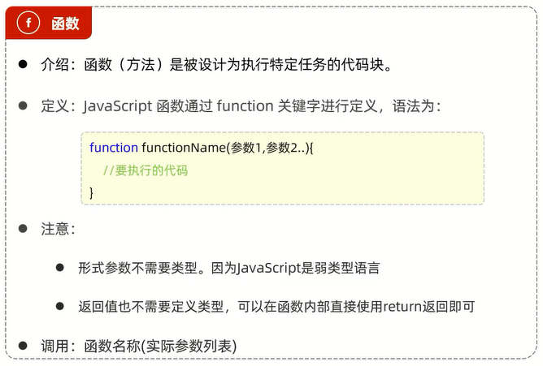

定义方式二:

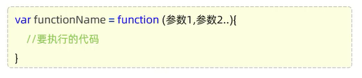

细节:**函数可以传递任意个数的参数,但是根据函数的定义来接收指定个数的参数**

范例:

```js
// 函数1
function add1(a, b) {
    return a + b;
}

// 函数1调用
var result1 = add1(19, 23);
alert(result1);

// 函数2
var add2 = function(a, b) {
    return a + b;
}

// 函数2调用
var result2 = add2(11, 23);
alert(result2);
```

# 对象

## Array

Array对象用于定义数组

定义:
1. `var 变量名 = new Array(元素列表);`
2. `var 变量名 = [元素列表];`

访问:`arr[索引] = 值;`

特点:**JavaScript中的数组相当于Java中的集合,数组的长度是可变的,而JavaScript是弱类型,所以可以存储任意类型的数据**

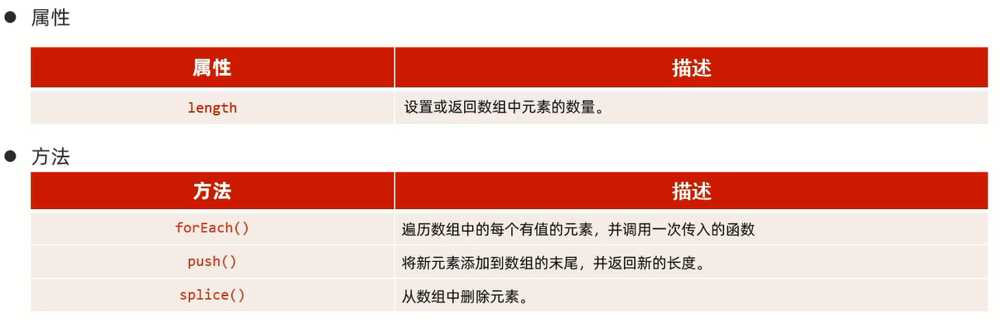

范例:

```js
{
    // 定义数组
    var arr1 = new Array(1, 2, 3, 4, 5);
    var arr2 = [1, 2, 3];

    // 输出3
    console.log(arr1[2]);
    // 输出1
    console.log(arr2[0]);

    // 输出undefined
    console.log(arr2[10]);

    arr2[11] = 100;
    // 输出100
    console.log(arr2[11]);

    arr2[9] = true;
    arr2[8] = "A";
    // 输出(12) [1, 2, 3, empty × 5, 'A', true, empty, 100]
    console.log(arr2);

    // 遍历数组中的所有元素
    for (let i = 0; i < arr2.length; i++) {
        const element = arr2[i];
        console.log(element);
    }

    // 遍历数组中有值的元素
    arr2.forEach(function (e) {
        console.log(e);
    });
    // 或者ES6的箭头函数
    arr2.forEach((e) => {
        console.log(e);
    });

    // 将新元素添加到数组末尾
    arr2.push(23, 24, 25);
    console.log(arr2);

    // 删除数组中的元素
    // 删除0索引开始之后的2个元素
    arr2.splice(0, 2);
    console.log(arr2);
}
```

补充:箭头函数(ES6),用来简化函数定义语法

具体形式:`(...) => {...}`,如果需要给箭头函数起名字:`var XXX = (...) => {...}`

## String

定义:
1. `var 变量名 = new String("...");`
2. `var 变量名 = "...";`

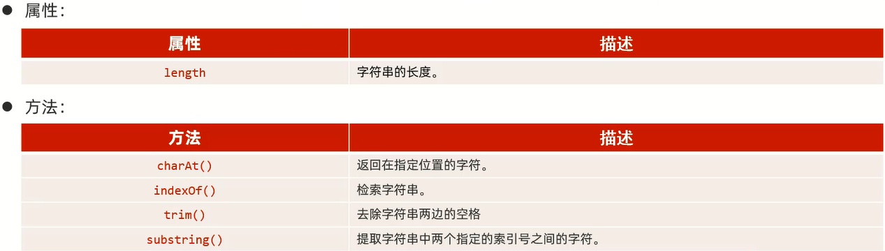

范例:

```js
{
    var str1 = new String("hello X");
    var str2 = " w o r l d ";

    // 输出7
    console.log(str1.length);

    // 输出h
    console.log(str1.charAt(0));

    // 输出6
    console.log(str1.indexOf("X"));

    // 输出w o r l d
    console.log(str2.trim());

    // 输出hello
    console.log(str1.substring(0,5));
}
```

## 自定义对象

定义:

```js
var 对象名 = {
    属性名1:属性值1,
    属性名2:属性值2,
    属性名3:属性值3,
    函数名称:function(形参列表){},

    // 简化
    函数(形参列表){}
}
```

调用:
- `对象名.属性名;`
- `对象名.函数名();`

范例:

```js
// 定义
var user = {
    name: "张三",
    age: 23,
    gender: "男",

    getInfo: function () {
        alert(this.name + "-" + this.age + "-" + this.gender);
    },

    // 简化
    getAge() {
        alert(this.age);
    }

}

// 调用
console.log(user.name);
user.getInfo();
user.getAge();
```

## JSON

概念:JavaScript Object Notation,JavaScript对象标记法                       
JSON是通过JavaScript对象标记法书写的**文本**

细节:**相较于JavaScript,属性值必须使用双引号包裹**

例如:              
JavaScript中的`name: "张三",age: 23,gender: "男"`              
JSON中`"name": "张三","age": 23,"gender": "男"`    

由于其语法简单,层次结构鲜明,现多用于作为**数据载体**,在网络中进行数据传输

定义:`var 变量名 = '{"key1":value1,"key2":value2}';`         

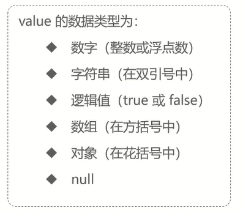

例如:`var userStr = '{"name":"张三","age":18,"address":["北京","上海","西安"]}';`

JSON字符串转为JS对象:`var jsObject = JSON.parse(jsonStr);`

JS对象转为JSON字符串:`var jsonStr = JSON.stringify(jsObject);`

范例:

```js
var userStr = '{"name":"张三","age":18,"address":["北京","上海","西安"]}';

// json字符串转为js对象
var user = JSON.parse(userStr);

alert(user.name);

// js对象转为json字符串

var userStr2 = JSON.stringify(user);

alert(userStr2);
```

## BOM

概念:Browser Object Model,浏览器对象模型,允许JavaScript与浏览器对话,JavaScript将浏览器的各个组成部分封装为对象

组成:
1. Window:浏览器窗口对象
2. Navigator:浏览器对象
3. Screen:屏幕对象
4. History:历史记录对象
5. Location:地址栏对象

### Window

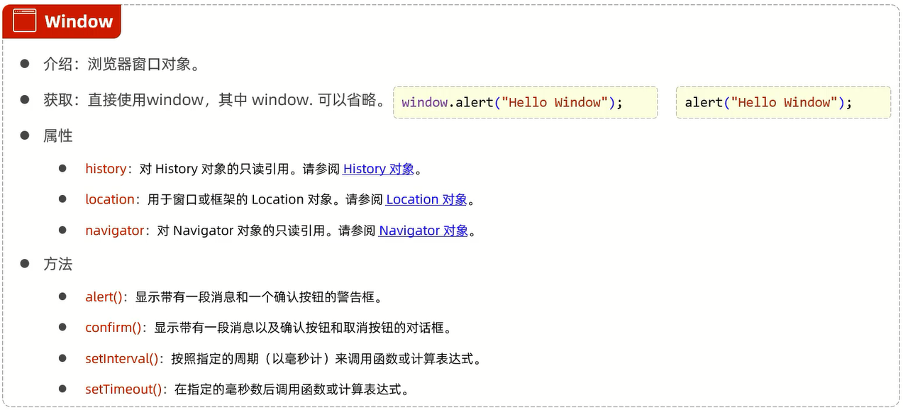

范例:

```js
// 提示框
window.alert("hello");

// 简化
alert("world");

// 对话框--返回值:确认(true)/取消(false)
var flag = confirm("你确定吗?");

// 定时器--延迟指定时间执行1次
setTimeout(function () {
    alert("定时器1执行")
}, 2000);

// 定时器--周期性(毫秒)的执行某一个函数
var i = 0;
setInterval(function () {
    i++;
    console.log("定时器2执行了" + i + "次");
}, 1000);
```

### Location

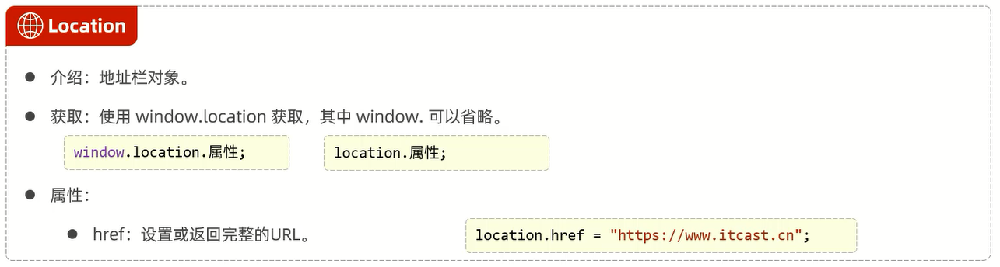

范例:

```js
// 获取地址栏的url信息
alert(location.href);

// 设置url
location.href = "https://www.bilibili.com/";
```

## DOM

### 概念

概念:Document Object Model,文档对象模型

将标记语言的各个组成部分封装为对应的对象:
- Document:整个文档对象
- Element:元素对象
- Attribute:属性对象
- Text:文本对象
- Comment:注释对象

范例:

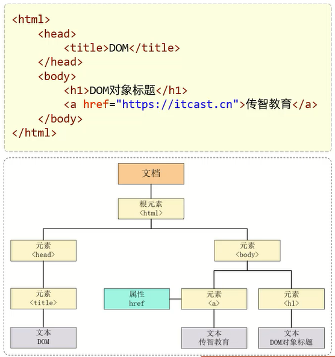

### 作用

JavaScript通过DOM,就能对HTML进行操作:
- 改变HTML元素的内容
- 改变HTML元素的样式(CSS)
- 对HTML DOM事件做出反应
- 添加和删除HTML元素

### 组成

DOM是W3C(万维网联盟)的标准,定义了访问HTML和XML文档的标准,分为3个不同的部分:

Core DOM - 所有文档类型的标准模型
- Document:整个文档对象
- Element:元素对象
- Attribute:属性对象
- Text:文本对象
- Comment:注释对象

XML DOM - XML文档的标准模型

HTML DOM - HTML文档的标准模型
- `Image:`
- `Button:<input type="button">`

### 获取元素对象

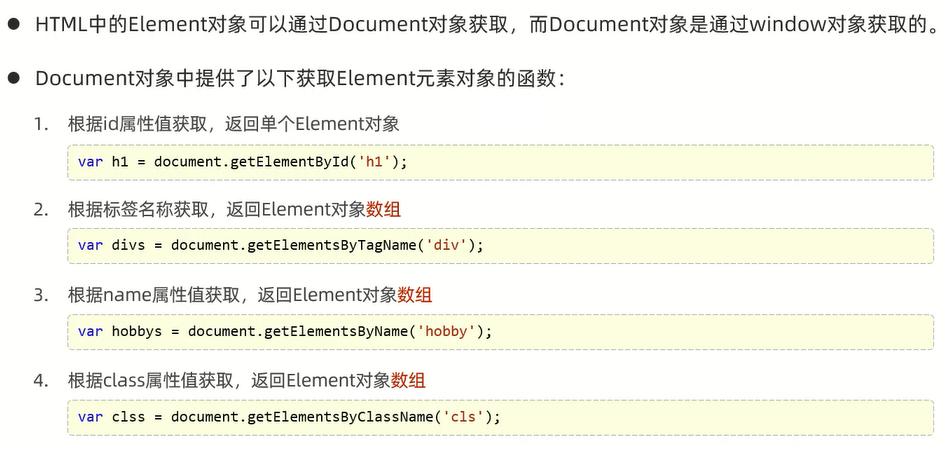

范例:

```html
<!DOCTYPE html>
<html lang="en">

<head>
    <meta charset="UTF-8">
    <meta name="viewport" content="width=device-width, initial-scale=1.0">
    <title>JavaScript</title>
</head>

<body>
     <br>

    <div class="cls">电灯</div>
    <div class="cls">爱好</div>

    <input type="checkbox" name="hobby"> 电影
    <input type="checkbox" name="hobby"> 旅游
    <input type="checkbox" name="hobby"> 游戏
</body>

<script>
    // 获取Element元素

    // 根据id
    var img = document.getElementById("h1");
    alert(img);

    // 根据标签
    var divArr = document.getElementsByTagName("div");
    for (let i = 0; i < divArr.length; i++) {
        alert(divArr[i]);
    }

    // 根据name属性
    var inArr = document.getElementsByName("hobby");
    for (let i = 0; i < inArr.length; i++) {
        alert(inArr[i]);
    }

    // 根据class属性
    var classArr = document.getElementsByClassName("cls");
    for (let i = 0; i < classArr.length; i++) {
        alert(classArr[i]);
    }
</script>

</html>
```

练习:

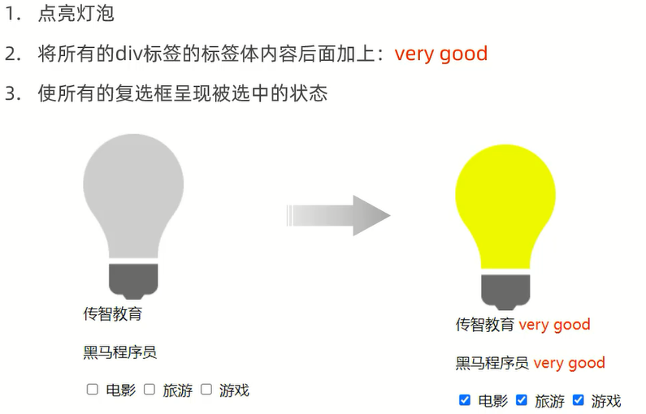

```html
<!DOCTYPE html>
<html lang="en">

<head>
    <meta charset="UTF-8">
    <meta name="viewport" content="width=device-width, initial-scale=1.0">
    <title>JavaScript</title>
</head>

<body>
     <br>

    <div class="cls">电灯</div>
    <div class="cls">爱好</div>

    <input type="checkbox" name="hobby"> 电影
    <input type="checkbox" name="hobby"> 旅游
    <input type="checkbox" name="hobby"> 游戏
</body>

<script>
    // 点亮灯泡
    var img = document.getElementById("h1");
    img.src = "img/on.gif";

    // div标签后面加上very good
    var divArr = document.getElementsByTagName("div");
    for (let i = 0; i < divArr.length; i++) {
        divArr[i].innerHTML += "<font color='red'>very good</font>";
    }

    // 使所有复选框呈现选中状态
    var inputArr = document.getElementsByName("hobby");
    for (let i = 0; i < inputArr.length; i++) {
        inputArr[i].checked = true;
    }
</script>

</html>
```

# 事件监听

事件:HTML事件是发生在HTML元素上的"事情",比如按钮被点击、鼠标移动到元素上、按下键盘按键

事件监听:JavaScript可以在事件被侦测到时执行代码

## 事件绑定

1. 通过HTML标签中的事件属性进行绑定
2. 通过DOM元素属性绑定

范例:

```html
<!DOCTYPE html>
<html lang="en">

<head>
    <meta charset="UTF-8">
    <meta name="viewport" content="width=device-width, initial-scale=1.0">
    <title>JavaScript</title>
</head>

<body>
     <br>

    <!--通过HTML标签中的事件属性进行绑定-->
    <input type="button" onclick="on()" value="开灯1">
    <input type="button" onclick="off()" value="关灯2">
    <br> <br>

    <!--通过DOM元素属性绑定-->
    <input type="button" id="on" value="开灯2">
    <input type="button" id="off" value="关灯2">
</body>

<script>
    function on() {
        var img = document.getElementById("h1");
        img.src = "img/on.gif";
    }
    function off() {
        var img = document.getElementById("h1");
        img.src = "img/off.gif";
    }
    document.getElementById("on").onclick = function () {
        var img = document.getElementById("h1");
        img.src = "img/on.gif";
    }
    document.getElementById("off").onclick = function () {
        var img = document.getElementById("h1");
        img.src = "img/off.gif";
    }
</script>

</html>
```

## 常见事件

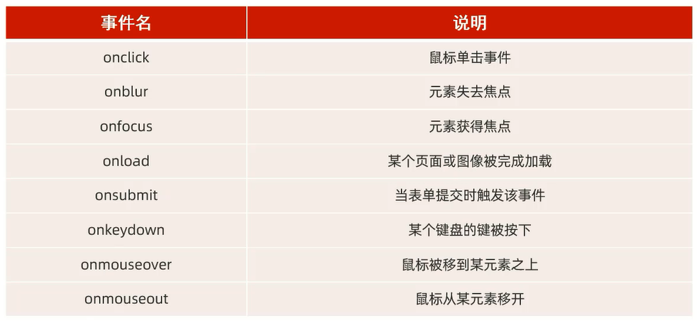

范例:

```html
<!DOCTYPE html>
<html lang="en">

<head>
    <meta charset="UTF-8">
    <meta http-equiv="X-UA-Compatible" content="IE=edge">
    <meta name="viewport" content="width=device-width, initial-scale=1.0">
    <title>JS-事件-常见事件</title>
</head>

<body onload="load()">

    <form action="" style="text-align: center;" onsubmit="subFn()">
        <input type="text" name="username" onblur="bfn()" onfocus="ffn()" onkeydown="kfn()">

        <input id="b1" type="submit" value="提交">

        <input id="b1" type="button" value="单击事件" onclick="fn1()">
    </form>

    <br><br><br>

    <table width="800px" border="1" cellspacing="0" align="center" onmouseover="over()" onmouseout="out()">
        <tr>
            <th>学号</th>
            <th>姓名</th>
            <th>分数</th>
            <th>评语</th>
        </tr>
        <tr align="center">
            <td>001</td>
            <td>张三</td>
            <td>90</td>
            <td>很优秀</td>
        </tr>
        <tr align="center">
            <td>002</td>
            <td>李四</td>
            <td>92</td>
            <td>优秀</td>
        </tr>
    </table>

</body>

<script>
    // onload:页面/元素加载完成后触发
    function load() {
        console.log("页面加载完成...")
    }

    // onclick:鼠标点击事件
    function fn1() {
        console.log("我被点击了...");
    }

    // onblur:失去焦点事件
    function bfn() {
        console.log("失去焦点...");
    }

    // onfocus:元素获得焦点
    function ffn() {
        console.log("获得焦点...");
    }

    // onkeydown:某个键盘的键被按下
    function kfn() {
        console.log("键盘被按下了...");
    }

    // onmouseover:鼠标移动到元素之上
    function over() {
        console.log("鼠标移入了...")
    }

    // onmouseout:鼠标移出某元素
    function out() {
        console.log("鼠标移出了...")
    }

    // onsubmit:提交表单事件
    function subFn() {
        alert("表单被提交了...");
    }

</script>

</html>
```

## 范例

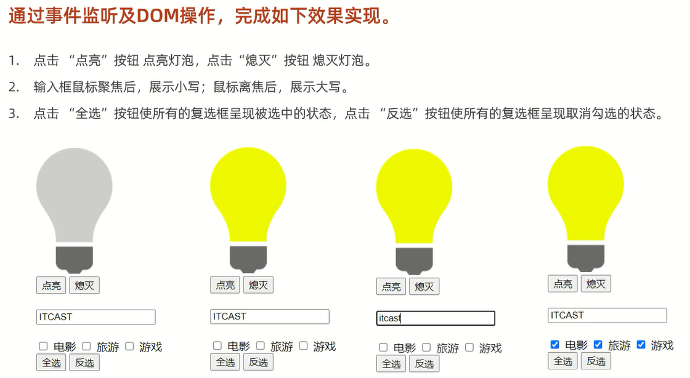

```html
<!DOCTYPE html>
<html lang="en">

<head>
    <meta charset="UTF-8">
    <meta http-equiv="X-UA-Compatible" content="IE=edge">
    <meta name="viewport" content="width=device-width, initial-scale=1.0">
    <title>事件案例</title>
</head>

<body>
     <br>
    <input type="button" value="点亮" onclick="on()">
    <input type="button" value="熄灭" onclick="off()">
    <br><br>
    <input type="text" id="name" onfocus="lower()" onblur="upper()">
    <br><br>
    <input type="checkbox" name="hobby"> 电影
    <input type="checkbox" name="hobby"> 旅游
    <input type="checkbox" name="hobby"> 游戏
    <br><br>
    <input type="button" value="全选" onclick="checkAll()">
    <input type="button" value="反选" onclick="reverse()">
</body>

<script>
    function on() {
        var img = document.getElementById("light");
        img.src = "img/on.gif";
    }

    function off() {
        var img = document.getElementById("light");
        img.src = "img/off.gif";
    }

    function lower() {
        var input = document.getElementById("name");
        input.value = input.value.toLowerCase();
    }

    function upper() {
        var input = document.getElementById("name");
        input.value = input.value.toUpperCase();
    }

    function checkAll() {
        var hobbyArr = document.getElementsByName("hobby");
        for (let i = 0; i < hobbyArr.length; i++) {
            const element = hobbyArr[i];
            element.checked = true;
        }
    }

    function reverse() {
        var hobbyArr = document.getElementsByName("hobby");
        for (let i = 0; i < hobbyArr.length; i++) {
            const element = hobbyArr[i];
            element.checked = false;
        }
    }
</script>

</html>
```