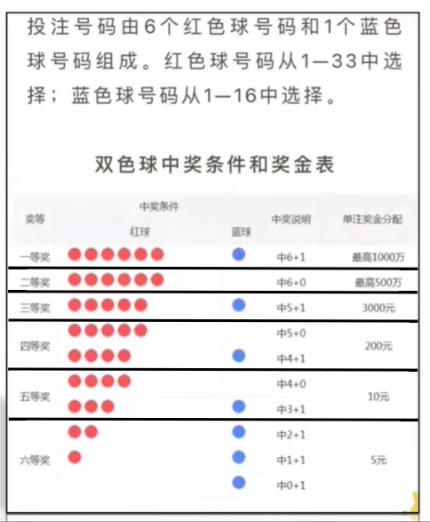

## 卖飞机票

机票的价格按照淡季旺季、头等舱和经济舱收费    
旺季(5月-10月): 头等舱9折,经济舱8.5折   
淡季(11月-来年4月): 头等舱7折,经济舱6.5折     
录入机票原价,月份和头等舱或经济舱,显示支付的价格    

```java
import java.util.Scanner;

public class test {
    public static void main(String[] args) {
        Scanner sc = new Scanner(System.in);
        System.out.println("请输入机票原价: ");
        double oldPrice = sc.nextDouble();
        System.out.println("请输入出行的月份(1~12): ");
        int month = sc.nextInt();
        //验证输入月份的合法性
        int season;
        int error_1 = 0;
        while (true) {
            error_1 = getSeason(month);
            if (error_1 != 2) {
                break;
            }
            System.out.println("请重新输入出行的月份(1~12): ");
            month = sc.nextInt();
        }
        //判断淡季/旺季
        season = getSeason(month);
        System.out.println("头等舱(0),经济舱(1),请输入您的舱位: ");
        int choose = sc.nextInt();
        //验证选择淡季/旺季的合法性
        double newPrice;
        double error_2 = 0.0;
        while (true) {
            error_2 = getMoney(choose, season, oldPrice);
            if (error_2 != 0.1) {
                break;
            }
            System.out.println("头等舱(0),经济舱(1),请重新输入您的舱位: ");
            choose = sc.nextInt();
        }
        //计算出对应季对应舱的实际价格
        newPrice = getMoney(choose, season, oldPrice);
        System.out.println("您需要支付的实际价格为: " + newPrice);
    }

    public static int getSeason(int month) {
        int season;
        int error_1 = 2;
        if (month >= 5 && month <= 10) {
            //旺季season=0
            season = 0;
        } else if ((month >= 1 && month <= 4) || (month >= 11 && month <= 12)) {
            //淡季season=1
            season = 1;
        } else {
            System.out.print("输入不合法!");
            //输入不合法
            return error_1;
        }
        return season;
    }

    public static double getMoney(int choose, int season, double oldPrice) {
        double newPrice;
        double error_2 = 0.1;
        if (season == 1 && choose == 0) {
            //旺季头等舱
            newPrice = 0.9 * oldPrice;
        } else if (season == 1 && choose == 1) {
            //旺季经济舱
            newPrice = 0.85 * oldPrice;
        } else if (season == 2 && choose == 0) {
            //淡季头等舱
            newPrice = 0.7 * oldPrice;
        } else if (season == 2 && choose == 1) {
            //淡季经济舱
            newPrice = 0.65 * oldPrice;
        } else {
            System.out.print("输入不合法!");
            //输入不合法
            return error_2;
        }
        return newPrice;
    }
}
```

## 找质数

质数又称素数,质数是一个大于1的自然数   
除了1和它自身外，不能被其他自然数整除的数叫做质数    
判断101~200之间有多少个素数,并输出所有的素数    

```java
public class test {
    public static void main(String[] args) {
        int[] arr = new int[100];
        //模拟索引
        int an = 0;
        //计数器
        int count = 0;
        //遍历101~200,依次得到该范围内的每一个数number
        for (int number = 101; number <= 200; number++) {
            //假设number一开始就是素数
            boolean flag = true;
            //判断当前number是否是一个素数
            for (int i = 2; i < number; i++) {
                if (number % i == 0) {
                    flag = false;
                    //跳出单层循环,即内循环
                    break;
                }
            }
            if (flag) {
                //将所有素数存入数组
                arr[an] = number;
                an++;
                count++;
            }
        }
        System.out.println("101~200中一共有" + count + "个素数,分别为: ");
        for (int i = 0; i < count; i++) {
            System.out.print(arr[i] + " ");
        }
    }
}
```

## 开发验证码

定义方法实现随机产生一个5位的验证码   

验证码格式:    
1. 长度为5   
2. 前4位是大写字母或者小写字母    
3. 最后1位是数字   

```java
import java.util.Random;

public class test {
    public static void main(String[] args) {
        Random ra = new Random();
        //前4位的字母,A~z随机生成
        for (int i = 0; i < 4; i++) {
            //随机取大写字母65~90
            int A_number = ra.nextInt(25) + 65;
            //随机取小写字母97~122
            int a_number = ra.nextInt(25) + 97;
            System.out.print(getTemp(A_number,a_number));
        }
        //最后1位的数字,0~9随机生成
        int number = ra.nextInt(10);
        System.out.print(number);
    }

    public static char getTemp(int A, int a) {
        Random ra = new Random();
        char temp;
        //随机选择字母大/小写
        int x = ra.nextInt(2);
        if (x == 0) {
            temp = (char) A;
        } else {
            temp = (char) a;
        }
        return temp;
    }
}
```

```java
import java.util.Random;

public class test {
    public static void main(String[] args) {
        char[] arr = new char[52];
        //65~90大写字母存入数组
        for (int i = 0, n1 = 65; i < 26; i++, n1++) {
            arr[i] = (char) n1;
        }
        //97~122小写字母存入数组
        for (int i = 26, n2 = 97; i < 52; i++, n2++) {
            arr[i] = (char) n2;
        }
        //前4位随机抽取大小写字母
        Random ra = new Random();
        for (int i = 0; i < 4; i++) {
            int radius = ra.nextInt(arr.length);
            System.out.print(arr[radius]);
        }
        //最后1位随机抽取数字0~9
        int number = ra.nextInt(10);
        System.out.print(number);
    }
}
```

```java
import java.util.Random;

public class test {
    public static void main(String[] args) {
        char[] arr = new char[52];
        for (int i = 0; i < arr.length; i++) {
            if (i < 26) {
                //65~90大写字母存入数组
                arr[i] = (char) ('A' + i);
            } else {
                //97~122小写字母存入数组
                arr[i] = (char) ('a' + i - 26);
            }
        }
        //前4位随机抽取大小写字母
        Random ra = new Random();
        //链接字符
        String result = "";
        for (int i = 0; i < 4; i++) {
            int radius = ra.nextInt(arr.length);
            result += arr[radius];
        }
        //最后1位随机抽取数字0~9
        int number = ra.nextInt(10);
        System.out.print(result + number);
    }
}
```

## 数组元素的复制

```java
public class test {
    public static void main(String[] args) {
        int[] oldArr = {1, 2, 3, 4, 5, 46, 678, 3457, 998};
        System.out.print("原先数组: ");
        for (int i = 0; i < oldArr.length; i++) {
            System.out.print(oldArr[i] + " ");
        }
        int[] newArr = new int[oldArr.length];
        for (int i = 0; i < oldArr.length; i++) {
            newArr[i] = oldArr[i];
        }
        System.out.print("\n新的数组: ");
        for (int i = 0; i < newArr.length; i++) {
            System.out.print(newArr[i] + " ");
        }
    }
}
```

## 评委打分

在歌唱比赛当中,有6名评委给选手打分,分数范围是0-100之间的整数        
选手最后的得分为: 去掉最高分、最低分后的4个评委的平均分     
完成上述过程并计算出选手的得分   

```java
import java.util.Scanner;

public class test {
    public static void main(String[] args) {
        int[] scoreArr = getScore();
        int sum = getSum(scoreArr);
        int min = minScore(scoreArr);
        int max = maxScore(scoreArr);
        double lastScore = (double) (sum - min - max) / (scoreArr.length - 2);
        System.out.println("选手的得分为: " + lastScore);
    }
    // 获取所有评委分数存储到数组中
    public static int[] getScore() {
        Scanner sc = new Scanner(System.in);
        int[] score = new int[6];
        //将条件控制语句`i++`移动到判断语句中
        for (int i = 0; i < score.length; ) {
            System.out.println("请输入第" + (i + 1) + "位评委打的分数: ");
            int putIn = sc.nextInt();
            if (putIn >= 0 && putIn <= 100) {
                score[i] = putIn;
                i++;
            } else {
                System.out.println("输入不合法!");
            }
        }
        return score;
    }
    //获取数组中的最大值
    public static int maxScore(int[] score) {
        int max = score[0];
        for (int i = 1; i < score.length; i++) {
            if (max <= score[i]) {
                max = score[i];
            }
        }
        return max;
    }
    //获取数组中的最小值
    public static int minScore(int[] score) {
        int min = score[0];
        for (int i = 1; i < score.length; i++) {
            if (min >= score[i]) {
                min = score[i];
            }
        }
        return min;
    }
    //数组求和
    public static int getSum(int[] score) {
        int sum = 0;
        for (int i = 0; i < score.length; i++) {
            sum += score[i];
        }
        return sum;
    }
}
```

## 数字加密

某系统的数字密码(大于0),比如1983,采用加密方式进行传输      
规则: 先得到每位数,然后每位数都加上5,再对10求余,最后将所有数字反转,得到串新数     

```java
public class test {
    public static void main(String[] args) {
        int[] arr = {1,9,8,3};
        //数组的每一位+5
        for (int i = 0; i < arr.length; i++) {
            arr[i] += 5;
        }
        //数组的每一位%10
        for (int i = 0; i < arr.length; i++) {
            arr[i] %= 10;
        }
        //数组反转
        for (int i = 0, j = arr.length - 1; i < j; i++, j--) {
            int temp = arr[i];
            arr[i] = arr[j];
            arr[j] = temp;
        }
        System.out.print("加密后: ");
        //拼接数组的每一位,组成加密后的密码
        int result = 0;
        for (int i = 0; i < arr.length; i++) {
            result = result * 10 + arr[i];
        }
        System.out.println(result);
    }
}
```

```java
import java.util.Scanner;

public class test {
    public static void main(String[] args) {
        Scanner sc = new Scanner(System.in);
        System.out.print("请输入4位数密码: ");
        int oldPwd = sc.nextInt();
        int[] arr = new int[4];
        //将反转后的密码的每一位存入数组中
        for (int i = 0; i < arr.length; i++) {
            int number = oldPwd % 10;
            oldPwd /= 10;
            arr[i] = number;
        }
        //数组的每一位+5
        for (int i = 0; i < arr.length; i++) {
            arr[i] += 5;
        }
        //数组的每一位%10
        for (int i = 0; i < arr.length; i++) {
            arr[i] %= 10;
        }
        System.out.print("加密后: ");
        for (int i = 0; i < arr.length; i++) {
            System.out.print(arr[i]);
        }
    }
}
```

```java
import java.util.Scanner;

public class test {
    public static void main(String[] args) {
        Scanner sc = new Scanner(System.in);
        System.out.print("请输入密码: ");
        int pwd = sc.nextInt();
        //定义一个变量临时记录密码的值
        int oldPwd = pwd;
        //验证密码的合法性
        int pwdLength = 0;
        if(pwd > 0) {
            //判断出密码的长度
            while (pwd != 0) {
                pwd /= 10;
                pwdLength++;
            }
        }else {
            System.out.println("输入不合法!");
        }
        //创建数组存储密码
        int[] arr = new int[pwdLength];
        //密码的每一位存入数组中
        //模拟索引
        int index = arr.length-1;
        while(oldPwd != 0){
            int number = oldPwd % 10;
            oldPwd /= 10;
            arr[index] = number;
            index --;
        }
        //数组的每一位+5
        for (int i = 0; i < arr.length; i++) {
            arr[i] += 5;
        }
        //数组的每一位%10
        for (int i = 0; i < arr.length; i++) {
            arr[i] %= 10;
        }
        //数组反转
        for (int i = 0, j = arr.length - 1; i < j; i++, j--) {
            int temp = arr[i];
            arr[i] = arr[j];
            arr[j] = temp;
        }
        System.out.print("加密后: ");
        for (int i = 0; i < arr.length; i++) {
            System.out.print(arr[i]);
        }
    }
}
```

## 数字解密

某系统的数字密码(大于0),比如1983,采用加密方式进行传输    
规则: 先得到每位数,然后每位数都加上5,再对10求余,最后将所有数字反转,得到串新数    
请根据数字加密的规则,解密密码    

```java
import java.util.Scanner;

public class test {
    public static void main(String[] args) {
        Scanner sc = new Scanner(System.in);
        System.out.print("请输入加密后的数据: ");
        int pwd = sc.nextInt();
        //定义一个临时变量存储加密后的数据
        int newPwd = pwd;
        //计算出存储该数据的数组长度
        int pwdLength = 0;
        while (pwd != 0) {
            pwd /= 10;
            pwdLength++;
        }
        //创建数组存储加密后的数据
        int[] pwdArr = new int[pwdLength];
        //模拟索引
        int index = pwdArr.length - 1;
        while (newPwd != 0) {
            int number = newPwd % 10;
            newPwd /= 10;
            pwdArr[index] = number;
            index--;
        }
        //数组反转
        for (int i = 0, j = pwdLength - 1; i < j; i++, j--) {
            int temp = pwdArr[i];
            pwdArr[i] = pwdArr[j];
            pwdArr[j] = temp;
        }
        //数组的每一位是对10求余得到的,需要还原
        //分析: 0~9加5后对应5~14,5~9对10求余得5~9,10~14对10求余得0~4
        for (int i = 0; i < pwdArr.length; i++) {
            if (pwdArr[i] >= 0 && pwdArr[i] <= 4) {
                pwdArr[i] += 10;
            }
        }
        //数组中的每一位是加5得到的,需要还原
        for (int i = 0; i < pwdArr.length; i++) {
            pwdArr[i] -= 5;
        }
        System.out.print("原密码为: ");
        for (int i = 0; i < pwdArr.length; i++) {
            System.out.print(pwdArr[i]);
        }
    }
}
```

## 抢红包

直播抽奖,分别有2,588,888,1000,10000五个奖金,请使用代码模拟抽奖   
打印出每个奖项,奖项的出现顺序要随机且不重复   

打印效果如下(随机顺序,不一定是下面的顺序):    
- 888元的奖金被抽出   
- 2元的奖金被抽出   
- 588元的奖金被抽出      
- 10000元的奖金被抽出   
- 1000元的奖金被抽出    

```java
import java.util.Random;

public class test {
    public static void main(String[] args) {
        Random ra = new Random();
        int[] awardArr = {2, 588, 888, 1000, 10000};
        //使数组元素随机交换位置
        for (int i = 0; i < 5; i++) {
            int temp = awardArr[i];
            int j = ra.nextInt(awardArr.length);
            awardArr[i] = awardArr[j];
            awardArr[j] = temp;
        }
        for (int i = 0; i < awardArr.length; i++) {
            System.out.println(awardArr[i] + "元的奖金被抽出");
        }
    }
}
```

```java
import java.util.Random;

public class test {
    public static void main(String[] args) {
        int[] oldArr = {2, 588, 888, 1000, 10000};
        //定义新数组用于存储抽奖结果
        int[] newArr = new int[oldArr.length];
        Random ra = new Random();
        for (int i = 0; i < newArr.length; ) {
            //获取随机索引
            int index = ra.nextInt(oldArr.length);
            //获取奖项
            int prize = oldArr[index];
            //判断奖项是否存在于新数组中,如果存在则重新抽取;如果不存在,就把奖项存入新数组
            boolean flag = judge(newArr, oldArr[index]);
            if (!flag) {
                newArr[i] = prize;
                System.out.print(prize + "元的奖金被抽出\n");
                i++;
            }
        }
    }
    //判断奖项是否已经存在于新数组中,如果存在就返回true;如果不存在就返回false
    public static boolean judge(int[] newArr, int prize) {
        for (int i = 0; i < newArr.length; i++) {
            if (newArr[i] == prize) {
                return true;
            }
        }
        return false;
    }
}
```

## 模拟双色球



```java
import java.util.Random;
import java.util.Scanner;

public class test {
    public static void main(String[] args) {
        //获取红色球中奖号码
        int[] getRed_Number = getRed_prizeArr();
        //获取蓝色球中奖号码
        int[] getBlue_Number = getBlue_prizeArr();
        //获取输入的双色球号码(6个红色球号码+1个蓝色球号码)
        int[] putIn_Number = putIn();
        //打印投注的双色球号码
        System.out.println("您投注的双色球为: ");
        for (int i = 0; i < putIn_Number.length; i++) {
            System.out.print(putIn_Number[i] + " ");
        }
        //打印中奖的双色球号码
        int[] prizeNumber = sum(getRed_Number, getBlue_Number);
        System.out.println("\n中奖双色球为: ");
        for (int i = 0; i < prizeNumber.length; i++) {
            System.out.print(prizeNumber[i] + " ");
        }
        //红色球中奖数量
        int redCount = redRight(putIn_Number, getRed_Number);
        //蓝色球中奖数量
        int blueCount = blueRight(putIn_Number, prizeNumber);
        //打印结果
        int result = condition(redCount, blueCount);
        if (result != 0) {
            System.out.println("\n恭喜你!获得" + result + "等奖!");
        } else {
            System.out.println("\n很遗憾,没中奖!");
        }
    }

    //返回红色球中奖数量
    public static int redRight(int[] putIn, int[] prize) {
        int count = 0;
        for (int i = 0; i < putIn.length - 1; i++) {
            boolean flag = flag(prize, putIn[i]);
            if (flag) {
                count++;
            }
        }
        return count;
    }

    //返回蓝色球中奖数量
    public static int blueRight(int[] putIn, int[] prize) {
        int count = 0;
        boolean flag = prize[prize.length - 1] == putIn[putIn.length - 1];
        if (flag) {
            count++;
        }
        return count;
    }

    //根据红色球和蓝色球数量对应的中奖条件,返回几等奖
    public static int condition(int redCount, int blueCount) {
        int prize = 0;
        if (redCount >= 0 && redCount <= 2 && blueCount == 1) {
            prize = 6;
        } else if ((redCount == 3 && blueCount == 1) || (redCount == 4 && blueCount == 0)) {
            prize = 5;
        } else if ((redCount == 4 && blueCount == 1) || (redCount == 5 && blueCount == 0)) {
            prize = 4;
        } else if (redCount == 5 && blueCount == 1) {
            prize = 3;
        } else if (redCount == 6 && blueCount == 0) {
            prize = 2;
        } else if (redCount == 6 && blueCount == 1) {
            prize = 1;
        }
        return prize;
    }

    //判断数字是否存在于数组中,如果存在,返回true;如果不存在,返回false
    public static boolean flag(int[] arr, int number) {
        for (int i = 0; i < arr.length; i++) {
            if (arr[i] == number) {
                return true;
            }
        }
        return false;
    }

    //获取输入的双色球号码: 6个红色球号码+1个蓝色球号码,存入数组中并返回
    public static int[] putIn() {
        //创建两个数组分别存储6个红色球号码和1个蓝色球号码
        int[] myRed = new int[6];
        int[] myBlue = new int[1];
        Scanner sc = new Scanner(System.in);
        System.out.println("红色球号码选择范围: 1~33 蓝色球号码选择范围: 1~16\n请从号码范围中选择输入且不要重复输入相同的号码!");
        //获取输入的6个红色球号码
        for (int i = 0; i < myRed.length; ) {
            System.out.println("请输入第" + (i + 1) + "个红色球号码: ");
            //验证红色球号码合法性
            int red = sc.nextInt();
            //1.确保红色球号码在范围1~33之间
            //2.确保不重复输入相同的号码
            if (red >= 1 && red <= 33 && !flag(myRed, red)) {
                myRed[i] = red;
                i++;
            } else {
                System.out.println("输入不合法!");
            }
        }
        //获取输入的1个蓝色球号码
        for (int i = 0; i < myBlue.length; ) {
            System.out.println("请输入1个蓝色球号码: ");
            //验证蓝色球号码合法性
            int blue = sc.nextInt();
            if (blue >= 1 && blue <= 16) {
                myBlue[i] = blue;
                i++;
            } else {
                System.out.println("输入不合法!");
            }
        }
        return sum(myRed, myBlue);
    }

    //6个红色球号码+1个蓝色球号码,合并成一个数组并返回
    public static int[] sum(int[] red, int[] blue) {
        int[] myChoose = new int[7];
        //将6个红色球号码存入索引0~5,将1个蓝色球号码存入索引6
        for (int i = 0; i < myChoose.length; i++) {
            if (i < 6) {
                myChoose[i] = red[i];
            } else {
                myChoose[i] = blue[0];
            }
        }
        return myChoose;
    }

    //获取随机的1个蓝色球中奖号码,写入数组中并返回
    public static int[] getBlue_prizeArr() {
        Random ra = new Random();
        int[] Blue_prize = new int[1];
        //从1~17中随机选择一个数字填入数组
        Blue_prize[0] = ra.nextInt(16) + 1;
        return Blue_prize;
    }

    //获取随机的6个红色球中奖号码,写入数组中并返回
    public static int[] getRed_prizeArr() {
        //将1~33写入红色球数组
        int[] redArr = new int[33];
        int number = 1;
        for (int i = 0; i < redArr.length; i++) {
            redArr[i] = number;
            number++;
        }
        //将红色球数组内的元素位置随机打乱
        int[] confusion = confusion(redArr);
        //将(已经随机打乱元素位置的)红色球数组的前6位元素复制到新数组中
        //即将前6位红色球中奖号码复制到新数组中
        int[] Red_prize = new int[6];
        for (int i = 0; i < 6; i++) {
            Red_prize[i] = confusion[i];
        }
        return Red_prize;
    }

    //打乱数组元素位置后返回该数组
    public static int[] confusion(int[] arr) {
        Random ra = new Random();
        for (int i = 0; i < arr.length; i++) {
            int j = ra.nextInt(arr.length);
            int temp = arr[i];
            arr[i] = arr[j];
            arr[j] = temp;
        }
        return arr;
    }
}
```