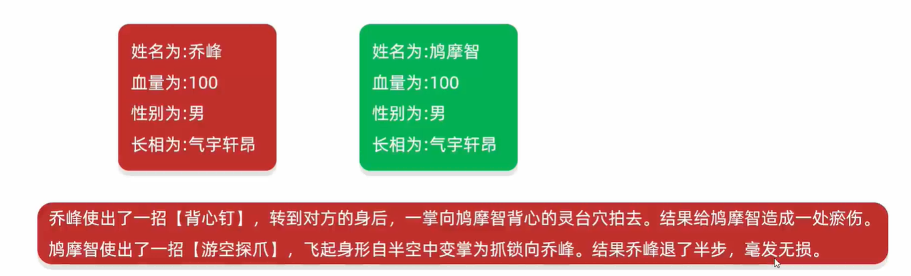
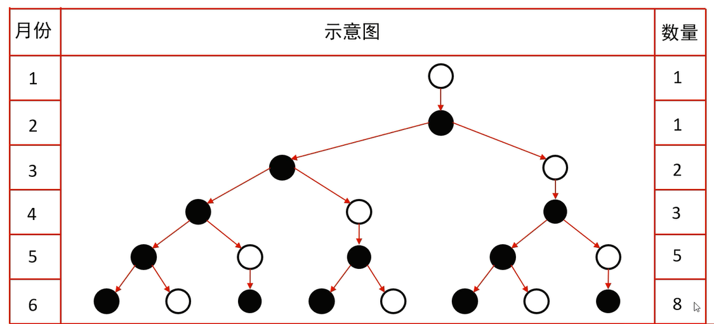
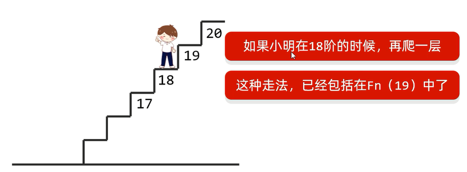

## 回文数

回文数是指正序(从左向右)和倒序(从右向左)读都是一样的整数    
输入一个整数,如果是回文数,打印`true`;否则,打印`false`     

```java
import java.util.Scanner;

public class test {
    public static void main(String[] args) {
        Scanner sc = new Scanner(System.in);
        System.out.println("请输入一个整数: ");
        int x = sc.nextInt();
        //定义一个临时变量来记录x的值,用于最后进行比较
        int temp = x;
        int y = 0;
        while(x != 0){
            //取x的个位上的数字
            int position = x % 10;
            //再将x的个位数删除,即循环实现取得x每个位置上的数字
            x = x / 10;
            //将每个位置上的数字倒序拼接给y,y即x的倒序数
            y = y * 10 + position;
        }
        //判断x与其倒序数是否一致,即判断回文数
        System.out.println(temp == y);
    }
}
```

## 求质数
 
质数又称素数,质数是一个大于1的自然数    
除了1和它自身外，不能被其他自然数整除的数叫做质数   
录入一个正整数x,判断该整数是否为一个质数   

1. 方法一       
循环遍历所有情况   

```java
import java.util.Scanner; 

public class test {
    public static void main(String[] args) {
        Scanner sc = new Scanner(System.in); 
        System.out.println("请输入一个正整数: "); 
        int x = sc.nextInt(); 
        if (x > 0) {
            //假设x一开始就是个质数
            boolean flag = true; 
            //看2~(x-1)之间有无数字i可以被x整除
            for (int i = 2;  i <= (x-1);  i++) {
                if (x % i == 0) {
                    //有数字能被整除,则x不是质数
                    flag = false; 
                }
            }
            if (flag) {
                System.out.println(x + "是一个质数"); 
            } else {
                System.out.println(x + "不是一个质数"); 
            }
        } else {
            System.out.println("输入不合法!"); 
        }
    }
}
```

2. 方法二    
当一个数第一次被比自己小的数（不包含1）整除成功后，就可以立刻判断出这个数不是质数   
即使用`break`跳出循环   

```java
import java.util.Scanner; 

public class test {
    public static void main(String[] args) {
        Scanner sc = new Scanner(System.in); 
        System.out.println("请输入一个正整数: "); 
        int x = sc.nextInt(); 
        if (x > 0) {
            //假设x一开始就是个质数
            boolean flag = true; 
            //看2~(x-1)之间有无数字i可以被x整除
            for (int i = 2;  i <= (x-1);  i++) {
                if (x % i == 0) {
                    //有数字能被整除,则x不是质数
                    flag = false; 
                    //x不是质数,break跳出循环
                    break; 
                }
            }
            if (flag) {
                System.out.println(x + "是一个质数"); 
            } else {
                System.out.println(x + "不是一个质数"); 
            }
        } else {
            System.out.println("输入不合法!"); 
        }
    }
}
```

3. 方法三     
因数都是成对出现的,例如100的因数有：1和100，2和50，4和25，5和20，10和10   
成对的因数，其中一个必然小于等于100的开平方，另一个大于等于100的开平方   
所以,数字x在2~(x的算数平方根)之间的所有数字,都不能被x整除,则x就一定是个质数   

```java
import java.util.Scanner; 

public class test {
    public static void main(String[] args) {
        Scanner sc = new Scanner(System.in); 
        System.out.println("请输入一个正整数: "); 
        int x = sc.nextInt(); 
        if (x > 0) {
            //假设x一开始就是个质数
            boolean flag = true; 
            //看2~(x的算数平方根)之间有无数字i可以被x整除
            for (int i = 2;  i <= Math.sqrt(x);  i++) {
                if (x % i == 0) {
                    //有数字能被整除,则x不是质数
                    flag = false; 
                    //x不是质数,break跳出循环
                    break; 
                }
            }
            if (flag) {
                System.out.println(x + "是一个质数"); 
            } else {
                System.out.println(x + "不是一个质数"); 
            }
        } else {
            System.out.println("输入不合法!"); 
        }
    }
}
```

4. 方法四  
如果x`%`2不等于0,那么x`%`(2的倍数)一定也不为0   
即只需要判断一个数是否能被小于它的质数除尽即可    

## 数组元素依次从大到小打印

在主方法中通过键盘录入三个整数   
定义一个方法,方法接收三个整数变量,在方法中从大到小依次打印三个变量    

```java
import java.util.Scanner;

public class test {
    public static void main(String[] args) {
        Scanner sc = new Scanner(System.in);
        System.out.println("请输入第一个数: ");
        int number1 = sc.nextInt();
        System.out.println("请输入第二个数: ");
        int number2 = sc.nextInt();
        System.out.println("请输入第三个数: ");
        int number3 = sc.nextInt();
        maxToMin(number1, number2, number3);
    }

    public static void maxToMin(int a, int b, int c) {
        //最大值
        int temp1 = a > b ? a :  b;
        int max = temp1 > c ? temp1 :  c;
        //最小值
        int temp2 = a < b ? a :  b;
        int min = temp2 < c ? temp2 :  c;
        //中间值
        int sum = a + b + c;
        int middle = sum - max - min;
        System.out.println("从大到小以此为: " + max + " " + middle + " " + min);
    }
}
```

## 猜数字小游戏

程序自动生成1~100之间的随机数字,用程序实现猜出这个数字是多少

```java
import java.util.Random;
import java.util.Scanner;

public class test {
    public static void main(String[] args) {
        Random r = new Random();
        int number = r.nextInt(100) + 1;
        Scanner sc = new Scanner(System.in);
        int count = 0;
        while (true) {
            System.out.println("请输入你猜的数: ");
            int guess = sc.nextInt();
            if (number > guess) {
                System.out.println("小了!");
                count++;
            } else if (number < guess) {
                System.out.println("大了!");
                count++;
            } else {
                System.out.println("历经" + count + "次,你终于猜对了!");
                break;
            }
        }
    }
}
```

## 交换数据

定义一个数组,存入1,2,3,4,5,按照要求交换索引对应的元素   
交换前: 1,2,3,4,5   
交换后: 5,4,3,2,1   

```java
public class test {
    public static void main(String[] args) {
        int[] arr = {1, 2, 3, 4, 5};
        System.out.println("交换前: ");
        for (int i = 0; i < arr.length; i++) {
            System.out.print(arr[i] + " ");
        }
        System.out.println("\n交换后: ");
        for (int i = 0, j = arr.length - 1; i < j; i++, j--) {
            int temp = arr[i];
            arr[i] = arr[j];
            arr[j] = temp;
        }
        for (int i = 0; i < arr.length; i++) {
            System.out.print(arr[i] + " ");
        }
    }
}
```

## 打乱数据

定义一个数组,存入1~5,要求打乱数组中所有数据的顺序
  
```java
import java.util.Random;

public class test {
    public static void main(String[] args) {
        Random r = new Random();
        int[] arr = {1, 2, 3, 4, 5};
        System.out.println("原数组: ");
        for (int i = 0; i < arr.length; i++) {
            System.out.print(arr[i] + " ");
        }
        int randomIndex = r.nextInt(arr.length);
        //通过随机索引,将数组里的每一个元素和剩下的元素随机交换数据
        for (int i = 0; i < arr.length; i++) {
            int temp = arr[i];
            arr[i] = arr[randomIndex];
            arr[randomIndex] = temp;
        }
        System.out.println("\n随机数组: ");
        for (int i = 0; i < arr.length; i++) {
            System.out.print(arr[i] + " ");
        }
    }
}
```

## 数字加密

某系统的数字密码(大于0),比如1983,采用加密方式进行传输    
规则: 先得到每位数,然后每位数都加上5,再对10求余,最后将所有数字反转,得到串新数    

```java
import java.util.Scanner;

public class test {
    public static void main(String[] args) {
        Scanner sc = new Scanner(System.in);
        System.out.print("请输入密码: ");
        int pwd = sc.nextInt();
        //定义一个变量临时记录密码的值
        int oldPwd = pwd;
        //验证密码的合法性
        int pwdLength = 0;
        if(pwd > 0) {
            //判断出密码的长度
            while (pwd != 0) {
                pwd /= 10;
                pwdLength++;
            }
        }else {
            System.out.println("输入不合法!");
        }
        //创建数组存储密码
        int[] arr = new int[pwdLength];
        //密码的每一位存入数组中
        //模拟索引
        int index = arr.length-1;
        while(oldPwd != 0){
            int number = oldPwd % 10;
            oldPwd /= 10;
            arr[index] = number;
            index --;
        }
        //数组的每一位+5
        for (int i = 0; i < arr.length; i++) {
            arr[i] += 5;
        }
        //数组的每一位%10
        for (int i = 0; i < arr.length; i++) {
            arr[i] %= 10;
        }
        //数组反转
        for (int i = 0, j = arr.length - 1; i < j; i++, j--) {
            int temp = arr[i];
            arr[i] = arr[j];
            arr[j] = temp;
        }
        System.out.print("加密后: ");
        for (int i = 0; i < arr.length; i++) {
            System.out.print(arr[i]);
        }
    }
}
```

## 抢红包

直播抽奖,分别有2,588,888,1000,10000五个奖金,请使用代码模拟抽奖     
打印出每个奖项,奖项的出现顺序要随机且不重复     
 
打印效果如下(随机顺序,不一定是下面的顺序):      
- 888元的奖金被抽出   
- 2元的奖金被抽出   
- 588元的奖金被抽出    
- 10000元的奖金被抽出   
- 1000元的奖金被抽出   

```java
import java.util.Random;

public class test {
    public static void main(String[] args) {
        int[] oldArr = {2, 588, 888, 1000, 10000};
        //定义新数组用于存储抽奖结果
        int[] newArr = new int[oldArr.length];
        Random ra = new Random();
        for (int i = 0; i < newArr.length; ) {
            //获取随机索引
            int index = ra.nextInt(oldArr.length);
            //获取奖项
            int prize = oldArr[index];
            //判断奖项是否存在于新数组中,如果存在则重新抽取;如果不存在,就把奖项存入新数组
            boolean flag = judge(newArr, oldArr[index]);
            if (!flag) {
                newArr[i] = prize;
                System.out.print(prize + "元的奖金被抽出\n");
                i++;
            }
        }
    }
    //判断奖项是否已经存在于新数组中,如果存在就返回true;如果不存在就返回false
    public static boolean judge(int[] newArr, int prize) {
        for (int i = 0; i < newArr.length; i++) {
            if (newArr[i] == prize) {
                return true;
            }
        }
        return false;
    }
}
```

## 文字版格斗游戏



```java
import java.util.Random;

public class role {
    private String name;
    private int blood;
    private String gender;
    private String outlook;
    //长相描述
    String[] boyfaces = {"风流俊雅", "气宇轩昂", "相貌英俊", "五官端正", "相貌平平", "一塌糊涂", "面目狰狞"};
    String[] girlfaces = {"美奂绝伦", "沉鱼落雁", "婷婷玉立", "身材娇好", "相貌平平", "相貌简陋", "惨不忍睹"};
    //攻击描述
    String[] attacks_desc = {
            "%s使出了一招【背心钉】,转到对方的身后,一掌向%s背心的灵台穴拍去,",
            "%s使出了一招【游空探爪】,飞起身形自半空中变掌为抓锁向%s,",
            "%s大喝一声,身形下伏,一招【劈雷坠地】,捶向%s双腿,",
            "%s运气于掌,一瞬间掌心变得血红,一式【掌心雷】,推向%s,",
            "%s阴手翻起阳手跟进,一招【没遮拦】,结结实实的捶向%s,",
            "%s上步抢身,招中套招,一招【劈挂连环】,连环攻向%s,"
    };
    //受伤描述
    String[] injureds_desc = {
            "结果%s退了半步,毫发无损,",
            "结果给%s造成一处瘀伤,",
            "结果一击命中,%s痛得弯下腰,",
            "结果%s痛苦地闷哼了一声,显然受了点内伤,",
            "结果%s摇摇晃晃,一跤摔倒在地,",
            "结果%s脸色一下变得惨白,连退了好几步,",
            "结果『轰』的一声,%s口中鲜血狂喷而出,",
            "结果%s一声惨叫,像滩软泥般塌了下去,"
    };

    public role() {
    }

    public role(String name, int blood, String gender) {
        this.name = name;
        this.blood = blood;
        this.gender = gender;
        setOutlook(gender);
    }

    public String getName() {
        return name;
    }

    public void setName(String name) {
        this.name = name;
    }

    public int getBlood() {
        return blood;
    }

    public void setBlood(int blood) {
        this.blood = blood;
    }

    public String getGender() {
        return gender;
    }

    public void setGender(String gender) {
        this.gender = gender;
    }

    public String getOutlook() {
        return outlook;
    }

    public void setOutlook(String gender) {
        Random random = new Random();
        if (gender == "男") {
            this.outlook = boyfaces[random.nextInt(boyfaces.length)];
        } else if (gender == "女") {
            this.outlook = girlfaces[random.nextInt(girlfaces.length)];
        } else {
            this.outlook = "面目狰狞";
        }
    }

    //定义一个方法用于攻击别人
    public void attack(role role) {
        Random random = new Random();
        //使用随机招式
        String attackMode = attacks_desc[random.nextInt(attacks_desc.length)];
        //造成随机10~29点伤害
        int harm = random.nextInt(20) + 10;
        //剩余血量
        int nowBlood = role.getBlood() - harm;
        //如果剩余血量小于0,则剩余血量赋值为0;否则保持不变
        nowBlood = nowBlood < 0 ? 0 :  nowBlood;
        //修改被攻击者的血量为剩余血量
        role.setBlood(nowBlood);
        System.out.printf(attackMode, this.getName(), role.getName());
        System.out.print("造成了" + harm + "点伤害,");
        String injuredMode = "";
        //根据血量呈现不同的受伤效果
        if (nowBlood >= 90 && nowBlood< 100) {
            injuredMode = injureds_desc[0];
        }else if(nowBlood >= 80 && nowBlood< 90){
            injuredMode = injureds_desc[1];
        }else if(nowBlood >= 70 && nowBlood< 80){
            injuredMode = injureds_desc[2];
        }else if(nowBlood >= 60 && nowBlood< 70){
            injuredMode = injureds_desc[3];
        }else if(nowBlood >= 40 && nowBlood< 60){
            injuredMode = injureds_desc[4];
        }else if(nowBlood >= 20 && nowBlood< 40){
            injuredMode = injureds_desc[5];
        }else if(nowBlood >= 10 && nowBlood< 20) {
            injuredMode = injureds_desc[6];
        }else{
            injuredMode = injureds_desc[7];
        }
        System.out.printf(injuredMode, role.getName());
        System.out.println(role.getName() + "还剩下" + role.getBlood() + "点血量");
    }
}
```

```java
public class playGame {
    public static void main(String[] args) {
        role role1 = new role("乔峰",100,"男");
        role role2 = new role("小龙女",100,"女");
        while(true){
            role1.attack(role2);
            if(role2.getBlood() == 0){
                System.out.println(role1.getOutlook()+"的"+role1.getName() +"K.O了"+role2.getOutlook()+"的"+role2.getName());
                break;
            }
            role2.attack(role1);
            if(role1.getBlood() == 0){
                System.out.println(role2.getOutlook()+"的"+role2.getName() +"K.O了"+role1.getOutlook()+"的"+role1.getName());
                break;
            }
        }
    }
}
```

## 学生信息

定义一个长度为3的数组,数组存储1~3名学生对象作为初始数据,学生对象的学号、姓名各不相同    
学生的属性: 学号、姓名和年龄   
1. 要求1: 再次添加一个学生对象,并在添加的时候进行学号唯一性的判断   
2. 要求2: 添加完毕后,遍历所有学生信息   
3. 要求3: 通过id删除学生信息   
如果存在,则删除;如果不存在,则提示删除失败   
4. 要求4: 删除完毕后,遍历所有学生信息   
5. 要求5: 查询数组id为"002"的学生,如果存在,则将他的年龄+1岁   

```java
public class Student {
    private int id;
    private String name;
    private int age;

    public Student() {
    }

    public Student(int id, String name, int age) {
        this.id = id;
        this.name = name;
        this.age = age;
    }

    public int getId() {
        return id;
    }

    public void setId(int id) {
        this.id = id;
    }

    public String getName() {
        return name;
    }

    public void setName(String name) {
        this.name = name;
    }

    public int getAge() {
        return age;
    }

    public void setAge(int age) {
        this.age = age;
    }
}
```

```java
import java.util.Scanner;

public class StudentTest {
    public static void main(String[] args) {
        Student stu1 = new Student(1433, "张三", 22);
        Student stu2 = new Student(3123, "李四", 21);
        Student[] arr = new Student[3];
        arr[0] = stu1;
        arr[1] = stu2;
        Student stu4 = new Student();
        Scanner sc = new Scanner(System.in);
        showArr(arr);
        //要求1: 添加的时候需要进行学号的唯一性判断
        System.out.println("请输入添加的学生的学号: ");
        int addId = sc.nextInt();
        stu4.setId(addId);
        int index = getIndex(arr, addId);
        if (index >= 0) {
            //学号已存在
            System.out.println("学号已存在,输入不合法!");
        } else {
            //学号不存在
            //判断数组是否还有空间,返回数组的元素个数
            int count = getCount(arr);
            if (count != arr.length) {
                //数组中还有空间
                System.out.println("请输入学生的姓名: ");
                String addName = sc.next();
                stu4.setName(addName);
                System.out.println("请输入学生的年龄: ");
                int addAge = sc.nextInt();
                stu4.setAge(addAge);
                //将添加的学生对象放入空元素的索引位置,即添加到数组中
                arr[count] = stu4;
                //要求2: 添加完毕之后,遍历所有学生信息
                showArr(arr);
                //要求3: 通过id删除学生信息
                Student[] deleteArr = deleteArr(arr);
                //要求4: 删除完毕之后,遍历所有学生信息
                showArr(deleteArr);
                //要求5: id为X的学生,年龄+1岁
                Student[] processArr = processArr(deleteArr);
                showArr(processArr);
            } else {
                //数组中没有空间
                //将数组长度+1,并将原数组元素拷贝到新数组
                Student[] copyLongArr = copyLongArr(arr);
                copyLongArr[copyLongArr.length - 1] = stu4;
                //要求2: 添加完毕之后,遍历所有学生信息
                showArr(copyLongArr);
                //要求3: 通过id删除学生信息
                Student[] deleteArr = deleteArr(copyLongArr);
                //要求4: 删除完毕之后,遍历所有学生信息
                showArr(deleteArr);
                //要求5: id为X的学生,年龄+1岁
                Student[] processArr = processArr(deleteArr);
                showArr(processArr);
            }
        }
    }

    //要求5: id为X的学生,年龄+1岁
    public static Student[] processArr(Student[] arr) {
        Scanner sc = new Scanner(System.in);
        System.out.println("请输入处理的学生的id: ");
        int processId = sc.nextInt();
        int index = getIndex(arr, processId);
        if (index >= 0) {
            //存在处理的学生的id
            //将该id的学生的年龄+1岁
            int oldAge = arr[index].getAge();
            arr[index].setAge(oldAge + 1);
        } else {
            //不存在处理的学生的id
            System.out.println("不存在相同的学生的id,处理失败!");
        }
        return arr;
    }

    //要求3: 通过id删除学生信息,返回数组
    public static Student[] deleteArr(Student[] arr) {
        Scanner sc = new Scanner(System.in);
        System.out.println("请输入删除的学生的id: ");
        int deleteId = sc.nextInt();
        int index = getIndex(arr, deleteId);
        if (index >= 0) {
            //存在删除的学生的id
            //将该id的元素赋值为空
            arr[index] = null;
        } else {
            //不存在删除的学生的id
            System.out.println("不存在相同的学生的id,删除失败!");
        }
        return arr;
    }

    //要求2: 遍历所有学生信息
    public static void showArr(Student[] arr) {
        for (int i = 0; i < arr.length; i++) {
            Student stu = arr[i];
            //遍历并打印出数组中存在的学生对象的所有信息
            if (stu != null) {
                System.out.println(stu.getId() + "," + stu.getName() + "," + stu.getAge());
            }
        }
    }

    //将数组长度+1,并将原数组元素拷贝到新数组
    public static Student[] copyLongArr(Student[] arr) {
        //数组长度+1
        Student[] newArr = new Student[arr.length + 1];
        for (int i = 0; i < arr.length; i++) {
            newArr[i] = arr[i];
        }
        return newArr;
    }


    //判断数组是否还有空间,返回数组元素个数
    public static int getCount(Student[] arr) {
        //计数器
        int count = 0;
        for (int i = 0; i < arr.length; i++) {
            Student stu = arr[i];
            //数组元素不为空,元素数量+1
            if (stu != null) {
                count++;
            }
        }
        //count也表示空元素的索引位置
        return count;
    }

    //判断元素是否存在于数组中: 如果数组中存在该元素,则返回其元素的索引位置;反之,返回索引-1
    public static int getIndex(Student[] arr, int id) {
        //元素索引
        int index = 0;
        for (int i = 0; i < arr.length; i++) {
            Student student = arr[i];
            if (student != null) {
                //判断数组中的每一个学生对象的id是否与输入的学生对象的id一致
                if (student.getId() == id) {
                    //返回有相同id的元素的索引位置
                    return index;
                }
            }
            index++;
        }
        return -1;
    }
}
```

## 金额转换


```java
import java.util.Scanner;

public class test {
    public static void main(String[] args) {
        Scanner sc = new Scanner(System.in);
        int money;
        while (true) {
            System.out.println("请录入一个金额");
            money = sc.nextInt();
            if (money >= 0 && money <= 9999999) {
                break;
            } else {
                System.out.println("金额无效");
            }
        }

        String moneyStr = "";
        while (true) {
            //从右往左获取数据,因为右侧是数据的个位
            int ge = money % 10;
            String capitalNumber = getCapitalNumber(ge);
            //把转换之后的大写拼接到moneyStr当中
            moneyStr = capitalNumber + moneyStr;
            //第一次循环: "伍" + "" = "伍"
            //第二次循环: "叁" + "伍" = "叁伍"
            //去掉刚刚获取的数据
            money = money / 10;
            //如果数字上的每一位全部获取到了,那么money记录的就是0,此时循环结束
            if (money == 0) {
                break;
            }
        }

        //字符串补齐到7位
        int count = 7 - moneyStr.length();
        for (int i = 0; i < count; i++) {
            moneyStr = "零" + moneyStr;
        }

        //插入单位
        String[] arr = {"佰", "拾", "万", "仟", "佰", "拾", "元"};
        String result = "";
        for (int i = 0; i < moneyStr.length(); i++) {
            char c = moneyStr.charAt(i);
            //把大写数字和单位拼接到result当中
            result = result + c + arr[i];
        }
        System.out.println("转换后: " + result);
    }

    //把阿拉伯数字转换成大写数字
    public static String getCapitalNumber(int number) {
        String[] arr = {"零", "壹", "贰", "叁", "肆", "伍", "陆", "柒", "捌", "玖"};
        return arr[number];
    }
}
```

## 输出字符串中最后一个单词的长度

给定一个字符串s,该字符串由若干单词组成,单词前后用一些空格字符隔开    

返回字符串中的最后一个单词的长度    
单词是指仅由字母组成,不包含任何空格字符的最大字符串      

例如:     
输入"hello world my girl is beautiful"    
输出"最后一个单词的长度为9"   

```java
import java.util.Scanner;

public class test {
    public static void main(String[] args) {
        Scanner sc = new Scanner(System.in);
        System.out.println("请输入一句话: ");
        String english = sc.nextLine();
        StringBuilder sb = new StringBuilder();
        StringBuilder result = new StringBuilder();
        //将字符串反转
        String reverseEnglish = sb.append(english).reverse().toString();
        int i;
        for (i = 0; i < reverseEnglish.length(); i++) {
            boolean flag = reverseEnglish.charAt(i) == ' ';
            //如果字符是空格,则跳出循环,遍历次数i即为最后一个单词的长度
            if (flag) {
                break;
            }
        }
        System.out.println("最后一个单词的长度为: " + i);
    }
}
```

## 统计文本中关键词的出现次数

"Java语言是面向对象的,Java语言是健壮的,Java语言是安全的,Java是高性能的,Java语言是跨平台的"    
统计该文本中"Java"一词出现的次数为5次   

```java
public class test {
    public static void main(String[] args) {
        String str = "Java语言是面向对象的,Java语言是健壮的,Java语言是安全的,Java是高性能的,Java语言是跨平台的";
        String tar = "Java";
        System.out.println(search(str, tar));

    }

    public static int search(String str, String tar) {
        //计数器
        int count = 0;
        int index = -1;
        // 定义循环,判断条件为在字符串中找到了目标子串
        while ((index = str.indexOf(tar)) != -1) {
            count++;
            //把查找过的部分剪切掉,从找到的索引+子串长度的位置开始截取
            str = str.substring(index + tar.length());
        }
        return count;
    }
}
```

```java
public class test {
    public static void main(String[] args) {
        String str = "Java语言是面向对象的,Java语言是健壮的,Java语言是安全的,Java是高性能的,Java语言是跨平台的";
        String tar = "Java";
        System.out.println(search(str, tar));

    }

    //将关键字全部替换之后,求长度差,再用长度差/关键字长度,即可得到关键字数量
    public static int search(String str, String tar) {
        String newStr = str.replace(tar, "");
        return (str.length() - newStr.length()) / tar.length();
    }
}
```

## 升序数组插入数字后依然升序

有一个数组,其中有十个元素从小到大依次排列{12,14,23,45,66,68,70,77,90,91}   
再通过键盘录入一个整数数字  
要求: 把数字放入数组序列中,生成一个新的数组,并且数组的元素依旧是从小到大排列的    

```java
import java.util.Scanner;

public class Demo6 {
    public static void main(String[] args) {
        int[] arr = {12, 14, 23, 45, 66, 68, 70, 77, 90, 91};
        int[] brr = new int[11];
        Scanner sc = new Scanner(System.in);
        System.out.println("请输入一个整数数字");
        int num = sc.nextInt();
        //创建索引代表数字要插入的位置
        int index = 0;
        for (int i = 0; i < arr.length; i++) {
            if (arr[i] <= num) {
                //如果元素小于等于要插入的数字，则直接存放进新数组
                brr[i] = arr[i];
                //把i后面的一个位置记录下来
                index = i + 1;
            } else {
                //如果元素大于要插入的数字,则往后一个位置存放进新数组
                brr[i + 1] = arr[i];
            }
        }
        //把数字放入到索引的位置
        brr[index] = num;
        for (int i = 0; i < brr.length; i++) {
            System.out.print(brr[i] + " ");
        }
    }
}
```

## 在控制台输出"HelloWorld"

```java
public interface Inter {
    public abstract void show();
}
```

```java
class Outer {
    static Inter method() {
        //创建并返回一个实现了Inter接口的匿名内部类对象
        return new Inter() {
            @Override
            public void show() {
                System.out.println("HelloWorld");
            }
        };
    }
}
```

```java
public class OuterDemo {
    public static void main(String[] args) {
        Outer.method().show();
    }
}
```

## 打乱一维数组数据并添加到二维数组中

`int[] tempArr = {0, 1, 2, 3, 4, 5, 6, 7, 8, 9, 10, 11, 12, 13, 14, 15};`    
要求: 打乱一维数组中的数据,并按照4个一维数组的方式添加到二维数组中    

1. 方法一: 

```java
import java.util.Random;

public class test {
    public static void main(String[] args) {
        //创建一个一维数组
        int[] tempArr1 = {0, 1, 2, 3, 4, 5, 6, 7, 8, 9, 10, 11, 12, 13, 14, 15};
        Random random = new Random();
        //遍历一维数组,得到每一个元素,拿着每一个元素跟随机索引上的数据进行交换
        for (int i = 0; i < tempArr1.length; i++) {
            //获取随机索引
            int randomIndex = random.nextInt(16);
            //拿着每一个元素跟随机索引上的数据进行交换
            int temp = tempArr1[i];
            tempArr1[i] = tempArr1[randomIndex];
            tempArr1[randomIndex] = temp;
        }
        //创建一个4*4的二维数组
        int[][] tempArr2 = new int[4][4];
        //遍历一维数组
        for (int i = 0; i < tempArr1.length; ) {
            if (i < 4) {
                //将一维数组中索引0~3的元素添加到第1个一维数组中
                for (int j = 0; j < 4; j++) {
                    tempArr2[0][j] = tempArr1[i];
                    i++;
                }
                //将一维数组中索引4~7的元素添加到第2个一维数组中
            } else if (i < 8) {
                for (int j = 0; j < 4; j++) {
                    tempArr2[1][j] = tempArr1[i];
                    i++;
                }
                //将一维数组中索引8~11的元素添加到第3个一维数组中
            } else if (i < 12) {
                for (int j = 0; j < 4; j++) {
                    tempArr2[2][j] = tempArr1[i];
                    i++;
                }
                //将一维数组中索引12~15的元素添加到第4个一维数组中
            } else {
                for (int j = 0; j < 4; j++) {
                    tempArr2[3][j] = tempArr1[i];
                    i++;
                }
            }
        }
        //遍历二维数组
        for (int[] i :  tempArr2) {
            for (int j :  i) {
                System.out.print(j + " ");
            }
            System.out.println();
        }
    }
}
```

2. 方法二: 

```java
import java.util.Random;

public class test {
    public static void main(String[] args) {
        //创建一个一维数组
        int[] tempArr1 = {0, 1, 2, 3, 4, 5, 6, 7, 8, 9, 10, 11, 12, 13, 14, 15};
        Random random = new Random();
        //遍历一维数组,得到每一个元素,拿着每一个元素跟随机索引上的数据进行交换
        for (int i = 0; i < tempArr1.length; i++) {
            //获取随机索引
            int randomIndex = random.nextInt(16);
            //拿着每一个元素跟随机索引上的数据进行交换
            int temp = tempArr1[i];
            tempArr1[i] = tempArr1[randomIndex];
            tempArr1[randomIndex] = temp;
        }
        //创建一个4*4的二维数组
        int[][] tempArr2 = new int[4][4];
        //遍历一维数组
        for (int i = 0; i < tempArr1.length; i++) {
            //将一维数组中索引0~3,4~7,8~11,12~15的元素分别添加到二维数组中
            //0~3 / 4 = 0; 0~3 % 4 = 0~3
            //4~7 / 4 = 1; 4~7 % 4 = 0~3
            //8~11 / 4 = 2; 8~11 % 4 = 0~3
            //12~15 / 4 = 3; 12~15 % 4 = 0~3
            tempArr2[i / 4][i % 4] = tempArr1[i];
        }
        //遍历二维数组
        for (int[] i :  tempArr2) {
            for (int j :  i) {
                System.out.print(j + " ");
            }
            System.out.println();
        }
    }
}
```

3. 方法三: 

```java
import java.util.Random;

public class test {
    public static void main(String[] args) {
        //创建一个一维数组
        int[] tempArr1 = {0, 1, 2, 3, 4, 5, 6, 7, 8, 9, 10, 11, 12, 13, 14, 15};
        Random random = new Random();
        //遍历一维数组,得到每一个元素,拿着每一个元素跟随机索引上的数据进行交换
        for (int i = 0; i < tempArr1.length; i++) {
            //获取随机索引
            int randomIndex = random.nextInt(16);
            //拿着每一个元素跟随机索引上的数据进行交换
            int temp = tempArr1[i];
            tempArr1[i] = tempArr1[randomIndex];
            tempArr1[randomIndex] = temp;
        }
        //创建一个4*4的二维数组
        int[][] tempArr2 = new int[4][4];
        //遍历二维数组
        int index = 0;
        for (int i = 0; i < tempArr2.length; i++) {
            for (int j = 0; j < tempArr2[i].length; j++) {
                //给其中的每一个数据赋一维数组中每一个元素的值
                tempArr2[i][j] = tempArr1[index];
                index++;
            }
        }
        //遍历二维数组
        for (int[] i :  tempArr2) {
            for (int j :  i) {
                System.out.print(j + " ");
            }
            System.out.println();
        }
    }
}
```

## 判断年份是闰年还是平年

二月有29天是闰年,一年有366天是闰年,用`JDK7`和`JDK8`两种方式完成

1. `JDK7`: 

```java
import java.util.Calendar;
import java.util.Scanner;

public class Test {
    public static void main(String[] args) {
        Scanner sc = new Scanner(System.in);
        System.out.print("请输入年份: ");
        String putInYear = sc.nextLine();
        int year = Integer.parseInt(putInYear);

        Calendar c1 = Calendar.getInstance();
        c1.set(year,2,1);
        c1.add(Calendar.DAY_OF_MONTH,-1);

        Calendar c2 = Calendar.getInstance();
        c2.set(year + 1,1,1);
        c2.add(Calendar.DAY_OF_MONTH,-1);

        if (c1.get(Calendar.DAY_OF_MONTH) == 29 || c2.get(Calendar.DAY_OF_YEAR) == 366) {
            System.out.println(putInYear + "年是闰年");
        } else {
            System.out.println(putInYear + "年是平年");
        }
    }
}
```

2. `JDK8`:  

```java
import java.time.LocalDate;
import java.util.Scanner;

public class Test {
    public static void main(String[] args) {
        Scanner sc = new Scanner(System.in);
        System.out.print("请输入年份: ");
        String putInYear = sc.nextLine();
        int year = Integer.parseInt(putInYear);

        LocalDate date = LocalDate.of(year,3,1);
        LocalDate nextDate = LocalDate.of(year + 1,1,1);
        LocalDate minusMonthDays = date.minusDays(1);
        LocalDate minusYearDays = nextDate.minusDays(1);

        if (minusMonthDays.getDayOfMonth() == 29 || minusYearDays.getDayOfYear() == 366) {
            System.out.println(putInYear + "年是闰年");
        } else {
            System.out.println(putInYear + "年是平年");
        }
    }
}
```

```java
import java.time.LocalDate;
import java.util.Scanner;

public class Test {
    public static void main(String[] args) {
        Scanner sc = new Scanner(System.in);
        System.out.print("请输入年份: ");
        String putInYear = sc.nextLine();
        int year = Integer.parseInt(putInYear);

        LocalDate date = LocalDate.of(year,1,1);

        if (date.isLeapYear()) {
            System.out.println(putInYear + "年是闰年");
        } else {
            System.out.println(putInYear + "年是平年");
        }
    }
}
```

## 不死神兔

有一个很有名的数学逻辑题叫做不死神兔问题             
有一对兔子,从出生后第三月起每个月都生一对兔子         
小兔子长到第三个月后,每个月又生一对兔子             
假设兔子都不死,问第十二个月的兔子对数为多少?          



特点: 从第三个数开始,是前两个数的和(斐波那契数列)

循环法: 

```java
public class Test {
    public static void main(String[] args) {
        int[] arr = new int[12];
        arr[0] = 1;
        arr[1] = 1;
        for (int i = 2; i < arr.length; i++) {
            arr[i] = arr[i - 1] + arr[i - 2];
        }
        System.out.println(arr[11]);
    }
}
```

递归法: 

```java
public class Test {
    public static void main(String[] args) {
        System.out.println(getSum(12));
    }

    public static int getSum(int month) {
        if (month == 1 || month == 2) {
            return 1;
        } else {
            return getSum(month - 1) + getSum(month - 2);
        }
    }
}
```

## 爬楼梯

可爱的小明特别喜欢爬楼梯,他有时候一次爬一个台阶,有时候一次爬两个台阶           
如果这个楼梯有20个台阶,小明一共有多少种爬法?

1层台阶: 1种爬法             
2层台阶: 2种爬法                    
7层台阶: 21种爬法



20个台阶的爬法=19个台阶的爬法+18个台阶的爬法

```java
public class Test {
    public static void main(String[] args) {
        System.out.println(sum(20));
    }

    public static int sum(int step) {
        if (step == 1) {
            return 1;
        } else if (step == 2) {
            return 2;
        } else {
            return sum(step - 1) + sum(step - 2);
        }
    }
}
```