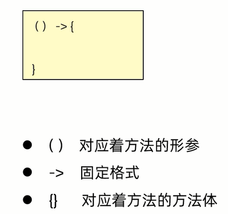

## 函数式编程

函数式编程(`Functional programming`)是一种思想特点               

函数式编程思想: 忽略面向对象的复杂语法,**强调做什么,而不是谁去做**

Lambda表达式就是函数式思想的体现

## Lambda表达式

范例: 

```java
import java.util.Arrays;

public class ArraySort {
    public static void main(String[] args) {
        Integer[] arr = {1,2,3,8,65,3234,66,23,21,90};
        
        /*
        //匿名内部类的形式
        Arrays.sort(arr,new Comparator<Integer>() {
            @Override
            public int compare(Integer o1,Integer o2) {
                return o1 - o2;
            }
        });
        */

        //Lambda表达式的形式
        Arrays.sort(arr,(Integer o1,Integer o2) -> {
                    return o1 - o2;
                }
        );
        System.out.println(Arrays.toString(arr));
    }
}
```

Lambda表达式是`JDK8`开始后的一种新语法形式

### 格式



**注意事项 :**
1. **Lambda表达式可以用来简化匿名内部类的书写**
2. **Lambda表达式只能简化函数式接口的匿名内部类的写法**     
**函数式接口: 有且仅有一个抽象方法的接口,接口上方可以加`@FunctionalInterface`注解**

范例: 

```java
@FunctionalInterface
interface Swim {
    public abstract void Swimming();
}
```

```java
public class Test {
    public static void main(String[] args) {
        //匿名内部类的形式
        method(new Swim() {
            @Override
            public void Swimming() {
                System.out.println("正在游泳!");
            }
        });

        //Lambda表达式的形式
        method(
                () -> {
                    System.out.println("正在游泳!!!");
                }
        );
    }

    public static void method(Swim s) {
        s.Swimming();
    }
}
```

### 好处 

Lambda是一个匿名函数,可以把Lambda表达式理解为一段可以传递的代码           
它可以写出更简洁、更灵活的代码,作为一种更紧凑的代码风格,使`Java`语言的表达能力得到提升

### 省略写法

核心: **可推导,可省略**

规则: 
1. `参数类型`可以省略不写
2. 如果只有一个参数,`参数类型`、`()`可以**同时**省略不写
3. 如果Lambda表达式的方法体只有一行,`{}`、`;`、`return`可以**同时**省略不写

范例: 

```java
import java.util.Arrays;

public class Test {
    public static void main(String[] args) {
        Integer[] arr = {1,2,3,8,65,3234,66,23,21,90};

        //Lambda表达式完整格式
        /*
        Arrays.sort(arr,(Integer o1,Integer o2) -> {
                    return o1 - o2;
                }
        );
        */

        //Lambda表达式省略写法
        Arrays.sort(arr,(o1,o2) -> o1 - o2);

        System.out.println(Arrays.toString(arr));
    }
}
```

练习: 

定义数组并存储一些字符串,利用Arrays中的sort方法进行排序

要求: 按照字符串的长度进行排序,短的在前面,长的在后面(暂时不比较字符串里面的内容)

1. 匿名内部类

```java
import java.util.Arrays;
import java.util.Comparator;

public class Test {
    public static void main(String[] args) {
        String[] stringArr = {"祖国风光无限好","中国","爱国心","精忠报国","远古的东方有一条龙"};
        Arrays.sort(stringArr,new Comparator<String>() {
            @Override
            public int compare(String o1,String o2) {
                return o1.length() - o2.length();
            }
        });
        for (int i = 0; i < stringArr.length; i++) {
            System.out.print(stringArr[i] + " ");
        }
    }
}
```

2. Lambda表达式

```java
import java.util.Arrays;

public class Test {
    public static void main(String[] args) {
        String[] stringArr = {"祖国风光无限好","中国","爱国心","精忠报国","远古的东方有一条龙"};
        Arrays.sort(stringArr,(o1,o2) -> o1.length() - o2.length());
        for (int i = 0; i < stringArr.length; i++) {
            System.out.print(stringArr[i] + " ");
        }
    }
}
```