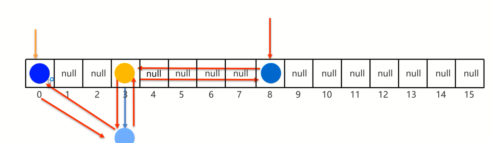

# 特点

特点都是**由键决定的:有序**、不重复、无索引                      
这里的有序指的是保证存储和取出的元素顺序一致

# 原理

底层数据结构是哈希表,但是每个键值对元素又额外多了一个双链表的机制记录存储的顺序          



范例:

```java
import java.util.LinkedHashMap;

public class Test {
    public static void main(String[] args) {
        LinkedHashMap<String, Integer> map = new LinkedHashMap<>();
        map.put("a", 123);
        map.put("a", 111);
        map.put("b", 456);
        map.put("c", 789);
        // 打印结果:"{a=111, b=456, c=789}"
        System.out.println(map);
    }
}
```