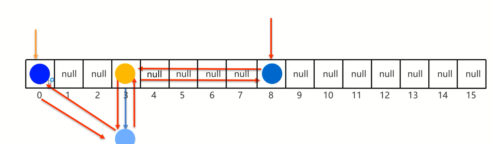

# 特点

`LinkedHashSet`: `Linked` -- 链表,`HashSet` -- 是其父类

1. **有序**:存取顺序一致
2. 不重复:可以去除重复
3. 无索引:没有带索引的方法,所以不能使用普通的for循环遍历,也不能通过索引来获取元素

# 原理

底层数据结构是哈希表,但是每个元素又额外多了一个双链表的机制记录存储的顺序



范例:

```java
import java.util.Objects;

public class Student {
    private String name;
    private int number;

    public Student() {
    }

    public Student(String name, int number) {
        this.name = name;
        this.number = number;
    }

    public String getName() {
        return name;
    }

    public void setName(String name) {
        this.name = name;
    }

    public int getNumber() {
        return number;
    }

    public void setNumber(int number) {
        this.number = number;
    }

    @Override
    public String toString() {
        return "Student{" +
                "name='" + name + '\'' +
                ", number=" + number +
                '}';
    }

    @Override
    public boolean equals(Object o) {
        if (this == o) return true;
        if (o == null || getClass() != o.getClass()) return false;
        Student student = (Student) o;
        return number == student.number && Objects.equals(name, student.name);
    }

    @Override
    public int hashCode() {
        return Objects.hash(name, number);
    }
}
```

```java
import java.util.LinkedHashSet;

public class StudentTest {
    public static void main(String[] args) {
        Student student1 = new Student("张三", 23);
        Student student2 = new Student("张三", 23);
        Student student3 = new Student("李四", 23);
        Student student4 = new Student("王五", 23);
        LinkedHashSet<Student> hashset = new LinkedHashSet<>();
        hashset.add(student1);
        hashset.add(student2);
        hashset.add(student3);
        hashset.add(student4);
        for (Student student : hashset) {
            // 打印结果:"Student{name='张三', number=23}"
            // 打印结果:"Student{name='李四', number=23}"
            // 打印结果:"Student{name='王五', number=23}"
            System.out.println(student);
        }
    }
}
```

# 应用

1. 如果只要数据去重,默认使用HashSet               
2. 如果要数据去重且存取有序,使用LinkedHashSet      