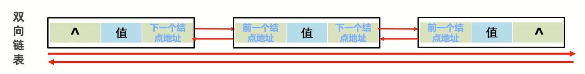
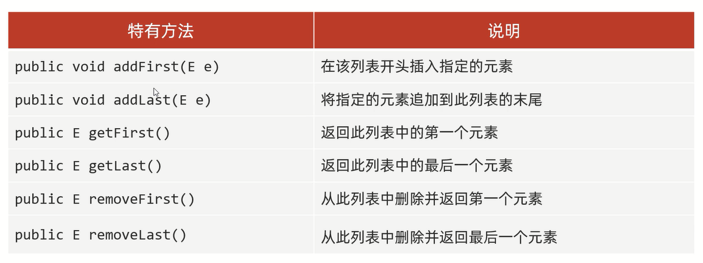
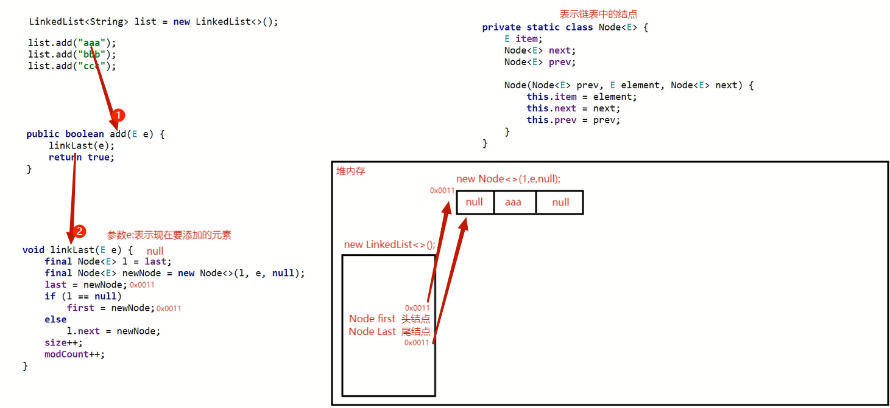
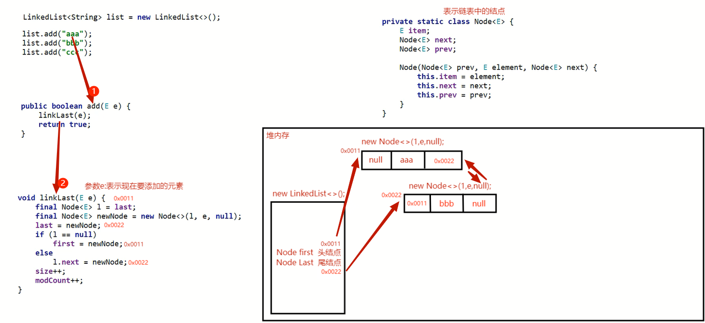
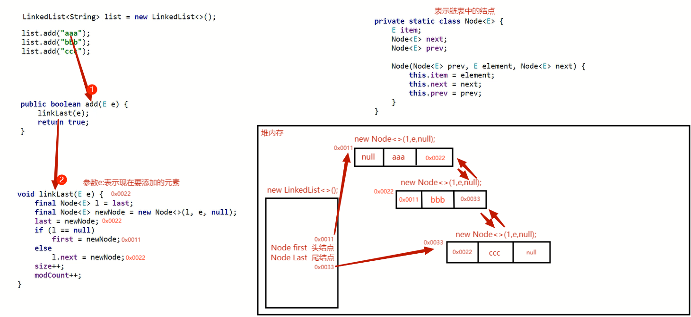

# LinkedList

LinkedList: `Linked` -- 链表,List -- 属于List系列的一员

LinkedList本身多了很多直接操作首尾元素的特有方法

# 特点

**查询慢,增删快**(如果操作是首位元素,速度也是快的)   

1. **有序**: 存和取的元素顺序一致
2. **有索引**: 可以通过索引操作元素
3. **可重复**: 存储的元素可以重复

# 特有方法

# LinkedList底层原理

LinkedList底层数据结构是双链表

# LinkedList底层源码分析

