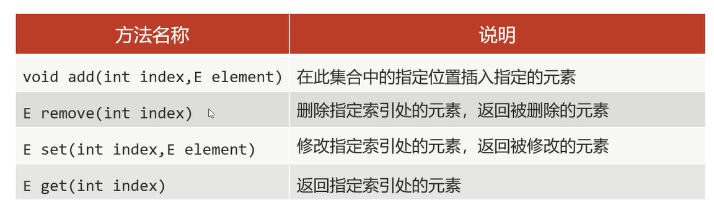

## 特点 

1. **有序**: 存和取的元素顺序一致
2. **有索引**: 可以通过索引操作元素
3. **可重复**: 存储的元素可以重复

## 特有方法

1. `Collection`的方法`List`都继承了
2. `List`集合因为有索引,所以多了很多索引操作的方法



细节: 
1. `add(int index,E element)`: 在指定位置插入指定的元素,**原来索引上的元素会依次往后移**

范例: 

```java
import java.util.ArrayList;
import java.util.List;

public class Test {
    public static void main(String[] args) {
        List<String> list = new ArrayList<>();
        list.add("你");
        list.add("是");
        list.add("我");
        list.add("我");
        list.add("是");
        list.add("你");

        //打印结果: "[你,是,我,我,是,你]"
        System.out.println(list);
        System.out.println();

        //在指定位置插入指定的元素
        list.add(2,"靠");
        //打印结果: "[你,是,靠,我,我,是,你]"
        System.out.println(list);
        System.out.println();

        //删除指定索引处的元素,返回被删除的元素
        String remove = list.remove(2);
        //打印结果: "靠"
        System.out.println(remove);
        //打印结果: "[你,是,我,我,是,你]"
        System.out.println(list);
        System.out.println();

        //修改指定索引处的元素,返回被修改的元素
        String set = list.set(4,"儿子");
        //打印结果: "是"
        System.out.println(set);
        //打印结果: "[你,是,我,我,儿子,你]"
        System.out.println(list);
        System.out.println();

        //返回指定索引处的元素
        String get = list.get(4);
        //打印结果: "儿子"
        System.out.println(get);
    }
}
```

2. `remove(int index)`: 删除指定索引处的元素,返回被删除的元素               
a.**调用方法的时候,如果方法出现了重载,优先调用实参和形参类型一致的那个方法**                
b.**`remove`方法不会自动装箱**

范例: 

```java
import java.util.ArrayList;
import java.util.List;

public class Test {
    public static void main(String[] args) {
        List<Integer> list = new ArrayList<>();
        list.add(1);
        list.add(2);
        list.add(3);

        //删除的是索引为1的元素,而不是删除元素1
        //调用方法的时候,如果方法出现了重载,优先调用实参和形参类型一致的那个方法
        //因此这里调用的是remove(int index)方法
        list.remove(1);
        //打印结果: "[1,3]"
        System.out.println(list);

        //手动装箱,把基本数据类型的1变成Integer型
        Integer i = Integer.valueOf(1);
        //而这里调用的是remove(Object obj)方法
        list.remove(i);
        //打印结果: "[3]"
        System.out.println(list);
    }
}
```

## 遍历方式

1. 普通for遍历(**因为`List`集合存在索引**) -- **如果遍历的时候想操作索引,使用普通for遍历**
2. 迭代器遍历 -- **在遍历的过程中需要删除元素,使用迭代器遍历**
3. 增强for遍历 -- **仅遍历,使用增强for遍历**
4. Lambda表达式遍历 -- **仅遍历,使用Lambda表达式遍历**
5. 列表迭代器遍历 -- **在遍历的过程中需要添加元素,使用遍历迭代器遍历** 

范例: 

```java
import java.util.ArrayList;
import java.util.Iterator;
import java.util.List;
import java.util.ListIterator;

public class Test {
    public static void main(String[] args) {
        List<String> list = new ArrayList<>();
        list.add("一");
        list.add("二");
        list.add("三");
        list.add("四");
        list.add("五");
        list.add("六");

        //普通for遍历
        for (int i = 0; i < list.size(); i++) {
            System.out.print(list.get(i));
        }
        System.out.println();

        //迭代器遍历
        Iterator<String> it = list.iterator();
        while (it.hasNext()) {
            System.out.print(it.next());
        }
        System.out.println();

        //增强for遍历
        for (String s: list) {
            System.out.print(s);
        }
        System.out.println();

        //Lambda表达式遍历
        list.forEach(s -> System.out.print(s));
        System.out.println();

        //列表迭代器遍历
        ListIterator<String> lit = list.listIterator();
        while(lit.hasNext()){
            System.out.print(lit.next());
        }
    }
}
```

### 遍历迭代器遍历      

和迭代器类似,但是有一个方法`add(E element)`: 在遍历的过程中,可以添加元素             

细节: **迭代器遍历时,不能用集合的方法进行增加或者删除**         
**否则就会报错`ConcurrentModificationException`(并发修改异常)**           


范例: 

```java
import java.util.ArrayList;
import java.util.List;
import java.util.ListIterator;

public class Test {
    public static void main(String[] args) {
        List<String> list = new ArrayList<>();
        list.add("一");
        list.add("二");
        list.add("三");
        list.add("四");
        list.add("五");
        list.add("六");

        //列表迭代器遍历
        ListIterator<String> it = list.listIterator();
        while (it.hasNext()) {
            String str = it.next();
            if (str.equals("四")) {
                //用迭代器的方法进行添加
                it.add("4");
            }
        }
        //打印结果: "[一,二,三,四,4,五,六]"
        System.out.print(list);
    }
}
```