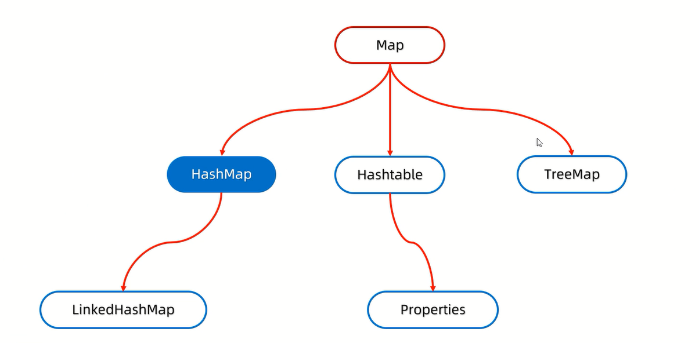
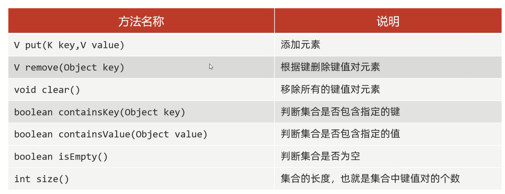
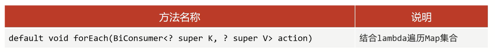

# 集合体系结构 

1. 单列集合(Collection)
2. 双列集合(Map)

# 双列集合(Map)



# 特点

1. 双列集合一次需要存一对数据,分别为键和值
2. 键不能重复,值可以重复
3. 键和值是一一对应的,每一个键只能找到自己对应的值
4. 键+值这个整体称之为"键值对"或者"键值对对象",在Java中叫做"Entry对象"

## 常用方法

Map是双列集合的顶层接口,它的全部功能是全部双列集合都可以继承使用的



范例:

```java
import java.util.HashMap;
import java.util.Map;

public class test {
    public static void main(String[] args) {
        Map<String, String> m = new HashMap<>();

        // 添加元素
        m.put("韦小宝1", "沐剑屏");
        m.put("韦小宝2", "霜儿");
        // 打印结果:"{韦小宝1=沐剑屏, 韦小宝2=霜儿}"
        System.out.println(m);

        // 根据键删除键值对元素
        m.remove("韦小宝1");
        // 打印结果:"{韦小宝=霜儿}"
        System.out.println(m);

        // 移除所有键值对元素
        m.clear();
        // 打印结果:"{}"
        System.out.println(m);

        m.put("韦小宝1", "沐剑屏");
        m.put("韦小宝2", "霜儿");
        m.put("韦小宝3", "郡主");

        // 判断是否包含键
        boolean b1 = m.containsKey("韦小宝1");
        boolean b2 = m.containsKey("韦小宝4");
        // 打印结果:"true"
        System.out.println(b1);
        // 打印结果:"false"
        System.out.println(b2);

        // 判断是否包含值
        boolean b3 = m.containsValue("沐剑屏");
        boolean b4 = m.containsValue("双儿");
        // 打印结果:"true"
        System.out.println(b3);
        // 打印结果:"false"
        System.out.println(b4);

        // 判断是否为空
        // 打印结果:"false"
        System.out.println(m.isEmpty());

        // 打印集合的长度
        // 打印结果:"3"
        System.out.println(m.size());
    }
}
```

### put方法的细节

添加/覆盖                          

1. 在添加数据的时候,如果键不存在,那么直接把键值对对象添加到Map集合中                            
2. 在添加数据的时候,如果键存在,那么会把原有的键值对对象覆盖,把被覆盖的值返回                                


范例:

```java
import java.util.HashMap;
import java.util.Map;

public class test {
    public static void main(String[] args) {
        Map<String, String> m = new HashMap<>();
        
        // 添加元素
        String value1 = m.put("韦小宝", "沐剑屏");
        // 打印结果:"null"
        System.out.println(value1);
        
        String value2 = m.put("韦小宝", "霜儿");
        // 打印结果:"沐剑屏"
        System.out.println(value2);

        // 打印结果:"{韦小宝=霜儿}"
        System.out.println(m);
    }
}
```

## 遍历方式

1. 键找值
2. 键值对
3. Lambda表达式

## 键找值

步骤:
1. 通过keySet()方法获取所有的键,把这些键放到一个单列集合当中
2. 遍历单列集合
3. 通过`String value = map.get(key);`来键找值

范例:

```java
import java.util.HashMap;
import java.util.Iterator;
import java.util.Map;
import java.util.Set;
import java.util.function.Consumer;

public class test {
    public static void main(String[] args) {
        Map<String, String> map = new HashMap<>();

        map.put("韦小宝1", "沐剑屏");
        map.put("韦小宝2", "霜儿");
        map.put("韦小宝3", "郡主");

        // 通过keySet()方法获取所有的键,把这些键放到一个单列集合当中
        Set<String> keys = map.keySet();

        // 增强for遍历单列集合,得到每一个键
        for (String key : keys) {
            // 利用Map集合中的键获取对应的值
            String value1 = map.get(key);
            System.out.println(key + "与" + value1);
        }
        System.out.println();

        // 迭代器遍历单列集合,得到每一个键
        Iterator<String> it = keys.iterator();
        while (it.hasNext()) {
            // 利用Map集合中的键获取对应的值
            String key = it.next();
            String value2 = map.get(key);
            System.out.println(key + "与" + value2);
        }
        System.out.println();

        // Lambda表达式遍历单列集合,得到每一个键
        keys.forEach(key -> {
            // 利用Map集合中的键获取对应的值
            String value3 = map.get(key);
            System.out.println(key + "与" + value3);
        });
    }
}
```

## 键值对(键值对对象/Entry对象)

步骤:
1. 通过entrySet()方法获取所有的键值对对象,方法返回一个Set集合
2. 遍历Set集合
3. 通过`getKey()`和`getValue()`来获取键值对

范例:

```java
import java.util.HashMap;
import java.util.Iterator;
import java.util.Map;
import java.util.Set;
import java.util.function.Consumer;

public class test {
    public static void main(String[] args) {
        Map<String, String> map = new HashMap<>();

        map.put("韦小宝1", "沐剑屏");
        map.put("韦小宝2", "霜儿");
        map.put("韦小宝3", "郡主");

        // 通过一个方法获取所有的键值对对象,方法返回一个Set集合
        Set<Map.Entry<String, String>> entries = map.entrySet();


        // 增强for遍历entries集合,去得到里面的每一个键值对对象
        for (Map.Entry<String, String> entry1 : entries) {
            // 利用entry调用get方法获取键和值
            System.out.println(entry1.getKey() + "与" + entry1.getValue());
        }
        System.out.println();

        // 迭代器遍历entries集合,去得到里面的每一个键值对对象
        Iterator<Map.Entry<String, String>> it = entries.iterator();
        while (it.hasNext()) {
            Map.Entry<String, String> entry2 = it.next();
            // 利用entry调用get方法获取键和值
            System.out.println(entry2.getKey() + "与" + entry2.getValue());
        }
        System.out.println();

        // Lambda表达式遍历entries集合,去得到里面的每一个键值对对象
        entries.forEach(entry3 -> {
            // 利用entry调用get方法获取键和值
            System.out.println(entry3.getKey() + "与" + entry3.getValue());
        });
    }
}
```

## Lambda表达式



forEach()方法的底层就是利用键值对的方式进行遍历,依次得到每一个键和值,然后再调用accept()方法

范例:

```java
import java.util.HashMap;
import java.util.Map;

public class test {
    public static void main(String[] args) {
        Map<String, String> map = new HashMap<>();

        map.put("韦小宝1", "沐剑屏");
        map.put("韦小宝2", "霜儿");
        map.put("韦小宝3", "郡主");

//        // 匿名内部类形式
//        map.forEach(new BiConsumer<String, String>() {
//            @Override
//            public void accept(String key, String value) {
//                System.out.println(key + "与" + value);
//            }
//        });

        // Lambda表达式形式
        map.forEach((key, value) ->
                System.out.println(key + "与" + value)
        );
    }
}
```