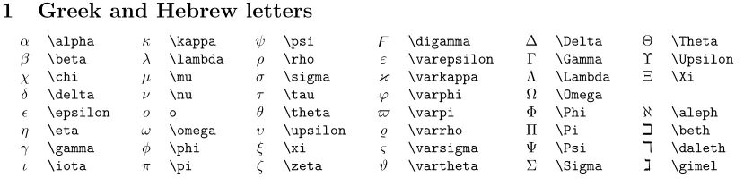
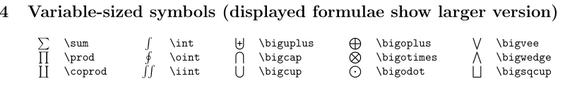
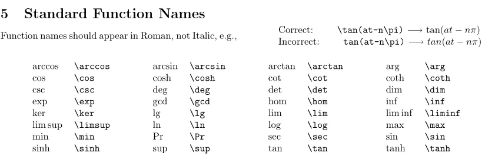
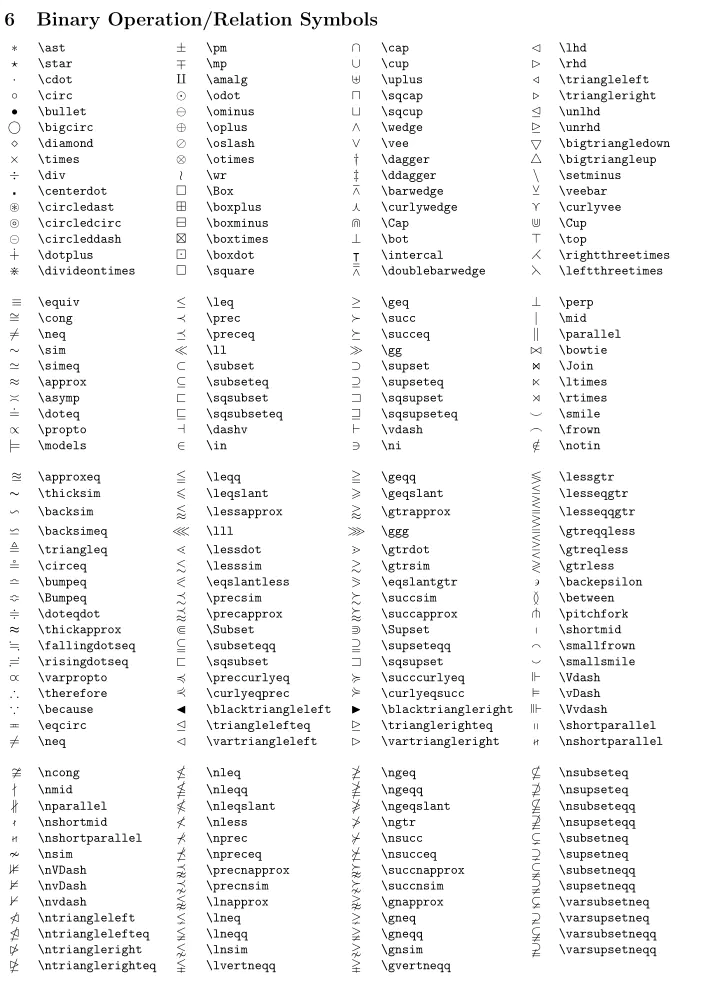
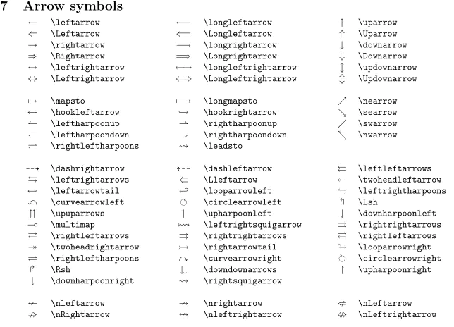
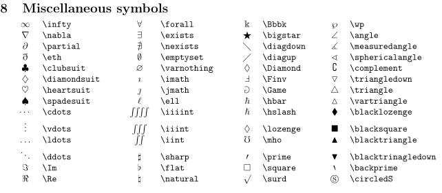

# 数学公式

1. 行内插入公式: `$...$`
2. 行间插入公式: `$$...$$`

# 希腊字母



```markdown
$\alpha$
$\beta$
$\chi$
$\Delta$
$\Gamma$
$\Theta$
```

# 数学结构


```markdown
$$
\frac{abc}{xyz}
$$

$$
\frac{abc123}{xyz123}
$$             
```  

# 定界符


```markdown
$$
|
$$         

$$
\|
$$

$$
\left|\begin{matrix}
    a & b & c \\
    d & e & f \\
    g & h & i
\end{matrix}\right|
$$
```

# 可变大小的符号



```markdown
$$
\bigcap\bigcup\bigoplus\bigotimes\sum\int\oint\iint
$$
```

# 函数名称



```markdown
$$
\tan(at-n\pi)\\
\sin\\
\cos\\
\log\\
$$
```

# 二进制运算符和关系运算符




```markdown
$\times$
$\ast$
$\div$
$\pm$
$\mp$
$\leq$
$\geq$
$\lessgtr$
```

# 箭头符号



```markdown
$\leftarrow$       
$\Leftarrow$             
$\nLeftarrow$                  
$\rightleftarrows$ 
```

# 其他符号



```markdown
$\heartsuit$                
$\infty$               
$\iiint$                 
$\partial$
```

# 上下标

使用`^`来输出上标,使用`_`来输出下标,使用{}包含作用范围

```markdown
$$
\sin^2(\theta) + \cos^2(\theta) = 1
$$

$$
\sum_{n=1}^\infty k
$$

$$
\int_a^bf(x)\,dx
$$

$$
\lim\limits_{x\to\infty}\exp(-x) = 0
$$
```

# 矩阵

矩阵中的各元素通过用`$`来分隔,`\\`来换行

```markdown
$$
\begin{matrix}
0&1&2\\
3&4&5\\
6&7&8\\
\end{matrix}
$$

$$
\begin{bmatrix}
0&1&2\\
3&4&5\\
6&7&8\\
\end{bmatrix}
$$

$$
\begin{Bmatrix}
0&1&2\\
3&4&5\\
6&7&8\\
\end{Bmatrix}
$$

$$
\begin{vmatrix}
0&1&2\\
3&4&5\\
6&7&8\\
\end{vmatrix}
$$

$$
\begin{Vmatrix}
0&1&2\\
3&4&5\\
6&7&8\\
\end{Vmatrix}
$$
```

# 分段函数

用`\begin{cases}`和`\end{cases}`来构造分段函数,中间则用`\\`来分段

```markdown
$$
f(x) = 
\begin{cases}
2x,\,\,x>0\\
3x,\,\,x\le0\\
\end{cases}
$$
```

# 字体

1. 字体1: 

```markdown
$\mathbf{ABCDEFGHIJKLMNOPQRSTUVWXYZabc123}$
```

2. 字体2: 

```markdown
$\mathcal{ABCDEFGHIJKLMNOPQRSTUVWXYZabc123}$
```

3. 字体3: 

```markdown
$\mathfrak{ABCDEFGHIJKLMNOPQRSTUVWXYZabc123}$
```

4. 字体4: 

```markdown
$\mathsf{ABCDEFGHIJKLMNOPQRSTUVWXYZabc123}$
```

5. 字体5: 

```markdown
$\mathbb{ABCDEFGHIJKLMNOPQRSTUVWXYZabc123}$
```