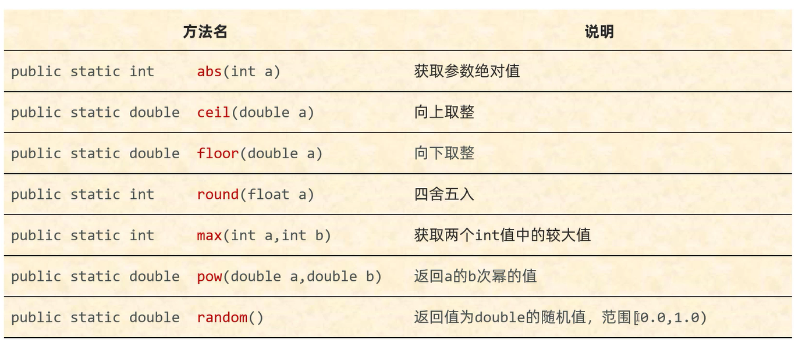

# Math

进行数学计算的工具类    
**私有化构造方法,所有的方法都是静态的**    

## 常用方法



## Math.abs(int a)

获取绝对值   

存在Bug,以int类型为例,取值范围为: -2147483648 ~ 2147483647   
如果没有正数与负数对应,那么传递的负数结果有误   

范例: 

```java
public class Test {
    public static void main(String[] args) {
        // 打印结果:"2"
        System.out.println(Math.abs(-2));
        // 打印结果:"-2147483648"
        System.out.println(Math.abs(-2147483648));
    }
}
```

-2147483648没有正数与之对应,所以其结果会产生Bug    
解决方案: JDK15以后,使用Math.absExact(),如果不在取值范围内,程序会自动报错   

## Math.ceil(double a)

向上取整  
进一法: 往正无穷大方向获取距离最近的整数   

范例: 

```java
public class Test {
    public static void main(String[] args) {
        // 打印结果:"13.0"
        System.out.println(Math.ceil(12.32));
        // 打印结果:"13.0"
        System.out.println(Math.ceil(12.52));
        // 打印结果:"-12.0"
        System.out.println(Math.ceil(-12.32));
        // 打印结果:"-12.0"
        System.out.println(Math.ceil(-12.52));
    }
}
```

## Math.floor(double a)

向下取整   
去尾法: 往负无穷大方向获取距离最近的整数   

范例: 

```java
public class Test {
    public static void main(String[] args) {
        // 打印结果:"12.0"
        System.out.println(Math.floor(12.32));
        // 打印结果:"12.0"
        System.out.println(Math.floor(12.52));
        // 打印结果:"-13.0"
        System.out.println(Math.floor(-12.32));
        // 打印结果:"-13.0"
        System.out.println(Math.floor(-12.52));
    }
}
```

## Math.round(float a)

四舍五入

范例: 

```java
public class Test {
    public static void main(String[] args) {
        // 打印结果:"12"
        System.out.println(Math.round(12.32));
        // 打印结果:"13"
        System.out.println(Math.round(12.52));
        // 打印结果:"-12"
        System.out.println(Math.round(-12.32));
        // 打印结果:"-13"
        System.out.println(Math.round(-12.52));
    }
}
```

## Math.max(int a,int b)

获取两个整数的较大值

范例: 

```java
public class Test {
    public static void main(String[] args) {
        // 打印结果:"12"
        System.out.println(Math.max(12,11));
    }
}
```

## Math.min(int a,int b)

获取两个整数的较小值

范例: 

```java
public class Test {
    public static void main(String[] args) {
        // 打印结果:"11"
        System.out.println(Math.min(12,11));
    }
}
```

## Math.pow(double a,double b)

返回a的b次幂   
根据第二个参数b,返回不同的值   
1. b是大于等于1的数,返回a的b次幂   
2. b是0~1之间的小数,返回a的b方根   
3. b是负数,返回a的b次方的倒数   
**第二个参数一般传递大于等于1的正整数**   

范例: 

```java
public class Test {
    public static void main(String[] args) {
        // 打印结果:"8.0"
        System.out.println(Math.pow(2,3));
        // 打印结果:"2.0"
        System.out.println(Math.pow(4,0.5));
        // 打印结果:"0.25"
        System.out.println(Math.pow(2,-2));
    }
}
```

## Math.sqrt(double a)

返回a的平方根

范例: 

```java
public class Test {
    public static void main(String[] args) {
        // 打印结果:"2.0"
        System.out.println(Math.sqrt(4));
    }
}
```

## Math.cbrt(double a)

返回a的立方根

范例: 

```java
public class Test {
    public static void main(String[] args) {
        // 打印结果:"2.0"
        System.out.println(Math.cbrt(8));
    }
}
```

## Math.random()

获取一个范围在`[0,1.0)`的随机数

范例: 

```java
public class Test {
    public static void main(String[] args) {
        // 打印结果:"0.975375166736634"(随机值)
        System.out.println(Math.random());
    }
}
```

练习 :

判断一个数是否为一个质数

```java
import java.util.Scanner;

public class Test {
    public static void main(String[] args) {
        Scanner scanner = new Scanner(System.in);
        System.out.println("请输入一个数: ");
        int number = scanner.nextInt();
        if (isPrime(number)) {
            System.out.println(number + "是质数");
        } else {
            System.out.println(number + "不是质数");
        }
    }

    public static boolean isPrime(int number) {
        int count = 0;
        for (int i = 2; i <= Math.sqrt(number); i++) {
            count++;
            if (number % i == 0) {
                return false;
            }
        }
        System.out.println("循环次数: " + count);
        return true;
    }
}
```

练习: 

自幂数,一个n位自然数等于自身各个数位上数字的n次幂之和   
例如: 1^3+5^3+3^3=153

1. 要求1: 统计一下一共有多少个水仙花数    
2. 要求2: 判断一下为什么没有两位的自幂数   
3. 要求3: 统计一下一共有多少个四叶玫瑰数   
4. 要求4: 统计一下一共有多少个五角星数    
5. 要求5: 录入一个数,判断这个数是不是自幂数   


```java
import java.util.Scanner;

public class Test {
    public static void main(String[] args) {
        // 打印出0~99999之间的自幂数
        // 判断是否存在两位的自幂数
        // 统计水仙花数、四叶玫瑰数、五角星数的个数
        System.out.print("打印出0~99999之间的自幂数: ");
        printNumber();

        Scanner scanner = new Scanner(System.in);
        System.out.print("请输入一个数: ");
        int number = scanner.nextInt();

        // 根据位数判断是哪种自幂数
        int result = isRight(number);
        if (result == 1) {
            System.out.println(",而且是独身数");
        } else if (result == 3) {
            System.out.println(",而且是水仙花数");
        } else if (result == 4) {
            System.out.println(",而且是四叶玫瑰数");
        } else if (result == 5) {
            System.out.println(",而且是五角星数");
        } else if (result == 6) {
            System.out.println(",而且是六合数");
        } else if (result == 7) {
            System.out.println(",而且是北斗七星数");
        } else if (result == 8) {
            System.out.println(",而且是八仙数");
        } else if (result == 9) {
            System.out.println(",而且是九九重阳数");
        } else if (result == 10) {
            System.out.println(",而且是十全十美数");
        }
    }

    // 打印出0~99999之间的自幂数
    // 判断是否存在两位的自幂数
    // 统计水仙花数、四叶玫瑰数、五角星数的个数
    public static void printNumber() {
        // 统计水仙花数的个数
        int threeCount = 0;
        // 证明没有两位的自幂数
        int twoCount = 0;
        // 统计四叶玫瑰数的个数
        int fourCount = 0;
        // 统计五角星数的个数
        int fiveCount = 0;
        for (int j = 0; j < 99999; j++) {
            int number = j;
            // 作为获取各位上的数字时变化的数
            int oldNumber = number;
            // 作为最终结果比对的数
            int numberResult = number;
            // 获取位数
            int numberCount = 0;
            while (number > 0) {
                number = number / 10;
                numberCount++;
            }
            // 获取各个数位上的数字的次幂之和
            int result = 0;
            for (int i = 0; i < numberCount; i++) {
                // 获取个位上的数字
                int digitNumber = oldNumber % 10;
                result += Math.pow(digitNumber,numberCount);
                oldNumber /= 10;
            }
            if (result == numberResult) {
                // 打印出1~99999之间的自幂数
                System.out.print(result + " ");

                // 统计两位的自幂数的个数
                if (numberCount == 2) {
                    twoCount++;

                    // 统计水仙花数的个数
                } else if (numberCount == 3) {
                    threeCount++;

                    // 统计四叶玫瑰数的个数
                } else if (numberCount == 4) {
                    fourCount++;

                    // 统计五角星数的个数
                } else if (numberCount == 5) {
                    fiveCount++;
                }
            }
        }
        System.out.println();
        // 判断是否存在两位的自幂数
        if (twoCount != 0) {
            System.out.println("存在两位的自幂数");
        } else {
            System.out.println("不存在两位的自幂数");
        }
        System.out.println("水仙花数的个数为: " + threeCount);
        System.out.println("四叶玫瑰数的个数为: " + fourCount);
        System.out.println("五角星数的个数为: " + fiveCount);
    }

    // 判断是否是自幂数,返回自幂数的位数
    public static int isRight(int number) {
        // 作为获取各位上的数字时变化的数
        int oldNumber = number;
        // 作为最终结果比对的数
        int numberResult = number;
        // 获取位数
        int numberCount = 0;
        while (number > 0) {
            number = number / 10;
            numberCount++;
        }
        // 获取各个数位上的数字的次幂之和
        int result = 0;
        for (int i = 0; i < numberCount; i++) {
            // 获取个位上的数字
            int digitNumber = oldNumber % 10;
            result += Math.pow(digitNumber,numberCount);
            oldNumber /= 10;
        }
        // 判断是否是自幂数
        if (result == numberResult) {
            System.out.print(numberResult + "是自幂数");
            // 是自幂数,返回位数
            return numberCount;
        } else {
            System.out.print(numberResult + "不是自幂数");
            // 不是自幂数,返回-1
            return -1;
        }
    }
}
```