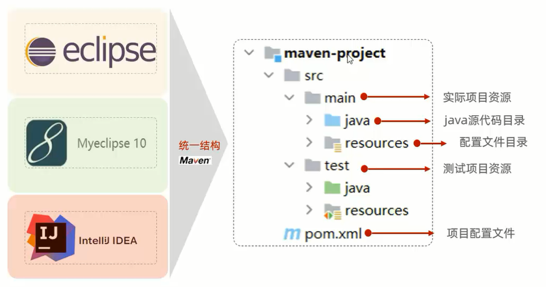
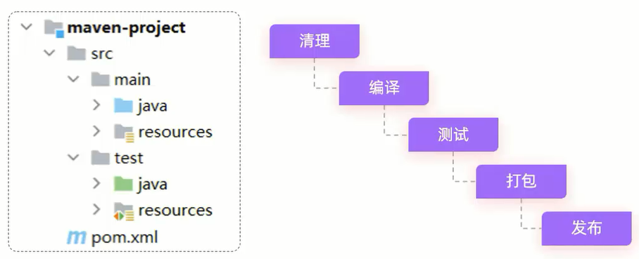
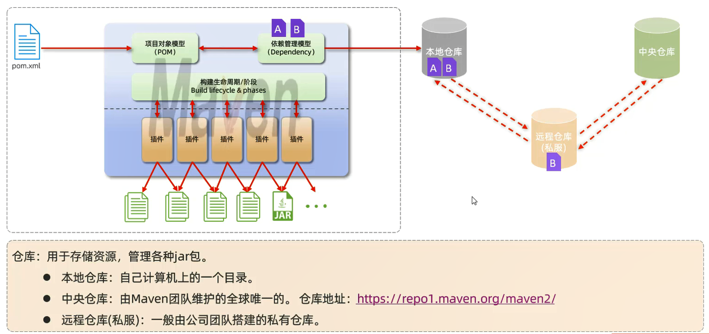
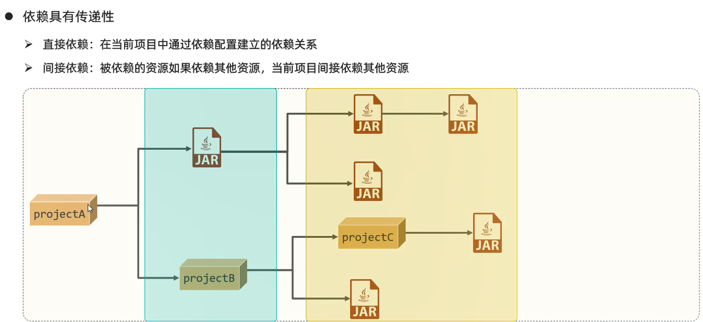
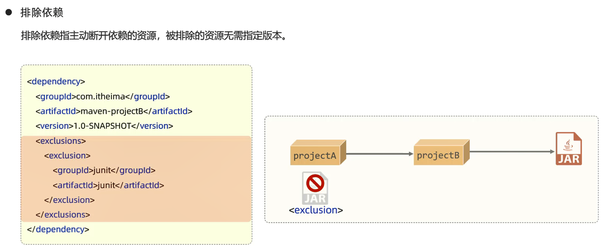
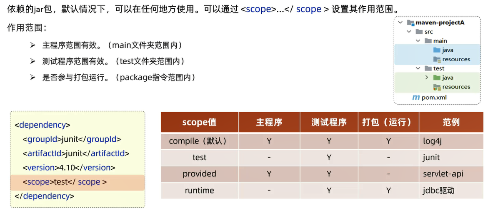
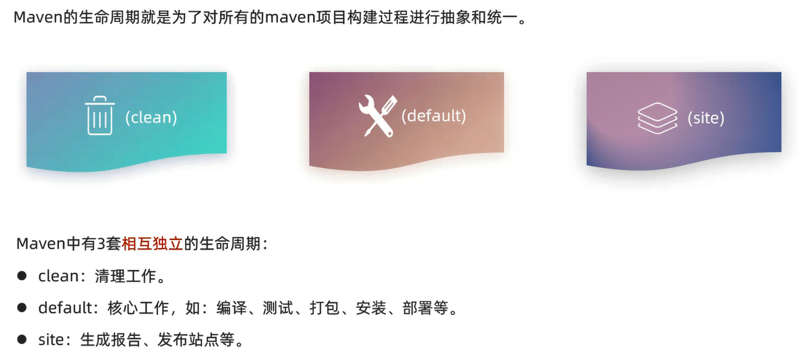
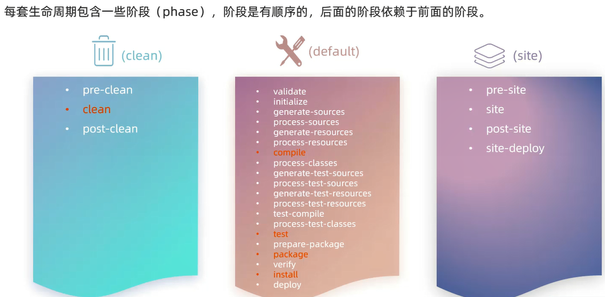
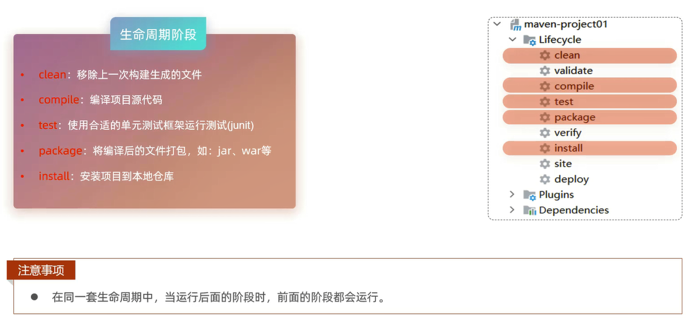
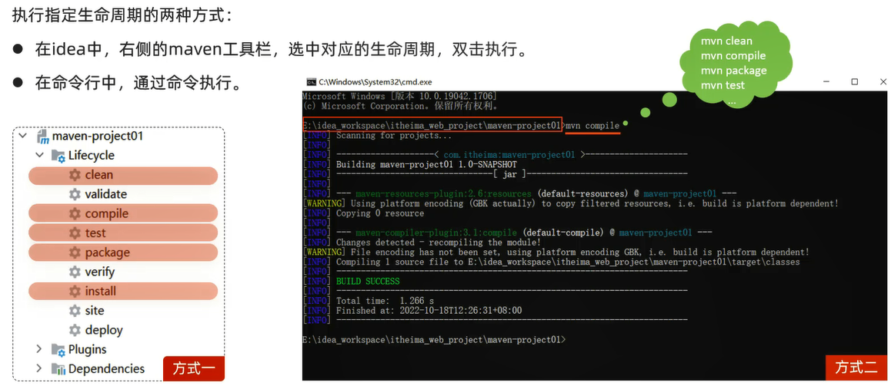

# Maven

Maven是Apache旗下的一个开源项目,是**一款用于管理和构建Java项目的工具**

它基于**项目对象模型**(Project Object Model,POM)的概念,通过一小段描述信息来管理项目的构建

[Maven官网](https://maven.apache.org/)

作用:
1. 依赖管理
2. 统一项目结构

3. 项目构建

 
Maven模型及仓库:

# 坐标

作用:
1. **坐标是资源的唯一标识,通过该坐标可以唯一定位资源位置**
2. 使用坐标来定义项目或引入项目中所需要的依赖

组成:
- `groupId`:定义当前Maven项目隶属组织名称(通常是域名反写)
- `artifactId`:定义当前Maven项目名称(通常是模块名称,例如order-service、goods-service)
- `version`:定义当前项目版本号

# IDEA导入Maven项目

2种方式:
1. 打开IDEA,选择右侧Maven面板,点击+号,选中对应项目的pom.xml文件,双击即可
2. File => Project Structure => Modules => + => Import Module

# 依赖管理

## 依赖配置

依赖:指当前项目运行所需要的jar包,一个项目中可以引入多个依赖

具体步骤:
1. 在pom.xml中编写标签
2. 在标签中使用引入坐标
3. 定义坐标的groupId、artifactId、version
4. 点击刷新按钮,引入最新加入的坐标                   
刷新依赖:保证每一次引入新的依赖,或者修改现有的依赖配置,都可以加入最新的坐标

细节:
- 如果引入的依赖,在本地仓库中不存在,将会连接远程仓库/中央仓库,然后下载依赖(这个过程会比较耗时,耐心等待)
- 如果不知道依赖的坐标信息,可以到[mvn的中央仓库](https://mvnrepository.com/)中搜索

## 依赖传递

## 依赖范围

## 生命周期

