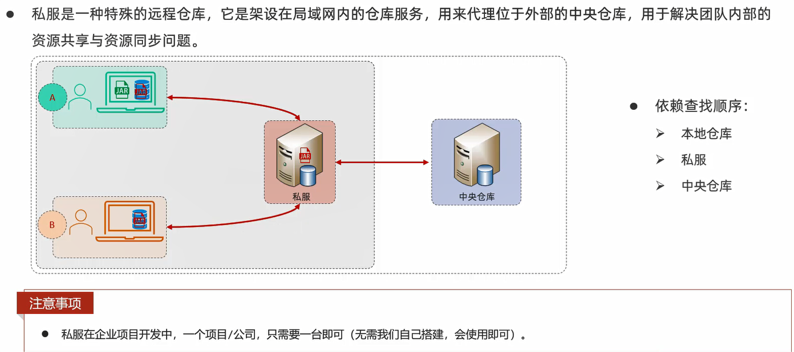

# 分模块设计与开发

分模块设计:将项目按照功能拆分成若干个子模块

作用:方便项目的管理维护、扩展,也方便模块间的相互调用、资源共享

细节:**分模块开发需要先针对模块功能进行设计,再进行编码**

# 继承与聚合

概念:继承描述的是两个工程间的关系,与Java中的继承相似,子工程可以继承父工程中的配置信息,常见于依赖关系的继承

作用:简化依赖配置、统一管理依赖

实现:`<parent>..</parent>`

## 继承

- 创建maven模块,**该工程为父工程,设置打包方式为pom**(默认为jar)                 
- 在子工程的pom.xml文件中,配置继承关系            
- 在父工程中配置各个工程共有的依赖(子工程会自动继承父工程的依赖)

范例:

父工程pom.xml:

```xml
<?xml version="1.0" encoding="UTF-8"?>
<project xmlns="http://maven.apache.org/POM/4.0.0"
         xmlns:xsi="http://www.w3.org/2001/XMLSchema-instance"
         xsi:schemaLocation="http://maven.apache.org/POM/4.0.0 http://maven.apache.org/xsd/maven-4.0.0.xsd">
    <modelVersion>4.0.0</modelVersion>

    <parent>
        <groupId>org.springframework.boot</groupId>
        <artifactId>spring-boot-starter-parent</artifactId>
        <version>2.7.5</version>
        <relativePath/> <!-- lookup parent from repository -->
    </parent>

    <groupId>com.itheima</groupId>
    <artifactId>tlias-parent</artifactId>
    <version>1.0-SNAPSHOT</version>
    <packaging>pom</packaging>

    <dependencies>
        <dependency>
            <groupId>org.projectlombok</groupId>
            <artifactId>lombok</artifactId>
            <version>1.18.24</version>
        </dependency>
    </dependencies>

    <properties>
        <maven.compiler.source>11</maven.compiler.source>
        <maven.compiler.target>11</maven.compiler.target>
        <project.build.sourceEncoding>UTF-8</project.build.sourceEncoding>
    </properties>

</project>
```

子工程pom.xml:

```xml
<?xml version="1.0" encoding="UTF-8"?>
<project xmlns="http://maven.apache.org/POM/4.0.0"
         xmlns:xsi="http://www.w3.org/2001/XMLSchema-instance"
         xsi:schemaLocation="http://maven.apache.org/POM/4.0.0 http://maven.apache.org/xsd/maven-4.0.0.xsd">
    <modelVersion>4.0.0</modelVersion>

    <parent>
        <groupId>com.itheima</groupId>
        <artifactId>tlias-parent</artifactId>
        <version>1.0-SNAPSHOT</version>
        <relativePath>../tlias-parent/pom.xml</relativePath>
    </parent>

    <artifactId>tlias-pojo</artifactId>
    <version>1.0-SNAPSHOT</version>

    <properties>
        <maven.compiler.source>11</maven.compiler.source>
        <maven.compiler.target>11</maven.compiler.target>
    </properties>

</project>
```

细节:
1. **在子工程中,配置了继承关系之后,坐标轴的`groupId`是可以省略的,因为会自动继承父工程的**
2. **`relativePath`指定父工程的pom文件的相对位置(如果不指定,将从本地仓库/远程仓库查找该工程)**
3. **如果父子工程都配置了同一个依赖的不同版本,将以子工程的为准**

## 版本锁定


.png)

- `<dependencies>`:直接依赖,在父工程配置了依赖,子工程会直接继承下来

- `<dependencyManagement>`:统一管理依赖版本,不会直接依赖,还需要在子工程中引入所需依赖(无需指定版本)

## 聚合

概念:将多个模块组织成一个整体,同时进行项目的构建

聚合工程:一个不具有业务功能的空工程(有且仅有pom文件,而父工程一般也是这样,所以父工程也一般作为聚合工程)

作用:快速构建项目(无需根据依赖关系手动构建,直接在聚合工程上构建即可)


## 继承与聚合


# 私服



## 上传与下载


## 配置范例

访问私服:http://192.168.150.101:8081

访问密码:admin/admin

使用私服,需要在maven的settings.xml配置文件中,做如下配置:

1. 需要在**servers**标签中,配置访问私服的个人凭证(访问的用户名和密码)

```xml
<server>
    <id>maven-releases</id>
    <username>admin</username>
    <password>admin</password>
</server>
    
<server>
    <id>maven-snapshots</id>
    <username>admin</username>
    <password>admin</password>
</server>
```

2. 在**mirrors**中只配置自己私服的连接地址(如果之前配置过阿里云,需要直接替换掉)

```xml
<mirror>
    <id>maven-public</id>
    <mirrorOf>*</mirrorOf>
    <url>http://192.168.150.101:8081/repository/maven-public/</url>
</mirror>
```

3. 需要在**profiles**中,增加如下配置,来指定snapshot快照版本的依赖,依然允许使用

```xml
<profile>
    <id>allow-snapshots</id>
        <activation>
        <activeByDefault>true</activeByDefault>
        </activation>
    <repositories>
        <repository>
            <id>maven-public</id>
            <url>http://192.168.150.101:8081/repository/maven-public/</url>
            <releases>
            <enabled>true</enabled>
            </releases>
            <snapshots>
            <enabled>true</enabled>
            </snapshots>
        </repository>
    </repositories>
</profile>
```

4. 如果需要上传自己的项目到私服上,需要在项目的pom.xml文件中,增加如下配置,来配置项目发布的地址(也就是私服的地址)

```xml
<distributionManagement>
    <!-- release版本的发布地址 -->
    <repository>
        <id>maven-releases</id>
        <url>http://192.168.150.101:8081/repository/maven-releases/</url>
    </repository>
    
    <!-- snapshot版本的发布地址 -->
    <snapshotRepository>
        <id>maven-snapshots</id>
        <url>http://192.168.150.101:8081/repository/maven-snapshots/</url>
    </snapshotRepository>
</distributionManagement>
```

5. 发布项目,直接运行deploy生命周期即可(发布时,建议跳过单元测试)