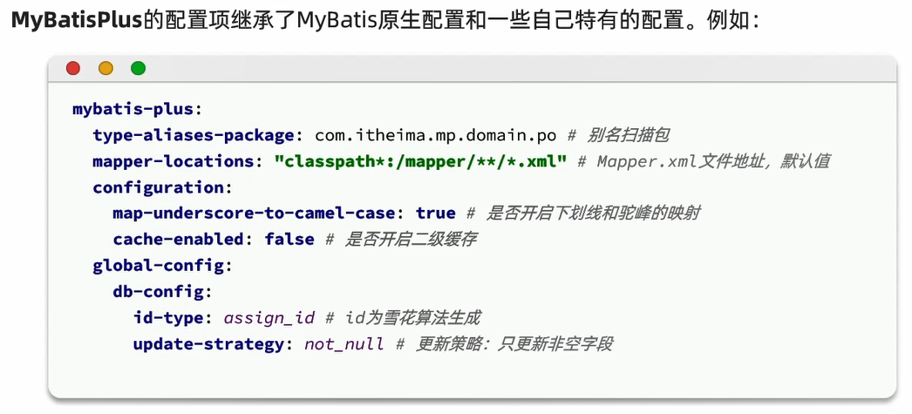

# MyBatisPlus

[MyBatisPlus官方网站](https://baomidou.com/)

特点:
1. 润物无声:只做增强不做改变,引入它不会对现有工程产生影响,如丝般顺滑
2. 效率至上:只需简单配置,即可快速进行单表CRUD操作,节省大量时间

# 快速入门

1. 引入MyBatisPlus的起步依赖,代替MyBatis依赖

```xml
<dependency>
    <groupId>com.baomidou</groupId>
    <artifactId>mybatis-plus-boot-starter</artifactId>
    <version>3.5.6</version>
</dependency>
```

2. 定义Mapper接口并继承BaseMapper

```java
public interface UserMapper extends BaseMapper<User> {
}
```

# 基本原理

MyBatisPlus通过扫描实体类,并基于反射获取实体类信息作为数据库表信息

- 类名驼峰转下划线作为表名
- 名为id的字段作为主键
- 变量名驼峰转下划线作为表的字段名

# 常用注解


# 常见配置



# 核心功能

## 条件构造器


细节:
- **`QueryWrapper`和`LambdaQueryWrapper`通常用来构建select、delete、update的where条件部分**
- **`UpdateWrapper`和`LambdaUpdateWrapper`通常只有在set语句比较特殊时,才使用**
- **尽量使用`LambdaQueryWrapper`和`LambdaUpdateWrapper`,避免硬编码**

### 范例

准备工作:

```sql
-- 创建地址表
CREATE TABLE IF NOT EXISTS `address`
(
    `id`         bigint NOT NULL AUTO_INCREMENT,
    `user_id`    bigint                                                  DEFAULT NULL COMMENT '用户ID',
    `province`   varchar(10) CHARACTER SET utf8 COLLATE utf8_general_ci  DEFAULT NULL COMMENT '省',
    `city`       varchar(10) CHARACTER SET utf8 COLLATE utf8_general_ci  DEFAULT NULL COMMENT '市',
    `town`       varchar(10) CHARACTER SET utf8 COLLATE utf8_general_ci  DEFAULT NULL COMMENT '县/区',
    `mobile`     varchar(255) CHARACTER SET utf8 COLLATE utf8_general_ci DEFAULT NULL COMMENT '手机',
    `street`     varchar(255) CHARACTER SET utf8 COLLATE utf8_general_ci DEFAULT NULL COMMENT '详细地址',
    `contact`    varchar(255) CHARACTER SET utf8 COLLATE utf8_general_ci DEFAULT NULL COMMENT '联系人',
    `is_default` bit(1)                                                  DEFAULT b'0' COMMENT '是否是默认 1默认 0否',
    `notes`      varchar(255) CHARACTER SET utf8 COLLATE utf8_general_ci DEFAULT NULL COMMENT '备注',
    `deleted`    bit(1)                                                  DEFAULT b'0' COMMENT '逻辑删除',
    PRIMARY KEY (`id`) USING BTREE,
    KEY `user_id` (`user_id`) USING BTREE
) 
    COMMENT ='地址表'
    ENGINE = InnoDB
    AUTO_INCREMENT = 71
    DEFAULT CHARSET = utf8mb3
    ROW_FORMAT = COMPACT;

-- 地址表导入数据
INSERT INTO `address` (`id`, `user_id`, `province`, `city`, `town`, `mobile`, `street`, `contact`, `is_default`,
                       `notes`, `deleted`)
VALUES (59, 2, '北京', '北京', '朝阳区', '13900112222', '金燕龙办公楼', 'Rose', b'1', NULL, b'0'),
       (60, 1, '北京', '北京', '朝阳区', '13700221122', '修正大厦', 'Jack', b'0', NULL, b'0'),
       (61, 1, '上海', '上海', '浦东新区', '13301212233', '航头镇航头路', 'Jack', b'1', NULL, b'0'),
       (63, 2, '广东', '佛山', '永春', '13301212233', '永春武馆', 'Rose', b'0', NULL, b'0'),
       (64, 3, '浙江', '杭州', '拱墅区', '13567809102', '浙江大学', 'Hope', b'1', NULL, b'0'),
       (65, 3, '浙江', '杭州', '拱墅区', '13967589201', '左岸花园', 'Hope', b'0', NULL, b'0'),
       (66, 4, '湖北', '武汉', '汉口', '13967519202', '天天花园', 'Thomas', b'1', NULL, b'0'),
       (67, 3, '浙江', '杭州', '拱墅区', '13967589201', '左岸花园', 'Hopey', b'0', NULL, b'0'),
       (68, 4, '湖北', '武汉', '汉口', '13967519202', '天天花园', 'Thomas', b'1', NULL, b'0'),
       (69, 3, '浙江', '杭州', '拱墅区', '13967589201', '左岸花园', 'Hopey', b'0', NULL, b'0'),
       (70, 4, '湖北', '武汉', '汉口', '13967519202', '天天花园', 'Thomas', b'1', NULL, b'0');

-- 创建用户表
CREATE TABLE `user`
(
    `id`          BIGINT(19)   NOT NULL AUTO_INCREMENT COMMENT '用户id',
    `username`    VARCHAR(50)  NOT NULL COMMENT '用户名' COLLATE 'utf8_general_ci',
    `password`    VARCHAR(128) NOT NULL COMMENT '密码' COLLATE 'utf8_general_ci',
    `phone`       VARCHAR(20)  NULL     DEFAULT NULL COMMENT '注册手机号' COLLATE 'utf8_general_ci',
    `info`        JSON         NOT NULL COMMENT '详细信息',
    `status`      INT(10)      NULL     DEFAULT '1' COMMENT '使用状态（1正常 2冻结）',
    `balance`     INT(10)      NULL     DEFAULT NULL COMMENT '账户余额',
    `create_time` DATETIME     NOT NULL DEFAULT CURRENT_TIMESTAMP COMMENT '创建时间',
    `update_time` DATETIME     NOT NULL DEFAULT CURRENT_TIMESTAMP ON UPDATE CURRENT_TIMESTAMP COMMENT '更新时间',
    PRIMARY KEY (`id`) USING BTREE,
    UNIQUE INDEX `username` (`username`) USING BTREE
)
    COMMENT ='用户表'
    COLLATE = 'utf8_general_ci'
    ENGINE = InnoDB
    ROW_FORMAT = COMPACT
    AUTO_INCREMENT = 5;

-- 用户表导入数据
INSERT INTO `user` (`id`, `username`, `password`, `phone`, `info`, `status`, `balance`, `create_time`, `update_time`)
VALUES 
    (1, 'Jack', '123', '13900112224', '{
     "age": 20,
     "intro": "佛系青年",
     "gender": "male"
    }', 1, 1600, '2023-05-19 20:50:21', '2023-06-19 20:50:21'),
   (2, 'Rose', '123', '13900112223', '{
     "age": 19,
     "intro": "青涩少女",
     "gender": "female"
   }', 1, 600, '2023-05-19 21:00:23', '2023-06-19 21:00:23'),
   (3, 'Hope', '123', '13900112222', '{
     "age": 25,
     "intro": "上进青年",
     "gender": "male"
   }', 1, 100000, '2023-06-19 22:37:44', '2023-06-19 22:37:44'),
   (4, 'Thomas', '123', '17701265258', '{
     "age": 29,
     "intro": "伏地魔",
     "gender": "male"
   }', 1, 800, '2023-06-19 23:44:45', '2023-06-19 23:44:45');
```

UserMapper接口:

```java
package com.itheima.mp.mapper;

import com.baomidou.mybatisplus.core.conditions.query.QueryWrapper;
import com.baomidou.mybatisplus.core.mapper.BaseMapper;
import com.baomidou.mybatisplus.core.toolkit.Constants;
import com.itheima.mp.domain.po.User;
import org.apache.ibatis.annotations.Mapper;
import org.apache.ibatis.annotations.Param;

@Mapper
public interface UserMapper extends BaseMapper<User> {
}
```

操作:
1. 查询出名字中带o的,存款大于等于1000元的人的id、username、info、balance字段
2. 更新用户名为jack的用户的余额为2000
3. 更新id为1,2,4的用户余额,扣200

测试类:

```java
package com.itheima.mp.mapper;

import com.baomidou.mybatisplus.core.conditions.query.QueryWrapper;
import com.itheima.mp.domain.po.User;
import org.junit.jupiter.api.Test;
import org.springframework.beans.factory.annotation.Autowired;
import org.springframework.boot.test.context.SpringBootTest;

import java.util.List;

@SpringBootTest
class UserMapperTest {

    @Autowired
    private UserMapper userMapper;

    // 查询出名字中带o的,存款大于等于1000元的人的id、username、info、balance字段
    @Test
    public void test1() {
        // 构建查询条件
        QueryWrapper<User> userQueryWrapper = new QueryWrapper<User>()
                .select("id", "username", "info", "balance")
                .like("username", "o")
                .ge("balance", 1000);
        // 查询
        List<User> users = userMapper.selectList(userQueryWrapper);
        users.forEach(System.out::println);
    }

    // 更新用户名为jack的用户的余额为2000
    @Test
    public void test2() {
        // 要更新的数据
        User user = new User();
        user.setBalance(2000);
        // 更新的条件
        QueryWrapper<User> userQueryWrapper = new QueryWrapper<User>()
                .eq("username", "jack");
        // 执行更新
        userMapper.update(user, userQueryWrapper);
    }

    // 更新id为1,2,4的用户余额,扣200
    @Test
    public void test3() {
        // 更新的条件
        List<Long> ids = List.of(1L, 2L, 4L);
        UpdateWrapper<User> updateWrapper = new UpdateWrapper<User>()
                .setSql("balance=balance-200")
                .in("id", ids);
        // 执行更新
        userMapper.update(null, updateWrapper);
    }

    // Lambda方式,查询出名字中带o的,存款大于等于1000元的人的id、username、info、balance字段
    // 方式一
    @Test
    public void test11() {
        // 构建查询条件
        LambdaQueryWrapper<User> userQueryWrapper = new LambdaQueryWrapper<User>()
                .select(User::getId, User::getUsername, User::getInfo, User::getBalance)
                .like(User::getUsername, "o")
                .ge(User::getBalance, 1000);
        // 查询
        List<User> users = userMapper.selectList(userQueryWrapper);
        users.forEach(System.out::println);
    }

    // 方式二
    @Test
    public void test111() {
        // 构建查询条件
        LambdaQueryWrapper<User> userQueryWrapper = new QueryWrapper<User>().lambda()
                .select(User::getId, User::getUsername, User::getInfo, User::getBalance)
                .like(User::getUsername, "o")
                .ge(User::getBalance, 1000);
        // 查询
        List<User> users = userMapper.selectList(userQueryWrapper);
        users.forEach(System.out::println);
    }
}
```

## 自定义SQL

利用MyBatisPlus的Wrapper来构建复杂的Where条件,然后自己定义SQL语句中剩下的部分


### 范例

测试类:

```java
@SpringBootTest
class UserMapperTest {

    @Autowired
    private UserMapper userMapper;

    @Test
    public void test3() {
        // 更新的条件
        List<Long> ids = List.of(1L, 2L, 4L);
        int amount = 200;
        // 定义条件
        QueryWrapper<User> userQueryWrapper = new QueryWrapper<User>().in("id",ids);
        // 调用自定义方法
        userMapper.updateBalanceByIds(userQueryWrapper,amount);
    }
}
```

UserMapper接口类:

```java
package com.itheima.mp.mapper;

import com.baomidou.mybatisplus.core.conditions.query.QueryWrapper;
import com.baomidou.mybatisplus.core.mapper.BaseMapper;
import com.baomidou.mybatisplus.core.toolkit.Constants;
import com.itheima.mp.domain.po.User;
import org.apache.ibatis.annotations.Mapper;
import org.apache.ibatis.annotations.Param;
import org.yaml.snakeyaml.scanner.Constant;

@Mapper
public interface UserMapper extends BaseMapper<User> {
    void updateBalanceByIds(@Param("ew") QueryWrapper<User> userQueryWrapper, @Param("amount") int amount);
    // void updateBalanceByIds(@Param(Constants.WRAPPER) QueryWrapper<User> userQueryWrapper, @Param("amount") int amount);
}
```

UserMapper.xml:

```xml
<?xml version="1.0" encoding="UTF-8"?>
<!DOCTYPE mapper PUBLIC "-//mybatis.org//DTD Mapper 3.0//EN" "http://mybatis.org/dtd/mybatis-3-mapper.dtd">
<mapper namespace="com.itheima.mp.mapper.UserMapper">
    <update id="updateBalanceByIds">
        update user set balance = balance - #{amount} ${ew.customSqlSegment}
    </update>
</mapper>
```

## Service接口


### 基本用法


使用流程:

1. 自定义Service接口继承IService接口

```java
package com.itheima.mp.service;

import com.baomidou.mybatisplus.extension.service.IService;
import com.itheima.mp.domain.po.User;

public interface UserService extends IService<User> {
}
```

2. 自定义Service实现类,实现自定义接口并继承ServiceImpl类(**泛型中指定Mapper类和实体类**)

```java
package com.itheima.mp.service.Impl;

import com.baomidou.mybatisplus.extension.service.impl.ServiceImpl;
import com.itheima.mp.domain.po.User;
import com.itheima.mp.mapper.UserMapper;
import com.itheima.mp.service.UserService;
import org.springframework.stereotype.Service;

@Service
public class UserServiceImpl extends ServiceImpl<UserMapper, User> implements UserService {
}
```

即可在测试类中创建Service接口,并调用IService的方法,实际上其底层也是通过Mapper接口继承BaseMapper接口

```java
package com.itheima.mp.service;

import com.itheima.mp.domain.po.User;
import org.junit.jupiter.api.Test;
import org.springframework.beans.factory.annotation.Autowired;
import org.springframework.boot.test.context.SpringBootTest;

import java.time.LocalDateTime;

@SpringBootTest
class UserServiceTest {

    @Autowired
    private UserService userService;

    @Test
    public void testSaveUser() {
        User user = new User();
        user.setId(88L);
        user.setUsername("Hugh");
        user.setPassword("123");
        user.setPhone("18688990011");
        user.setBalance(200);
        user.setInfo("{\"age\": 24, \"intro\": \"英文老师\", \"gender\": \"female\"}");
        user.setCreateTime(LocalDateTime.now());
        user.setUpdateTime(LocalDateTime.now());
        userService.save(user);
    }
}
```

### 开发基础业务接口


### 开发复杂业务接口


